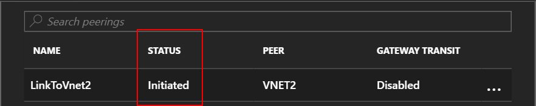
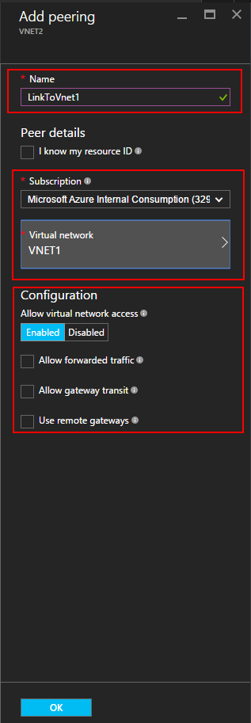

<properties
    pageTitle="Azure 虚拟网络对等互连 - 门户 | Azure"
    description="了解如何使用 Azure 门户创建虚拟网络对等互连。"
    services="virtual-network"
    documentationcenter=""
    author="NarayanAnnamalai"
    manager="jefco"
    editor=""
    tags="azure-resource-manager" />
<tags
    ms.assetid="026bca75-2946-4c03-b4f6-9f3c5809c69a"
    ms.service="virtual-network"
    ms.devlang="na"
    ms.topic="article"
    ms.tgt_pltfrm="na"
    ms.workload="infrastructure-services"
    ms.date="09/14/2016"
    wacn.date="03/31/2017"
    ms.author="narayan;annahar" />  

# 使用 Azure 门户创建虚拟网络对等互连
[AZURE.INCLUDE [virtual-networks-create-vnet-selectors-arm-include](../../includes/virtual-networks-create-vnetpeering-selectors-arm-include.md)]

[AZURE.INCLUDE [virtual-networks-create-vnet-intro](../../includes/virtual-networks-create-vnetpeering-intro-include.md)]

[AZURE.INCLUDE [virtual-networks-create-vnet-scenario-basic-include](../../includes/virtual-networks-create-vnetpeering-scenario-basic-include.md)]

若要使用 Azure 门户基于方案创建 VNet 对等互连，请完成以下步骤：

1. 从浏览器导航到 http://portal.azure.cn，根据需要使用 Azure 帐户登录。
2. 若要建立 VNet 对等互连，需要在两个 VNet 之间创建两个链接，每个方向各一个。可先创建 VNet1 到 VNet2 的 VNet 对等互连链接。在 Azure 门户中，单击“浏览”> 选择“虚拟网络”

      

3. 在“虚拟网络”边栏选项卡中，选择“VNET1”，然后依次单击“对等互连”和“添加”，如下图所示：

      

4. 在“添加对等互连”边栏选项卡上的“名称”中输入 *LinkToVnet2*，选择订阅和对等**虚拟网络** *VNET2*，然后单击“确定”。

      

5. 创建 VNet 对等互连链接后，可看到链接状态，如下图中所示：

      

6. 创建 VNET2 到 VNET1 的 VNet 对等互连链接。在“虚拟网络”边栏选项卡中，选择“VNET2”，然后依次单击“对等互连”和“添加”，如下图所示：

      

7. 在“添加对等互连”边栏选项卡上的“名称”中输入 *LinkToVnet1*，选择订阅，为“虚拟网络”选择“VNET1”，然后单击“确定”。

      

8. 创建 VNet 对等互连链接后，可看到链接状态，如下图中所示：

      

9. 检查 **LinkToVnet2** 的状态，该状态现在也变为“已连接”。
	
      

    > [AZURE.NOTE]
    仅当两个链接已连接在一起时，才会建立 VNET 对等互连。
    > 
    > 

每个链接有几个可配置属性：

| 选项 | 说明 | 默认 |
|:--- |:--- |:--- |
| 允许虚拟网络访问 |是否将对等 VNet 的地址空间包括为 Virtual\_network 标记的一部分 |是 |
| 允许转发的流量 |是接受还是丢弃不是源自对等 VNet 的流量 |否 |
| 允许网关传输 |允许对等 VNet 使用你的 VNet 网关 |否 |
| 使用远程网关 |使用对等方的 VNet 网关。对等 VNet 必须已配置网关并且已选择 AllowGatewayTransit。如果你已配置了网关，则无法使用此选项。 |否 |

VNet 对等互连中的每个链接都有上述属性集。在门户中，可以单击“VNet 对等互连”链接并更改任何可用的选项，然后单击“保存”应用更改。

[AZURE.INCLUDE [virtual-networks-create-vnet-scenario-crosssub-include](../../includes/virtual-networks-create-vnetpeering-scenario-crosssub-include.md)]

1. 从浏览器导航到 http://portal.azure.cn，根据需要使用 Azure 帐户登录。
2. 在此示例中，用户 A 具有订阅 A 的管理权限，用户 B 具有订阅 B 的管理权限。两个订阅均与同一 Azure Active Directory 租户关联。无法在与不同 Azure Active Directory 租户关联的订阅之间创建对等互连。
3. 在门户中，单击“浏览”，然后选择“虚拟网络”。单击要设置对等互连的 VNet。
4. 在所选 VNet 的边栏选项卡中，依次单击“访问控制”和“添加”，如下图中所示：

      

4. 在“添加访问权限”边栏选项卡中，单击某个角色并选择“网络参与者”，单击“添加用户”，键入用户 B 的登录名，然后单击“确定”。

      

5. 以用户 B 的身份登录到 Azure 门户，该用户是订阅 B 的特权用户。遵循上述步骤将用户 A 添加到“网络参与者”角色，如下图中所示：

      

    > [AZURE.NOTE]
    可以在浏览器中同时注销和登录两个用户会话，确保成功启用授权。
    >
    >

    > [AZURE.IMPORTANT]
    如果要在通过 Azure Resource Manager 部署模型创建的两个 VNet 之间创建对等互连，请继续执行本部分中的余下步骤。如果两个 VNet 是通过不同部署模型创建的，请跳过本部分的余下步骤并完成本文的[将通过不同部署模型创建的虚拟网络对等互连](#x-model)部分中所述的步骤。

6. 以用户 A 的身份登录到门户，导航到“VNET3”边栏选项卡，单击“对等互连”、选中“我知道我的资源 ID”复选框，然后采用下例中的格式键入 VNET5 的资源 ID：
   
    /subscriptions/{SubscriptionID}/resourceGroups/{ResourceGroupName}/providers/Microsoft.Network/virtualNetworks/{VNETname}
   
      

7. 以用户 B 的身份登录到门户，然后遵循前面的步骤创建从 VNET5 到 VNet3 的对等互连链接。
   
      

8. 将建立对等互连。连接到 VNet3 的任何 VM 都应该能与连接到 VNet5 的任何 VM 通信。

[AZURE.INCLUDE [virtual-networks-create-vnet-scenario-transit-include](../../includes/virtual-networks-create-vnetpeering-scenario-transit-include.md)]

1. 第一步，建立从 HubVnet 到 VNET1 的 VNET 对等互连链接。请注意，没有为该链接选择“允许转发的流量”选项。
   
      

2. 第二步，可以创建从 VNET1 到 HubVnet 的对等互连链接。请注意，要选择“允许转发的流量”选项。
   
      

3. 对等互连建立后，可以参考此[文章](/documentation/articles/virtual-network-create-udr-arm-ps/)，定义用户定义的路由 (UDR)，以便通过虚拟设备重定向 VNet1 流量以使用其功能。在路由中指定下一个跃点地址时，可以在对等 VNet HubVNet 中将其设置为虚拟装置的 IP 地址。

[AZURE.INCLUDE [virtual-networks-create-vnet-scenario-asmtoarm-include](../../includes/virtual-networks-create-vnetpeering-scenario-asmtoarm-include.md)]

1. 从浏览器导航到 http://portal.azure.cn，根据需要使用 Azure 帐户登录。
2. 如果要在*同一*订阅中通过不同部署模型部署的 VNet 之间创建对等互连，请跳到步骤 3。在**预览版**中，可在*不同*订阅中创建通过不同部署模型部署的 VNet 之间的对等互连。预览版功能不提供与正式版功能相同级别的可靠性和服务级别协议。如果要在不同订阅中通过不同部署模型部署的 VNet 之间创建对等互连，必须先完成以下任务：
    - 在 PowerShell 中输入以下命令，在 Azure 订阅中注册预览版功能：`Register-AzureRmProviderFeature -FeatureName AllowClassicCrossSubscriptionPeering -ProviderNamespace Microsoft.Network` 和 `Register-AzureRmResourceProvider -ProviderNamespace Microsoft.Network`。无法在门户中完成此步骤。
    - 完成本文的[跨订阅对等互连](#x-sub)部分中的步骤 1-6。
3. 若要在此方案中建立 VNET 对等互连，只需创建一个链接，从 Azure Resource Manager 中的虚拟网络连接到经典部署模型中的另一个虚拟网络。即，从 **VNET1** 连接到 **VNET2**。在门户中，单击“浏览”> 选择“虚拟网络”
4. 在“虚拟网络”边栏选项卡中，选择“VNET1”。单击“对等互连”，然后单击“添加”。
5. 在“添加对等互连”边栏选项卡中，为链接命名。在本例中命名为 **LinkToVNet2**。在“对等互连详细信息”下面，选择“经典”。
6. 选择订阅和对等虚拟网络 **VNET2**。然后，单击“确定”。

      

7. 创建此 VNet 对等链接后，两个虚拟网络将对等互连，随后会显示以下信息：

      

## 删除 VNet 对等互连
1. 从浏览器导航到 http://portal.azure.cn，根据需要使用 Azure 帐户登录。
2. 转到虚拟网络边栏选项卡，单击“对等互连”，单击要删除的链接，然后单击“删除”。

      

3. 删除 VNET 对等互连中的一个链接后，该对等链接状态将为断开。

    
4. 在此状态下，在对等链接状态更改为已启动之前无法重新创建链接。建议先删除这两个链接，然后再重新创建 VNet 对等互连。

<!---HONumber=Mooncake_0327_2017-->
<!--Update_Description: wording update-->