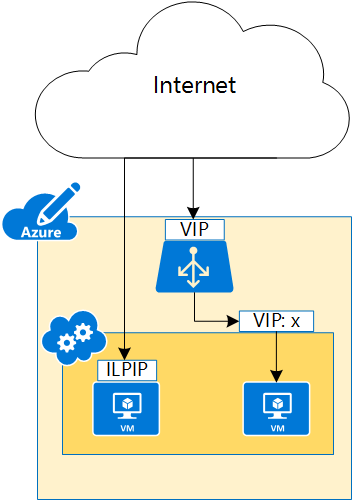

<properties
    pageTitle="Azure 实例层级公共 IP（经典）地址 | Azure"
    description="了解实例层级公共 IP (ILPIP) 地址以及如何使用 PowerShell 进行管理。"
    services="virtual-network"
    documentationcenter="na"
    author="jimdial"
    manager="timlt"
    editor="tysonn"
    translationtype="Human Translation" />
<tags
    ms.assetid="07eef6ec-7dfe-4c4d-a2c2-be0abfb48ec5"
    ms.service="virtual-network"
    ms.devlang="na"
    ms.topic="article"
    ms.tgt_pltfrm="na"
    ms.workload="infrastructure-services"
    ms.date="02/10/2016"
    wacn.date="05/02/2017"
    ms.author="jdial"
    ms.sourcegitcommit="78da854d58905bc82228bcbff1de0fcfbc12d5ac"
    ms.openlocfilehash="cbbb469b943c8175e9fe760f4b848e0496de53c7"
    ms.lasthandoff="04/22/2017" />

# 实例层级公共 IP（经典）概述
实例层级公共 IP (ILPIP) 是可直接分配至 VM 或云服务角色实例（而非 VM 或角色实例所在的云服务）的公共 IP 地址。 ILPIP 不会取代分配给云服务的虚拟 IP (VIP)。 而是可以用来直接连接到 VM 或角色实例的其他 IP 地址。

> [AZURE.IMPORTANT]
> Azure 具有用于创建和处理资源的两个不同的部署模型：[Resource Manager 和经典](/documentation/articles/resource-manager-deployment-model/)。 本文介绍使用经典部署模型的情况。 Azure 建议通过 Resource Manager 创建 VM。 请确保你了解 [IP 地址](/documentation/articles/virtual-network-ip-addresses-overview-classic/)在 Azure 中的工作原理。

如图 1 所示，云服务是使用 VIP 访问的，而各个 VM 通常是使用 VIP:&lt;端口号&gt;访问的。 通过将 ILPIP 分配给特定 VM，可以直接使用该 IP 地址访问该 VM。

在 Azure 中创建云服务时，系统会自动创建相应的 DNS A 记录，以便通过完全限定的域名 (FQDN) 而非实际 VIP 来访问服务。 系统会针对 ILPIP 执行相同的进程，以便通过 FQDN 而非 ILPIP 来访问 VM 或角色实例。 例如，如果创建了名为 *contosoadservice* 的云服务，且通过两个实例配置了名为 *contosoweb* 的 Web 角色，则 Azure 会为实例注册以下 A 记录：

* contosoweb\_IN_0.contosoadservice.chinacloudapp.cn
* contosoweb\_IN_1.contosoadservice.chinacloudapp.cn 

> [AZURE.NOTE]
> 只能为每个 VM 或角色实例分配一个 ILPIP。 每个订阅最多可使用 5 个 ILPIP。 多 NIC VM 不支持 LIPID。
> 
> 

## 为什么要请求 ILPIP？
如果你想要能够通过直接向其分配的 IP 地址链接到 VM 或角色实例，请为 VM 或角色实例请求 ILPIP，而不是使用云服务VIP:&lt;端口号&gt;。

* **主动 FTP** - 通过为 VM 分配 ILPIP，可在任何端口上接收流量。 VM 不需要终结点来接收流量。  请参阅 [FTP 协议概述](https://en.wikipedia.org/wiki/File_Transfer_Protocol#Protocol_overview)，了解有关 FTP 协议的详细信息。
* **出站 IP** - 源自 VM 的出站流量映射到 ILPIP，以便源和 ILPIP 可唯一标识针对外部实体的 VM。

> [AZURE.NOTE]
> ILPIP 地址以前被称为公共 IP (PIP) 地址。
> 

## 管理 VM 的 ILPIP
在以下任务中，可通过 VM 创建、分配和删除 ILPIP：

### 在 VM 创建期间如何使用 PowerShell 请求 ILPIP
下面的 PowerShell 脚本将创建名为 *FTPService* 的云服务，然后从 Azure 中检索映像，并使用检索到的映像创建名为 *FTPInstance* 的 VM，接着将 VM 设置为使用 ILPIP，最后再将 VM 添加到新服务：

    New-AzureService -ServiceName FTPService -Location "China North"

    $image = Get-AzureVMImage|?{$_.ImageName -like "*RightImage-Windows-2012R2-x64*"} `
    New-AzureVMConfig -Name FTPInstance -InstanceSize Small -ImageName $image.ImageName `
    | Add-AzureProvisioningConfig -Windows -AdminUsername adminuser -Password MyP@ssw0rd!! `
    | Set-AzurePublicIP -PublicIPName ftpip | New-AzureVM -ServiceName FTPService -Location "China North"

### 如何检索 VM 的 ILPIP 信息
若要查看使用以上脚本创建的 VM 的 ILPIP 信息，请运行以下 PowerShell 命令，然后观察 *PublicIPAddress* 和 *PublicIPName* 的值：

    Get-AzureVM -Name FTPInstance -ServiceName FTPService

预期输出：

    DeploymentName              : FTPService
    Name                        : FTPInstance
    Label                       : 
    VM                          : Microsoft.WindowsAzure.Commands.ServiceManagement.Model.PersistentVM
    InstanceStatus              : ReadyRole
    IpAddress                   : 100.74.118.91
    InstanceStateDetails        : 
    PowerState                  : Started
    InstanceErrorCode           : 
    InstanceFaultDomain         : 0
    InstanceName                : FTPInstance
    InstanceUpgradeDomain       : 0
    InstanceSize                : Small
    HostName                    : FTPInstance
    AvailabilitySetName         : 
    DNSName                     : http://ftpservice888.chinacloudapp.cn/
    Status                      : ReadyRole
    GuestAgentStatus            :     Microsoft.WindowsAzure.Commands.ServiceManagement.Model.GuestAgentStatus
    ResourceExtensionStatusList : {Microsoft.Compute.BGInfo}
    PublicIPAddress             : 104.43.142.188
    PublicIPName                : ftpip
    NetworkInterfaces           : {}
    ServiceName                 : FTPService
    OperationDescription        : Get-AzureVM
    OperationId                 : 568d88d2be7c98f4bbb875e4d823718e
    OperationStatus             : OK

### 如何删除 VM 的 ILPIP
若要删除在以上脚本中添加到 VM 的 ILPIP，请运行以下 PowerShell 命令：

    Get-AzureVM -ServiceName FTPService -Name FTPInstance | Remove-AzurePublicIP | Update-AzureVM

### 如何向现有 VM 添加 ILPIP
若要向使用以上脚本创建的 VM 添加 ILPIP，请运行以下命令：

    Get-AzureVM -ServiceName FTPService -Name FTPInstance | Set-AzurePublicIP -PublicIPName ftpip2 | Update-AzureVM

## 管理云服务角色实例的 ILPIP

若要将 ILPIP 添加到云服务角色实例，请完成以下步骤：

1. 通过完成[如何配置云服务](/documentation/articles/cloud-services-how-to-configure-portal/#reconfigure-your-cscfg)文章中的步骤，下载云服务的 .cscfg 文件。
2. 通过添加 `InstanceAddress` 元素更新 .cscfg 文件。 以下示例将名为 *MyPublicIP* 的 ILPIP 添加到名为 *WebRole1* 的角色实例中： 

        <?xml version="1.0" encoding="utf-8"?>
        <ServiceConfiguration serviceName="ILPIPSample" xmlns="http://schemas.microsoft.com/ServiceHosting/2008/10/ServiceConfiguration" osFamily="4" osVersion="*" schemaVersion="2014-01.2.3">
          <Role name="WebRole1">
            <Instances count="1" />
              <ConfigurationSettings>
            <Setting name="Microsoft.WindowsAzure.Plugins.Diagnostics.ConnectionString" value="UseDevelopmentStorage=true" />
              </ConfigurationSettings>
          </Role>
          <NetworkConfiguration>
            <AddressAssignments>
              <InstanceAddress roleName="WebRole1">
            <PublicIPs>
              <PublicIP name="MyPublicIP" domainNameLabel="MyPublicIP" />
                </PublicIPs>
              </InstanceAddress>
            </AddressAssignments>
          </NetworkConfiguration>
        </ServiceConfiguration>

3. 通过完成[如何配置云服务](/documentation/articles/cloud-services-how-to-configure-portal/#reconfigure-your-cscfg)文章中的步骤，上传云服务的 .cscfg 文件。

## 后续步骤
* 了解 [IP 寻址](/documentation/articles/virtual-network-ip-addresses-overview-classic/)在经典部署模型中的工作原理。
* 了解[保留 IP](/documentation/articles/virtual-networks-reserved-public-ip/)。

<!--Update_Description: wording update-->