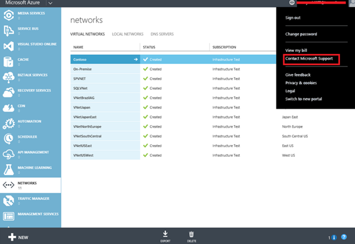

<properties 
   pageTitle="如何从地缘组迁移到区域虚拟网络 (VNet)"
   description="了解如何从地缘组迁移到区域 VNet"
   services="virtual-network"
   documentationCenter="na"
   authors="telmosampaio"
   manager="carmonm"
   editor="tysonn" />
<tags
	ms.service="virtual-network"
	ms.date="03/15/2016"
	wacn.date="04/26/2016"/>

# 如何从地缘组迁移到区域虚拟网络 (VNet)

你可以使用地缘组来确保在相同地缘组中创建的资源由彼此靠近的服务器实际托管，从而加快这些资源的通信速度。过去，地缘组是创建虚拟网络 (VNet) 的必要条件。当时，托管 VNet 的网络管理器服务只能在一组物理服务器或缩放单位内工作。体系结构改进已将网络管理的范畴扩大到了区域。

由于这些体系结构的改进，不再建议或需要对虚拟网络使用地缘组。对 VNet 使用地缘组将被区域取代。与区域关联的虚拟网络称为区域 VNet。

此外，我们建议你在一般情况下不要使用地缘组。除了 VNet 要求外，使用地缘组来确保计算和存储等资源的位置相互靠近同样重要。但是，对于当前的 Azure 网络体系结构，不再需要满足这些位置要求。有关你可能需要使用地缘组的其余少数特定情况，请参阅[地缘组和 VM](#Affinity-groups-and-VMs)。

## 创建和迁移到区域 VNet

今后，在创建新的 VNet 时，可以使用*区域*。你可以将此视为经典管理门户中的一个选项。请注意，在网络配置文件中，这显示为*位置*。

>[AZURE.IMPORTANT]尽管从技术上讲仍可以创建与地缘组关联的虚拟网络，但是，没有令人信服的理由让人这么做。许多新功能，例如网络安全组，仅当使用区域 VNet 时才可用，而不能用于与地缘组关联的虚拟网络。

### 关于与地缘组关联的 VNet

在不久的将来，将启用当前与地缘组关联的虚拟网络以迁移到区域 VNet。我们将更新此页，以让你了解该过程的进展情况以及何时执行后续步骤来完成迁移。

请注意，地缘组将仍然存在，即使我们不再建议对 VNet 使用它们也是如此。因此，你可以选择不迁移 VNet，也可以选择延迟迁移。你的 VNet 仍将正常工作。但是，你可能会遇到限制问题，而且将无法充分利用任何需要区域 VNet 的许多新功能。我们强烈建议你在启用 VNet 时，将地缘组 VNet 迁移到区域 VNet。

### 提前迁移

提前迁移适用于拥有支持合同的客户。若要选择提前迁移，请执行以下步骤：

1. 在**经典管理门户**的 VNet 页上，单击右上角的“联系 Microsoft 支持”。

	

2. 在“联系 Microsoft 支持”页上，选择以下项：订阅：如果你有多个订阅，请选择与要迁移的 VNet 对应的订阅。支持类型：技术产品类型：虚拟网络 (VNet)。问题类型：将虚拟网络迁移到区域虚拟网络

	- **订阅**：如果你有多个订阅，请选择与要迁移的 VNet 对应的订阅。

	- **支持类型：***技术*

	- **产品类型：***虚拟网络 (VNet)*

	- **问题类型：***将虚拟网络迁移到区域虚拟网络*

3. 先决条件：必须已为你的 VNet 启用迁移，才能执行以下步骤。如果你收到确认（如果是提前迁移请求），或此页已更新可反映启用了所有 VNet 以进行迁移，则会知道 VNet 已启用。

4. 导出网络配置文件。可以使用 PowerShell 或经典管理门户。有关使用经典管理门户的说明，请参阅[使用网络配置文件配置 VNet](/documentation/articles/virtual-networks-using-network-configuration-file/)。

5. 编辑网络配置文件，将旧值替换为新值。

	> [AZURE.NOTE]“位置”是已为与 VNet 关联的地缘组指定的区域。例如，如果你的 VNet 与位于美国西部的地缘组关联，则在你迁移时，你的“位置”必须指向美国西部。
	
	编辑网络配置文件中的以下行，将相应值替换为你自己的值：

	**旧值：** \<VirtualNetworkSitename="VNetChinsNorth" AffinityGroup="VNetDemoAG"\> 

	**新值：** \<VirtualNetworkSitename="VNetChinsNorth" Location="China North"\>

6. 保存所做的更改，并将网络配置[导入](/documentation/articles/virtual-networks-using-network-configuration-file/)到 Azure。

>[AZURE.NOTE]此迁移不会导致你的服务出现任何停机情况。

## 地缘组和 VM

如前所述，在一般情况下，将不再建议对 VM 使用地缘组。仅当一组 VM 必须在 VM 之间拥有绝对最低网络延迟时，你才应该使用地缘组。将 VM 置于地缘组中后，VM 将全部置于相同计算群集或缩放单位中。

必须注意，使用地缘组可能会造成两个负面后果：

- VM 大小集将限制为计算缩放单位所提供的 VM 大小集。

- 无法分配新 VM 的概率较高。如果地缘组的特定缩放单位超出能力范畴，则会发生这种情况。

### 如果你在地缘组中有一个 VM 该怎么办

当前位于地缘组中的 VM 不需要从地缘组中删除。

在 VM 部署后，系统会将其部署到单个缩放单位。地缘组可以限制可用于新 VM 部署的 VM 大小集，但是部署的任何现有 VM 已限制为在其中部署该 VM 的缩放单位中可用的 VM 大小集。因此，从地缘组中删除 VM 将不产生任何影响。
 

<!---HONumber=74-->