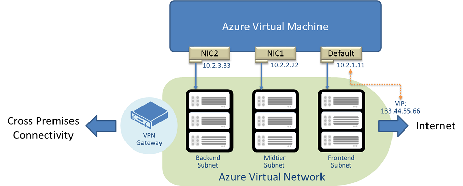

<properties 
   pageTitle="创建具有多个 NIC 的 VM"
   description="了解如何创建和配置具有多个 NIC 的 VM"
   services="virtual-network, virtual-machines"
   documentationCenter="na"
   authors="telmosampaio"
   manager="carmonm"
   editor="tysonn" 
   tags="azure-service-management,azure-resource-manager"
/>
<tags
	ms.service="virtual-network"
	ms.date="02/02/2016"
	wacn.date="03/28/2016"/>

# 创建具有多个 NIC 的 VM

你可以在 Azure 中创建虚拟机 (VM)，然后将多个网络接口 (NIC) 附加到每个 VM。多 NIC 是许多网络虚拟设备（例如应用程序传送和 WAN 优化解决方案）所必需的。多 NIC 还提供更多的网络流量管理功能，包括在前端 NIC 和后端 NIC 之间进行流量隔离，或者将数据平面流量与管理平面流量进行隔离。

上图显示了带三个 NIC 的 VM，每个 NIC 都连接到不同的子网。

## 要求和约束

多 NIC 目前有以下要求和约束：

- 必须在 Azure 虚拟网络 (VNet) 中创建多 NIC VM。不支持非 VNet VM。 
- 在单个云服务（经典部署）或资源组中，仅允许以下设置： 
	- 该云服务中的所有 VM 都必须启用多 NIC，否则 
	- 该云服务中的所有 VM 都必须使用单个 NIC 

> [AZURE.NOTE]Azure 具有用于创建和处理资源的两个不同的部署模型：[资源管理器和经典](/documentation/articles/resource-manager-deployment-model/)。这篇文章介绍如何使用资源管理器部署模型，Azure 建议大多数新部署使用资源管理器模型替代经典部署模型。
 
- 仅在“默认”NIC 上支持面向 Internet 的 VIP（经典部署）。默认 NIC 的 IP 只有一个对应的 VIP。 
- 多 NIC VM 目前不支持实例级公共 IP (LPIP) 地址（经典部署）。 
- VM 内部 NIC 的顺序将是随机的，在 Azure 基础结构更新过程中也可能会更改。不过，IP 地址和相应的以太网 MAC 地址将会保持不变。例如，假定 **Eth1** 的 IP 地址为 10.1.0.100，MAC 地址为 00-0D-3A-B0-39-0D；在进行 Azure 基础结构更新并重新启动后，它可能会更改为 **Eth2**，但 IP 和 MAC 配对将会保持不变。如果是客户执行的重新启动，NIC 顺序将保持不变。 
- 每个 VM 上的每个 NIC 的地址必须位于一个子网中，你可以向单个 VM 上的多个 NIC 分配同一子网中的地址。 
- VM 大小决定了可以为 VM 创建的 NIC 的数目。下表列出了与 VM 大小相对应的 NIC 数目： 

|VM 大小（标准 SKU）|NIC 数（每个 VM 允许的最大数目）|
|---|---|
|所有基本大小|1|
|A0\\特小型|1|
|A1\\小型|1|
|A2\\中型|1|
|A3\\大型|2|
|A4\\特大型|4|
|A5|1|
|A6|2|
|A7|4|
|D1|1|
|D2|2|
|D3|4|
|D4|8|
|D11|2|
|D12|4|
|D13|8|
|D14|8|
|DS1|1|
|DS2|2|
|DS3|4|
|DS4|8|
|DS11|2|
|DS12|4|
|DS13|8|
|DS14|8|

## 如何在经典部署中配置多 NIC VM

下面的说明将指导你创建包含 3 个 NIC（1 个默认 NIC，2 个其他 NIC）的多 NIC VM。这些配置步骤将会创建一个 VM，该 VM 将根据下面的服务配置文件片段进行配置：

	<VirtualNetworkSite name="MultiNIC-VNet" Location="China North">
	<AddressSpace>
	  <AddressPrefix>10.1.0.0/16</AddressPrefix>
	    </AddressSpace>
	    <Subnets>
	      <Subnet name="Frontend">
	        <AddressPrefix>10.1.0.0/24</AddressPrefix>
	      </Subnet>
	      <Subnet name="Midtier">
	        <AddressPrefix>10.1.1.0/24</AddressPrefix>
	      </Subnet>
	      <Subnet name="Backend">
	        <AddressPrefix>10.1.2.0/23</AddressPrefix>
	      </Subnet>
	      <Subnet name="GatewaySubnet">
	        <AddressPrefix>10.1.200.0/28</AddressPrefix>
	      </Subnet>
	    </Subnets>
	… Skip over the remainder section …
	</VirtualNetworkSite>

在尝试运行示例中的 PowerShell 命令之前，你需要满足以下先决条件。

- Azure 订阅。
- 已配置虚拟网络。有关 VNet 的详细信息，请参阅[虚拟网络概述](/documentation/articles/virtual-networks-overview/)。
- 已下载和安装最新版本的 Azure PowerShell。请参阅[如何安装和配置 Azure PowerShell](/documentation/articles/powershell-install-configure/)。

若要创建具有多个 NIC 的 VM，请执行以下步骤：

1. 从 Azure VM 映像库中选择 VM 映像。请注意，映像会经常更改，并按区域提供。以下示例中指定的映像可能会更改，也可能不在你的区域提供，因此务必指定所需的映像。 
	    
		$image = Get-AzureVMImage `
	    	-ImageName "a699494373c04fc0bc8f2bb1389d6106__Windows-Server-2012-R2-201410.01-en.us-127GB.vhd"

1. 创建 VM 配置。

		$vm = New-AzureVMConfig -Name "MultiNicVM" -InstanceSize "ExtraLarge" `
			-Image $image.ImageName –AvailabilitySetName "MyAVSet"

1. 创建默认的管理员登录名。

		Add-AzureProvisioningConfig –VM $vm -Windows -AdminUserName "<YourAdminUID>" `
			-Password "<YourAdminPassword>"

1. 将其他 NIC 添加到 VM 配置。

		Add-AzureNetworkInterfaceConfig -Name "Ethernet1" `
			-SubnetName "Midtier" -StaticVNetIPAddress "10.1.1.111" -VM $vm 
		Add-AzureNetworkInterfaceConfig -Name "Ethernet2" `
			-SubnetName "Backend" -StaticVNetIPAddress "10.1.2.222" -VM $vm

1. 指定默认 NIC 的子网和 IP 地址。

		Set-AzureSubnet -SubnetNames "Frontend" -VM $vm 
		Set-AzureStaticVNetIP -IPAddress "10.1.0.100" -VM $vm

1. 在虚拟网络中创建 VM。

		New-AzureVM -ServiceName "MultiNIC-CS" –VNetName "MultiNIC-VNet" –VMs $vm

>[AZURE.NOTE]你在此处指定的 VNet 必须已存在（已在先决条件中提到过）。下面的示例指定名为“MultiNIC-VNet”的虚拟网络。

## 辅助 NIC 对其他子网的访问

Azure 中的当前模型是虚拟机中的所有 NIC 都设置有默认网关。这允许 NIC 与其子网之外的 IP 地址进行通信。在使用弱主机路由模型的操作系统（如 Linux）中，如果流入和流出流量使用不同 NIC，Internet 连接就会中断。

为了解决此问题，Azure 将在 2015 年 7 月的第一周中推出平台更新，该更新将从辅助 NIC 中删除默认网关。这不会影响现有的虚拟机，直到这些虚拟机重新启动。在重新启动后，新设置将生效，在那时，辅助 NIC 上的通信流将限制为在同一子网内。如果用户要启用辅助 NIC 以在其自己的子网之外进行对话，他们必须在路由表中添加一个条目以配置网关，如下所述。

### 配置 Windows VM

假设你有一个具有两个 NIC 的 Windows VM，如下所示：

- 主 NIC IP 地址：192.168.1.4
- 辅助 NIC IP 地址：192.168.2.5

此 VM 的 IPv4 路由表将如下所示：

	IPv4 Route Table
	===========================================================================
	Active Routes:
	Network Destination        Netmask          Gateway       Interface  Metric
	          0.0.0.0          0.0.0.0      192.168.1.1      192.168.1.4      5
	        127.0.0.0        255.0.0.0         On-link         127.0.0.1    306
	        127.0.0.1  255.255.255.255         On-link         127.0.0.1    306
	  127.255.255.255  255.255.255.255         On-link         127.0.0.1    306
	    168.63.129.16  255.255.255.255      192.168.1.1      192.168.1.4      6
	      192.168.1.0    255.255.255.0         On-link       192.168.1.4    261
	      192.168.1.4  255.255.255.255         On-link       192.168.1.4    261
	    192.168.1.255  255.255.255.255         On-link       192.168.1.4    261
	      192.168.2.0    255.255.255.0         On-link       192.168.2.5    261
	      192.168.2.5  255.255.255.255         On-link       192.168.2.5    261
	    192.168.2.255  255.255.255.255         On-link       192.168.2.5    261
	        224.0.0.0        240.0.0.0         On-link         127.0.0.1    306
	        224.0.0.0        240.0.0.0         On-link       192.168.1.4    261
	        224.0.0.0        240.0.0.0         On-link       192.168.2.5    261
	  255.255.255.255  255.255.255.255         On-link         127.0.0.1    306
	  255.255.255.255  255.255.255.255         On-link       192.168.1.4    261
	  255.255.255.255  255.255.255.255         On-link       192.168.2.5    261
	===========================================================================

请注意，默认路由 (0.0.0.0) 仅适用于主 NIC。你将无法访问辅助 NIC 的子网外的资源，如下所示：

	C:\Users\Administrator>ping 192.168.1.7 -S 192.165.2.5
	 
	Pinging 192.168.1.7 from 192.165.2.5 with 32 bytes of data:
	PING: transmit failed. General failure.
	PING: transmit failed. General failure.
	PING: transmit failed. General failure.
	PING: transmit failed. General failure.

若要在辅助 NIC 上添加默认路由，请执行以下步骤：

1. 在命令提示符下运行以下命令来标识辅助 NIC 的索引号：

		C:\Users\Administrator>route print
		===========================================================================
		Interface List
		 29...00 15 17 d9 b1 6d ......Microsoft Virtual Machine Bus Network Adapter #16
		 27...00 15 17 d9 b1 41 ......Microsoft Virtual Machine Bus Network Adapter #14
		  1...........................Software Loopback Interface 1
		 14...00 00 00 00 00 00 00 e0 Teredo Tunneling Pseudo-Interface
		 20...00 00 00 00 00 00 00 e0 Microsoft ISATAP Adapter #2
		===========================================================================

2. 请注意，表中的第二个条目具有索引 27（在此示例中）。
3. 在命令提示符下运行 **route add** 命令，如下所示。在此示例中，你将指定 192.168.2.1 作为辅助 NIC 的默认网关：

		route ADD -p 0.0.0.0 MASK 0.0.0.0 192.168.2.1 METRIC 5000 IF 27

4. 若要测试连接，请返回到命令提示符并尝试 ping 与辅助 NIC 不同的子网，如以下示例所示：

		C:\Users\Administrator>ping 192.168.1.7 -S 192.165.2.5
		 
		Reply from 192.168.1.7: bytes=32 time<1ms TTL=128
		Reply from 192.168.1.7: bytes=32 time<1ms TTL=128
		Reply from 192.168.1.7: bytes=32 time=2ms TTL=128
		Reply from 192.168.1.7: bytes=32 time<1ms TTL=128

5. 你还可以查看路由表以检查新添加的路由，如下所示：

		C:\Users\Administrator>route print

		...

		IPv4 Route Table
		===========================================================================
		Active Routes:
		Network Destination        Netmask          Gateway       Interface  Metric
		          0.0.0.0          0.0.0.0      192.168.1.1      192.168.1.4      5
		          0.0.0.0          0.0.0.0      192.168.2.1      192.168.2.5   5005
		        127.0.0.0        255.0.0.0         On-link         127.0.0.1    306

### 配置 Linux VM

对于 Linux VM，由于默认行为使用弱主机路由，因为我们建议将辅助 NIC 限制为仅在同一子网内的通信流。但是，如果某些情况需要子网外的连接，用户应启用基于策略的路由以确保流入和流出流量使用同一 NIC。

## 后续步骤

- [在经典部署的 2 层应用程序方案中部署多 NIC VM](/documentation/articles/virtual-network-deploy-multinic-classic-ps/)。

<!---HONumber=Mooncake_1221_2015-->