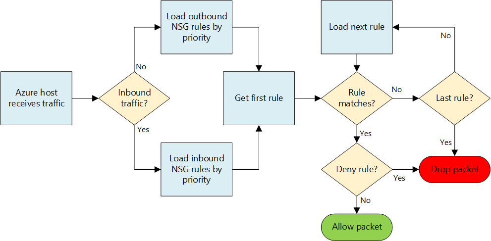

<properties
    pageTitle="Azure 中的网络安全组 | Azure"
    description="了解如何使用网络安全组，通过 Azure 中的分布式防火墙隔离和控制虚拟网络内的通信流。"
    services="virtual-network"
    documentationcenter="na"
    author="jimdial"
    manager="timlt"
    editor="tysonn"
    translationtype="Human Translation" />
<tags
    ms.assetid="20e850fc-6456-4b5f-9a3f-a8379b052bc9"
    ms.service="virtual-network"
    ms.devlang="na"
    ms.topic="get-started-article"
    ms.tgt_pltfrm="na"
    ms.workload="infrastructure-services"
    ms.date="02/11/2016"
    wacn.date="05/02/2017"
    ms.author="jdial"
    ms.sourcegitcommit="78da854d58905bc82228bcbff1de0fcfbc12d5ac"
    ms.openlocfilehash="6ee59cb73f7d75d016d041df31c51aed689059cd"
    ms.lasthandoff="04/22/2017" />

# 使用网络安全组筛选网络流量

网络安全组 (NSG) 包含一系列安全规则，这些规则可以允许或拒绝流向连接到 Azure 虚拟网络 (VNet) 的资源的网络流量。 可以将 NSG 关联到子网、单个 VM（经典）或附加到 VM 的单个网络接口 (NIC) (Resource Manager)。 将 NSG 关联到子网时，规则适用于连接到该子网的所有资源。 也可通过将 NSG 关联到 VM 或 NIC 来进一步限制流量。

> [AZURE.NOTE]
> Azure 具有用于创建和处理资源的两个不同的部署模型：[Resource Manager 和经典](/documentation/articles/resource-manager-deployment-model/)。 这篇文章介绍了如何使用这两种模型，但 Azure 建议大多数最新部署使用 Resource Manager 模型。

## NSG 资源
NSG 包含以下属性：

| 属性 | 说明 | 约束 | 注意事项 |
| --- | --- | --- | --- |
| Name |NSG 的名称 |必须在区域内唯一。 可以包含字母、数字、下划线、句点和连字符。 必须以字母或数字开头。 必须以字母、数字或下划线结尾。 不能超过 80 个字符。 |由于你可能需要创建多个 NSG，因此请确保设置命名约定，以便轻松标识 NSG 的功能。 |
| 区域 |在其中创建 NSG 的 Azure 区域。 |只能将多个 NSG 关联到该 NSG 所在区域中的资源。 |若要了解一个区域可以有多少 NSG，请阅读 [Azure 限制](/documentation/articles/azure-subscription-service-limits/#virtual-networking-limits-classic)一文。|
| 资源组 |NSG 所在的[资源组](/documentation/articles/resource-group-overview/#resource-groups)。 |虽然 NSG 存在于一个资源组中，但可将其关联到任意资源组中的资源，只要该资源与 NSG 属于同一 Azure 区域。 |资源组用于以部署单元的形式集中管理多个资源。 可以考虑将 NSG 与相关联的资源组合在一起。 |
| 规则 |入站或出站规则，用于定义允许或拒绝的具体流量。 | |请参阅本文的 [NSG 规则](#Nsg-rules)部分。 |

> [AZURE.NOTE]
> 不支持将基于终结点的 ACL 和网络安全组置于相同 VM 实例上。 如果你想要使用 NSG，但已有了终结点 ACL，则请先删除该终结点 ACL。 若要了解如何删除 ACL，请阅读[使用 PowerShell 管理终结点的访问控制列表 (ACL)](/documentation/articles/virtual-networks-acl-powershell/) 一文。
> 

###  NSG 规则
NSG 规则包含以下属性：

| 属性 | 说明 | 约束 | 注意事项 |
| --- | --- | --- | --- |
| **Name** |规则的名称。 |必须在区域内唯一。 可以包含字母、数字、下划线、句点和连字符。 必须以字母或数字开头。 必须以字母、数字或下划线结尾。 不能超过 80 个字符。 |一个 NSG 中可以有多个规则，因此请确保遵循命名约定，以便标识规则的功能。 |
| **协议** |要与规则匹配的协议。 |TCP、UDP 或 * |使用 * 作为协议时，会包括 ICMP（仅限东西通信），以及 UDP 和 TCP，可能会减少所需规则的数量。 同时，使用 * 可能是过于宽泛的方法，因此建议只在必要时使用 *。 |
| **Source port range** |要与规则匹配的源端口范围。 |单个端口号（从 1 到 65535）、端口范围（示例：1-65535）、或 *（表示所有端口）。 |源端口可以是暂时的。 除非客户端程序在使用特定端口，否则请在大多数情况下使用 *。 尽可能尝试使用端口范围，这样就不需使用多个规则。 不能使用逗号对多个端口或端口范围分组。 |
| **Destination port range** |要与规则匹配的目标端口范围。 |单个端口号（从 1 到 65535）、端口范围（示例：1-65535）、或 \*（表示所有端口）。 |尽可能尝试使用端口范围，这样就不需使用多个规则。 不能使用逗号对多个端口或端口范围分组。 |
| **Source address prefix** |要与规则匹配的源地址前缀或标记。 |单个 IP 地址（示例：10.10.10.10）、IP 子网（示例：192.168.1.0/24）、[默认标记](#default-tags)或 *（表示所有地址）。 |考虑使用范围、默认标记和 * 来减少规则数。 |
| **Destination address prefix** |要与规则匹配的目标地址前缀或标记。 | 单个 IP 地址（示例：10.10.10.10）、IP 子网（示例：192.168.1.0/24）、[默认标记](#default-tags)或 *（表示所有地址）。 |考虑使用范围、默认标记和 * 来减少规则数。 |
| **Direction** |要与规则匹配的流量方向。 |入站或出站。 |入站和出站规则将根据方向分别处理。 |
| **Priority** |将按优先级顺序来检查规则。 一旦应用某个规则，将不再检查其他规则的匹配情况。 | 介于 100 到 4096 之间的数字。 | 考虑以 100 为增量，为每个规则创建规则跳转优先级，为将来可能创建的新规则留出空间。 |
| **Access** |规则匹配时要应用的访问类型。 | 允许或拒绝。 | 请记住，如果找不到某个数据包的允许规则，则会丢弃该数据包。 |

NSG 包含两组规则：入站规则和出站规则。 在每组中，规则的优先级必须保持唯一。 

 

上图显示如何处理 NSG 规则。

###  默认标记
默认标记是系统提供的针对某类 IP 地址的标识符。 可以使用任何规则的**源地址前缀**和**目标地址前缀**属性中的默认标记。 有三个可使用的默认标记：

* **VirtualNetwork** (Resource Manager)（如果是经典部署模型，则为 **VIRTUAL_NETWORK**）：此标记包括虚拟网络地址空间（Azure 中定义的 CIDR 范围）、所有连接的本地地址空间，以及连接的 Azure VNet（本地网络）。
* **AzureLoadBalancer** (Resource Manager)（如果是经典部署模型，则为 **AZURE_LOADBALANCER**）：此标记表示 Azure 的基础结构负载均衡器。 此标记将转换为 Azure 数据中心 IP，Azure 的运行状况探测源于该 IP。
* **Internet** (Resource Manager)（如果是经典部署模型，则为 **INTERNET**）：此标记表示虚拟网络外部的 IP 地址空间，可以通过公共 Internet 进行访问。 范围包括 [Azure 拥有的公共 IP 空间](https://www.microsoft.com/download/details.aspx?id=42064)。

###  默认规则
所有 NSG 都包含一组默认规则。 默认规则无法删除，但由于给它们分配的优先级最低，可以用创建的规则来重写它们。 

默认规则允许和禁止的流量如下所示：
- **虚拟网络：**从方向上来说，在虚拟网络中发起和结束的通信可以是入站通信，也可以是出站通信。
- **Internet：**允许出站通信，但阻止入站通信。
- **负载均衡器：**允许 Azure 的负载均衡器探测 VM 和角色实例的运行状况。 如果不使用负载均衡集，则可覆盖此规则。

**入站默认规则**

| Name | 优先级 | Source IP | Source Port | Destination IP | Destination Port | 协议 | Access |
| --- | --- | --- | --- | --- | --- | --- | --- |
| AllowVNetInBound |65000 | VirtualNetwork | * | VirtualNetwork | * | * | ALLOW |
| AllowAzureLoadBalancerInBound | 65001 | AzureLoadBalancer | * | * | * | * | ALLOW |
| DenyAllInBound |65500 | * | * | * | * | * | DENY |

**出站默认规则**

| Name | 优先级 | Source IP | Source Port | Destination IP | Destination Port | 协议 | Access |
| --- | --- | --- | --- | --- | --- | --- | --- |
| AllowVnetOutBound | 65000 | VirtualNetwork | * | VirtualNetwork | * | * | ALLOW |
| AllowInternetOutBound | 65001 | * | * | Internet | * | * | ALLOW |
| DenyAllOutBound | 65500 | * | * | * | * | * | DENY |

##  将 NSG 相关联
可以根据所使用的部署模型将 NSG 关联到 VM、NIC 和子网，如下所示：

* **VM（仅经典部署模型）：**安全规则适用于所有出入 VM 的流量。 
* **NIC（仅 Resource Manager 部署模型）：**安全规则适用于所有与 NSG 关联的出入 NIC 的流量。 在多 NIC VM 中，可以为每个 NIC 单独应用不同（或相同）的 NSG。 
* **子网（Resource Manager 部署模型和经典部署模型）：**安全规则适用于出入任何连接到 VNet 的资源的任何流量。

可以将不同的 NSG 关联到 VM（或 NIC，具体取决于部署模型）以及 NIC 或 VM 连接到的子网。 安全规则在每个 NSG 中按优先级参照以下顺序应用到流量：

- **入站流量**

    1. **应用到子网的 NSG：**如果子网 NSG 存在相应的拒绝流量的规则，则会丢弃数据包。

    2. **应用到 NIC (Resource Manager) 或 VM（经典）的 NSG：**如果 VM\NIC NSG 存在相应的拒绝流量的规则，则会丢弃 VM\NIC 上的数据包，即使子网 NSG 存在相应的允许流量的规则。

- **出站流量**

    1. **应用到 NIC (Resource Manager) 或 VM（经典）的 NSG：**如果 VM\NIC NSG 存在相应的拒绝流量的规则，则会丢弃数据包。

    2. **应用到子网的 NSG：**如果子网 NSG 存在相应的拒绝流量的规则，则会丢弃数据包，即使 VM\NIC NSG 存在相应的允许流量的规则。

> [AZURE.NOTE]
> 尽管你只能将一个 NSG 关联到一个子网、VM 或 NIC，但可以将同一个 NSG 关联到任意数量的资源。
>

## 实现
可以使用以下工具，在 Resource Manager 部署模型或经典部署模型中实现 NSG：

| 部署工具 | 经典 | 资源管理器 |
| --- | --- | --- |
| Azure 门户   | 是 | [是](/documentation/articles/virtual-networks-create-nsg-arm-pportal/) |
| PowerShell     | [是](/documentation/articles/virtual-networks-create-nsg-classic-ps/) | [是](/documentation/articles/virtual-networks-create-nsg-arm-ps/) |
| Azure CLI **V1**   | [是](/documentation/articles/virtual-networks-create-nsg-classic-cli/) | [是](/documentation/articles/virtual-networks-create-nsg-cli-nodejs/) |
| Azure CLI **V2**   | 否 | [是](/documentation/articles/virtual-networks-create-nsg-arm-cli/) |
| Azure Resource Manager 模板   | 否  | [是](/documentation/articles/virtual-networks-create-nsg-arm-template/) |

##  规划
实施 NSG 之前，需要回答以下问题：

1. 你想要使用什么类型的资源来筛选出入流量？ 可以连接多种资源，例如 NIC (Resource Manager)、VM（经典）、云服务、应用程序服务环境以及 VM 规模集。 
2. 需要过滤其出入流量的资源是否连接到现有 VNet 中的子网？

若要详细了解如何针对 Azure 中的网络安全进行规划，请阅读[云服务和网络安全](/documentation/articles/best-practices-network-security/)一文。 

## 设计注意事项
了解[规划](#Planning)部分问题的答案以后，请查看以下部分的内容，然后再定义 NSG：

###  限制
订阅中的 NSG 数目以及每个 NSG 的规则数目均存在限制。 有关限制的详细信息，请阅读 [Azure 限制](/documentation/articles/azure-subscription-service-limits/#networking-limits)一文。

### VNet 和子网设计
由于 NSG 可以应用于子网，因此你可以通过按子网来组合资源以及将 NSG 应用到子网来尽量减少 NSG 的数量。  如果你决定将 NSG 应用到子网，你可能会发现，现有的 VNet 和子网不是通过所要的 NSG 定义的。 为了支持 NSG 设计以及将新资源部署到新子网，可能需要定义新的 VNet 和子网。 然后，你才能定义一个迁移策略，将现有资源移到新子网。 

### 特殊规则
如果阻止以下规则允许的流量，则基础结构无法与基本的 Azure 服务通信：

* **主机节点的虚拟 IP：**基本的基础结构服务（例如 DHCP、DNS 和运行状况监视）是通过虚拟化主机 IP 地址 168.63.129.16 提供的。 此公共 IP 地址属于 Microsoft，是唯一用于所有区域的虚拟化 IP 地址，而且没有其他用途。 此 IP 地址映射到托管 VM 的服务器计算机（主机节点）的物理 IP 地址。 主机节点充当 DHCP 中继、DNS 递归解析器，以及进行负载均衡器运行状况探测和计算机运行状况探测的探测源。 与此 IP 地址的通信不是攻击。
* **许可（密钥管理服务）：**在 VM 中运行的 Windows 映像必须获得许可。 为了确保许可，将会向处理此类查询的密钥管理服务主机服务器发送请求。 该请求是通过端口 1688 以出站方式提出的。

### ICMP 通信
当前的 NSG 规则只允许使用 *TCP* 或 *UDP* 协议。 没有 *ICMP*的特定标记。 但在 VNet 中，AllowVNetInBound 默认规则允许 ICMP 流量，即允许流量出入 VNet 中的任何端口和协议。

###  子网
* 考虑工作负荷所需的层数。 可以通过使用子网来隔离每个层，并可将 NSG 应用到该子网。 
* 如需针对 VPN 网关或 ExpressRoute 线路实现一个子网，请**勿**将 NSG 应用到该子网。 否则，可能无法进行跨 VNet 或跨界连接。 
* 如需实现一个网络虚拟设备 (NVA)，请将该 NVA 连接到其自身的子网并创建出入该 NVA 的用户定义的路由 (UDR)。 你可以实现一个子网级 NSG，以便筛选进出该子网的流量。 若要详细了解 UDR，请阅读[用户定义的路由](/documentation/articles/virtual-networks-udr-overview/)一文。

### 负载均衡器
* 考虑为每个工作负荷所使用的每个负载均衡器设置负载均衡和网络地址转换 (NAT) 规则。 NAT 规则绑定到一个后端池，其中包含 NIC (Resource Manager) 或 VM/云服务角色实例（经典）。 考虑为每个后端池创建一个 NSG，只允许通过负载均衡器中实施的规则映射的流量。 为每个后端池创建一个 NSG 可确保直接进入（而不是通过负载均衡器进入）后端池的流量也会得到筛选。
* 在经典部署中，你创建的终结点会将负载均衡器上的端口映射到 VM 或角色实例上的端口。 还可以通过 Resource Manager 创建自己的单个公用负载均衡器。 传入流量的目标端口是 VM 或角色实例中的实际端口，不是负载均衡器公开的端口。 到 VM 的连接的源端口和地址是 Internet 中远程计算机的端口和地址，不是负载均衡器公开的端口和地址。
* 通过创建 NSG 来筛选经过内部负载均衡器 (ILB) 的流量时，所应用的源端口和地址范围来自原始计算机，不是来自负载均衡器。 目标端口和地址范围是目标计算机的，而不是负载均衡器的。

### 其他
* 不支持将基于终结点的访问控制列表 (ACL) 和 NSG 置于相同的 VM 实例上。 如果你想要使用 NSG，但已有了终结点 ACL，则请先删除该终结点 ACL。 有关如何删除终结点 ACL 的信息，请参阅[管理终结点 ACL](/documentation/articles/virtual-networks-acl-powershell/) 一文。
* 在 Resource Manager 中，可以将与 VM 的 NIC 关联的 NSG 用于多个 NIC，以便通过 NIC 进行管理（远程访问）。 将唯一 NSG 关联到每个 NIC 可以跨 NIC 分隔流量类型。
* 与使用负载均衡器类似，在筛选来自其他 VNet 的流量时，你必须使用远程计算机的源地址范围，而不能使用连接 VNet 的网关。
* 许多 Azure 服务无法连接到 VNet。 如果某个 Azure 资源未连接到 VNet，则不能使用 NSG 筛选进入该资源的流量。  请阅读所用服务的文档，确定该服务能否连接到 VNet。

## 部署示例
请考虑下图显示的双层应用程序常见方案，此方案说明了如何应用本文中的信息：

如图所示，*Web1* 和 *Web2* VM 连接到 *FrontEnd* 子网，*DB1* 和 *DB2* VM 连接到 *BackEnd* 子网。  两个子网都属于 *TestVNet* VNet。 应用程序组件每个都在连接到 VNet 的 Azure VM 中运行。 此方案具有以下要求：

1. 分隔 WEB 和 DB 服务器之间的流量。
2. 负载均衡规则将流量从负载均衡器转发到端口 80 上的所有 Web 服务器。
3. 负载均衡器 NAT 规则将传入端口 50001 上的负载均衡器的流量转发到 WEB1 VM 上的端口 3389。
4. 不能从 Internet 访问前端或后端 VM，要求 1 和 3 例外。
5. 不能从 WEB 或 DB 服务器进行出站 Internet 访问。
6. 允许从 FrontEnd 子网访问任何 Web 服务器的端口 3389。
7. 允许从 FrontEnd 子网访问任何 DB 服务器的端口 3389。
8. 允许从 FrontEnd 子网访问所有 DB 服务器的端口 1433。
9. 将管理流量（端口 3389）和数据库流量（端口 1433）分隔到 DB 服务器的不同 NIC 上。

要求 1-6（要求 3 和 4 除外）均限于子网空间。 以下 NSG 符合上述要求，同时又可将所需 NSG 数降至最低：

### FrontEnd
**入站规则**

| 规则 | 访问 | 优先级 | Source address range | Source Port | Destination address range | Destination Port | 协议 |
| --- | --- | --- | --- | --- | --- | --- | --- |
| Allow-Inbound-HTTP-Internet | ALLOW | 100 | Internet | * | * | 80 | TCP |
| Allow-Inbound-RDP-Internet | ALLOW | 200 | Internet | * | * | 3389 | TCP |
| Deny-Inbound-All | DENY | 300 | Internet | * | * | * | TCP |

**出站规则**

| 规则 | 访问 | 优先级 | Source address range | Source Port | Destination address range | Destination Port | 协议 |
| --- | --- | --- | --- | --- | --- | --- | --- |
| Deny-Internet-All |DENY |100 | * | * | Internet | * | * |

### BackEnd
**入站规则**

| 规则 | 访问 | 优先级 | Source address range | Source Port | Destination address range | Destination Port | 协议 |
| --- | --- | --- | --- | --- | --- | --- | --- |
| Deny-Internet-All | DENY | 100 | Internet | * | * | * | * |

**出站规则**

| 规则 | 访问 | 优先级 | Source address range | Source Port | Destination address range | Destination Port | 协议 |
| --- | --- | --- | --- | --- | --- | --- | --- |
| Deny-Internet-All | DENY | 100 | * | * | Internet | * | * |

以下 NSG 在以下 VM 中创建并关联到 NIC：

### WEB1
**入站规则**

| 规则 | 访问 | 优先级 | Source address range | Source Port | Destination address range | Destination Port | 协议 |
| --- | --- | --- | --- | --- | --- | --- | --- |
| Allow-Inbound-RDP-Internet | ALLOW | 100 | Internet | * | * | 3389 | TCP |
| Allow-Inbound-HTTP-Internet | ALLOW | 200 | Internet | * | * | 80 | TCP |

> [AZURE.NOTE]
> 上述规则的源地址范围是 **Internet**，而不是负载均衡器的虚拟 IP 地址。 源端口是 *，而不是 500001。 负载均衡器的 NAT 规则不同于 NSG 安全规则。 NSG 安全规则始终与流量的最初源和最终目标相关，与二者之间的负载均衡器**无关**。 
> 
> 

### WEB2
**入站规则**

| 规则 | 访问 | 优先级 | Source address range | Source Port | Destination address range | Destination Port | 协议 |
| --- | --- | --- | --- | --- | --- | --- | --- |
| Deny-Inbound-RDP-Internet | DENY | 100 | Internet | * | * | 3389 | TCP |
| Allow-Inbound-HTTP-Internet | ALLOW | 200 | Internet | * | * | 80 | TCP |

### DB 服务器（管理 NIC）
**入站规则**

| 规则 | 访问 | 优先级 | Source address range | Source Port | Destination address range | Destination Port | 协议 |
| --- | --- | --- | --- | --- | --- | --- | --- |
| Allow-Inbound-RDP-Front-end | ALLOW | 100 | 192.168.1.0/24 | * | * | 3389 | TCP |

### DB 服务器（数据库流量 NIC）
**入站规则**

| 规则 | 访问 | 优先级 | Source address range | Source Port | Destination address range | Destination Port | 协议 |
| --- | --- | --- | --- | --- | --- | --- | --- |
| Allow-Inbound-SQL-Front-end | ALLOW | 100 | 192.168.1.0/24 | * | * | 1433 | TCP |

由于某些 NSG 关联到单个 NIC，因此这些规则适用于通过 Resource Manager 部署的资源。 规则针对子网和 NIC 进行组合，具体取决于其关联方式。 

## 后续步骤
* [部署 NSG (Resource Manager)](/documentation/articles/virtual-networks-create-nsg-arm-pportal/)。
* [部署 NSG（经典）](/documentation/articles/virtual-networks-create-nsg-classic-ps/)。
* [管理 NSG 日志](/documentation/articles/virtual-network-nsg-manage-log/)。
* [NSG 故障排除](/documentation/articles/virtual-network-nsg-troubleshoot-portal/)

<!--Update_Description: wording update-->