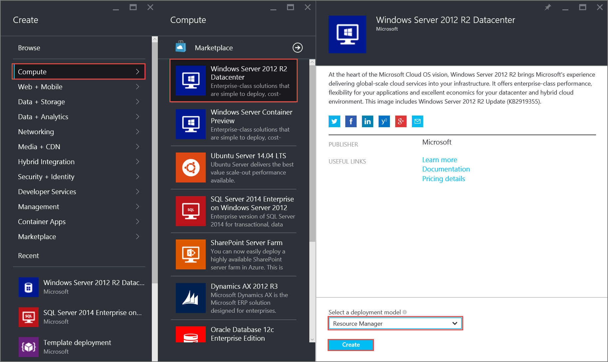
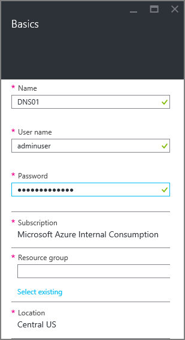
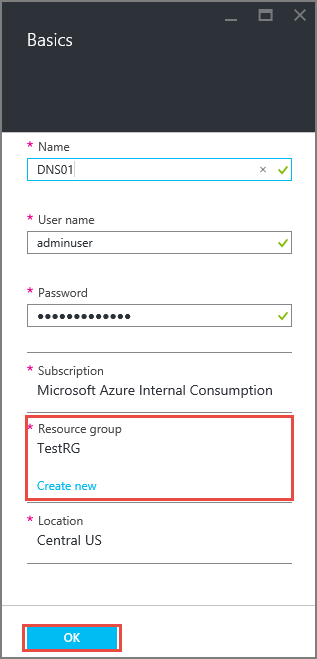
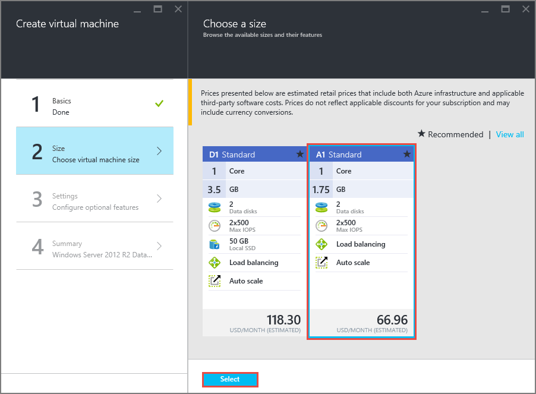
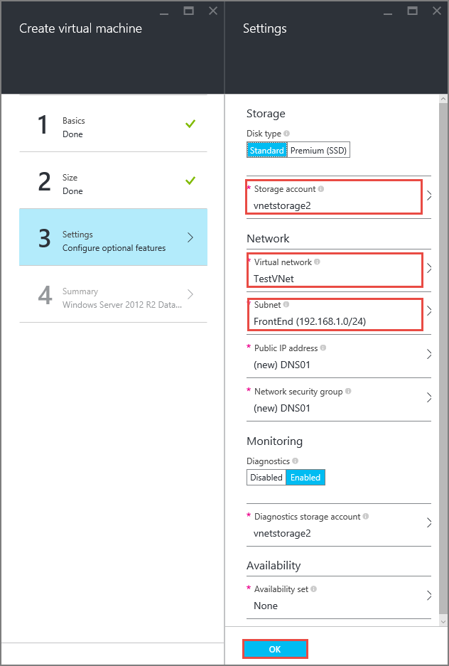
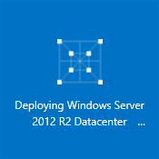
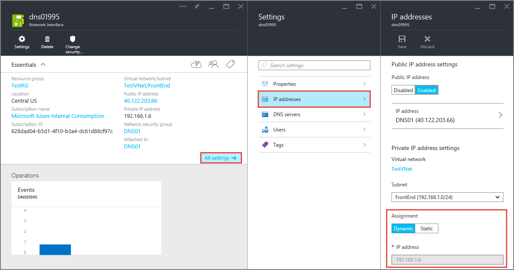

<!-- ARM: tested -->

<properties 
   pageTitle="如何使用 Azure 门户预览在 ARM 模式下设置静态专用 IP | Azure"
   description="了解专用 IP (DIP) 以及如何在 ARM 模式下使用 Azure 门户预览对其进行管理"
   services="virtual-network"
   documentationCenter="na"
   authors="telmosampaio"
   manager="carmonm"
   editor="tysonn"
   tags="azure-resource-manager"
/>
<tags
	ms.service="virtual-network"
	ms.date="02/04/2016"
	wacn.date="07/04/2016"/>

# 如何在 Azure 门户预览中设置静态专用 IP 地址

[AZURE.INCLUDE [virtual-networks-static-private-ip-selectors-arm-include](../includes/virtual-networks-static-private-ip-selectors-arm-include.md)]

[AZURE.INCLUDE [virtual-networks-static-private-ip-intro-include](../includes/virtual-networks-static-private-ip-intro-include.md)]

[AZURE.INCLUDE [azure-arm-classic-important-include](../includes/azure-arm-classic-important-include.md)]本文介绍资源管理器部署模型。你还可以[管理经典部署模型中的静态专用 IP 地址](/documentation/articles/virtual-networks-static-private-ip-classic-pportal/)。

[AZURE.INCLUDE [virtual-networks-static-ip-scenario-include](../includes/virtual-networks-static-ip-scenario-include.md)]

下面的示例步骤需要已创建简单的环境。如果你想要运行本文档中所显示的步骤，首先需要构建[创建 VNet](/documentation/articles/virtual-networks-create-vnet-arm-pportal/) 中所述的测试环境。

## 如何创建用于测试静态专用 IP 地址的 VM

在 Resource Manager 部署模型中创建 VM 时，不能使用 Azure 门户预览设置静态专用 IP 地址。必须先创建 VM，然后再将其专用 IP 设置为静态。

若要在名为 TestVNet 的 VNet 的 FrontEnd 子网中创建名为 DNS01 的 VM，请按以下步骤操作。

1. 从浏览器导航到 http://portal.azure.cn， 如有必要，请使用 Azure 帐户登录。
2. 单击“新建”>“计算”>“Windows Server 2012 R2 Datacenter”（注意此时“选择部署模型”列表已显示“Resource Manager”），然后单击“创建”，如下图所示。

	

3. 在“基本信息”边栏选项卡中，输入要创建的 VM 的名称（在我们的方案中为 DNS01）、本地管理员帐户和密码，如下图所示。

	

4. 请确保所选“位置”为“中国北部”，然后在“资源组”下单击“选择现有项”，接着依次单击“资源组”、“TestRG”和“确定”。

	

5. 在“选择大小”边栏选项卡中，选择“A1 标准”，然后单击“选择”。

	

6. 在“设置”边栏选项卡中，确保将下列属性设置为以下值，然后单击“确定”。

	-**存储帐户**：vnetstorage
	- **网络**：TestVNet
	- **子网**：FrontEnd

	

7. 在“摘要”边栏选项卡中，单击“确定”。请注意下方显示在仪表板中的磁贴。

	

## 如何检索 VM 的静态专用 IP 地址信息

若要查看使用以上步骤创建的 VM 的静态专用 IP 地址信息，请执行以下步骤。

1. 在 Azure 门户预览中，单击“全部浏览”>“虚拟机”>“DNS01”>“所有设置”>“网络接口”，然后单击列出的唯一网络接口。

	

2. 在“网络接口”边栏选项卡中，单击“所有设置”>“IP 地址”，记下“分配”和“IP 地址”的值。

	

## 如何将静态专用 IP 地址添加到现有 VM
若要将静态专用 IP 地址添加到使用上面步骤创建的 VM 中，请按照以下步骤操作：

1. 从上面所示的“IP 地址”边栏选项卡中，单击“分配”下面的“静态”。
2. 键入 192.168.1.101 作为“IP 地址”，然后单击“保存”。

	

>[AZURE.NOTE] 单击“保存”后，如果你注意到分配仍设置为“动态”，则表示你键入的 IP 地址已被使用。请尝试其他 IP 地址。

## 如何从 VM 中删除静态专用 IP 地址
若要从上面创建的 VM 中删除静态专用 IP 地址，请按照以下步骤操作。
	
1. 从上面所示的“IP 地址”边栏选项卡中，单击“分配”下面的“动态”，然后单击“保存”。

## 后续步骤

- 了解[保留公共 IP](/documentation/articles/virtual-networks-reserved-public-ip/) 地址。
- 了解[实例层级公共 IP (ILPIP)](/documentation/articles/virtual-networks-instance-level-public-ip/) 地址。
- 查阅[保留 IP REST API](https://msdn.microsoft.com/zh-cn/library/azure/dn722420.aspx)。

<!---HONumber=Mooncake_0418_2016-->