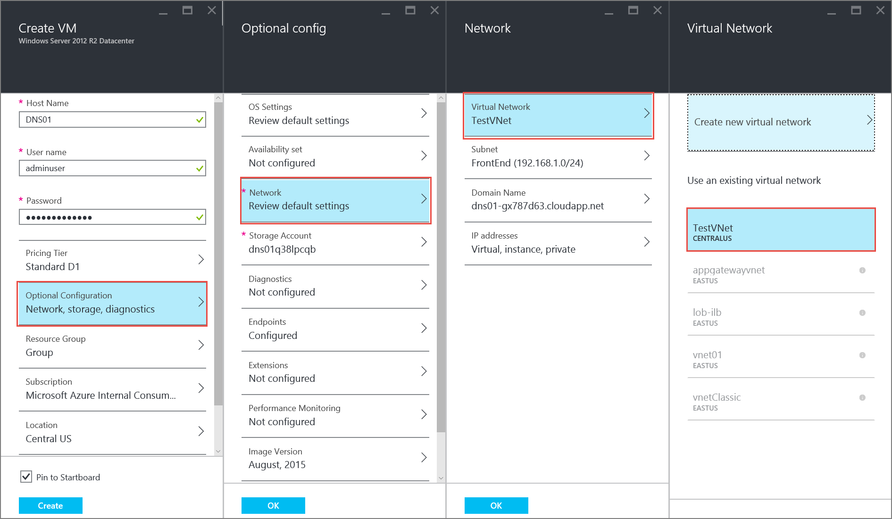
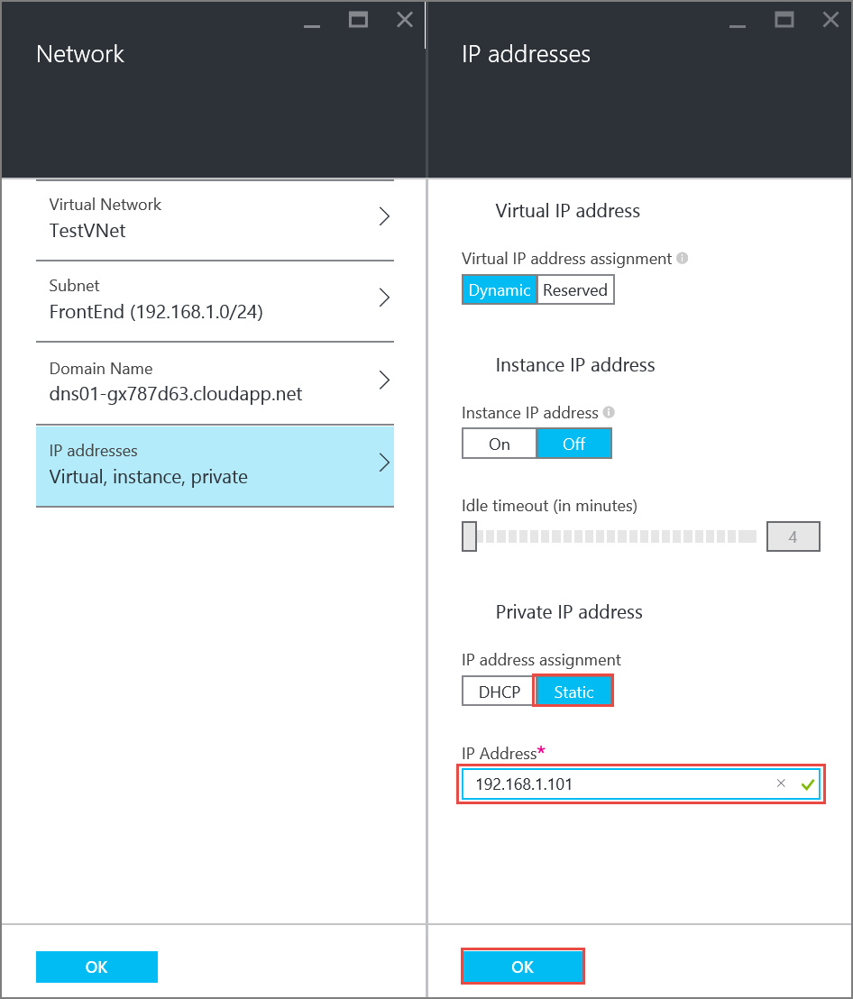
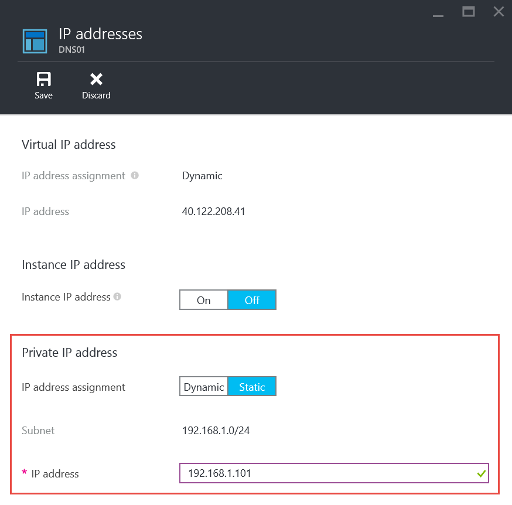
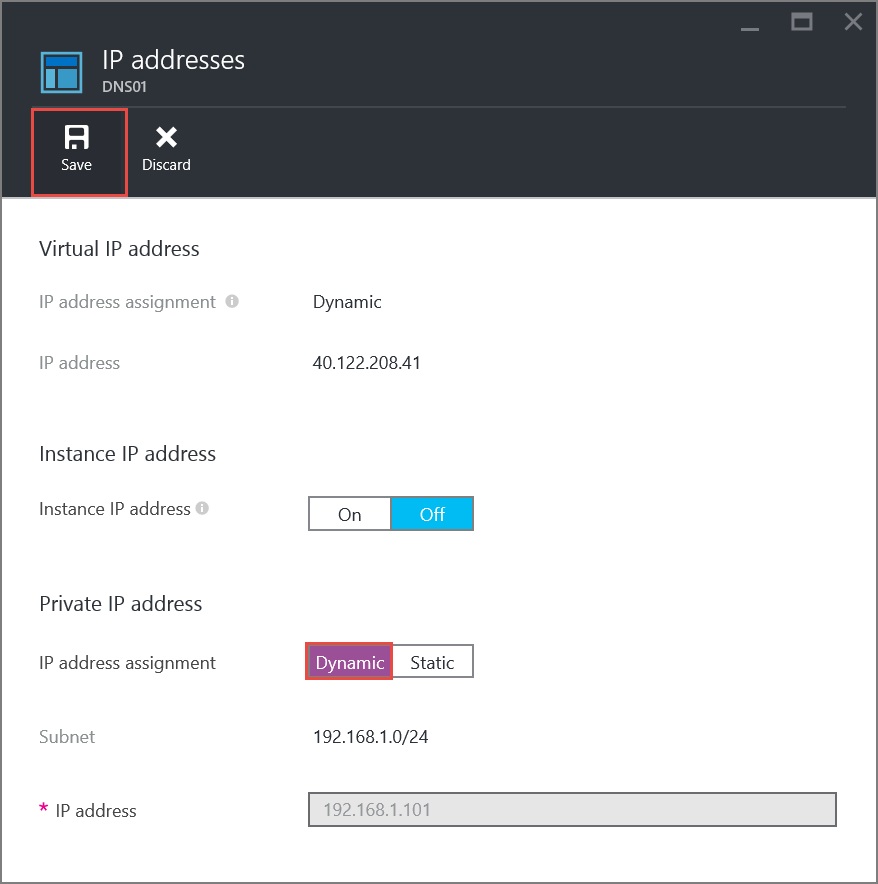

<properties 
   pageTitle="如何使用 Azure 门户预览在经典模式下设置静态专用 IP | Azure"
   description="了解静态专用 IP 以及如何使用 Azure 门户预览在经典模式下管理它们"
   services="virtual-network"
   documentationCenter="na"
   authors="telmosampaio"
   manager="carmonm"
   editor="tysonn"
   tags="azure-service-management"
/>
<tags 
   ms.service="virtual-network"
   ms.devlang="na"
   ms.topic="article"
   ms.tgt_pltfrm="na"
   ms.workload="infrastructure-services"
   ms.date="02/04/2016"
   wacn.date="12/26/2016"
   ms.author="jdial" />

# 如何在 Azure 门户预览中设置静态专用 IP 地址（经典）

[AZURE.INCLUDE [virtual-networks-static-private-ip-selectors-classic-include](../../includes/virtual-networks-static-private-ip-selectors-classic-include.md)]

[AZURE.INCLUDE [virtual-networks-static-private-ip-intro-include](../../includes/virtual-networks-static-private-ip-intro-include.md)]

>[AZURE.IMPORTANT]在使用 Azure 资源之前，请务必了解 Azure 当前使用两种部署模型：Azure Resource Manager 部署模型和经典部署模型。在使用任何 Azure 资源之前，请确保你了解[部署模型和工具](/documentation/articles/azure-classic-rm/)。可以通过单击本文顶部的选项卡来查看不同工具的文档。本文介绍经典部署模型。还可[在 Resource Manager 部署模型中管理静态专用 IP 地址](/documentation/articles/virtual-networks-static-private-ip-arm-pportal/)。

[AZURE.INCLUDE [virtual-networks-static-ip-scenario-include](../../includes/virtual-networks-static-ip-scenario-include.md)]

下面的示例步骤需要已创建简单的环境。若要运行本文档中所示步骤，首先需要生成[创建 Vnet](/documentation/articles/virtual-networks-create-vnet-classic-pportal/) 中所述的测试环境。

## 如何在创建 VM 时指定静态专用 IP 地址
若要在名为 *TestVNet* 的 VNet 的 *FrontEnd* 子网中使用静态专用 IP *192.168.1.101* 创建名为 *DNS01* 的 VM，请按照以下步骤进行操作：

1. 从浏览器导航到 http://portal.azure.cn，根据需要使用 Azure 帐户登录。
2. 单击“新建”>“计算”>“Windows Server 2012 R2 数据中心”（注意“选择部署模型”列表已显示“经典”），然后单击“创建”。

	

3. 在“创建 VM”边栏选项卡中，输入要创建的 VM 的名称（在本例中即 *DNS01*）、本地管理员帐户和密码。

	

4. 单击“可选配置”>“网络”>“虚拟网络”，然后单击“TestVNet”。如果 **TestVNet** 不可用，请确保你使用的位置为“中国北部”，并已创建本文开头所述的测试环境。

	

5. 在“网络”边栏选项卡中，确保当前选定的子网为 FrontEnd，然后单击“IP 地址”，在“IP 地址分配”下单击“静态”，然后输入 192.168.1.101 作为“IP 地址”，如下所示。

	

6. 依次在“IP 地址”、“网络”和“可选配置”边栏选项卡中单击“确定”。
7. 在“创建 VM”边栏选项卡中，单击“创建”。注意仪表板中显示以下磁贴。

	

## 如何检索 VM 的静态专用 IP 地址信息

若要查看使用以上步骤创建的 VM 的静态专用 IP 地址信息，请执行以下步骤。

1. 在 Azure 门户预览中，单击“浏览全部”>“虚拟机(经典)”>“DNS01”>“所有设置”>“IP 地址”，注意如下所示的 IP 地址分配和 IP 地址。

	

## 如何从 VM 中删除静态专用 IP 地址
若要从上面创建的 VM 中删除静态专用 IP 地址，请按照以下步骤操作。
	
1. 从上示“IP 地址”边栏选项卡中“IP 地址分配”右侧，依次单击“动态”、“保存”和“是”。

	

## 如何将静态专用 IP 地址添加到现有 VM
若要将静态专用 IP 地址添加到使用上面步骤创建的 VM，请按照以下步骤操作：

1. 从上面所示的“IP 地址”边栏选项卡中“IP 地址分配”右侧，单击“静态”。
2. 键入 *192.168.1.101* 作为“IP 地址”，然后单击“保存”，再单击“是”。

## 后续步骤

- 了解[保留公共 IP](/documentation/articles/virtual-networks-reserved-public-ip/) 地址。
- 了解[实例层级公共 IP (ILPIP)](/documentation/articles/virtual-networks-instance-level-public-ip/) 地址。
- 查阅[保留 IP REST API](https://msdn.microsoft.com/zh-cn/library/azure/dn722420.aspx)。

<!---HONumber=Mooncake_Quality_Review_1215_2016-->