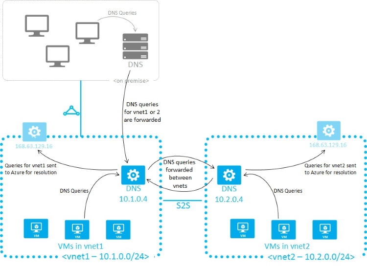

<properties 
   pageTitle="VM 和角色实例的解析"
   description="Azure IaaS、混合解决方案、不同的云服务之间、Active Directory 和使用自己的 DNS 服务器的名称解析方案"
   services="virtual-network"
   documentationCenter="na"
   authors="GarethBradshawMSFT"
   manager="carmonm"
   editor="tysonn" />
<tags
	ms.service="virtual-network"
	ms.date="02/24/2016"
	wacn.date="04/25/2016"/>

# VM 和角色实例的名称解析

具体取决于如何使用 Azure 托管 IaaS、PaaS 和混合解决方案，你可能需要允许 VM 和创建的角色实例彼此进行通信。尽管这种通信可以通过使用 IP 地址完成，但使用容易记住且不会更改的名称要简单得多。

当 Azure 中托管的角色实例和 VM 需要将域名解析到内部 IP 地址时，它们可以使用两种方法之一：

- [Azure 提供的名称解析](#azure-provided-name-resolution)

- [使用你自己的 DNS 服务器的名称解析](#name-resolution-using-your-own-dns-server)（可能会将查询转发到 Azure 提供的 DNS 服务器）

使用的名称解析类型取决于 VM 和角色实例需要彼此进行通信的方式。

**下表说明了方案和相应的名称解析解决方案：**

| **方案** | **解决方案** | **后缀** |
|--------------|--------------|----------|
| 位于相同云服务或虚拟网络中的角色实例或 VM 之间的名称解析 | [Azure 提供的名称解析](#azure-provided-name-resolution)| 主机名或 FQDN |
| 位于不同虚拟网络中的角色实例或 VM 之间的名称解析 | 客户托管的 DNS 服务器，在 VNet 之间转发可供 Azure（DNS 代理）解析的查询。请参阅[使用你自己的 DNS 服务器的名称解析](#name-resolution-using-your-own-dns-server)| 仅 FQDN |
| 通过 Azure 中的角色实例或 VM 解析本地计算机和服务的名称 | 客户托管的 DNS 服务器（例如本地域控制器、本地只读域控制器或使用区域传送同步的 DNS 辅助服务器）。请参阅[使用你自己的 DNS 服务器的名称解析](#name-resolution-using-your-own-dns-server)|仅 FQDN |
| 解析本地计算机中的 Azure 主机名 | 将查询转发到客户托管的相应 VNet 中的 DNS 代理服务器，代理服务器再将查询转发到 Azure 进行解析。请参阅[使用你自己的 DNS 服务器的名称解析](#name-resolution-using-your-own-dns-server)| 仅 FQDN |
| 针对内部 IP 的反向 DNS | [使用你自己的 DNS 服务器的名称解析](#name-resolution-using-your-own-dns-server) | 不适用 |
| 位于不同云服务（而非虚拟网络）中的 VM 或角色实例之间的名称解析| 不适用。不同云服务中的 VM 和角色实例之间的连接在虚拟网络外部不受支持。| 不适用 |

## Azure 提供的名称解析

除公共 DNS 名称解析之外，Azure 还为驻留在相同虚拟网络或云服务中的 VM 和角色实例提供内部名称解析。云服务中的 VM/实例共享同一 DNS 后缀，因此只需单独的主机名，但在经典虚拟网络中，不同的云服务具有不同的 DNS 后缀，因此需要使用 FQDN 在不同云服务之间解析名称。虽然 Azure 提供的名称解析不需要任何配置，但并不适合所有部署方案，如上表所示。

> [AZURE.NOTE] 在 Web 和辅助角色的情况下，还可以基于使用 Azure 服务管理 REST API 的角色名称和实例数访问内部 IP 地址。有关详细信息，请参阅[服务管理 REST API 参考](https://msdn.microsoft.com/zh-cn/library/azure/ee460799.aspx)。

### 功能和注意事项

**功能：**

- 易于使用：不需要配置就能使用 Azure 提供的名称解析。

- Azure 提供的名称解析服务高度可用，你无需创建和管理你自己的 DNS 服务器的群集。

- 可以与你自己的 DNS 服务器配合使用，以便解析本地主机名和 Azure 主机名。

- 在相同云服务中的角色实例/VM 之间提供名称解析，无需 FQDN。

- 经典部署模型中的虚拟网络需要使用 FQDN 来解析不同云服务中的名称。

- 你可以使用最能描述你的部署的主机名，而不必使用自动生成的名称。

**注意事项：**

- 不能修改 Azure 创建的 DNS 后缀。

- 不能手动注册你自己的记录。

- 不支持 WINS 和 NetBIOS。（在 Windows 资源管理器中看不到你的 VM。）

- 主机名必须与 DNS 兼容（它们必须仅使用 0-9、a-z 和“-”，并且不能以“-”开始或结束。请参见 RFC 3696 第 2 节。）

- DNS 查询流量按照 VM 进行限制。这不应影响大部分应用程序。如果遵循请求限制，请确保启用客户端缓存。有关详细信息，请参阅[充分利用 Azure 提供的名称解析](#Getting-the-most-from-Azure-provided-name-resolution)。

- 在经典部署模型中，每个虚拟网络仅注册前 180 个云服务中的 VM。

### 充分利用 Azure 提供的名称解析
**客户端缓存：**

不是每个 DNS 查询都需要跨网络发送。通过解析本地缓存中的重复性 DNS 查询，客户端缓存有助于减少延迟和提高网络信号的恢复能力。DNS 记录包含生存时间 (TTL)，这允许缓存尽可能长时间存储记录，而不影响记录刷新，因此客户端缓存适用于大多数情况。

默认 Windows DNS 客户端具有内置的 DNS 缓存。默认情况下，某些 Linux 发行版不包括缓存，建议每个 Linux VM 都添加缓存（此前必须确保不存在本地缓存）。

有许多不同 DNS 缓存包可用，例如 dnsmasq，下面是在最常见的发行版上安装 dnsmasq 的步骤：

- **Ubuntu（使用 resolvconf）**：
	- 只安装 dnsmasq 包（“sudo apt-get install dnsmasq”）。
- **SUSE（使用 netconf）**：
	- 安装 dnsmasq 包（“sudo zypper install dnsmasq”） 
	- 启用 dnsmasq 服务（“systemctl enable dnsmasq.service”） 
	- 启动 dnsmasq 服务（“systemctl start dnsmasq.service”） 
	- 编辑“/etc/sysconfig/network/config”，并将 NETCONFIG\_DNS\_FORWARDER="" 更改为“dnsmasq”
	- 更新 resolv.conf（“netconfig update”），以将缓存设置为本地 DNS 解析程序
- **OpenLogic（使用 NetworkManager）**：
	- 安装 dnsmasq 包（“sudo yum install dnsmasq”）
	- 启用 dnsmasq 服务（“systemctl enable dnsmasq.service”）
	- 启动 dnsmasq 服务（“systemctl start dnsmasq.service”）
	- 将“prepend domain-name-servers 127.0.0.1;”添加到“/etc/dhclient-eth0.conf”
	- 重新启动网络服务（“service network restart”），以将缓存设置为本地 DNS 解析程序

> [AZURE.NOTE]该“dnsmasq”包只是适用于 Linux 的众多 DNS 缓存中的一个。在使用之前，请检查其是否适合你的特定需求，并且确认你没有安装其他缓存。

**客户端重试：**

DNS 主要是一个 UDP 协议。因为 UDP 协议无法保证消息传递，所以重试逻辑在DNS 协议本身中处理。每个 DNS 客户端（操作系统）可能会表现出不同的重试逻辑，具体取决于创建者偏好：

 - Windows 操作系统在 1 秒后重试，然后在再 2 秒后、再 4 秒后和另一个 4 秒后再次重试。 
 - 默认 Linux 设置在 5 秒后重试。建议将此更改为重试 5 次，每次间隔 1 秒。  

若要检查 Linux VM 上的当前设置，“cat /etc/resolv.conf”并查看“options”行，例如：

	options timeout:1 attempts:5

resolv.conf 文件通常是自动生成的，不应进行编辑。添加“options”行的具体步骤因发行版而异：

- **Ubuntu**（使用 resolvconf）：
	- 将“options”行添加到“/etc/resolveconf/resolv.conf.d/head” 
	- 运行“resolvconf -u”以更新
- **SUSE**（使用 netconf）：
	- 将“timeout:1 attempts:5”添加到“/etc/sysconfig/network/config”中的 NETCONFIG\_DNS\_RESOLVER\_OPTIONS="" 参数 
	- 运行“netconfig update”以更新
- **OpenLogic**（使用 NetworkManager）：
	- 将“echo "options timeout:1 attempts:5"”添加到“/etc/NetworkManager/dispatcher.d/11-dhclient” 
	- 运行“service network restart”以更新

## 使用你自己的 DNS 服务器的名称解析
在很多情况下，Azure 所提供的功能可能无法满足你的名称解析需求，例如，你可能需要使用 Active Directory 域，或者需要在虚拟网络 (VNet) 之间进行 DNS 解析。考虑到这些情况，Azure 为你提供了使用你自己的 DNS 服务器的功能。

虚拟网络中的 DNS 服务器可以将 DNS 查询转发到 Azure 的递归解析程序，以便解析该虚拟网络中的主机名。例如，在 Azure 中运行的域控制器 (DC) 可以响应自身域的 DNS 查询，而将所有其他查询转发到 Azure。这样一来，VM 就可以查看你的本地资源（通过 DC）以及 Azure 提供的主机名（通过转发器）。可以通过虚拟 IP 168.63.129.16 访问 Azure 的递归解析程序。

DNS 转发还可用于在 VNet 之间进行 DNS 解析，可以通过本地计算机来解析 Azure 提供的主机名。为了解析 VM 的主机名，DNS 服务器 VM 必须驻留在同一虚拟网络中，并且必须配置为将主机名查询转发到 Azure。由于 DNS 后缀在每个 VNet 中是不同的，因此可使用条件性转发规则将 DNS 查询发送到正确的 VNet 进行解析。下图显示了如何通过两个 VNet 和一个本地网络使用该方法在 VNet 之间进行 DNS 解析。 一个 DNS 转发器示例可以在 [GitHub](https://github.com/Azure/azure-quickstart-templates/tree/master/301-dns-forwarder) 找到。

使用 Azure 提供的名称解析时，会通过 DHCP 为每个 VM 提供内部 DNS 后缀（*.internal.chinacloudapp.cn）。这使主机名解析成 internal.chinacloudapp.cn 区间内的主机记录。使用你自己的名称解析解决方案时，不会向 VM 提供该 IDNS 后缀，因为该后缀会干扰其他 DNS 体系结构（如 domain-joined 案例）。

如果需要，可通过 PowerShell 或 API 来确定该后缀：
 
-  在经典部署模型中，该后缀可通过 [Get Deployment API](https://msdn.microsoft.com/zh-cn/library/azure/ee460804.aspx) 调用或 [Get-AzureVM -Debug](https://msdn.microsoft.com/zh-cn/library/azure/dn495236.aspx) cmdlet 来获取。

如果你不想将查询转发到 Azure，则需提供你自己的 DNS 解决方案。你的 DNS 解决方案需满足以下条件：

-  提供合适的主机名解析方式（例如通过 [DDNS](/documentation/articles/virtual-networks-name-resolution-ddns/) 进行解析）。请注意，如果使用 DDNS，则可能需要禁用 DNS 记录清理，因为 Azure 的 DHCP 租约时间很长，进行清理可能会导致 DNS 记录删除过早。 
-  提供适当的递归式解析来解析外部域名。
-  可以从其所服务的对象（即客户端）进行访问（在端口 53 上启用 TCP 和 UDP），并可访问 Internet。
-  禁止从 Internet 进行访问，减少外部代理带来的威胁。

> [AZURE.NOTE] 为了获得最佳性能，在将 Azure VM用作 DNS 服务器时，应禁用 IPv6，并且[实例层级公共 IP](/documentation/articles/virtual-networks-instance-level-public-ip/) 应分配给每个 DNS 服务器 VM。如果你选择使用 Windows Server 作为 DNS 服务器，则可参阅[此文](http://blogs.technet.com/b/networking/archive/2015/08/19/name-resolution-performance-of-a-recursive-windows-dns-server-2012-r2.aspx)，其中提供了其他性能分析和优化措施。

### 指定 DNS 服务器

使用你自己的 DNS 服务器时，可通过 Azure 为每个虚拟网络或云服务（经典）指定多个 DNS 服务器。为云服务/网络接口指定 DNS 服务器时，其优先级高于为虚拟网络指定的 DNS 服务器。

> [AZURE.NOTE] 不应直接在 Windows VM 中编辑网络连接属性（例如 DNS 服务器 IP），因为如果更换虚拟网络适配器，则可能会在服务修复过程中擦除这些属性。

使用经典部署模型时，可以在经典管理门户或[网络配置文件](https://msdn.microsoft.com/zh-cn/library/azure/jj157100)中指定虚拟网络的 DNS 服务器。对于云服务器，则可通过[服务配置文件](https://msdn.microsoft.com/zh-cn/library/azure/ee758710)或 PowerShell ([New-AzureVM](https://msdn.microsoft.com/zh-cn/library/azure/dn495254.aspx)) 指定 DNS 服务器。

> [AZURE.NOTE] 如果更改已部署的虚拟网络/虚拟机的 DNS 设置，则需重新启动每个受影响的 VM，所做的更改才会生效。

## 后续步骤
 
经典部署模型：

- [Azure 服务配置架构](https://msdn.microsoft.com/zh-cn/library/azure/ee758710)
- [虚拟网络配置架构](https://msdn.microsoft.com/zh-cn/library/azure/jj157100)
- [使用网络配置文件配置虚拟网络](/documentation/articles/virtual-networks-using-network-configuration-file/) 

<!---HONumber=Mooncake_0418_2016-->