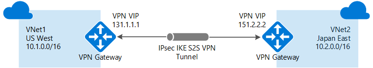
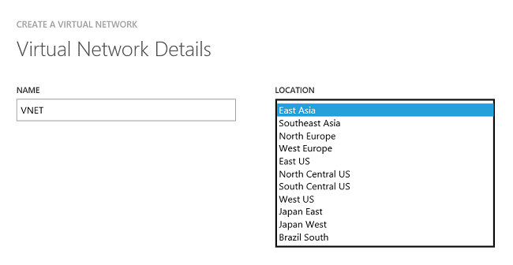
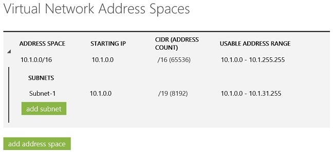

<properties
    pageTitle="为经典部署模型配置 VNet 到 VNet 连接 | Azure"
    description="如何使用 PowerShell 和 Azure 经典管理门户将 Azure 虚拟网络连接到一起。"
    services="vpn-gateway"
    documentationcenter="na"
    author="cherylmc"
    manager="carmonm"
    editor=""
    tags="azure-service-management" />  

<tags
    ms.assetid="7413827f-233d-4c7c-a133-9c99cf031833"
    ms.service="vpn-gateway"
    ms.devlang="na"
    ms.topic="article"
    ms.tgt_pltfrm="na"
    ms.workload="infrastructure-services"
    ms.date="08/31/2016"
    wacn.date="12/26/2016"
    ms.author="cherylmc" />

# 为经典部署模型配置 VNet 到 VNet 连接
> [AZURE.SELECTOR]
- [Resource Manager - Azure 门户预览](/documentation/articles/vpn-gateway-howto-vnet-vnet-resource-manager-portal/)
- [Resource Manager - PowerShell](/documentation/articles/vpn-gateway-vnet-vnet-rm-ps/)
- [经典 - 经典管理门户](/documentation/articles/virtual-networks-configure-vnet-to-vnet-connection/)

本文逐步讲解如何执行相关步骤，使用经典部署模型（也称为服务管理）来创建虚拟网络并将其连接到一起。以下步骤使用 Azure 经典管理门户来创建 VNet 和网关，使用 PowerShell 来配置 VNet 到 VNet 连接。无法在门户中配置该连接。

  

### VNet 到 VNet 连接的部署模型和方法
[AZURE.INCLUDE [部署模型](../../includes/vpn-gateway-deployment-models-include.md)]

下表显示了 VNet 到 VNet 配置当前可用的部署模型和方法。当有配置步骤相关的文章发布时，我们会直接从此表格链接到该文章。

[AZURE.INCLUDE [vpn-gateway-table-vnet-vnet](../../includes/vpn-gateway-table-vnet-to-vnet-include.md)]

## 关于 VNet 到 VNet 的连接
将虚拟网络连接到虚拟网络（VNet 到 VNet）类似于将虚拟网络连接到本地站点位置。这两种连接类型都使用 VPN 网关来提供使用 IPsec/IKE 的安全隧道。

你连接的 VNet 可位于不同的订阅和不同的区域中。你可以将 VNet 到 VNet 通信与多站点配置组合使用。这样，便可以建立将跨界连接与虚拟网络间连接相结合的网络拓扑。

### 为什么要连接虚拟网络？
你可能会出于以下原因而连接虚拟网络：

* **跨区域地域冗余和地域存在**
  
  * 你可以使用安全连接设置自己的异地复制或同步，而无需借助于面向 Internet 的终结点。
  * 使用 Azure Load Balancer 和 Microsoft 或第三方群集技术，你可以设置支持跨多个 Azure 区域实现地域冗余的高可用性工作负荷。一个重要的示例就是对分布在多个 Azure 区域中的可用性组设置 SQL Always On。
* **具有强大隔离边界的区域多层应用程序**
  
  * 在同一区域中，可以设置具有多个 VNet 的多层应用程序，这些虚拟网络相互连接在一起，但同时又能保持强大的隔离性，而且还能进行安全的层间通信。
* **在 Azure 中跨订阅进行组织间通信**
  
  * 如果你有多个 Azure 订阅，可以在虚拟网络之间安全地将不同订阅中的工作负荷连接起来。
  * 对于企业或服务提供商而言，可以在 Azure 中使用安全 VPN 技术启用跨组织通信。

### 针对经典 VNet 的 VNet 到 VNet 通信常见问题
* 虚拟网络可以在相同或不同的订阅中。
* 虚拟网络可以在相同或不同的 Azure 区域（位置）中。
* 云服务或负载均衡终结点不能跨虚拟网络，即使它们连接在一起，也是如此。
* 将多个虚拟网络连接在一起不需要任何 VPN 设备。
* VNet 到 VNet 通信支持连接 Azure 虚拟网络。它不支持连接未部署到虚拟网络的虚拟机或云服务。
* VNet 到 VNet 通信需要动态路由网关。不支持 Azure 静态路由网关。
* 虚拟网络连接可与多站点 VPN 同时使用。最多可以将一个虚拟网络 VPN 网关的 10 个 VPN 隧道连接到其他虚拟网络或本地站点。
* 虚拟网络和本地网络站点的地址空间不得重叠。地址空间重叠将会导致创建虚拟网络或上载 netcfg 配置文件失败。
* 不支持一对虚拟网络之间存在冗余隧道。
* VNet 的所有 VPN 隧道（包括 P2S VPN）共享 VPN 网关上的可用带宽，以及 Azure 中的相同 VPN 网关运行时间 SLA。
* VNet 到 VNet 流量将会流经 Azure 主干。

## 步骤 1 - 规划 IP 地址范围
必须确定要用于配置虚拟网络的范围。对于此配置，必须确保 VNet 的范围不互相重叠，也不能与所连接到的任何本地网络重叠。

下表显示有关如何定义 VNet 的示例。其中的范围仅供参考。请记下虚拟网络的范围。后面的步骤需要用到此信息。

**示例设置**

| 虚拟网络 | 地址空间 | 区域 | 连接到本地网络站点 |
|:--- |:--- |:--- |:--- |
| VNet1 |VNet1 (10.1.0.0/16) |中国北部 |VNet2Local (10.2.0.0/16) |
| VNet2 |VNet2 (10.2.0.0/16) |中国东部 |VNet1Local (10.1.0.0/16) |

## 步骤 2 - 创建 VNet1
本步骤创建 VNet1。使用任何示例时，必须替换成你自己的值。如果你的 VNet 已存在，则不需执行此步骤，但需确保 IP 地址范围不与第二个 VNet 的 IP 地址范围重叠，也不与要连接到的任何其他 VNet 的 IP 地址范围重叠。

1. 登录到 [Azure 经典管理门户](https://manage.windowsazure.cn)。本文使用经典管理门户，因为某些所需的配置设置目前无法在 Azure 门户预览中完成。
2. 在屏幕的左下角，单击“新建”>“网络服务”>“虚拟网络”>“自定义创建”启动配置向导。在向导中导航时，请将指定的值添加到每个页面。

### 虚拟网络详细信息
在“虚拟网络详细信息”页中输入以下信息：

    

* **名称** - 为虚拟网络命名。例如，VNet1。
* **位置** - 当你创建虚拟网络时，你会将它与一个 Azure 位置（区域）相关联。例如，如果你希望部署到虚拟网络的 VM 的物理位置位于中国北部，请选择该位置。创建虚拟网络后，将无法更改与虚拟网络关联的位置。

### DNS 服务器和 VPN 连接
在“DNS 服务器和 VPN 连接”页上，输入以下信息，然后单击右下角的“下一步”箭头。

    

* **DNS 服务器** - 输入 DNS 服务器名称和 IP 地址，或从下拉列表中选择一个以前注册的 DNS 服务器。此设置不创建 DNS 服务器。此设置允许指定要用于对此虚拟网络进行名称解析的 DNS 服务器。如果希望在虚拟网络之间进行名称解析，则必须配置自己的 DNS 服务器，而不是使用 Azure 提供的名称解析。
* 进行 P2S 或 S2S 连接时，请勿选择任何复选框。单击右下角的箭头转到下一屏幕。

### 虚拟网络地址空间
在“虚拟网络地址空间”页上，指定要用于虚拟网络的地址范围。这些都是动态 IP 地址 (DIPS)，将分配给你部署到此虚拟网络的 VM 和其他角色实例。

如果要创建的 VNet 也会连接到本地网络，则所选范围不要与本地网络所用范围重叠，这一点尤其重要。在这种情况下，需要与网络管理员协调。网络管理员可能需要从本地网络地址空间中划分一个 IP 地址范围供 VNet 使用。

    

* **地址空间** - 包括起始 IP 和地址计数。请确保你指定的地址空间不与本地网络的任一地址空间重叠。本示例为 VNet1 使用 10.1.0.0/16。
* **添加子网** - 包括起始 IP 和地址计数。附加的子网不是必需的，但你可能需要为具有静态 DIP 的 VM 创建一个单独的子网。或者，你可能需要在子网中拥有与其他角色实例分开的 VM。

**单击复选标记**（位于该页右下角），此时将开始创建你的虚拟网络。创建完成后，在“网络”页上，你将看到“状态”下面列出了“已创建”。

## 步骤 3 - 创建 VNet2
接下来，重复前面的步骤创建另一个 VNet。在后面的步骤中，将要连接两个 VNet。你可以参阅步骤 1 中的[示例设置](#step1)。如果你的 VNet 已存在，则不需执行此步骤，但需确保 IP 地址范围不与要连接到的任何其他 VNet 或本地网络的 IP 地址范围重叠。

## 步骤 4 - 添加本地网络站点
创建 VNet 到 VNet 配置时，需配置本地网络站点，如门户的“本地网络”页所示。Azure 使用在每个本地网络站点中指定的设置来确定如何在 VNet 之间路由流量。如果需要使用名称来引用每个本地网络站点，将由你来决定该名称。最好是使用描述性名称，因为在执行后面的步骤时，需要从下拉列表中选择值。

例如，VNet1 连接到创建的名为“VNet2Local”的本地网络站点。VNet2Local 的设置包含 VNet2 的地址前缀，以及 VNet2 网关的公共 IP 地址。VNet2 连接到创建的名为“VNet1Local”的本地网络站点，该站点包含 VNet1 的地址前缀，以及 VNet1 网关的公共 IP 地址。

### 添加本地网络站点 VNet1Local
1. 在屏幕的左下角，单击“新建”>“网络服务”>“虚拟网络”>“添加本地网络”。
2. 在“指定你的本地网络详细信息”页中，对于“名称”，请输入你要使用的名称，该名称代表所要连接到的网络。在此示例中，你可以使用“VNet1Local”来表示 VNet1 的 IP 地址范围和网关。
3. 对于“VPN 设备 IP 地址(可选)”，请指定任何有效的公共 IP 地址。通常，应该使用 VPN 设备的实际外部 IP 地址。对于 VNet 到 VNet 配置，请使用分配给 VNet 网关的公共 IP 地址。但是，考虑到尚未创建该网关，因此可以指定任何有效的公共 IP 地址作为占位符。请勿将此留空 - 就此配置来说，此项不是可选项。稍后将返回到这些设置，使用 Azure 生成的相应网关 IP 地址对其进行配置。单击箭头转到下一屏幕。
4. 在“指定地址”页中，输入 VNet1 的 IP 地址范围和地址计数。此值必须精确对应于为 VNet1 配置的范围。Azure 使用指定的 IP 地址范围将流量路由到 VNet1。单击复选标记以创建本地网络。

### 添加本地网络站点 VNet2Local
使用上述步骤创建本地网络站点“VNet2Local”。必要时，你可以参阅步骤 1 中[示例设置](#step1)中的值。

### 将每个 VNet 配置为指向本地网络
每个 VNet 都必须指向你要将流量路由到的相应本地网络。

**对于 VNet1**

1. 导航到虚拟网络 **VNet1** 的“配置”页。
2. 在“站点到站点连接”下，选择“连接到本地网络”，然后从下拉列表中选择“VNet2Local”作为本地网络。
3. 保存你的设置。

**对于 VNet2**

1. 导航到虚拟网络 **VNet2** 的“配置”页。
2. 在“站点到站点连接”下，选择“连接到本地网络”，然后从下拉列表中选择“VNet1Local”作为本地网络。
3. 保存你的设置。

## 步骤 5 - 为每个 VNet 配置网关
为每个虚拟网络配置动态路由网关。此配置不支持静态路由网关。如果你使用的 VNet 此前已配置过并且已经有动态路由网关，则不需执行此步骤。如果网关为静态路由，则需先将其删除，然后重新创建为动态路由网关。如果删除某个网关，则会释放分配到该网关的公共 IP 地址，此时需要返回使用新网关的新公共 IP 地址重新配置所有本地网络和 VPN 设备。

1. 在“网络”页上，验证虚拟网络的“状态”列是否为“已创建”。
2. 在“名称”列中，单击你的虚拟网络的名称。本示例使用“VNet1”。
3. 在“仪表板”页上，请注意此 VNet 尚未配置网关。当你完成配置网关的步骤时，你将会看到此状态更改。
4. 在页面底部，单击“创建网关”和“动态路由”。系统提示你确认要创建网关时，单击“是”。
   
        

5. 正在创建网关时，请注意页面上的网关图形将更改为黄色，并显示“正在创建网关”。创建网关通常需要大约 30 分钟时间。
6. 对 VNet2 重复相同的步骤。不需要在创建完第一个 VNet 网关之后才开始创建另一个 VNet 的网关。
7. 当网关状态更改为“正在连接”时，每个网关的公共 IP 地址将显示在仪表板中。写下对应于每个 VNet 的 IP 地址，请注意不要混淆。针对每个本地网络编辑 VPN 设备的占位符 IP 地址时，将要使用这些 IP 地址。

## 步骤 6 - 编辑本地网络
1. 在“本地网络”页上，单击你要编辑的本地网络名称，然后单击页底部的“编辑”。对于“VPN 设备 IP 地址”，请输入对应于 VNet 的网关 IP 地址。例如，对于 VNet1Local，请输入分配给 VNet1 的网关 IP 地址。然后，单击页底部的箭头。
2. 在“指定地址空间”页上，单击右下角的复选标记，但不要进行任何更改。

## 步骤 7 - 创建 VPN 连接
完成前面的所有步骤后，请设置 IPsec/IKE 预共享密钥并创建连接。这一组步骤使用 PowerShell，不能在门户中配置。有关安装 Azure PowerShell cmdlet 的详细信息，请参阅[如何安装和配置 Azure PowerShell](/documentation/articles/powershell-install-configure/)。请确保下载最新版本的服务管理 (SM) cmdlet。

1. 打开 Windows PowerShell，然后登录。
   
        Add-AzureAccount -Environment AzureChinaCloud
2. 选择 VNet 所在的订阅。
   
        Get-AzureSubscription | Sort SubscriptionName | Select SubscriptionName
        Select-AzureSubscription -SubscriptionName "<Subscription Name>"
3. 创建连接。在示例中，可以看到共享密钥完全相同。共享的密钥必须始终匹配。

    VNet1 到 VNet2 连接

        Set-AzureVNetGatewayKey -VNetName VNet1 -LocalNetworkSiteName VNet2Local -SharedKey A1b2C3D4

    VNet2 到 VNet1 连接

        Set-AzureVNetGatewayKey -VNetName VNet2 -LocalNetworkSiteName VNet1Local -SharedKey A1b2C3D4

4. 等待连接初始化。初始化网关后，网关将如下图所示。
   
      

   
[AZURE.INCLUDE [vpn-gateway-no-nsg-include](../../includes/vpn-gateway-no-nsg-include.md)]

## 后续步骤
你可以将虚拟机添加到虚拟网络。有关详细信息，请参阅[虚拟机文档](/documentation/services/virtual-machines/)。

<!---HONumber=Mooncake_1219_2016-->