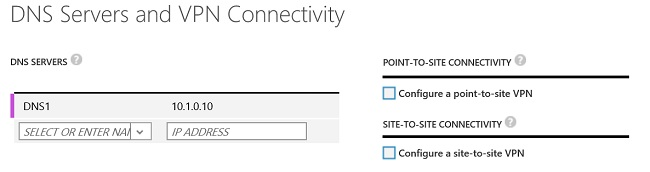

<properties
   pageTitle="配置 VNet 到 VNet 连接 | Azure"
   description="如何使用 PowerShell 和 Azure 经典管理门户在相同或不同的订阅或区域中将 Azure 虚拟网络连接在一起。本文适用于使用经典部署模型创建的 VNet。"
   services="vpn-gateway"
   documentationCenter="na"
   authors="cherylmc"
   manager="carmonm"
   editor=""/>

<tags
   ms.service="vpn-gateway"
   ms.date="05/02/2016"
   wacn.date="06/30/2016"/>

# 为经典部署模型配置 VNet 到 VNet 连接

> [AZURE.SELECTOR]
- [Azure 经典管理门户](/documentation/articles/virtual-networks-configure-vnet-to-vnet-connection/)
- [PowerShell - Azure 资源管理器](/documentation/articles/vpn-gateway-vnet-vnet-rm-ps/)

本文将引导你执行相关步骤，以便使用经典部署模型（也称为服务管理）来创建虚拟网络并将其连接到一起。以下步骤使用 Azure 经典管理门户和 PowerShell 的组合。

**关于 Azure 部署模型**

[AZURE.INCLUDE [vpn-gateway-clasic-rm](../includes/vpn-gateway-classic-rm-include.md)]

**VNet 到 VNet 的部署模型和工具**

可以通过使用多种不同工具在这两种部署模型中配置 VNet 到 VNet 的连接。有关更多信息，请参见下表。我们将在由可用于此配置的新文章、新部署模型和其他工具时更新此表。当有文章可用时，我们将从表中直接链接到该文章。

[AZURE.INCLUDE [vpn-gateway-table-vnet-to-vnet](../includes/vpn-gateway-table-vnet-to-vnet-include.md)]

## 关于 VNet 到 VNet 的连接

将虚拟网络连接到虚拟网络（VNet 到 VNet）非常类似于将虚拟网络连接到本地站点位置。这两种连接类型都使用 VPN 网关来提供使用 IPsec/IKE 的安全隧道。你连接的 VNet 可位于不同的订阅和不同的区域中。你甚至可以将 VNet 到 VNet 通信与多站点配置组合使用。这样，便可以建立将跨界连接与虚拟网络间连接相结合的网络拓扑，如下图所示：

### 为什么要连接虚拟网络？

你可能会出于以下原因而连接虚拟网络：

- **跨区域地域冗余和地域存在**
	- 你可以使用安全连接设置自己的地域复制或同步，而无需借助于面向 Internet 的终结点。
	- 使用 Azure 负载平衡器和 Microsoft 或第三方群集技术，你可以设置支持跨多个 Azure 区域实现地域冗余的高可用性工作负荷。一个重要的示例就是对分布在多个 Azure 区域中的可用性组设置 SQL Always On。

- **具有强大隔离边界的区域多层应用程序**
	- 在同一区域中，你可以设置具有多个虚拟网络的多层应用程序，这些虚拟网络相互连接在一起，但同时又能保持强大的隔离性，而且还能进行安全的层间通信。

- **在 Azure 中跨订阅进行组织间通信**
	- 如果你有多个 Azure 订阅，可以在虚拟网络之间安全地将不同订阅中的工作负荷连接起来。
	- 对于企业或服务提供商而言，可以在 Azure 中使用安全 VPN 技术启用跨组织通信。

### VNet 到 VNet 常见问题

- 虚拟网络可以在相同或不同的订阅中。

- 虚拟网络可以在相同或不同的 Azure 区域（位置）中。

- 云服务或负载平衡终结点不能跨虚拟网络，即使它们连接在一起，也是如此。

- 将多个虚拟网络连接在一起不需要任何本地 VPN 网关，除非需要跨界连接。

- VNet 到 VNet 通信支持连接 Azure 虚拟网络。它不支持连接不在虚拟网络中的虚拟机或云服务。

- VNet 到 VNet 连接需要具有动态路由 VPN 的 Azure VPN 网关。不支持 Azure 静态路由 VPN 网关。

- 虚拟网络连接可与多站点 VPN 同时使用，最多可以将一个虚拟网络 VPN 网关的 10 个 VPN 隧道连接到其他虚拟网络或本地站点。

- 虚拟网络和本地网络站点的地址空间不得重叠。地址空间重叠将会导致创建虚拟网络或上载 netcfg 配置文件失败。

- 不支持一对虚拟网络之间存在冗余隧道。

- 虚拟网络的所有 VPN 隧道（包括 P2S VPN）共享 Azure VPN 网关上的可用带宽，以及 Azure 中的相同 VPN 网关运行时间 SLA。

- VNet 到 VNet 流量将会流经 Azure 主干。

## 配置 VNet 到 VNet 的连接

在此过程中，我们将指导你完成连接两个虚拟网络：VNet1 和 VNet2。你需要具有丰富的网络知识，以便能够改用与你的网络设计要求相符的 IP 地址范围。将一个 Azure 虚拟网络连接到另一个 Azure 虚拟网络的操作与通过站点到站点 (S2S) VPN 连接到本地网络的操作相同。

此过程主要使用 Azure 经典管理门户，但你必须使用 Azure PowerShell cmdlet 来连接 VPN 网关。

## 步骤 1 - 规划 IP 地址范围

必须确定要用于配置网络配置文件 (netcfg) 的范围。从 VNet1 的角度讲，VNet2 只不过是 Azure 平台中定义的另一个 VPN 连接。从 VNet2 的角度讲，VNet1 也只不过是另一个 VPN 连接。它们将彼此标识为本地网络站点。请记住，必须确保没有任何 VNet 范围或本地网络范围存在任何形式的重叠。

表 1 显示了有关如何定义 VNet 的示例。下面的范围仅供参考。写下要用于虚拟网络的范围。后面的步骤需要用到此信息。

**表 1**

|虚拟网络 |虚拟网络站点定义 |本地网络站点定义|
|:----------------|:-------------------------------|:----------------------------|
|VNet1 |VNet1 (10.1.0.0/16) |VNet2 (10.2.0.0/16) |
|VNet2 |VNet2 (10.2.0.0/16) |VNet1 (10.1.0.0/16) |

## 步骤 2 - 创建虚拟网络

在本教程中，我们将创建两个虚拟网络：VNet1 和 VNet2。创建 VNet 时，请替换为你自己的值。在本教程中，我们将对 VNet 使用以下值：

VNet1：地址空间 = 10.1.0.0/16；区域 = 中国东部

VNet2：地址空间 = 10.2.0.0/16；区域 = 中国北部

1. 登录到 [Azure 经典管理门户](https://manage.windowsazure.cn)。

2. 在屏幕左下角，单击“新建”。在导航窗格中，单击“网络服务”，然后单击“虚拟网络”。单击“自定义创建”以启动配置向导。

在“虚拟网络详细信息”页上，输入以下信息。

  

  - **名称** - 为虚拟网络命名。例如，VNet1。
  - **位置** - 当你创建虚拟网络时，你会将它与一个 Azure 位置（区域）相关联。例如，如果你希望部署到虚拟网络的 VM 的物理位置位于中国北部，请选择该位置。创建虚拟网络后，将无法更改与虚拟网络关联的位置。

在“DNS 服务器和 VPN 连接”页上，输入以下信息，然后单击右下角的“下一步”箭头。

  

- **DNS 服务器** - 输入 DNS 服务器名称和 IP 地址，或从下拉列表中选择一个以前注册的 DNS 服务器。此设置不创建 DNS 服务器，但可以指定要用于对此虚拟网络进行名称解析的 DNS 服务器。如果希望在虚拟网络之间进行名称解析，则必须配置自己的 DNS 服务器，而不是使用 Azure 提供的名称解析。

  - 请不要选中任何复选框。只需单击右下角的箭头转到下一屏幕。

在“虚拟网络地址空间”页上，指定要用于虚拟网络的地址范围。这些都是动态 IP 地址 (DIPS)，将分配给你部署到此虚拟网络的 VM 和其他角色实例。所选范围不要与本地网络所用范围重叠，这一点尤其重要。你需要与网络管理员协调，该管理员可能需要从本地网络地址空间为你划分一个 IP 地址范围，以供你的虚拟网络使用。

  

  **输入以下信息**，然后单击右下角的复选标记以配置你的网络。

  - **地址空间** - 包括起始 IP 和地址计数。请验证你指定的地址空间不与本地网络的任一个地址空间相重叠。对于本示例，我们将对 VNet1 使用 10.1.0.0/16。
  - **添加子网** - 包括起始 IP 和地址计数。附加的子网不是必需的，但你可能需要为具有静态 DIP 的 VM 创建一个单独的子网。或者，你可能需要在子网中拥有与其他角色实例分开的 VM。

**单击复选标记**（位于该页右下角），此时将开始创建你的虚拟网络。创建完成时，将在 Azure 经典管理门户的“网络”页上看到“状态”下列出的“已创建”。

## 步骤 3 - 创建另一个虚拟网络

接下来，请重复前面的步骤以创建另一个虚拟网络。稍后在本练习中，你要连接这两个虚拟网络。请务必注意，你不能使用重复或重叠的地址空间。在本教程中，我们将使用以下值：

- **VNet2**
- **地址空间** = 10.2.0.0/16
- **区域** = 中国北部

## 步骤 4 - 添加本地网络

创建 VNet 到 VNet 配置时，需要将每个 VNet 配置为互相将对方标识为本地网络站点。在此过程中，你要将每个 VNet 配置为本地网络。如果以前已配置了 VNet，请在 Azure 经典管理门户中以类似的操作将它们添加为本地网络。

1. 在屏幕左下角，单击“新建”。在导航窗格中，单击“网络服务”，然后单击“虚拟网络”。单击“添加本地网络”

2. 在“指定你的本地网络详细信息”页中，对于“名称”，请输入你要在 VNet 到 VNet 配置中使用的虚拟网络的名称。对于本示例，我们将使用 VNet 1，因为我们的配置需要将 VNet2 指向此虚拟网络。

  对于“VPN 设备 IP 地址”，请使用任意 IP 地址。通常，应该使用 VPN 设备的实际外部 IP 地址。对于 VNet 到 VNet 配置，你需要使用网关 IP 地址。但是，考虑到你尚未创建网关，我们将使用你在此处以占位符形式指定的 IP 地址。稍后你将返回到这些设置，并使用 Azure 生成的相应网关 IP 地址对其进行配置。

3. 在“指定地址”页中，你需要输入 VNet1 的实际 IP 地址范围和地址计数。此值必须精确对应于你前面为 VNet1 指定的范围。

4. 将 VNet1 配置为本地网络后，请返回前面的屏幕，并使用对应于 VNet2 的值配置该 VNet。

5. 现在，将每个 VNet 作为本地网络指向另一个 VNet。在 Azure 经典管理门户中，转到 VNet1 的“配置”页。在“站点到站点连接”下，选择“连接到本地网络”，然后选择“VNET2”作为本地网络。

  

6. 在同一页上的“虚拟网络地址空间”部分中，单击“添加网关子网”，然后单击页底部的“保存”图标以保存配置。

7. 针对 VNet2 重复该步骤以将 VNet1 指定为本地网络。

## 步骤 5 - 为每个 VNet 创建动态路由网关

配置每个 VNet 后，接下来将要配置 VNet 网关。

1. 在“网络”页上，验证虚拟网络的“状态”列是否为“已创建”。

2. 在“名称”列中，单击你的虚拟网络的名称。

3. 在“仪表板”页上，请注意此 VNet 尚未配置网关。当你完成配置网关的步骤时，你将会看到此状态更改。

4. 在页面底部，单击“创建网关”。

  必须选择“动态路由”。系统提示你确认要创建网关时，单击“是”。

  

5. 正在创建网关时，请注意页面上的网关图形将更改为黄色，并显示“正在创建网关”。创建网关通常需要大约 15 分钟时间。

6. 针对另一个 VNet 重复相同的步骤，请确保选择“动态网关”。不需要在创建完第一个 VNet 网关之后才开始创建另一个 VNet 的网关。

7. 当网关状态更改为“正在连接”时，每个网关的 IP 地址将显示在仪表板中。写下对应于每个 VNet 的 IP 地址，请注意不要混淆。在“本地网络”中编辑 VPN 设备的占位符 IP 地址时，将要使用这些 IP 地址。

## 步骤 6 - 编辑本地网络

1. 在“本地网络”页上，单击你要编辑的本地网络名称，然后单击页底部的“编辑”。对于“VPN 设备 IP 地址”，请输入对应于 VNet 的网关 IP 地址。例如，对于 VNet1，请输入分配给 VNet1 的网关 IP 地址。然后，单击页底部的箭头。

2. 在“指定地址空间”页上，单击右下角的复选标记，但不要进行任何更改。

## 步骤 7 - 连接 VPN 网关

完成前面的所有步骤后，需要将 IPsec/IKE 预共享密钥设置为相同。你可以使用 REST API 或 PowerShell cmdlet 完成此操作。如果使用 PowerShell，请确认你使用的是[最新版本](/downloads)的 Azure PowerShell cmdlet。以下示例使用 PowerShell cmdlet 将密钥值设置为 A1b2C3D4。请注意，两个 VNet 应使用相同的密钥值。请编辑以下示例，使之反映你自己的值。

对于 VNet1

	Set-AzureVNetGatewayKey -VNetName VNet1 -LocalNetworkSiteName VNet2 -SharedKey A1b2C3D4

对于 VNet2

	Set-AzureVNetGatewayKey -VNetName VNet2 -LocalNetworkSiteName VNet1 -SharedKey A1b2C3D4

等待连接初始化。初始化网关后，该网关将与下图类似，此时你的虚拟网络已连接。

[AZURE.INCLUDE [vpn-gateway-no-nsg-include](../includes/vpn-gateway-no-nsg-include.md)]

## 后续步骤

连接完成后，即可将虚拟机添加到虚拟网络。有关详细信息，请参阅[虚拟机](/documentation/services/virtual-machines)文档。

[1]: /documentation/articles/hdinsight-hbase-geo-replication-configure-vnets/
[2]: http://channel9.msdn.com/Series/Getting-started-with-Windows-Azure-HDInsight-Service/Configure-the-VPN-connectivity-between-two-Azure-virtual-networks
 

<!---HONumber=Mooncake_0425_2016-->
