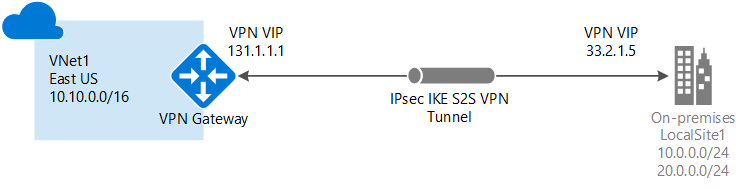
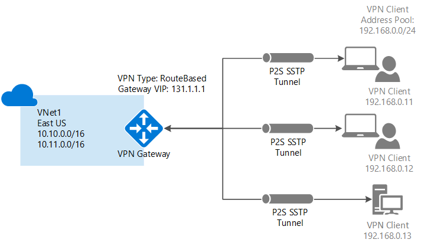

<properties
    pageTitle="VPN 网关概述：创建到 Azure 虚拟网络的跨界 VPN 连接 | Azure"
    description="此 VPN 网关概述介绍如何使用 VPN 连接通过 Internet 连接到 Azure 虚拟网络。 其中包括基本连接配置图。"
    services="vpn-gateway"
    documentationcenter="na"
    author="cherylmc"
    manager="timlt"
    editor=""
    tags="azure-resource-manager,azure-service-management" />
<tags
    ms.assetid="2358dd5a-cd76-42c3-baf3-2f35aadc64c8"
    ms.service="vpn-gateway"
    ms.devlang="na"
    ms.topic="get-started-article"
    ms.tgt_pltfrm="na"
    ms.workload="infrastructure-services"
    ms.date="04/04/2017"
    wacn.date="05/31/2017"
    ms.author="cherylmc"
    ms.translationtype="Human Translation"
    ms.sourcegitcommit="4a18b6116e37e365e2d4c4e2d144d7588310292e"
    ms.openlocfilehash="0e425b4cf0beefc87bd1815aec49016ee553b92d"
    ms.contentlocale="zh-cn"
    ms.lasthandoff="05/19/2017" />

# 关于 VPN 网关
若要在 Azure 虚拟网络和本地站点之间发送网络流量，则必须为虚拟网络创建虚拟网络网关。 VPN 网关是一种通过公共连接发送加密流量的虚拟网络网关。 还可以使用 VPN 网关通过 Microsoft 网络在 Azure 虚拟网络之间发送流量。

有两种类型的虚拟网络网关：“ExpressRoute”和“Vpn”。 创建虚拟网络网关时，需指定要创建的网关类型。 VPN 网关是使用“Vpn”网关类型的虚拟网络网关。 

每个虚拟网络可以拥有两个虚拟网络网关，但只能有一种类型。 根据所选设置，可以创建到单个 VPN 网关的多个连接。 其示例之一是多站点连接配置。 创建同一 VPN 网关的多个连接时，所有 VPN 隧道（包括点到站点 VPN）共享网关可用的带宽。

## 配置 VPN 网关
VPN 网关连接需依赖于多个具有特定设置的资源。 大多数资源可单独进行配置，不过，在某些情况下，必须按特定的顺序进行配置。

###设置
为每个资源选择的设置对于创建成功的连接至关重要。 有关 VPN 网关的各个资源和设置的信息，请参阅 [关于 VPN 网关设置](/documentation/articles/vpn-gateway-about-vpn-gateway-settings/)。 可找到有助于了解网关类型、VPN 类型、连接类型、网关子网、本地网络网关以及可能需要考虑的各种其他资源设置的信息。

###部署工具
可以使用一种配置工具（例如 Azure 门户）开始创建和配置资源。 稍后可以切换到另一种工具（如 PowerShell）来配置其他资源，或者在适当的情况下修改现有资源。 目前无法在 Azure 门户中配置每一项资源和资源设置。 需要使用特定的配置工具时，本文中针对每种连接拓扑提供的说明都有指明。 

###部署模型
配置 VPN 网关时，采取的步骤取决于用于创建虚拟网络的部署模型。 例如，如果使用经典部署模型创建了 VNet，将使用经典部署模型的指导原则和说明来创建及配置 VPN 网关设置。 有关部署模型的详细信息，请参阅 [了解 Resource Manager 和经典部署模型](/documentation/articles/resource-manager-deployment-model/)。

## 连接拓扑图
必须知道，VPN 网关连接可以使用不同的配置。 必须确定哪种配置最适合自己的需要。 在下面的部分中，可以查看有关以下 VPN 网关连接的信息和拓扑示意图：以下部分包含一些表格，其中列出了：

* 可用的部署模型
* 可用的配置工具
* 直接转到某篇文章的链接（如果有）

使用图示和描述来帮助选择符合要求的连接拓扑。 这些图示显示主要基准拓扑，但也可以使用这些图示作为指导来构建更复杂的配置。

##  站点到站点和多站点（IPsec/IKE VPN 隧道）
### 站点到站点
站点到站点 (S2S) VPN 网关连接是通过 IPsec/IKE（IKEv1 或 IKEv2）VPN 隧道建立的连接。 这种类型的连接要求 VPN 设备位于本地，并且分配有公共 IP 地址，不在 NAT 的后面。 S2S 连接可用于跨界和混合配置。   

### 多站点
此类型的连接是站点到站点连接的变体。 从虚拟网络网关创建多个 VPN 连接，通常情况下连接到多个本地站点。 使用多个连接时，必须使用 RouteBased VPN 类型（使用经典 VNet 时称为动态网关）。 由于每个虚拟网络只能有一个 VPN 网关，通过该网关的所有连接将共享可用带宽。 这通常称为“多站点”连接。

### 适用于站点到站点和多站点的部署模型和方法
[AZURE.INCLUDE [vpn-gateway-table-site-to-site](../../includes/vpn-gateway-table-site-to-site-include.md)]

## 点到站点（基于 SSTP 的 VPN）
点到站点 (P2S) VPN 网关连接可让用户创建从单个客户端计算机到虚拟网络的安全连接。 P2S 是基于 SSTP（安全套接字隧道协议）的 VPN 连接。 P2S 连接不需要 VPN 设备或面向公众的 IP 地址即可运行。 从客户端计算机启动 VPN 连接即可建立这种连接。 如果要从远程位置（例如，从家里或会议室）连接到 VNet，或者只有几个客户端需要连接到 VNet，此解决方案将非常有用。 可以通过同一 VPN 网关将 P2S 连接与 S2S 连接结合使用，前提是这两种连接的所有配置要求都兼容。

### 适用于点到站点的部署模型和方法
[AZURE.INCLUDE [vpn-gateway-table-point-to-site](../../includes/vpn-gateway-table-point-to-site-include.md)]

## VNet 到 VNet 连接（IPsec/IKE VPN 隧道）
将一个虚拟网络连接到另一个虚拟网络（VNet 到 VNet）类似于将 VNet 连接到本地站点位置。 这两种连接类型都使用 VPN 网关来提供使用 IPsec/IKE 的安全隧道。 甚至可以将 VNet 到 VNet 通信与多站点连接配置结合使用。 这样，便可以建立将跨界连接与虚拟网络间连接相结合的网络拓扑。

连接的 VNet 可以：

* 在相同或不同的区域中
* 在相同或不同的订阅中 
* 在相同或不同部署模型中

###部署模型之间的连接
Azure 当前具有两个部署模型：经典模型和 Resource Manager 模型。 如果 Azure 已经使用了一段时间，则您的 Azure VM 和实例角色可能是在经典 VNet 上运行。 而较新的 VM 和角色实例可能是在 Resource Manager 中创建的 VNet 上运行。 可以在 Vnet 之间创建连接，使其中一个 VNet 中的资源能够直接与另一个 VNet 中的资源通信。

###VNet 对等互连
只要虚拟网络符合特定要求，就能使用 VNet 对等互连来创建连接。 VNet 对等互连不使用虚拟网络网关。 有关详细信息，请参阅 [VNet 对等互连](/documentation/articles/virtual-network-peering-overview/)。

###适用于 VNet 到 VNet 的部署模型和方法
[AZURE.INCLUDE [vpn-gateway-table-vnet-to-vnet](../../includes/vpn-gateway-table-vnet-to-vnet-include.md)]

## ExpressRoute（专用连接）
使用 Azure ExpressRoute 可通过连接服务提供商所提供的专用连接，将本地网络扩展到 Microsoft 云。 使用 ExpressRoute 可与 Azure、Office 365 和 CRM Online 等 Microsoft 云服务建立连接。 可以从任意位置之间的 (IP VPN) 网络、点到点以太网或在共置设施上通过连接服务提供商的虚拟交叉连接来建立这种连接。

ExpressRoute 连接不通过公共 Internet 。 与通过 Internet 的典型连接相比，ExpressRoute 连接提供更高的可靠性、更快的速度、更低的延迟和更高的安全性。

ExpressRoute 连接不使用 VPN 网关，不过，它确实会使用虚拟网络网关作为其所需配置的一部分。 在 ExpressRoute 连接中，虚拟网络网关的网关类型配置为“ExpressRoute”而不是“Vpn”。 有关 ExpressRoute 的详细信息，请参阅 [ExpressRoute 技术概述](/documentation/articles/expressroute-introduction/)。

## 站点到站点和 ExpressRoute 共存连接
ExpressRoute 可以从 WAN 与 Microsoft 服务（包括 Azure）直接建立专用连接，不需要通过公共 Internet。 站点到站点 VPN 流量以加密方式通过公共 Internet 传输。 能够为同一个虚拟网络配置站点到站点 VPN 和 ExpressRoute 连接可带来诸多好处。

可以将站点到站点 VPN 配置为 ExpressRoute 的安全故障转移路径，或者使用站点到站点 VPN 连接到不属于网络的一部分但却已通过 ExpressRoute 进行连接的站点。 请注意，对于同一虚拟网络，此配置需要两个虚拟网络网关，一个使用“Vpn”网关类型，另一个使用“ExpressRoute”网关类型。

### S2S 和 ExpressRoute 的部署模型与方法
[AZURE.INCLUDE [vpn-gateway-table-coexist](../../includes/vpn-gateway-table-coexist-include.md)]

## 定价
[AZURE.INCLUDE [vpn-gateway-about-pricing-include](../../includes/vpn-gateway-about-pricing-include.md)]

## 网关 SKU
[AZURE.INCLUDE [vpn-gateway-gwsku-include](../../includes/vpn-gateway-gwsku-include.md)]

有关用于 VPN 网关的网关 SKU 的详细信息，请参阅[网关 SKU](/documentation/articles/vpn-gateway-about-vpn-gateway-settings/#gwsku)。

### 按 SKU 列出的估计聚合吞吐量
[AZURE.INCLUDE [vpn-gateway-table-gwtype-aggthroughput](../../includes/vpn-gateway-table-gwtype-aggtput-include.md)]

## 常见问题

有关 VPN 网关的常见问题，请参阅 [VPN 网关常见问题解答](/documentation/articles/vpn-gateway-vpn-faq/)。

## 后续步骤
- 规划 VPN 网关配置。 请参阅 [VPN 网关规划和设计](/documentation/articles/vpn-gateway-plan-design/)。
- 有关更多信息，请查看 [VPN 网关常见问题](/documentation/articles/vpn-gateway-vpn-faq/)。
- 查看[订阅和服务限制](/documentation/articles/azure-subscription-service-limits/#networking-limits)。

<!--Update_Description: add FAQ-->