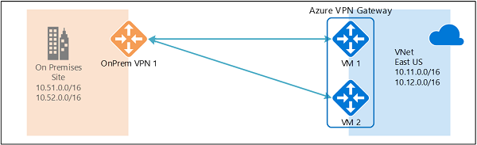

<properties
   pageTitle="如何使用 Azure Resource Manager 和 PowerShell 来配置与 Azure VPN 网关的主动-主动 S2S VPN 连接 | Azure"
   description="本文逐步讲解如何使用 Azure Resource Manager 和 PowerShell 配置包含 Azure VPN 网关的主动-主动连接。"
   services="vpn-gateway"
   documentationCenter="na"
   authors="yushwang"
   manager="rossort"
   editor=""
   tags="azure-resource-manager"/>  

<tags
   ms.service="vpn-gateway"
   ms.devlang="na"
   ms.topic="article"
   ms.tgt_pltfrm="na"
   ms.workload="infrastructure-services"
   ms.date="09/26/2016"
   wacn.date="11/07/2016"
   ms.author="yushwang"/>  

# 使用 Azure Resource Manager 和 PowerShell 来配置与 Azure VPN 网关的主动-主动 S2S VPN 连接

本文逐步讲解如何使用 Resource Manager 部署模型和 PowerShell 创建主动-主动跨界连接与 VNet 到 VNet 连接。

**关于 Azure 部署模型**

[AZURE.INCLUDE [vpn-gateway-clasic-rm](../../includes/vpn-gateway-classic-rm-include.md)] 

## 关于高可用性跨界连接

若要实现跨界连接和 VNet 到 VNet 连接的高可用性，应该部署多个 VPN 网关，在网络与 Azure 之间建立多个并行连接。有关连接选项和拓扑的概述，请参阅[高可用性跨界连接与 VNet 到 VNet 连接](/documentation/articles/vpn-gateway-highlyavailable/)。

本文提供有关设置两个虚拟网络之间的主动-主动跨界 VPN 连接以及主动-主动连接的说明：

- [第 1 部分 - 创建并配置采用主动-主动模式的 Azure VPN 网关](#aagateway)

- [第 2 部分 - 建立主动-主动跨界连接](#aacrossprem)

- [第 3 部分 - 建立主动-主动 VNet 到 VNet 连接](#aav2v)

- [第 4 部分 - 更新主动-主动和主动-待机连接之间的现有网关](#aaupdate)

可以将这些选项结合起来，构建符合要求的更复杂、高度可用的网络拓扑。

>[AZURE.IMPORTANT] 请注意，主动-主动模式只能在 HighPerformance SKU 中正常工作

## 第 1 部分 - 创建并设置主动-主动 VPN 网关

以下步骤将 Azure VPN 网关配置为主动-主动模式。主动-主动与主机-待机网关之间的重要差异：

- 需要使用两个公共 IP 地址创建两个网关 IP 配置
- 需要设置 EnableActiveActiveFeature 标志
- 网关 SKU 必须是 HighPerformance

其他属性与非主动-主动网关相同。

### 开始之前

- 确保你拥有 Azure 订阅。如果没有 Azure 订阅，可以注册一个 [1 元帐户](/pricing/1rmb-trial/)。
	
- 你需要安装 Azure Resource Manager PowerShell cmdlet。有关安装 PowerShell cmdlet 的详细信息，请参阅[如何安装和配置 Azure PowerShell](/documentation/articles/powershell-install-configure/)。

### 步骤 1 - 创建并配置 VNet1

#### 1\.声明变量

对于本练习，我们首先要声明变量。以下示例使用此练习中的值来声明变量。请务必在配置生产环境时，使用自己的值来替换该值。如果执行这些步骤是为了熟悉此类型的配置，则你可以使用这些变量。修改变量，然后将其复制并粘贴到 PowerShell 控制台中。

	$Sub1          = "Ross"
	$RG1           = "TestAARG1"
	$Location1     = "China North"
	$VNetName1     = "TestVNet1"
	$FESubName1    = "FrontEnd"
	$BESubName1    = "Backend"
	$GWSubName1    = "GatewaySubnet"
	$VNetPrefix11  = "10.11.0.0/16"
	$VNetPrefix12  = "10.12.0.0/16"
	$FESubPrefix1  = "10.11.0.0/24"
	$BESubPrefix1  = "10.12.0.0/24"
	$GWSubPrefix1  = "10.12.255.0/27"
	$VNet1ASN      = 65010
	$DNS1          = "8.8.8.8"
	$GWName1       = "VNet1GW"
	$GW1IPName1    = "VNet1GWIP1"
	$GW1IPName2    = "VNet1GWIP2"
	$GW1IPconf1    = "gw1ipconf1"
	$GW1IPconf2    = "gw1ipconf2"
	$Connection12  = "VNet1toVNet2"
	$Connection151 = "VNet1toSite5_1"
	$Connection152 = "VNet1toSite5_2"

#### 2\.连接到订阅并创建新资源组

确保切换到 PowerShell 模式，以便使用资源管理器 cmdlet。有关详细信息，请参阅[将 Windows PowerShell 与资源管理器配合使用](/documentation/articles/powershell-azure-resource-manager/)。

打开 PowerShell 控制台并连接到你的帐户。使用下面的示例来帮助你连接：

	Login-AzureRmAccount -EnvironmentName AzureChinaCloud
	Select-AzureRmSubscription -SubscriptionName $Sub1
	New-AzureRmResourceGroup -Name $RG1 -Location $Location1

#### 3\.创建 TestVNet1

以下示例创建一个名为 TestVNet1 的虚拟网络和三个子网：一个名为 GatewaySubnet、一个名为 FrontEnd，还有一个名为 Backend。替换值时，请务必始终将网关子网特意命名为 GatewaySubnet。如果命名为其他名称，网关创建将会失败。

	$fesub1 = New-AzureRmVirtualNetworkSubnetConfig -Name $FESubName1 -AddressPrefix $FESubPrefix1
	$besub1 = New-AzureRmVirtualNetworkSubnetConfig -Name $BESubName1 -AddressPrefix $BESubPrefix1
	$gwsub1 = New-AzureRmVirtualNetworkSubnetConfig -Name $GWSubName1 -AddressPrefix $GWSubPrefix1

	New-AzureRmVirtualNetwork -Name $VNetName1 -ResourceGroupName $RG1 -Location $Location1 -AddressPrefix $VNetPrefix11,$VNetPrefix12 -Subnet $fesub1,$besub1,$gwsub1

### 步骤 2 - 使用主动-主动模式创建 TestVNet1 的 VPN 网关

#### 1\.创建公共 IP 地址和网关 IP 配置

请求两个公共 IP 地址，分配给要为 VNet 创建的网关。你还将定义所需的子网和 IP 配置。

	$gw1pip1    = New-AzureRmPublicIpAddress -Name $GW1IPName1 -ResourceGroupName $RG1 -Location $Location1 -AllocationMethod Dynamic
	$gw1pip2    = New-AzureRmPublicIpAddress -Name $GW1IPName2 -ResourceGroupName $RG1 -Location $Location1 -AllocationMethod Dynamic

	$vnet1      = Get-AzureRmVirtualNetwork -Name $VNetName1 -ResourceGroupName $RG1
	$subnet1    = Get-AzureRmVirtualNetworkSubnetConfig -Name "GatewaySubnet" -VirtualNetwork $vnet1
	$gw1ipconf1 = New-AzureRmVirtualNetworkGatewayIpConfig -Name $GW1IPconf1 -Subnet $subnet1 -PublicIpAddress $gw1pip1
	$gw1ipconf2 = New-AzureRmVirtualNetworkGatewayIpConfig -Name $GW1IPconf2 -Subnet $subnet1 -PublicIpAddress $gw1pip2

#### 2\.使用主动-主动配置创建 VPN 网关

为 TestVNet1 创建虚拟网络网关。请注意有两个 GatewayIpConfig 条目，并且已设置 EnableActiveActiveFeature 标志。主动-主动模式需要 HighPerformance SKU 的基于路由的 VPN 网关。创建网关可能需要花费一段时间（30 分钟或更久）。

	New-AzureRmVirtualNetworkGateway -Name $GWName1 -ResourceGroupName $RG1 -Location $Location1 -IpConfigurations $gw1ipconf1,$gw1ipconf2 -GatewayType Vpn -VpnType RouteBased -GatewaySku HighPerformance -Asn $VNet1ASN -EnableActiveActiveFeature -Debug

#### 3\.获取网关公共 IP 地址和 BGP 对等 IP 地址

创建网关后，你将需要在 Azure VPN 网关上获取 BGP 对等节点 IP 地址。需要此地址才能将 Azure VPN 网关配置为本地 VPN 设备的 BGP 对等节点。

	$gw1pip1 = Get-AzureRmPublicIpAddress -Name $GW1IPName1 -ResourceGroupName $RG1
	$gw1pip2 = Get-AzureRmPublicIpAddress -Name $GW1IPName2 -ResourceGroupName $RG1
	$vnet1gw = Get-AzureRmVirtualNetworkGateway -Name $GWName1 -ResourceGroupName $RG1

使用以下 cmdlet 显示针对 VPN 网关分配的两个公共 IP 地址，以及每个网关实例的对应 BGP 对等 IP 地址：

	PS D:> $gw1pip1.IpAddress
	40.112.190.5

	PS D:> $gw1pip2.IpAddress
	138.91.156.129

	PS D:> $vnet1gw.BgpSettingsText
	{
	  "Asn": 65010,
	  "BgpPeeringAddress": "10.12.255.4,10.12.255.5",
	  "PeerWeight": 0
	}

网关实例的公共 IP 地址顺序与对应的 BGP 对等连接地址相同。在本示例中，公共 IP 为 40.112.190.5 的网关 VM 将使用 10.12.255.4 作为其 BGP 对等连接地址，公共 IP 为 138.91.156.129 的网关将使用 10.12.255.5。设置连接到主动-主动网关的本地 VPN 设备时需要此信息。下图显示了网关和所有地址：

  

创建网关后，可以使用此网关创建主动-主动跨界连接或 VNet 到 VNet 连接。以下各节将介绍完成该练习所需的步骤。

## 第 2 部分 - 建立主动-主动跨界连接

若要建立跨界连接，你需要创建本地网关来表示本地 VPN 设备，并创建连接将 Azure VPN 网关与本地网关连接在一起。在本示例中，Azure VPN 网关处于主动-主动模式。因此，即使只有一个本地 VPN 设备（本地网络网关）和一个连接资源，两个 Azure VPN 网关实例也都与该本地设备建立 S2S VPN 隧道。

在继续下一步之前，请确保已完成本练习的[第 1 部分](#aagateway)。

### 步骤 1 - 创建和配置本地网关

#### 1\.声明变量

此练习将继续生成图中所示的配置。请务必将值替换为要用于配置的值。

	$RG5           = "TestAARG5"
	$Location5     = "China North"
	$LNGName51     = "Site5_1"
	$LNGPrefix51   = "10.52.255.253/32"
	$LNGIP51       = "131.107.72.22"
	$LNGASN5       = 65050
	$BGPPeerIP51   = "10.52.255.253"

关于本地网关参数，有几个事项需要注意：

- 本地网关可以与 VPN 网关在相同或不同的位置和资源组中。本示例显示它们位于不同的资源组，但位于相同的 Azure 位置。

- 如果只有一个本地 VPN 设备（如上所示），则不管是否使用 BGP 协议，主动-主动连接都可正常工作。本示例对跨界连接使用 BGP。

- 如果 BGP 已启用，需要为本地网关声明的最小前缀是 VPN 设备上的 BGP 对等节点 IP 地址中的主机地址。在此示例中，它是“10.52.255.253/32”中的 /32 前缀。

- 提醒一下，在本地网络与 Azure VNet 之间必须使用不同的 BGP ASN。如果它们是相同的，则需要更改 VNet ASN（如果本地 VPN 设备已使用该 ASN 与其他 BGP 邻居对等）。

#### 2\.为 Site5 创建本地网关
	
继续操作之前，请确保仍与订阅 1 保持连接。创建资源组（如果尚未创建）。

	New-AzureRmResourceGroup       -Name $RG5 -Location $Location5
	New-AzureRmLocalNetworkGateway -Name $LNGName51 -ResourceGroupName $RG5 -Location $Location5 -GatewayIpAddress $LNGIP51 -AddressPrefix $LNGPrefix51 -Asn $LNGASN5 -BgpPeeringAddress $BGPPeerIP51

### 步骤 2 - 连接 VNet 网关和本地网关

#### 1\.获取这两个网关

	$vnet1gw = Get-AzureRmVirtualNetworkGateway -Name $GWName1  -ResourceGroupName $RG1
	$lng5gw1 = Get-AzureRmLocalNetworkGateway   -Name $LNGName51 -ResourceGroupName $RG5

#### 2\.创建 TestVNet1 到 Site5 的连接

在本步骤中，创建从 TestVNet1 到 Site5\_1 的连接，其“EnableBGP”设置为 $True。

	New-AzureRmVirtualNetworkGatewayConnection -Name $Connection151 -ResourceGroupName $RG1 -VirtualNetworkGateway1 $vnet1gw -LocalNetworkGateway2 $lng5gw1 -Location $Location1 -ConnectionType IPsec -SharedKey 'AzureA1b2C3' -EnableBGP True

#### 3\.本地 VPN 设备的 VPN 和 BGP 参数

下面的示例列出了你将在本地 VPN 设备上的 BGP 配置节中为此练习输入的参数：

	- Site5 ASN            : 65050
	- Site5 BGP IP         : 10.52.255.253
	- Prefixes to announce : (for example) 10.51.0.0/16 and 10.52.0.0/16
	- Azure VNet ASN       : 65010
	- Azure VNet BGP IP 1  : 10.12.255.4 for tunnel to 40.112.190.5
	- Azure VNet BGP IP 2  : 10.12.255.5 for tunnel to 138.91.156.129
	- Static routes        : Destination 10.12.255.4/32, nexthop the VPN tunnel interface to 40.112.190.5
	                         Destination 10.12.255.5/32, nexthop the VPN tunnel interface to 138.91.156.129
	- eBGP Multihop        : Ensure the "multihop" option for eBGP is enabled on your device if needed

连接应在几分钟后建立，BGP 对等会话将在建立 IPsec 连接后启动。本示例到目前为止只配置了一个本地 VPN 设备，如下图所示：

  

### 步骤 3 - 将两个本地 VPN 设备连接到主动-主动 VPN 网关

如果同一个本地网络上有两个 VPN 设备，可以通过将 Azure VPN 网关连接到第二个 VPN 设备来实现双重冗余。

#### 1\.为 Site5 创建第二个本地网络网关

请注意，第二个本地网络网关的网关 IP地址、地址前缀和 BGP 对等连接地址不能与同一个本地网络的前一个本地网络网关重叠。

	$LNGName52     = "Site5_2"
	$LNGPrefix52   = "10.52.255.254/32"
	$LNGIP52       = "131.107.72.23"
	$BGPPeerIP52   = "10.52.255.254"

	New-AzureRmLocalNetworkGateway -Name $LNGName52 -ResourceGroupName $RG5 -Location $Location5 -GatewayIpAddress $LNGIP52 -AddressPrefix $LNGPrefix52 -Asn $LNGASN5 -BgpPeeringAddress $BGPPeerIP52
 
#### 2\.连接 VNet 网关与第二个本地网络网关

创建从 TestVNet1 到 Site5\_2 的连接，其“EnableBGP”设置为 $True

	$lng5gw2 = Get-AzureRmLocalNetworkGateway   -Name $LNGName52 -ResourceGroupName $RG5

	New-AzureRmVirtualNetworkGatewayConnection -Name $Connection152 -ResourceGroupName $RG1 -VirtualNetworkGateway1 $vnet1gw -LocalNetworkGateway2 $lng5gw2 -Location $Location1 -ConnectionType IPsec -SharedKey 'AzureA1b2C3' -EnableBGP True

#### 3\.第二个本地 VPN 设备的 VPN 和 BGP 参数

下面列出了要输入到第二个 VPN 设备的参数：

	- Site5 ASN            : 65050
	- Site5 BGP IP         : 10.52.255.254
	- Prefixes to announce : (for example) 10.51.0.0/16 and 10.52.0.0/16
	- Azure VNet ASN       : 65010
	- Azure VNet BGP IP 1  : 10.12.255.4 for tunnel to 40.112.190.5
	- Azure VNet BGP IP 2  : 10.12.255.5 for tunnel to 138.91.156.129
	- Static routes        : Destination 10.12.255.4/32, nexthop the VPN tunnel interface to 40.112.190.5
	                         Destination 10.12.255.5/32, nexthop the VPN tunnel interface to 138.91.156.129
	- eBGP Multihop        : Ensure the "multihop" option for eBGP is enabled on your device if needed

建立连接（隧道）后，便已获得了连接到本地网络和 Azure 的双重冗余 VPN 设备和隧道：

  

## 第 3 部分 - 建立主动-主动 VNet 到 VNet 连接

本部分使用 BGP 创建主动-主动 VNet 到 VNet 连接。

下面的说明延续上面所列的前述步骤。必须完成[第 1 部分](#aagateway)，使用 BGP 创建和配置 TestVNet1 与 VPN 网关。

### 步骤 1 - 创建 TestVNet2 和 VPN 网关

必须确保新虚拟网络的 IP 地址空间 TestVNet2 不与任何 VNet 范围重叠。

在本示例中，虚拟网络属于同一订阅。可以在不同订阅之间设置 VNet 到 VNet 连接，有关更多详细信息，请参阅[配置 VNet 到 VNet 连接](/documentation/articles/vpn-gateway-vnet-vnet-rm-ps/)。请确保在创建连接时添加“-EnableBgp $True”，以启用 BGP。

#### 1\.声明变量

请务必将值替换为要用于配置的值。

	$RG2           = "TestAARG2"
	$Location2     = "China East"
	$VNetName2     = "TestVNet2"
	$FESubName2    = "FrontEnd"
	$BESubName2    = "Backend"
	$GWSubName2    = "GatewaySubnet"
	$VNetPrefix21  = "10.21.0.0/16"
	$VNetPrefix22  = "10.22.0.0/16"
	$FESubPrefix2  = "10.21.0.0/24"
	$BESubPrefix2  = "10.22.0.0/24"
	$GWSubPrefix2  = "10.22.255.0/27"
	$VNet2ASN      = 65020
	$DNS2          = "8.8.8.8"
	$GWName2       = "VNet2GW"
	$GW2IPName1    = "VNet2GWIP1"
	$GW2IPconf1    = "gw2ipconf1"
	$GW2IPName2    = "VNet2GWIP2"
	$GW2IPconf2    = "gw2ipconf2"
	$Connection21  = "VNet2toVNet1"
	$Connection12  = "VNet1toVNet2"

#### 2\.在新资源组中创建 TestVNet2

	New-AzureRmResourceGroup -Name $RG2 -Location $Location2

	$fesub2 = New-AzureRmVirtualNetworkSubnetConfig -Name $FESubName2 -AddressPrefix $FESubPrefix2
	$besub2 = New-AzureRmVirtualNetworkSubnetConfig -Name $BESubName2 -AddressPrefix $BESubPrefix2
	$gwsub2 = New-AzureRmVirtualNetworkSubnetConfig -Name $GWSubName2 -AddressPrefix $GWSubPrefix2

	New-AzureRmVirtualNetwork -Name $VNetName2 -ResourceGroupName $RG2 -Location $Location2 -AddressPrefix $VNetPrefix21,$VNetPrefix22 -Subnet $fesub2,$besub2,$gwsub2

#### 3\.创建 TestVNet2 的主动-主动 VPN 网关

请求两个公共 IP 地址，分配给要为 VNet 创建的网关。你还将定义所需的子网和 IP 配置。

	$gw2pip1    = New-AzureRmPublicIpAddress -Name $GW2IPName1 -ResourceGroupName $RG2 -Location $Location2 -AllocationMethod Dynamic
	$gw2pip2    = New-AzureRmPublicIpAddress -Name $GW2IPName2 -ResourceGroupName $RG2 -Location $Location2 -AllocationMethod Dynamic

	$vnet2      = Get-AzureRmVirtualNetwork -Name $VNetName2 -ResourceGroupName $RG2
	$subnet2    = Get-AzureRmVirtualNetworkSubnetConfig -Name "GatewaySubnet" -VirtualNetwork $vnet2
	$gw2ipconf1 = New-AzureRmVirtualNetworkGatewayIpConfig -Name $GW2IPconf1 -Subnet $subnet2 -PublicIpAddress $gw2pip1
	$gw2ipconf2 = New-AzureRmVirtualNetworkGatewayIpConfig -Name $GW2IPconf2 -Subnet $subnet2 -PublicIpAddress $gw2pip2

使用 AS 编号和“EnableActiveActiveFeature”标志创建 VPN 网关。请注意，必须覆盖 Azure VPN 网关上的默认 ASN。连接的 VNet 的 ASN 必须不同，才能启用 BGP 和传输路由。

	New-AzureRmVirtualNetworkGateway -Name $GWName2 -ResourceGroupName $RG2 -Location $Location2 -IpConfigurations $gw2ipconf1,$gw2ipconf2 -GatewayType Vpn -VpnType RouteBased -GatewaySku HighPerformance -Asn $VNet2ASN -EnableActiveActiveFeature

### 步骤 2 - 连接 TestVNet1 和 TestVNet2 网关

在本示例中，这两个网关位于同一订阅中。你可以在同一 PowerShell 会话中完成此步骤。

#### 1\.获取这两个网关

请确保登录并连接到订阅 1。

	$vnet1gw = Get-AzureRmVirtualNetworkGateway -Name $GWName1 -ResourceGroupName $RG1
	$vnet2gw = Get-AzureRmVirtualNetworkGateway -Name $GWName2 -ResourceGroupName $RG2
	
#### 2\.创建两个连接

在此步骤中，你将创建从 TestVNet1 到 TestVNet2 的连接，以及从 TestVNet2 到 TestVNet1 的连接。

	New-AzureRmVirtualNetworkGatewayConnection -Name $Connection12 -ResourceGroupName $RG1 -VirtualNetworkGateway1 $vnet1gw -VirtualNetworkGateway2 $vnet2gw -Location $Location1 -ConnectionType Vnet2Vnet -SharedKey 'AzureA1b2C3' -EnableBgp $True

	New-AzureRmVirtualNetworkGatewayConnection -Name $Connection21 -ResourceGroupName $RG2 -VirtualNetworkGateway1 $vnet2gw -VirtualNetworkGateway2 $vnet1gw -Location $Location2 -ConnectionType Vnet2Vnet -SharedKey 'AzureA1b2C3' -EnableBgp $True

>[AZURE.IMPORTANT] 请确保为这两个连接启用 BGP。

完成这些步骤后，连接将在几分钟内建立，完成具有双重冗余的 VNet 到 VNet 连接后，BGP 对等会话就会启动：

  

## 第 4 部分 - 更新主动-主动和主动-待机连接之间的现有网关

最后一部分说明如何将现有 Azure VPN 网关从主动-待机模式配置为主动-主动模式，或反之。

>[AZURE.IMPORTANT] 请注意，主动-主动模式只能在 HighPerformance SKU 中正常工作

### 将主动-待机网关配置为主动-主动网关

#### 1\.网关参数

以下示例将主动-待机网关转换为主动-主动网关。需要创建另一个公共 IP 地址，然后添加第二个网关 IP 配置。下面显示了使用的参数：

	$GWName     = "TestVNetAA1GW"
	$VNetName   = "TestVNetAA1"
	$RG         = "TestVPNActiveActive01"
	$GWIPName2  = "gwpip2"
	$GWIPconf2  = "gw1ipconf2"

	$vnet       = Get-AzureRmVirtualNetwork -Name $VNetName -ResourceGroupName $RG
	$subnet     = Get-AzureRmVirtualNetworkSubnetConfig -Name 'GatewaySubnet' -VirtualNetwork $vnet
	$gw         = Get-AzureRmVirtualNetworkGateway -Name $GWName -ResourceGroupName $RG
	$location   = $gw.Location

#### 2\.创建公共 IP 地址，然后添加第二个网关 IP 配置

	$gwpip2     = New-AzureRmPublicIpAddress -Name $GWIPName2 -ResourceGroupName $RG -Location $location -AllocationMethod Dynamic
	Add-AzureRmVirtualNetworkGatewayIpConfig -VirtualNetworkGateway $gw -Name $GWIPconf2 -Subnet $subnet -PublicIpAddress $gwpip2 

#### 3\.启用主动-主动模式并更新网关

必须在 PowerShell 中设置网关对象以触发实际更新。

	Set-AzureRmVirtualNetworkGateway -VirtualNetworkGateway $gw -EnableActiveActiveFeature

这种更新可能需要 30 到 45 分钟。

### 将主动-主动网关配置为主动-待机网关

#### 1\.网关参数

使用与上面相同的参数，获取要删除的 IP 配置的名称。

	$GWName     = "TestVNetAA1GW"
	$RG         = "TestVPNActiveActive01"

	$gw         = Get-AzureRmVirtualNetworkGateway -Name $GWName -ResourceGroupName $RG
	$ipconfname = $gw.IpConfigurations[1].Name

#### 2\.删除网关 IP 配置并禁用主动-主动模式

同样，必须在 PowerShell 中设置网关对象以触发实际更新。

	Remove-AzureRmVirtualNetworkGatewayIpConfig -Name $ipconfname -VirtualNetworkGateway $gw
	Set-AzureRmVirtualNetworkGateway -VirtualNetworkGateway $gw -DisableActiveActiveFeature

这种更新最多可能需要 30 到 45 分钟。

## 后续步骤

连接完成后，即可将虚拟机添加到虚拟网络。请参阅[创建虚拟机](/documentation/articles/virtual-machines-windows-hero-tutorial/)以获取相关步骤。

<!---HONumber=Mooncake_1031_2016-->