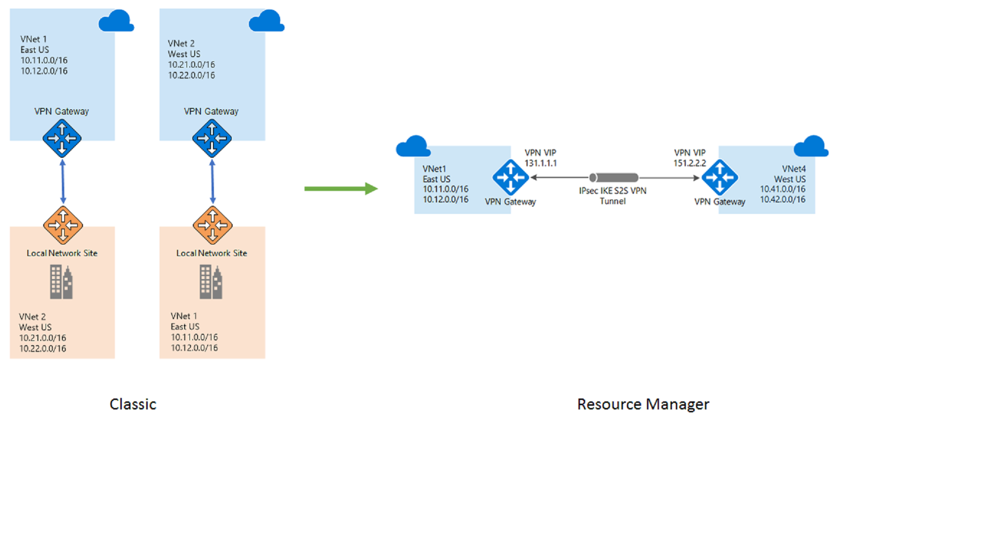
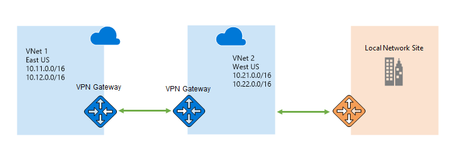

<properties
    pageTitle="将 VPN 网关从经典部署模型迁移到 Resource Manager 部署模型 | Azure"
    description="此页提供将 VPN 网关从经典部署模型迁移到 Resource Manager 部署模型的概述。"
    documentationcenter="na"
    services="vpn-gateway"
    author="amsriva"
    manager="rossort"
    editor="amsriva" />
<tags
    ms.assetid="caa8eb19-825a-4031-8b49-18fbf3ebc04e"
    ms.service="vpn-gateway"
    ms.devlang="na"
    ms.topic="article"
    ms.tgt_pltfrm="na"
    ms.workload="infrastructure-services"
    ms.date="05/02/2017"
    wacn.date="05/31/2017"
    ms.author="amsriva"
    ms.translationtype="Human Translation"
    ms.sourcegitcommit="4a18b6116e37e365e2d4c4e2d144d7588310292e"
    ms.openlocfilehash="ca001a798d0773d4ce9ea39f20c0ea04c7f22060"
    ms.contentlocale="zh-cn"
    ms.lasthandoff="05/19/2017" />

# 将 VPN 网关从经典部署模型迁移到 Resource Manager 部署模型
现在可以将 VPN 网关从经典部署模型迁移到 Resource Manager 部署模型。 可以阅读有关 Azure Resource Manager [功能和优点](/documentation/articles/resource-group-overview/)的更多内容。 在本文中，将详细介绍如何从经典部署模型迁移到更新的基于 Resource Manager 的部署模型。 

VPN 网关将作为 VNet 迁移的一部分从经典部署模型迁移到 Resource Manager 部署模型。 此迁移是按一次一个 VNet 完成的。 就迁移的工具和先决条件而言，没有任何其他要求。 迁移步骤与现有 VNet 迁移步骤相同，并且已在 [IaaS 资源迁移页](/documentation/articles/virtual-machines-windows-ps-migration-classic-resource-manager/)进行了编档。 在迁移期间数据路径不会关闭，因此在迁移过程中现有的工作负荷将继续正常运行，并且本地连接不会丢失。 在迁移过程中，与 VPN 网关关联的公共 IP 地址不会更改。 这意味着在迁移完成后不需要重新配置本地路由器。  

Resource Manager 中的模型与经典模型不同，它由虚拟网络网关、本地网络网关和连接资源组成。 这些分别表示 VPN 网关本身、表示本地地址空间的本地站点和这两者之间的连接。 迁移完成后，你的网关将无法在经典模型中使用，对虚拟网络网关、本地网络网关和连接对象的所有管理操作必须使用 Resource Manager 模型执行。

## 支持的方案
经典部署模型到 Resource Manager 部署模型的迁移涵盖了最常见的 VPN 连接方案。 支持的方案包括：

* 点到站点连接
* 使用连接到本地位置的 VPN 网关的站点到站点连接
* 两个 VNet 之间使用 VPN 网关的 VNet 到 VNet 连接
* 连接到同一本地位置的多个 VNet
* 多站点连接
* 已启用强制隧道的 VNet

不支持的方案包括：  

* 当前不支持使用 ExpressRoute 网关和 VPN 网关的 VNet。
* 其中的 VM 扩展连接到本地服务器的传输方案。 下文会详细介绍传输 VPN 连接限制。

> [AZURE.NOTE]
> 相比经典模型中的 CIDR 验证，Resource Manager 模型中的 CIDR 验证更为严格。 在迁移之前，请确保给定的经典地址范围符合有效的 CIDR 格式，然后再开始迁移。 可以使用任何常见的 CIDR 验证程序验证 CIDR。 迁移时，具有无效 CIDR 范围的 VNet 或本地站点会导致失败状态。
> 
> 

## VNet 到 VNet 连接迁移
经典模型中的 VNet 到 VNet 连接是通过创建已连接 VNet 的本地站点表示形式来实现的。 客户需要创建两个本地站点来表示需连接在一起的两个 VNet。 然后，使用 IPsec 隧道将这两个本地站点连接到相应的 VNet，以便在这两个 VNet 之间建立连接。 由于一个 VNet 中的任何地址范围更改还必须在相应的本地站点表示形式中进行相应维护，因此此模型在可管理性方面具有挑战性。 在 Resource Manager 模型中不再需要此解决方法。 可以使用连接资源中的“Vnet2Vnet”连接类型直接实现两个 VNet 之间的连接。 

在 VNet 迁移期间我们检测到当前 VNet 的 VPN 网关所连接的实体是另一个 VNet，并确保这两个 VNet 的迁移完成后，将不会再看到表示另一个 VNet 的两个本地站点。 两个 VPN 网关、两个本地站点以及它们之间的两个连接的经典模型将转换为具有两个 VPN 网关和两个 Vnet2Vnet 类型的连接的 Resource Manager 模型。

## 传输 VPN 连接
可以在拓扑中配置 VPN 网关，以便 VNet 的本地连接可以通过连接到直接连接到本地的另一个 VNet 来实现。 这是传输 VPN 连接，其中第一个 VNet 中的实例通过传输到直接连接到本地的已连接 VNet 中的 VPN 网关来连接到本地资源。 若要在经典部署模型中实现此配置，需要创建具有聚合前缀的本地站点来同时表示已连接的 VNet 和本地地址空间。 然后将此表述性本地站点连接到 VNet，以实现传输连接。 此经典模型在可管理性方面也具有类似的挑战性，因为也必须在表示 VNet 和本地的聚合的本地站点上维护本地地址范围中的任何更改。 在 Resource Manager 支持的网关中引入 BGP 支持可简化可管理性，因为连接的网关可以从本地了解路由，而不用手动修改前缀。

由于我们转换 VNet 到 VNet 连接而无需本地站点，对于间接连接到本地的 VNet，传输方案将失去本地连接。 完成迁移后，可以按照以下两种方式缓解丢失连接的情况： 

* 在连接在一起和连接到本地的 VPN 网关上启用 BGP。 启用 BGP 还原连接而无需任何其他配置更改，因为可以在 VNet 网关之间学习和播发路由。 请注意，BGP 选项仅在“标准”和更高版本的 SKU 上可用。
* 从受影响的 VNet 到表示本地位置的本地网络网关建立显式连接。 这还需要更改本地路由器的配置，才能创建和配置 IPsec 隧道。

## 后续步骤
了解 VPN 网关迁移支持后，请转到[平台支持的从经典部署模型到 Resource Manager 部署模型的 IaaS 资源迁移](/documentation/articles/virtual-machines-windows-ps-migration-classic-resource-manager/)来开始使用。

<!--Update_Description: wording update-->