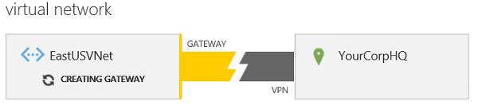
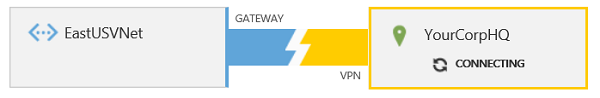

<properties 
   pageTitle="在 Azure 经典管理门户中配置 VPN 网关 | Azure"
   description="本文将演示如何配置虚拟网络 VPN 网关和更改网关 VPN 路由类型。"
   services="vpn-gateway"
   documentationCenter="na"
   authors="cherylmc"
   manager="carmonm"
   editor=""
   tags="azure-service-management"/>

<tags
	ms.service="vpn-gateway"
	ms.date="08/11/2016"
	wacn.date="08/29/2016"/>

# 配置经典部署模型的 VPN 网关

如果想要在 Azure 与本地位置之间创建安全的跨界连接，则需要配置 VPN 网关连接。在经典部署模型中，网关可以是以下两种 VPN 路由类型之一：静态或动态。所选的类型取决于您的网络设计规划和想要使用的本地 VPN 设备。

例如，某些连接选项（如点到站点连接）需要动态路由网关。如果想要将网关配置为同时支持点到站点 (P2S) 连接和站点到站点 (S2S) 连接，即使可使用任意一种网关 VPN 路由类型配置站点到站点，也必须要配置动态路由网关。

此外，必须确保用于连接的设备支持所要创建的 VPN 路由类型。请参阅[关于 VPN 设备](/documentation/articles/vpn-gateway-about-vpn-devices/)。

**关于本文**

本文是针对使用[经典管理门户](https://manage.windowsazure.cn)（而不是 Azure 门户预览）的经典部署模型编写的。

**关于 Azure 部署模型**

[AZURE.INCLUDE [vpn-gateway-clasic-rm](../../includes/vpn-gateway-classic-rm-include.md)]

## 配置概述

以下步骤将演示如何在 Azure 经典管理门户中配置 VPN 网关。这些步骤适用于使用经典部署模型创建的虚拟网络的网关。目前，并非所有网关的配置设置在 Azure 门户预览中都可用。当它们可用时，我们将创建一套适用于 Azure 门户预览的新说明。

1. [为 VNet 创建 VPN 网关](#create-a-vpn-gateway)

1. [收集 VPN 设备配置信息](#gather-information-for-your-vpn-device-configuration)

1. [配置 VPN 设备](#configure-your-vpn-device)

1. [验证局域网范围和 VPN 网关 IP 地址](#verify-your-local-network-ranges-and-vpn-gateway-ip-address)

### 开始之前

在配置网关之前，必须先创建虚拟网络。有关为跨界连接创建虚拟网络的步骤，请参阅[使用站点到站点 VPN 连接配置虚拟网络](/documentation/articles/vpn-gateway-site-to-site-create/)或[使用点到站点 VPN 连接配置虚拟网络](/documentation/articles/vpn-gateway-point-to-site-create/)。然后，按照以下步骤来配置 VPN 网关，并收集配置 VPN 设备所需的信息。

如果已有一个 VPN 网关并想要更改 VPN 路由类型，请参阅[如何更改网关的 VPN 路由类型](#how-to-change-the-vpn-routing-type-for-your-gateway)。

## 创建 VPN 网关

1. 在 [Azure 经典管理门户](https://manage.windowsazure.cn)中的“网络”页上，验证虚拟网络的状态列是否为“已创建”。

1. 在“名称”列中，单击你的虚拟网络的名称。

1. 在“仪表板”页上，请注意此 VNet 尚未配置网关。当你完成配置网关的步骤时，你将会看到此状态。

接下来，在页面底部单击“创建网关”。可以选择“静态路由”或“动态路由”。选择的 VPN 路由类型取决于几个因素。例如，VPN 设备支持的类型，以及是否需要支持点到站点连接。请参阅[关于用于虚拟网络连接的 VPN 设备](/documentation/articles/vpn-gateway-about-vpn-devices/)以确认所需的路由类型。创建网关后，必须先删除并重新创建网关才能更改网关 VPN 路由类型。系统提示你确认要创建网关时，单击“是”。

正在创建网关时，请注意页面上的网关图形将更改为黄色，并显示“正在创建网关”。创建网关最多可能需要 45 分钟。等到网关创建完成才能继续进行其他配置设置。

当网关更改为“正在连接”时，你可以收集 VPN 设备所需的信息。

## 收集 VPN 设备配置信息

创建网关后，收集 VPN 设备配置的信息。此信息位于虚拟网络的“仪表板”页：

1. **网关 IP 地址 -** IP 地址可在“仪表板”页中找到。只有在网关创建完成之后才能看到该地址。

1. **共享密钥 -** 单击屏幕底部的“管理密钥”。单击密钥旁边的图标将密钥复制到剪贴板，然后粘贴并保存密钥。仅当只有一个 S2S VPN 隧道时，此按钮才有效。如果有多个 S2S VPN 隧道，请使用*获取虚拟网络网关共享密钥* API 或 PowerShell cmdlet。

  

## 配置 VPN 设备

完成前面的步骤之后，您或网络管理员需要配置 VPN 设备以创建连接。有关 VPN 设备的详细信息，请参阅[关于用于虚拟网络连接的 VPN 设备](/documentation/articles/vpn-gateway-about-vpn-devices/)。

配置 VPN 设备之后，可以在 VNet 的“仪表板”页上查看更新的连接信息。

还可以运行以下任一命令来测试连接：

| | Cisco ASA | Cisco ISR/ASR | Juniper SSG/ISG | Juniper SRX/J |
|----------------------|-----------------------|-----------------------|-----------------|------------------------------------------|
| **Check main mode SAs** | show crypto isakmp sa | show crypto isakmp sa | get ike cookie | show security ike security-association |
| **Check quick mode SAs** | show crypto ipsec sa | show crypto ipsec sa | get sa | show security ipsec security-association |

## 验证本地网络范围和 VPN 网关 IP 地址

### 验证 VPN 网关 IP 地址

为了使网关正常建立连接，必须针对你为跨界配置指定的局域网正确配置 VPN 设备的 IP 地址。通常，这在指定站点到站点配置的过程中配置的。但是，如果以前已将此本地网络用于不同的设备，或此本地网络的 IP 地址已更改，则需要编辑设置，以指定正确的网关 IP 地址。

1. 若要验证网关 IP 地址，请在左侧门户窗格中单击“网络”，然后在页面顶部选择“本地网络”。你将看到针对每个局域网创建的 VPN 网关地址。若要编辑 IP 地址，请选择 VNet，然后在页面底部单击“编辑”。

1. 在“指定本地网络详细信息”页上编辑 IP 地址，然后单击页面底部的“下一步”箭头。

1. 在“指定地址空间”页上，单击右下角的选中标记以保存设置。

### 验证局域网的地址范围

对于流经网关到达本地位置的正确流量，您需要验证是否已指定了每个 IP 地址范围。必须在 Azure **本地网络**配置中列出每个范围。这可能会是比较大型的任务，具体取决于本地位置的网络配置。包含在列出范围中的 IP 地址所绑定的流量将通过虚拟网络 VPN 网关来发送。尽管列出的范围不一定是专用范围，但您需要验证本地配置是否能够接收入站流量。

若要添加或编辑本地网络的范围，请按照以下步骤进行。

1. 若要编辑本地网络的 IP 地址范围，请在左侧门户窗格中单击“网络”，然后在页面顶部选择“本地网络”。在门户中，最简单方法是查看“编辑”页上所列出的范围。若要查看范围，请选择 VNet，然后在页面底部单击“编辑”。

1. 在“指定本地网络详细信息”页上，请勿进行任何更改。单击页面底部的“下一步”箭头。

1. 在“指定地址空间”页上，进行网络地址空间更改。然后单击复选标记以保存配置。

## 如何查看网关流量

可以从虚拟网络“仪表板”页查看网关和网关流量。

可以在“仪表板”页上查看以下信息：

- 流经网关的数据量（包括传入和传出数据）。

- 针对虚拟网络指定的 DNS 服务器的名称。

- 网关与 VPN 设备之间的连接。

- 用于配置网关与 VPN 设备之间的连接的共享密钥。

## 如何更改网关的 VPN 路由类型

由于某些连接配置仅适用于特定网关路由类型，你可能需要更改现有 VPN 网关的 VPN 路由网关类型。例如，你可能要将点到站点连接添加到具有静态网关的现有站点到站点连接。点到站点连接需要动态网关。这意味着若要配置 P2S 连接，必须将网关 VPN 路由类型从静态更改为动态。

如果需要更改网关 VPN 路由类型，需要删除现有网关，然后使用新的路由类型重新创建网关。不需要删除整个虚拟网络来更改网关路由类型。

在更改网关 VPN 类型之前，请确保验证 VPN 设备可支持所要使用的路由类型。若要下载新的路由配置示例并检查 VPN 设备要求，请参阅[关于用于虚拟网络连接的 VPN 设备](/documentation/articles/vpn-gateway-about-vpn-devices/)。

>[AZURE.IMPORTANT] 删除虚拟网络 VPN 网关时，将释放分配给该网关的 VIP。重新创建网关时，系统会为它分配新的 VIP。

1. **删除现有 VPN 网关。**

	在虚拟网络的“仪表板”页上，导航到页面底部，然后单击“删除网关”。等待出现已完成删除网关的通知。当屏幕上出现已删除网关的通知后，便可以创建新网关。

1. **创建新 VPN 网关。**

	按照位于页面顶部的过程来创建新网关：[创建 VPN 网关](#create-a-vpn-gateway)。

## 后续步骤

你可以将虚拟机添加到虚拟网络。请参阅[如何创建自定义虚拟机](/documentation/articles/virtual-machines-windows-classic-createportal/)。

如果要配置点到站点 VPN 连接，请参阅[配置点到站点 VPN 连接](/documentation/articles/vpn-gateway-point-to-site-create/)。

 

<!---HONumber=Mooncake_0822_2016-->