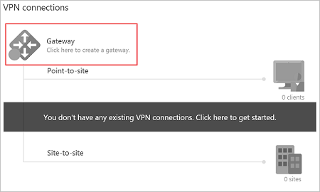
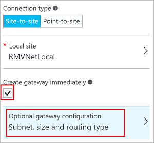
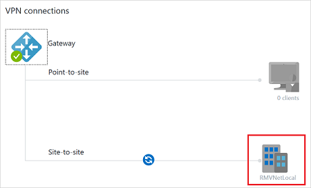
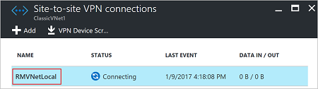
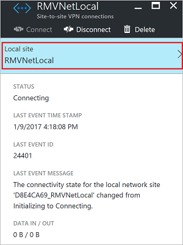
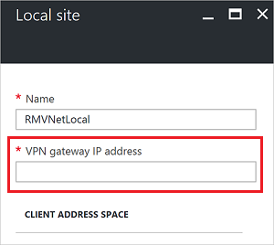

<properties
    pageTitle="将经典虚拟网络连接到 Azure Resource Manager VNet：门户 | Azure"
    description="了解如何使用 VPN 网关和门户在经典 VNet 和 Resource Manager VNet 之间创建 VPN 连接"
    services="vpn-gateway"
    documentationcenter="na"
    author="cherylmc"
    manager="timlt"
    editor=""
    tags="azure-service-management,azure-resource-manager" />
<tags
    ms.assetid="5a90498c-4520-4bd3-a833-ad85924ecaf9"
    ms.service="vpn-gateway"
    ms.devlang="na"
    ms.topic="article"
    ms.tgt_pltfrm="na"
    ms.workload="infrastructure-services"
    ms.date="01/17/2017"
    wacn.date="03/03/2017"
    ms.author="cherylmc" />  

# 使用门户从不同的部署模型连接虚拟网络
> [AZURE.SELECTOR]
- [门户](/documentation/articles/vpn-gateway-connect-different-deployment-models-portal/)
- [PowerShell](/documentation/articles/vpn-gateway-connect-different-deployment-models-powershell/)

Azure 当前具有两个管理模型：经典模型和 Resource Manager (RM) 模型。如果 Azure 已经使用了一段时间，则您的 Azure VM 和实例角色可能是在经典 VNet 上运行。而较新的 VM 和角色实例可能是在 Resource Manager 中创建的 VNet 上运行。本文将指导您如何连接经典 VNet 和 Resource Manager Vnet，从而可以通过网关连接使不同部署模型中的资源能够相互通信。

可以在位于不同订阅、不同区域中的 VNet 之间创建连接。您还可以连接已连接到本地网络的 VNet，只要它们配置的网关是动态或基于路由的。有关 VNet 到 VNet 连接的详细信息，请参阅本文末尾的 [VNet 到 VNet 注意事项](#faq)。

### VNet 到 VNet 连接的部署模型和方法
[AZURE.INCLUDE [vpn-gateway-clasic-rm](../../includes/vpn-gateway-classic-rm-include.md)]

当我们发布有关此配置的新文章和其他可用工具时，将会更新以下表格。有相关的文章发布时，我们会直接从该表格链接到该文章。  

**VNet 到 VNet**

[AZURE.INCLUDE [vpn-gateway-table-vnet-vnet](../../includes/vpn-gateway-table-vnet-to-vnet-include.md)]

**VNet 对等互连**

[AZURE.INCLUDE [vpn-gateway-vnetpeeringlink](../../includes/vpn-gateway-vnetpeeringlink-include.md)]

## 开始之前
以下步骤将指导您完成为每个 VNet 配置动态或基于路由的网关以及在网关之间创建 VPN 连接所需的设置。此配置不支持静态或基于策略的网关。

在本文中，我们将使用 Azure 门户预览和 PowerShell。若要在虚拟网络之间创建连接，则需要 PowerShell。不能使用门户来创建此配置的连接。

### 先决条件
* 已创建了两个 VNet。
* 两个 VNet 的地址范围不相互重叠，也不与网关可能连接到的其他连接的任何范围重叠。
* 已安装最新的 PowerShell cmdlet。有关详细信息，请参阅[如何安装和配置 Azure PowerShell](https://docs.microsoft.com/powershell/azureps-cmdlets-docs)。请确保安装服务管理 (SM) 和 Resource Manager (RM) cmdlet。

### 示例设置
可以使用示例设置作为参考。

**经典 VNet 设置**

VNet 名称 = ClassicVNet   
地址空间 = 10.0.0.0/24   
子网-1 = 10.0.0.0/27   
资源组 = ClassicRG   
位置 = 中国北部   
网关子网 = 10.0.0.32/28   
本地站点 = RMVNetLocal  

**Resource Manager VNet 设置**

VNet 名称 = RMVNet   
地址空间 = 192.168.0.0/16   
子网-1 = 192.168.1.0/24   
网关子网 = 192.168.0.0/26   
资源组 = RG1   
位置 = 中国东部   
虚拟网络网关名称 = RMGateway   
网关类型 = VPN   
VPN 类型 = 基于路由   
网关公共 IP 名称 = gwpip   
本地网络网关 = ClassicVNetLocal  

## 第 1 部分：配置经典 VNet 设置
在本部分中，将为经典 VNet 创建本地网络（本地站点）和虚拟网络网关。本部分中的说明使用 Azure 门户预览。这些步骤假设尚未为经典 VNet 创建 VPN 网关。如果已有网关，请确认它是动态网关。如果是静态网关，必须先删除该 VPN 网关，然后继续执行以下步骤。

### 第 1 部分 - 配置本地站点

打开 [Azure 门户预览](https://portal.azure.cn)并使用 Azure 帐户登录。

1. 导航到“所有资源”并找到经典虚拟网络。
2. 在“概述”边栏选项卡上的“VPN 连接”部分中，单击“网关”图创建网关。

	  

3. 在“新建 VPN 连接”边栏选项卡上，对于“连接类型”，请选择“站点到站点”。
4. 对于“本地站点”，请单击“配置所需设置”。这将打开“本地站点”边栏选项卡。
5. 在“本地站点”边栏选项卡上，创建将用于引用 Resource Manager VNet 的名称。例如，RMVNetLocal。
6. 如果 Resource Manager VNet 的 VPN 网关已有一个公共 IP 地址，请使用该 **VPN 网关 IP 地址**字段的值。如果尚未为 Resource Manager VNet 创建虚拟网络网关，则可以使用占位符 IP 地址。请确保该占位符 IP 地址使用有效的格式。之后，必须将占位符 IP 地址替换为 Resource Manager 虚拟网络网关的公共 IP 地址。
7. 对于**客户端地址空间**，请为 Resource Manager VNet 使用虚拟网络 IP 地址空间的值。此设置用于指定要路由到 RM VNet 的地址空间。
8. 单击“确定”保存值，并返回“新建 VPN 连接”边栏选项卡。

### 第 2 部分 — 创建虚拟网络网关
1. 在“新建 VPN 连接”边栏选项卡上，选中“立即创建网关”复选框，然后单击“可选网关配置”，打开“网关配置”边栏选项卡。

	  

2. 单击“子网 - 配置所需设置”，打开“添加子网”边栏选项卡。在此边栏选项卡，可以看到已配置具有所需值 **GatewaySubnet** 的名称。
3. **地址范围**指网关子网的范围。虽然可以创建具有 / 29 地址范围（3 个地址）的网关子网，但建议创建包含更多可用 IP 地址的网关子网，以满足将来可能需要更多可用 IP 地址的配置。如果可能，请使用 /27 或 /28。单击“确定”创建网关子网。
4. 在“网关配置”边栏选项卡上，“大小”指网关 SKU。选择 VPN 网关的网关 SKU。
5. 验证“路由类型”是否为“动态”，然后单击“确定”返回“新建 VPN 连接”边栏选项卡。
6. 在“新建 VPN 连接”边栏选项卡上，单击“确定”开始创建 VPN 网关。此步骤最多需要 45 分钟才能完成。

### 第 3 部分 - 复制虚拟网络网关公共 IP 地址
创建虚拟网络网关后，可以查看网关 IP 地址。

1. 导航到经典 VNet，然后单击“概述”。
2. 单击“VPN 连接”打开“VPN 连接”边栏选项卡。在“VPN 连接”边栏选项卡上，可以查看公共 IP 地址。这是分配给虚拟网络网关的公共 IP 地址。记下或复制此 IP 地址。该地址将在后续步骤中使用，即进行 Resource Manager 本地网络网关配置设置时使用。还可以查看网关连接的状态。请注意，创建的本地网络站点将列为“正在连接”。创建连接后，该状态将更改。复制网关 IP 地址后，请关闭边栏选项卡。

## 第 2 部分：配置 Resource Manager VNet 设置
在本部分中，将为 Resource Manager VNet 创建虚拟网络网关和本地网络。这些屏幕截图仅供参考。请务必替换为自己的值。如果您在练习创建此配置，请引用这些[值](#values)。

### 第 1 节 - 创建网关子网
创建虚拟网络网关前，需要先创建网关子网。创建 CIDR 计数为 /28 或更大（/27、/26 等）的网关子网。

[AZURE.INCLUDE [vpn-gateway-no-nsg-include](../../includes/vpn-gateway-no-nsg-include.md)]

从浏览器导航到 [Azure 门户预览](http://portal.azure.cn)并使用 Azure 帐户登录。

[AZURE.INCLUDE [vpn-gateway-add-gwsubnet-rm-portal](../../includes/vpn-gateway-add-gwsubnet-rm-portal-include.md)]

### 第 2 节 - 创建虚拟网络网关
[AZURE.INCLUDE [vpn-gateway-add-gw-rm-portal](../../includes/vpn-gateway-add-gw-rm-portal-include.md)]

创建虚拟网络网关最多可能需要 45 分钟。可以等待 Resource Manager 虚拟网络网关完成创建，也可以转到[第 3 部分-创建本地网络网关](#createlng)。网关创建完成后，将为其分配公共 IP 地址。在后续步骤中，此 IP 地址将用于替换在第 1 部分创建的经典 VNet 本地站点设置中的占位符 IP 地址信息。

### 第 3 部分 - 创建本地网络网关

本地网络网关指定与经典 VNet 及其虚拟网络网关相关联的地址范围和公共 IP 地址。

- 请使用在[上一部分](#ip)中已分配给经典 VNet 网关的公共 IP 地址。
- 为本地网络网关命名，Azure 可通过该名称引用该网关。例如，“ClassicVNetLocal”。
- 请使用分配给经典 VNet（而不仅仅是子网）的地址空间。

[AZURE.INCLUDE [vpn-gateway-add-lng-rm-portal](../../includes/vpn-gateway-add-lng-rm-portal-include.md)]

## 第 3 节：修改经典 VNet 本地站点设置

在此节中，将使用经典 VNet。替换指定本地站点设置时使用的占位符 IP 地址。本部分使用经典 (SM) PowerShell cmdlet。如果尚未这样做，请查看 Resource Manager VNet 的虚拟网络网关，并复制公共 IP 地址。此 IP 地址将用于替换占位符 IP 地址。

验证是否已下载[开始之前](#before)部分中指定的这些 cmdlet 的最新版本。

1. 在 Azure 门户预览中，导航到经典虚拟网络。
2. 在虚拟网络边栏选项卡上，单击“概述”。
3. 在“VPN 连接”部分中，单击图中的本地站点名称。

	  

4. 在“站点到站点 VPN 连接”边栏选项卡上，单击站点名称。

	  

5. 在本地站点的连接边栏选项卡上，单击本地站点名称以打开“本地站点”边栏选项卡。

	  

6. 在“本地站点”边栏选项卡上，将 VPN 网关 IP 地址替换为 Resource Manager 网关的 IP 地址。

	  

7. 单击“确定”更新 IP 地址。

## 第 4 部分：创建连接
在本部分中，将创建 VNet 之间的连接。这些步骤需要 PowerShell。无法在任一门户中创建此连接。请确保您已下载并安装了经典 (SM) 和 Resource Manager (RM) PowerShell cmdlet。

### 第 1 部分 - 登录 Azure 帐户

1. 使用提升的权限打开 PowerShell 控制台，并登录 Azure 帐户。以下 cmdlet 将提示您提供 Azure 帐户的登录凭据。登录后将下载您的帐户设置，以便 Azure PowerShell 使用这些设置。
   
        Login-AzureRmAccount -EnvironmentName AzureChinaCloud 
   
2. 如果您有多个订阅，则获取您的 Azure 订阅的列表。
   
        Get-AzureRmSubscription
   
3. 指定要使用的订阅。
   
        Select-AzureRmSubscription -SubscriptionName "Name of subscription"

4. 添加要使用经典 PowerShell cmdlet 的 Azure 帐户。若要执行此操作，请使用以下命令：
   
        Add-AzureAccount -Environment AzureChinaCloud

### 第 2 部分 — 下载网络配置文件

有时候，在 Azure 门户预览中创建经典 VNet 设置时，因为部署模型中存在差异，会更改网络配置文件中的经典 VNet 和本地网络站点的名称。例如，使用 Azure 门户预览，在名为“ClassicRG”的资源组中创建一个经典 VNet 并将其命名为“经典 VNet”。网络配置文件中包含的名称将转换为“组 ClassicRG 经典 VNet”。指定包含空格的 VNet 的名称时，请使用引号将值引起来。

1. 通过运行以下命令，导出 Azure 网络配置文件。如有必要，可以将文件的导出位置更改为其他位置。
   
        Get-AzureVNetConfig -ExportToFile C:\AzureNet\NetworkConfig.xml
3. 使用记事本等文本编辑器打开 .xml 文件并查看内容。验证经典虚拟网络和本地网络站点的名称值。

### 第 3 部分 - 设置共享密钥

设置从经典 VNet 到 Resource Manager VNet 的连接的共享密钥。使用这些 cmdlet 时，请务必使用网络配置文件验证 `-VNetName` 和 `-LocalNetworkSiteName` 的值。指定包含空格的名称时，请使用引号将值引起来。

- 在此示例中，`-VNetName` 是经典 VNet 的名称。
- `-LocalNetworkSiteName` 是为本地站点指定的名称。
- `-SharedKey` 是用户生成并指定的值。在此示例中，我们使用的是 *abc123*，但可以生成更复杂的内容。重要的是，此处指定的值必须与下一步中创建连接时指定的值相同。

在 PowerShell 控制台中，通过运行下面的示例，并确保将其中的值替换为自己的值，从而设置共享密钥。本示例的返回结果应显示“状态: 成功”。
   
        Set-AzureVNetGatewayKey -VNetName "Group ClassicRG ClassicVNet" `
        -LocalNetworkSiteName "172B9E16_RMVNetLocal" -SharedKey abc123
### 第 4 部分 - 通过运行以下命令创建 VPN 连接：
   
1. 设置变量。
   
        $vnet01gateway = Get-AzureRMLocalNetworkGateway -Name ClassicVNetLocal -ResourceGroupName RG1
        $vnet02gateway = Get-AzureRmVirtualNetworkGateway -Name RMGateway -ResourceGroupName RG1
   
2. 创建连接。在此示例中，`-Name` 是要为连接命名的名称，而不是已创建某些内容。下面的示例创建名为“RM-Classic”的连接。请注意，`-ConnectionType` 是“IPsec”，而不是“Vnet2Vnet”，且 `-SharedKey` 与之前设置的密钥相匹配。
   
        New-AzureRmVirtualNetworkGatewayConnection -Name RM-Classic -ResourceGroupName RG1 `
        -Location "China East" -VirtualNetworkGateway1 `
        $vnet02gateway -LocalNetworkGateway2 `
        $vnet01gateway -ConnectionType IPsec -RoutingWeight 10 -SharedKey 'abc123'

## 第 5 节：验证连接
可以使用 Azure 门户预览或 PowerShell 来验证连接。验证时，因为正在创建连接，可能需要等待一两分钟。连接成功后，连接状态将从“正在连接”更改为“已连接”。

### 验证从经典 VNet 到 Resource Manager VNet 的连接

####使用 PowerShell 验证连接

[AZURE.INCLUDE [vpn-gateway-verify-connection-ps-classic](../../includes/vpn-gateway-verify-connection-ps-classic-include.md)]

####使用 Azure 门户预览验证连接

[AZURE.INCLUDE [vpn-gateway-verify-connection-azureportal-classic](../../includes/vpn-gateway-verify-connection-azureportal-classic-include.md)]

###验证从 Resource Manager VNet 到经典 VNet 的连接

####使用 PowerShell 验证连接

[AZURE.INCLUDE [vpn-gateway-verify-ps-rm](../../includes/vpn-gateway-verify-connection-ps-rm-include.md)]

####使用 Azure 门户预览验证连接

[AZURE.INCLUDE [vpn-gateway-verify-connection-portal-rm](../../includes/vpn-gateway-verify-connection-portal-rm-include.md)]

## VNet 到 VNet 注意事项

[AZURE.INCLUDE [vpn-gateway-vnet-vnet-faq](../../includes/vpn-gateway-vnet-vnet-faq-include.md)]

<!---HONumber=Mooncake_0227_2017-->
<!--Update_Description: change to solutions to Azure Portal Preview's-->