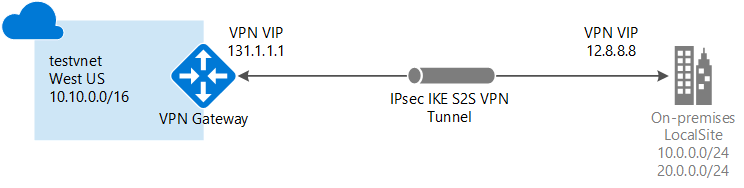

<properties
    pageTitle="将本地网络连接到 Azure 虚拟网络：站点到站点 VPN：PowerShell | Azure"
    description="通过公共 Internet 创建从本地网络到 Azure 虚拟网络的 IPsec 连接的步骤。 这些步骤可帮助使用 PowerShell 创建跨界站点到站点 VPN 网关连接。"
    services="vpn-gateway"
    documentationcenter="na"
    author="cherylmc"
    manager="timlt"
    editor=""
    tags="azure-resource-manager" />
<tags
    ms.assetid="fcc2fda5-4493-4c15-9436-84d35adbda8e"
    ms.service="vpn-gateway"
    ms.devlang="na"
    ms.topic="hero-article"
    ms.tgt_pltfrm="na"
    ms.workload="infrastructure-services"
    ms.date="05/01/2017"
    wacn.date="05/31/2017"
    ms.author="cherylmc"
    ms.translationtype="Human Translation"
    ms.sourcegitcommit="4a18b6116e37e365e2d4c4e2d144d7588310292e"
    ms.openlocfilehash="21046b9ce0b3129f4fcc234c875d9de3289dc9de"
    ms.contentlocale="zh-cn"
    ms.lasthandoff="05/19/2017" />

# 使用 PowerShell 创建具有站点到站点 VPN 连接的 VNet

本文介绍如何使用 PowerShell 创建站点到站点 VPN 网关连接，以便从本地网络连接到 VNet。 本文中的步骤适用于 Resource Manager 部署模型。 也可使用不同的部署工具或部署模型创建此配置，方法是从以下列表中选择另一选项：
> [AZURE.SELECTOR]
- [Resource Manager - Azure 门户](/documentation/articles/vpn-gateway-howto-site-to-site-resource-manager-portal/)
- [Resource Manager - PowerShell](/documentation/articles/vpn-gateway-create-site-to-site-rm-powershell/)
- [Resource Manager - CLI](/documentation/articles/vpn-gateway-howto-site-to-site-resource-manager-cli/)
- [经典 - Azure 门户](/documentation/articles/vpn-gateway-howto-site-to-site-classic-portal/)
- [经典 - 经典管理门户](/documentation/articles/vpn-gateway-site-to-site-create/)

使用站点到站点 VPN 网关连接，通过 IPsec/IKE（IKEv1 或 IKEv2）VPN 隧道将本地网络连接到 Azure 虚拟网络。 此类型的连接要求位于本地的 VPN 设备分配有一个面向外部的公共 IP 地址。 有关 VPN 网关的详细信息，请参阅[关于 VPN 网关](/documentation/articles/vpn-gateway-about-vpngateways/)。

## 开始之前

在开始配置之前，请验证是否符合以下条件：

* 验证是否需要使用 Resource Manager 部署模型。 [AZURE.INCLUDE [deployment models](../../includes/vpn-gateway-deployment-models-include.md)] 
* 一台兼容的 VPN 设备和能够对其进行配置的人员。 有关兼容的 VPN 设备和设备配置的详细信息，请参阅[关于 VPN 设备](/documentation/articles/vpn-gateway-about-vpn-devices/)。
* 一个用于 VPN 设备的面向外部的公共 IPv4 地址。 此 IP 地址不得位于 NAT 之后。
* 如果熟悉本地网络配置中的 IP 地址范围，则需咨询能够提供此类详细信息的人员。 创建此配置时，必须指定 IP 地址范围前缀，Azure 会将该前缀路由到本地位置。 本地网络的任何子网都不得与要连接到的虚拟网络子网重叠。
* 最新版本的 Azure Resource Manager PowerShell cmdlet。 有关安装 PowerShell cmdlet 的详细信息，请参阅 [如何安装和配置 Azure PowerShell](https://docs.microsoft.com/zh-cn/powershell/azure/overview) 。

### 示例值

本文中的示例使用以下值。 可使用这些值创建测试环境，或参考这些值以更好地理解本文中的示例。

    #Example values

    VnetName                = testvnet 
    ResourceGroup           = testrg 
    Location                = China North 
    AddressSpace            = 10.0.0.0/16 
    SubnetName              = Subnet1 
    Subnet                  = 10.0.1.0/28 
    GatewaySubnet           = 10.0.0.0/27
    LocalNetworkGatewayName = LocalSite
    LNG Public IP           = <VPN device IP address> 
    Local Address Prefixes  = 10.0.0.0/24','20.0.0.0/24
    Gateway Name            = vnetgw1
    PublicIP                = gwpip
    Gateway IP Config       = gwipconfig1 
    VPNType                 = RouteBased 
    GatewayType             = Vpn 
    ConnectionName          = myGWConnection

## 1.连接到订阅

[AZURE.INCLUDE [vpn-gateway-ps-login](../../includes/vpn-gateway-ps-login-include.md)]

## 2.创建虚拟网络和网关子网

如果还没有虚拟网络，请创建。 创建虚拟网络时，请确保指定的地址空间不与本地网络的任一个地址空间重叠。 对于此配置，还需要一个网关子网。 虚拟网关使用的网关子网包含 VPN 网关服务使用的 IP 地址。 创建网关子网时，必须将其命名为“GatewaySubnet”。 如果将其命名为其他名称，将创建子网，但 Azure 不将它视为网关子网。

指定的网关子网的大小取决于要创建的 VPN 网关配置。 尽管创建的网关子网最小可为 /29，但建议选择 /27 或 /28，创建包含更多地址的更大子网。 使用更大的网关子网可以有足够的 IP 地址来应对未来可能会有的配置。

[AZURE.INCLUDE [vpn-gateway-no-nsg](../../includes/vpn-gateway-no-nsg-include.md)]

### 若要创建虚拟网络和网关子网

此示例创建虚拟网络和网关子网。 如果已经有一个虚拟网络且需要向其添加网关子网，请参阅[向已创建的虚拟网络添加网关子网](#gatewaysubnet)。

创建资源组：

    New-AzureRmResourceGroup -Name testrg -Location 'China North'

创建虚拟网络。 

1. 设置变量。

        $subnet1 = New-AzureRmVirtualNetworkSubnetConfig -Name 'GatewaySubnet' -AddressPrefix 10.0.0.0/27
        $subnet2 = New-AzureRmVirtualNetworkSubnetConfig -Name 'Subnet1' -AddressPrefix '10.0.1.0/28'

2. 创建 VNet。

        New-AzureRmVirtualNetwork -Name testvnet -ResourceGroupName testrg `
        -Location 'China North' -AddressPrefix 10.0.0.0/16 -Subnet $subnet1, $subnet2

### 将网关子网添加到已创建的虚拟网络

1. 设置变量。

        $vnet = Get-AzureRmVirtualNetwork -ResourceGroupName testrg -Name testvnet

2. 创建网关子网。

        Add-AzureRmVirtualNetworkSubnetConfig -Name 'GatewaySubnet' -AddressPrefix 10.0.0.0/27 -VirtualNetwork $vnet

3. 设置配置。

        Set-AzureRmVirtualNetwork -VirtualNetwork $vnet

## 3.创建本地网关

本地网络网关通常是指本地位置。 可以为站点提供一个名称供 Azure 引用，然后指定本地 VPN 设备的 IP 地址，以便创建一个连接来连接到该设备。 此外还可指定 IP 地址前缀，以便通过 VPN 网关将其路由到 VPN 设备。 指定的地址前缀是位于本地网络的前缀。 如果本地网络出现变化，可以轻松更新这些前缀。

使用以下值：

* *GatewayIPAddress* 是本地 VPN 设备的 IP 地址。 VPN 设备不能位于 NAT 之后。
* *AddressPrefix* 是本地地址空间。

- 若要添加具有单个地址前缀的局域网网关：

        New-AzureRmLocalNetworkGateway -Name LocalSite -ResourceGroupName testrg `
        -Location 'China North' -GatewayIpAddress '23.99.221.164' -AddressPrefix '10.0.0.0/24'

- 若要添加具有多个地址前缀的局域网网关：

        New-AzureRmLocalNetworkGateway -Name LocalSite -ResourceGroupName testrg `
        -Location 'China North' -GatewayIpAddress '23.99.221.164' -AddressPrefix @('10.0.0.0/24','20.0.0.0/24')

- 为本地网关修改 IP 地址前缀： 
有时你的局域网网关前缀会有变化。 修改 IP 地址前缀时采取的步骤取决于是否已创建 VPN 网关连接。 请参阅本文的 [修改本地网关的 IP 地址前缀](#modify) 部分。

## 4.请求公共 IP 地址

VPN 网关必须具有公共 IP 地址。 请先请求 IP 地址资源，然后在创建虚拟网关时参阅该资源。 创建 VPN 网关时，IP 地址是动态分配给资源的。 VPN 网关当前仅支持动态公共 IP 地址分配。 不能请求静态公共 IP 地址分配。 但这并不意味着 IP 地址在分配到 VPN 网关后会更改。 公共 IP 地址只在删除或重新创建网关时更改。 该地址不会因为 VPN 网关大小调整、重置或其他内部维护/升级而更改。

请求一个公共 IP 地址，该地址将分配给虚拟网络 VPN 网关。

    $gwpip= New-AzureRmPublicIpAddress -Name gwpip -ResourceGroupName testrg -Location 'China North' -AllocationMethod Dynamic

## 5.创建网关 IP 寻址配置

网关配置定义要使用的子网和公共 IP 地址。 使用以下示例创建网关配置：

    $vnet = Get-AzureRmVirtualNetwork -Name testvnet -ResourceGroupName testrg
    $subnet = Get-AzureRmVirtualNetworkSubnetConfig -Name 'GatewaySubnet' -VirtualNetwork $vnet
    $gwipconfig = New-AzureRmVirtualNetworkGatewayIpConfig -Name gwipconfig1 -SubnetId $subnet.Id -PublicIpAddressId $gwpip.Id

## 6.创建 VPN 网关

创建虚拟网络 VPN 网关。 创建 VPN 网关可能需要长达 45 分钟或更长时间才能完成。

使用以下值：

* 站点到站点配置的 *-GatewayType* 为 *Vpn*。 网关类型永远是你要实现的配置的特定类型。 例如，其他网关配置可能需要 -GatewayType ExpressRoute。
* *-VpnType* 可以是 *RouteBased*（在某些文档中称为动态网关）或 *PolicyBased*（在某些文档中称为静态网关）。 有关 VPN 网关类型的详细信息，请参阅[关于 VPN 网关](/documentation/articles/vpn-gateway-about-vpngateways/)。
* *-GatewaySku* 可以是 Basic、Standard 或 HighPerformance。 某些 SKU 存在配置限制。 有关详细信息，请参阅[网关 SKU](/documentation/articles/vpn-gateway-about-vpngateways/#gateway-skus)。

        New-AzureRmVirtualNetworkGateway -Name vnetgw1 -ResourceGroupName testrg `
        -Location 'China North' -IpConfigurations $gwipconfig -GatewayType Vpn `
        -VpnType RouteBased -GatewaySku Standard

## 7.配置 VPN 设备

通过站点到站点连接连接到本地网络需要 VPN 设备。 在此步骤中，请配置 VPN 设备。 配置 VPN 设备时，需要以下项：

- 共享密钥。 此共享密钥就是在创建站点到站点 VPN 连接时指定的共享密钥。 在示例中，我们使用基本的共享密钥。 建议生成更复杂的可用密钥。
- 虚拟网关的“公共 IP 地址”。 可以通过 Azure 门户、PowerShell 或 CLI 查看公共 IP 地址。 若要使用 PowerShell 查找虚拟网关的公共 IP 地址，请使用以下示例：

        Get-AzureRmPublicIpAddress -Name GW1PublicIP -ResourceGroupName TestRG

[AZURE.INCLUDE [Configure VPN device](../../includes/vpn-gateway-configure-vpn-device-rm-include.md)]

## 8.创建 VPN 连接

接下来，将在虚拟网络网关和 VPN 设备之间创建站点到站点 VPN 连接。 请务必替换为你自己的值。 共享密钥必须与你用于 VPN 设备配置的值匹配。 请注意，站点到站点的“-ConnectionType”为 IPsec。

1. 设置变量。

        $gateway1 = Get-AzureRmVirtualNetworkGateway -Name vnetgw1 -ResourceGroupName testrg
        $local = Get-AzureRmLocalNetworkGateway -Name LocalSite -ResourceGroupName testrg

2. 创建连接。

        New-AzureRmVirtualNetworkGatewayConnection -Name MyGWConnection -ResourceGroupName testrg `
        -Location 'China North' -VirtualNetworkGateway1 $gateway1 -LocalNetworkGateway2 $local `
        -ConnectionType IPsec -RoutingWeight 10 -SharedKey 'abc123'

在一小段时间后，将建立该连接。

## 9.验证 VPN 连接

VPN 连接有几种不同的验证方式。

[AZURE.INCLUDE [Verify connection](../../includes/vpn-gateway-verify-connection-ps-rm-include.md)]

## 连接到虚拟机

[AZURE.INCLUDE [Connect to VM](../../includes/vpn-gateway-connect-vm-s2s-include.md)]

## 修改本地网关的 IP 地址前缀

如果需要路由到本地位置的 IP 地址前缀发生更改，则可修改本地网关。 提供了两套说明。 要选择哪套说明取决于您是否已创建了网关连接。

[AZURE.INCLUDE [Modify prefixes](../../includes/vpn-gateway-modify-ip-prefix-rm-include.md)]

## 修改本地网关的 IP 地址

[AZURE.INCLUDE [Modify gw IP](../../includes/vpn-gateway-modify-lng-gateway-ip-rm-include.md)]

## 后续步骤

* 连接完成后，即可将虚拟机添加到虚拟网络。 有关详细信息，请参阅[虚拟机](/documentation/services/virtual-machines/)。
* 有关 BGP 的信息，请参阅 [BGP 概述](/documentation/articles/vpn-gateway-bgp-overview/)和[如何配置 BGP](/documentation/articles/vpn-gateway-bgp-resource-manager-ps/)。

<!--Update_Description: add "Example values" and "connect to VM"-->