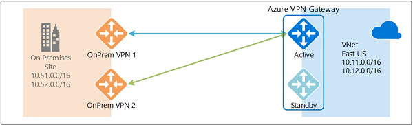
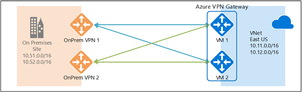

<properties
   pageTitle="包含 Azure VPN 网关的高可用性配置概述 | Azure"
   description="本文概述使用 Azure VPN 网关的高可用性配置选项。"
   services="vpn-gateway"
   documentationCenter="na"
   authors="yushwang"
   manager="rossort"
   editor=""
   tags=""/>  

<tags
   ms.service="vpn-gateway"
   ms.devlang="na"
   ms.topic="get-started-article"
   ms.tgt_pltfrm="na"
   ms.workload="infrastructure-services"
   ms.date="09/24/2016"
   wacn.date=""
   ms.author="yushwang"/>  

# 高可用性跨界连接与 VNet 到 VNet 连接

本文概述使用 Azure VPN 网关的跨界连接和 VNet 到 VNet 连接的高可用性配置选项。

## 关于 Azure VPN 网关冗余

每个 Azure VPN 网关由两个采用主动-待机配置的实例组成。当主动实例发生任何计划内维护或计划外中断时，待机实例将自动接管负载（故障转移），恢复 S2S VPN 连接或 VNet 到 VNet 连接。这种交接会造成短暂的中断。发生计划内维护时，10 到 15 秒内应可恢复连接。发生计划外的问题时，恢复连接所需的时间更长，在最糟的情况下大约需要 1 到 1.5 分钟。为使 P2S VPN 客户端与网关建立连接，需要先断开 P2S 连接，然后，用户必须从客户端计算机重新连接。

  

## 高可用性跨界连接

若要为跨界连接提供更高的可用性，可以使用多种选项：

- 多个本地 VPN 设备
- 主动-主动 Azure VPN 网关
- 两者的组合

### 多个本地 VPN 设备

可以使用本地网络中的多个 VPN 设备连接到 Azure VPN 网关，如下图所示：

  

此配置提供多个活动隧道用于从同一个 Azure VPN 网关连接到同一位置中的本地设备。此配置有一些要求和限制：

1. 需要创建从 VPN 设备到 Azure 的多个 S2S VPN 连接。从同一个本地网络的多个 VPN 设备连接到 Azure 时，需要为每个 VPN 设备创建一个本地网络网关，以及一个从 Azure VPN 网关到本地网络网关的连接。

2. 对应于 VPN 设备的本地网络网关在“GatewayIpAddress”属性中必须有唯一的公共 IP 地址。

3. 此配置需要 BGP。必须在“BgpPeerIpAddress”属性中为代表 VPN 设备的每个本地网络网关指定唯一的 BGP 对等 IP 地址。

4. 每个本地网络网关中的 AddressPrefix 属性字段不能重叠。应在 AddressPrefix 字段中指定 /32 CIDR 格式的“BgpPeerIpAddress”，例如 10.200.200.254/32。

5. 应使用 BGP 向 Azure VPN 网关播发同一本地网络的相同前缀，流量将同时通过这些隧道转发。

6. 每个连接将计入 Azure VPN 网关的隧道数目上限，基本和标准 SKU 的上限为 10，高性能 SKU 的上限为 30。

在此配置中，Azure VPN 网关仍处于主动-待机模式，因此，仍会发生[上述](#activestandby)故障转移行为和短暂中断。但是，这种设置可针对本地网络和 VPN 设备故障或中断提供保护。
 
### 主动-主动 Azure VPN 网关

现在，可以在主动-主动配置中创建一个 Azure VPN 网关，其中的两个网关 VM 实例将与本地 VPN 设备建立 S2S VPN 隧道，如下图所示：

  

在此配置中，每个 Azure 网关实例都有唯一的公共 IP 地址，每个实例将与本地网络网关和连接中指定的本地 VPN 设备建立 IPsec/IKE S2S VPN 隧道。请注意，这两个 VPN 隧道实际上属于同一个连接。仍然需要配置本地 VPN 设备，以便与这两个 Azure VPN 网关公共 IP 地址建立两条 S2S VPN 隧道，或者接受这种通道。

由于 Azure 网关实例采用主动-主动配置，因此，从 Azure 虚拟网络到本地网络的流量同时通过这两条隧道路由，即使本地 VPN 设备优先选择其中一个隧道，也是如此。请注意，除非其中一个实例发生维护事件，否则相同的 TCP 或 UDP 流量始终会遍历相同的隧道或路径。

当一个网关实例发生计划内维护或计划外事件时，从该实例到本地 VPN 设备的 IPsec 隧道将会断开。VPN 设备上的对应路由应会自动删除或撤消，以便将流量切换到其他活动 IPsec 隧道。在 Azure 端，将自动从受影响的实例切换到活动实例。

### 双重冗余：Azure 和本地网络的主动-主动 VPN 网关

最可靠的选项是结合网络和 Azure 上的主动-主动网关，如下图所示。

  

此处创建并设置了采用主动-主动配置的 Azure VPN 网关，并针对上述两个本地 VPN 设备创建了两个本地网络网关和两个连接。结果是在 Azure 虚拟网络与本地网络之间建立了包含 4 个 IPsec 隧道的全面网格连接。

所有网关和隧道从 Azure 端激活，因此流量同时分散在 4 个隧道之间，每个 TCP 或 UDP 流量再次沿着源自 Azure 端的相同隧道或路径传送。尽管分散了流量，但你可能会发现，IPsec 隧道上的吞吐量稍有提高，而此配置的主要目标就是实现高可用性。由于分散的统计特征，难以通过某种测量方式来确定不同的应用程序流量状况对聚合吞吐量造成的影响。

此拓扑需要使用两个本地网络网关和两个连接来支持本地 VPN 设备对，需要使用 BGP 来与同一个本地网络建立两个连接。[上述](#activeactiveonprem)配置同样需要满足这些要求。

## 通过 Azure VPN 网关实现高可用性 VNet 到 VNet 连接

上述主动-主动配置同样适用于 Azure VNet 到 VNet 连接。可为两个虚拟网络创建主动-主动 VPN 网关并将它们连接到一起，同样在两个 VNet 之间构成包含 4 个隧道的全面网格连接，如下图所示：

  

这可以确保用于任何计划内维护事件的两个虚拟网络之间始终有一对隧道，进一步提高可用性。尽管用于跨界连接的相同拓扑需要两个连接，但如上所示的 VNet 到 VNet 拓扑只需要为每个网关建立一个连接。此外，除非基于 VNet 到 VNet 连接的传输路由是必需的，否则 BGP 是可选的。

## 后续步骤

有关配置主动-主动跨界连接和 VNet 到 VNet 连接的步骤，请参阅 [Configuring Active-Active VPN Gateways for Cross-Premises and VNet-to-VNet Connections](http://go.microsoft.com/fwlink/?LinkId=828726)（为跨界连接和 VNet 到 VNet 连接配置主动-主动 VPN 网关）。

<!---HONumber=Mooncake_1031_2016-->