<properties
    pageTitle="使用点到站点将计算机连接到 Azure 虚拟网络：Azure 门户：经典 | Azure"
    description="使用 Azure 门户创建点到站点 VPN 网关连接，从而安全连接到经典 Azure 虚拟网络。"
    services="vpn-gateway"
    documentationcenter="na"
    author="cherylmc"
    manager="timlt"
    editor=""
    tags="azure-service-management" />
<tags
    ms.assetid="65e14579-86cf-4d29-a6ac-547ccbd743bd"
    ms.service="vpn-gateway"
    ms.devlang="na"
    ms.topic="hero-article"
    ms.tgt_pltfrm="na"
    ms.workload="infrastructure-services"
    ms.date="05/03/2017"
    wacn.date="05/31/2017"
    ms.author="cherylmc"
    ms.translationtype="Human Translation"
    ms.sourcegitcommit="4a18b6116e37e365e2d4c4e2d144d7588310292e"
    ms.openlocfilehash="6ecf7c58e341be30ad525199928c46feafa1032e"
    ms.contentlocale="zh-cn"
    ms.lasthandoff="05/19/2017" />

# 使用 Azure 门户（经典）配置与 VNet 的点到站点连接

[AZURE.INCLUDE [deployment models](../../includes/vpn-gateway-classic-deployment-model-include.md)]

本文介绍如何在经典部署模型中使用 Azure 门户通过点到站点连接创建 VNet。 也可使用不同的部署工具或部署模型创建此配置，方法是从以下列表中选择另一选项：
> [AZURE.SELECTOR]
- [Resource Manager - Azure 门户](/documentation/articles/vpn-gateway-howto-point-to-site-resource-manager-portal/)
- [Resource Manager - PowerShell](/documentation/articles/vpn-gateway-howto-point-to-site-rm-ps/)
- [经典 - Azure 门户](/documentation/articles/vpn-gateway-howto-point-to-site-classic-azure-portal/)

使用点到站点 (P2S) 配置可以创建从单个客户端计算机到虚拟网络的安全连接。 P2S 是基于 SSTP（安全套接字隧道协议）的 VPN 连接。 如果要从远程位置（例如，从家里或会议室）连接到 VNet，或者只有少数几台客户端计算机需要连接到虚拟网络，点到站点连接将非常有用。 P2S 连接不需要 VPN 设备或面向公众的 IP 地址。 可从客户端计算机建立 VPN 连接。 

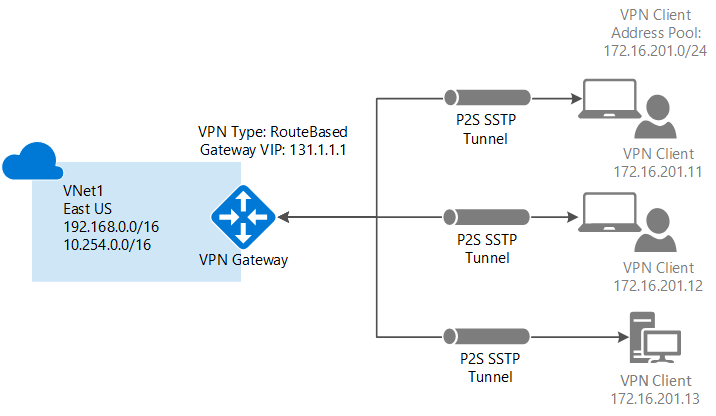

P2S 连接有以下要求：

* 动态 VPN 网关。
* 根证书的公钥（.cer 文件），已上传到 Azure。 此证书被视为可信证书，用于身份验证。
* 从根证书生成的客户端证书，安装在每个要连接的客户端计算机上。 此证书用于客户端身份验证。
* 必须生成 VPN 客户端配置包，并将其安装在每个进行连接的客户端计算机上。 客户端配置包为操作系统上已有的本机 VPN 客户端配置连接到 VNet 所需的信息。

有关点到站点连接的详细信息，请参阅本文末尾的 [点到站点常见问题解答](#faq) 。

### 示例设置

可使用以下值创建测试环境，或参考这些值以更好地理解本文中的示例：

* **名称：VNet1**
* **地址空间：192.168.0.0/16** 对于此示例，我们只使用一个地址空间。 对于 VNet，可以有多个地址空间。
* **子网名称：FrontEnd**
* **子网地址范围：192.168.1.0/24**
* **订阅：** 如果你有多个订阅，请确保使用正确的订阅。
* **资源组：TestRG**
* **位置：中国东部**
* **连接类型：点到站点**
* **客户端地址空间：172.16.201.0/24**。 使用此点到站点连接连接到 VNet 的 VPN 客户端接收来自指定池的 IP 地址。
* **网关子网：192.168.200.0/24**。 网关子网必须使用名称“GatewaySubnet”。
* **大小：** 选择要使用的网关 SKU。
* **路由类型：动态**

## 第 1 部分 - 创建虚拟网络和 VPN 网关

开始之前，请确保你拥有 Azure 订阅。 如果还没有 Azure 订阅，可以注册一个[试用帐户](/pricing/1rmb-trial)。

### 第 1 部分：创建虚拟网络

如果还没有虚拟网络，请创建一个。 这些屏幕截图仅供参考。 请务必替换为你自己的值。 若要使用 Azure 门户创建 VNet，请执行以下步骤：

1. 从浏览器导航到 [Azure 门户](http://portal.azure.cn)，必要时使用 Azure 帐户登录。
2. 单击“新建” 。 在“搜索应用商店”字段中，键入“虚拟网络”。 从返回的列表中找到“虚拟网络”，单击打开“虚拟网络”边栏选项卡。

    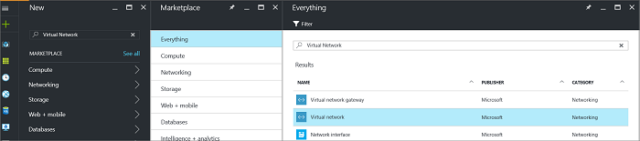
3. 从靠近“虚拟网络”边栏选项卡底部的“选择部署模型”列表中，选择“经典”，然后单击“创建”。

    
4. 在“创建虚拟网络”  边栏选项卡上，配置 VNet 设置。 在此边栏选项卡中，添加第一个地址空间和单个子网地址范围。 完成创建 VNet 之后，可以返回并添加其他子网和地址空间。

    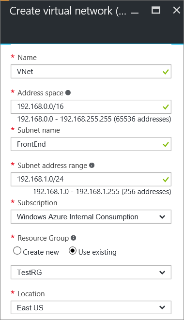
5. 验证“订阅”  是否正确。 可以使用下拉列表更改订阅。
6. 单击“资源组”  ，然后选择现有资源组，或通过键入新的资源组名称创建新资源组。 如果要创建新资源组，请根据计划的配置值来命名资源组。 有关资源组的详细信息，请访问 [Azure Resource Manager 概述](/documentation/articles/resource-group-overview/#resource-groups)。
7. 接下来，选择 VNet 的“位置”  设置。 该位置确定要部署到此 VNet 的资源所在的位置。
8. 如果希望能够在仪表板上轻松查找 VNet，请选择“固定到仪表板”，然后单击“创建”。

    
9. 单击“创建”后，仪表板上会出现一个磁贴，反映 VNet 的进度。 创建 VNet 时，该磁贴会更改。

    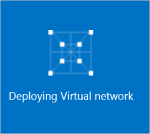
10. 创建虚拟网络后，可以在 Azure 经典管理门户中的“网络”页上，看到“状态”下面列出了“已创建”。
11. 添加 DNS 服务器（可选）。 创建虚拟网络后，可以添加 DNS 服务器的 IP 地址进行名称解析。 指定 DNS 服务器时，该服务器应该可以解析 VNet 中资源的名称。 若要添加 DNS 服务器，请打开虚拟网络的设置，单击 DNS 服务器，然后添加要使用的 DNS 服务器的 IP 地址。 在随后的步骤中生成的客户端配置包将包含在本设置中指定的 DNS 服务器的 IP 地址。 如果需要在将来更新 DNS 服务器的列表，则可根据更新的列表生成并安装新的 VPN 客户端配置包。

### 第 2 部分：创建网关子网和动态路由网关

本步骤创建网关子网和动态路由网关。 在经典部署模型的 Azure 门户中，可以通过相同的配置边栏选项卡创建网关子网和网关。

1. 在门户中，导航到要为其创建网关的虚拟网络。
2. 在虚拟网络“概述”边栏选项卡上的“VPN 连接”部分中，单击“网关”。

    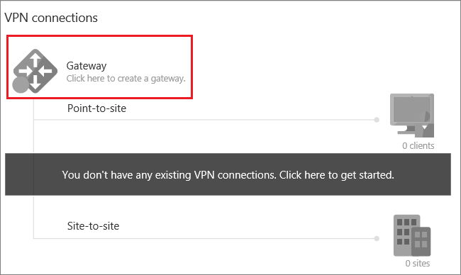
3. 在“新建 VPN 连接”边栏选项卡中，选择“点到站点”。

    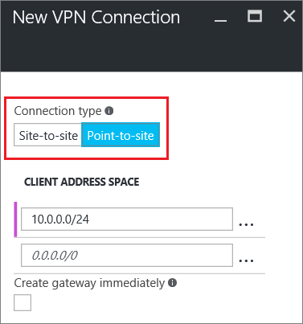
4. 对于“客户端地址空间”，请添加 IP 地址范围。 这是 VPN 客户端在连接时要从中接收 IP 地址的范围。 使用专用 IP 地址范围时，该范围不得与要通过其进行连接的本地位置重叠，也不得与要连接到其中的 VNet 重叠。 可以删除自动填充的范围，然后添加要使用的专用 IP 地址范围。

    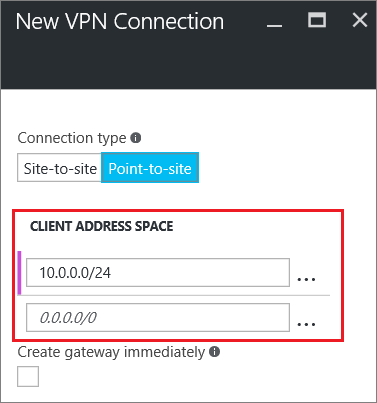
5. 选中“立即创建网关”复选框。

    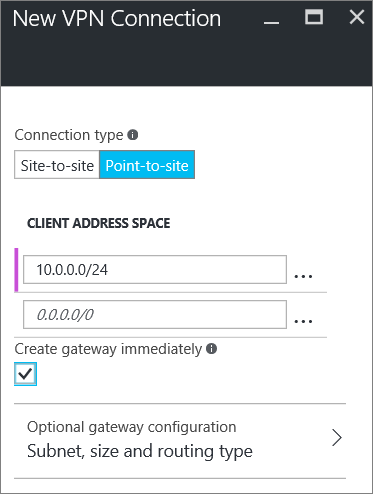
6. 单击“可选网关配置”打开“网关配置”边栏选项卡。

    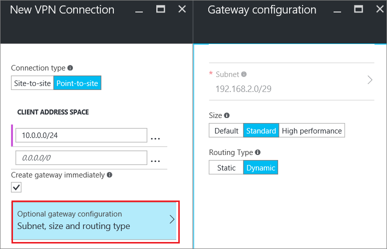
7. 单击“子网配置所需的设置”添加**网关子网**。 尽管创建的网关子网最小可为 /29，但建议至少选择 /28 或 /27，创建包含更多地址的更大子网。 这样便可以留出足够多的地址，满足将来可能需要使用的其他配置。 处理网关子网时，请避免将网络安全组 (NSG) 关联到网关子网。 将网络安全组与此子网关联可能会导致 VPN 网关停止按预期方式工作。

    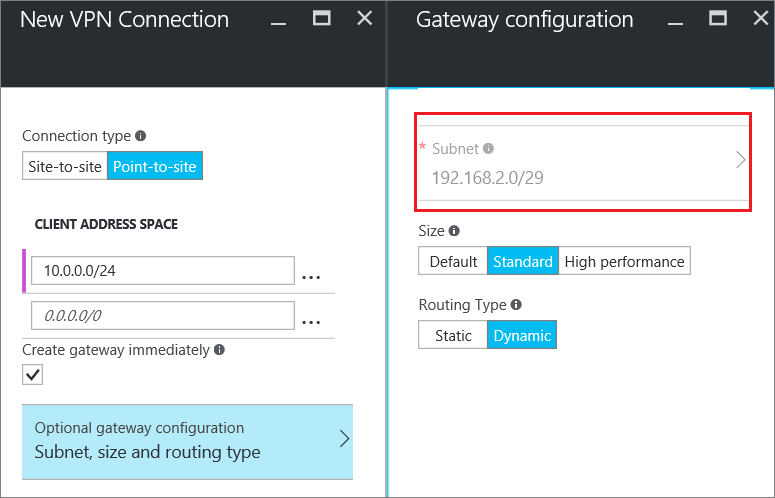
8. 选择网关“大小”。 大小为虚拟网关的网关 SKU。 在门户中，默认 SKU 为“基本”。 有关网关 SKU 的详细信息，请参阅[关于 VPN 网关设置](/documentation/articles/vpn-gateway-about-vpn-gateway-settings/#gwsku)。

    
9. 选择网关的“路由类型”。 P2S 配置需要“动态”路由类型。 在此边栏选项卡中完成配置后，请单击“确定”。

    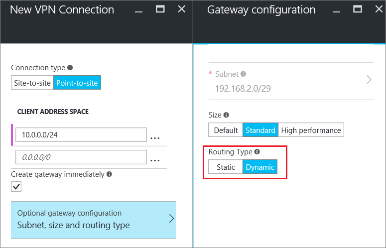
10. 在“新建 VPN 连接”边栏选项卡中，单击底部的“确定”开始创建虚拟网络网关。 VPN 网关可能需要长达 45 分钟的时间才能完成，具体取决于所选网关 SKU。

## 第 2 部分 - 创建证书

Azure 使用证书对点到站点 VPN 的 VPN 客户端进行身份验证。 请将根证书的公钥信息上传到 Azure， 然后即可将该公钥视为“可信”公钥。 必须根据可信根证书生成客户端证书，然后将其安装在每个客户端计算机的 Certificates-Current User/个人证书存储中。 当客户端发起到 VNet 的连接时，使用证书对客户端进行身份验证。 有关如何生成和安装证书的详细信息，请参阅[点到站点的证书](/documentation/articles/vpn-gateway-certificates-point-to-site/)。

### 第 1 部分：获取根证书的公钥 (.cer)

[AZURE.INCLUDE [vpn-gateway-basic-vnet-rm-portal](../../includes/vpn-gateway-p2s-rootcert-include.md)]

### 第 2 部分：生成客户端证书

[AZURE.INCLUDE [vpn-gateway-basic-vnet-rm-portal](../../includes/vpn-gateway-p2s-clientcert-include.md)]

## 第 3 部分：上传根证书 .cer 文件

创建网关后，可以将可信根证书的 .cer 文件（其中包含公钥信息）上传到 Azure。 不要将根证书的私钥上传到 Azure。 上传 .cer 文件后，Azure 可以使用该文件对已安装客户端证书（根据可信根证书生成）的客户端进行身份验证。 可在以后根据需要上传更多的可信根证书文件（最多 20 个）。  

1. 在 VNet 边栏选项卡的“VPN 连接”部分中，单击“客户端”图形打开“点到站点 VPN 连接”边栏选项卡。

    
2. 在“点到站点连接”边栏选项卡中，单击“管理证书”打开“证书”边栏选项卡。 

    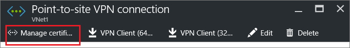  
3. 在“证书”边栏选项卡中，单击“上传”打开“上传证书”边栏选项卡。 

    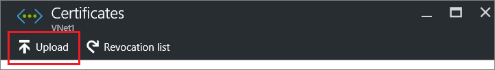 
4. 单击文件夹图形浏览 .cer 文件。 选择该文件，然后单击“确定”。 刷新页面，在“证书”边栏选项卡中查看上传的证书。

     

## 第 4 部分 - 配置客户端

若要通过点到站点 VPN 连接到 VNet，每个客户端都必须安装一个用于配置本机 Windows VPN 客户端的包。 配置包为本机 Windows VPN 客户端配置连接到虚拟网络所需的设置，在为 VNet 指定 DNS 服务器的情况下，它包含 DNS 服务器 IP 地址，客户端将使用该地址进行名称解析。 如果在以后更改指定的 DNS 服务器，则在生成客户端配置包以后，请确保生成新的客户端配置包，以便将其安装在客户端计算机上。

只要版本与客户端的体系结构匹配，就可以在每台客户端计算机上使用相同的 VPN 客户端配置包。 有关支持的客户端操作系统列表，请参阅本文末尾的[点到站点连接常见问题解答](#faq)。

### 第 1 部分 - 生成和安装 VPN 客户端配置包

1. 在 Azure 门户中，在 VNet 的“概述”边栏选项卡上的“VPN 连接”中，单击客户端图形打开“点到站点 VPN 连接”边栏选项卡。
2. 在“点到站点 VPN 连接”边栏选项卡顶部，选择与要在其中进行安装的客户端操作系统对应的下载包： 

    * 对于 64 位客户端，请选择“VPN 客户端（64 位）”。
    * 对于 32 位客户端，请选择“VPN 客户端（32 位）”。

         
3. 生成打包的内容以后，即可下载它并在客户端计算机上安装它。 如果显示 SmartScreen 弹出窗口，请单击“更多信息”，然后单击“仍要运行”。 也可将要安装的包保存在其他客户端计算机上。

### 第 2 部分：安装客户端证书

如果想要从另一台客户端计算机（而不是用于生成客户端证书的计算机）创建 P2S 连接，需要安装客户端证书。 安装客户端证书时，需要使用导出客户端证书时创建的密码。 通常只需双击证书即可安装。 有关详细信息，请参阅[安装已导出的客户端证书](/documentation/articles/vpn-gateway-certificates-point-to-site/#install)。

## 第 5 节 - 连接到 Azure

### 连接到 VNet

1. 若要连接到 VNet，请在客户端计算机上导航到 VPN 连接，找到创建的 VPN 连接。 其名称与虚拟网络的名称相同。 单击“连接”。 可能会出现与使用证书相关的弹出消息。 如果出现此消息，请单击“继续”  以使用提升的权限。
2. 在“连接”状态页上，单击“连接”以启动连接。 如果看到“选择证书”屏幕，请确保所显示的客户端证书是要用来连接的证书。 如果不是，请使用下拉箭头选择正确的证书，然后单击“确定”。

    
3. 连接已建立。

    

如果连接时遇到问题，请检查以下项：

- 打开“管理用户证书”，然后导航到“受信任的根证书颁发机构\证书”。 验证根证书是否已列出。 若要进行身份验证，根证书必须存在。 使用默认值“包括证书路径中的所有证书(如果可能)”导出客户端证书 .pfx 时，根证书信息也会导出。 安装客户端证书时，根证书也会安装在客户端计算机上。 

- 如果使用的是通过企业 CA 解决方案颁发的证书，并且无法进行身份验证，请检查客户端证书上的身份验证顺序。 可以通过双击客户端证书，并转到“详细信息”>“增强型密钥用法”来检查身份验证列表顺序。 请确保此列表显示的第一项是“客户端身份验证”。 如果不是，则需要基于将“客户端身份验证”作为列表中第一项的用户模板颁发客户端证书。 

### 验证 VPN 连接

1. 若要验证你的 VPN 连接是否处于活动状态，请打开提升的命令提示符，然后运行 *ipconfig/all*。
2. 查看结果。 请注意，你收到的 IP 地址是点到站点连接地址范围中的一个地址，该范围是你在创建 VNet 时指定的。 结果应大致如下所示：

示例：

    PPP adapter VNet1:
        Connection-specific DNS Suffix .:
        Description.....................: VNet1
        Physical Address................:
        DHCP Enabled....................: No
        Autoconfiguration Enabled.......: Yes
        IPv4 Address....................: 192.168.130.2(Preferred)
        Subnet Mask.....................: 255.255.255.255
        Default Gateway.................:
        NetBIOS over Tcpip..............: Enabled

 如果你在通过 P2S 连接到虚拟机时出现问题，请使用“ipconfig”检查分配给以太网适配器的 IPv4 地址，该适配器所在的计算机正是你要从其进行连接的计算机。 如果该 IP 地址位于你要连接到的 VNet 的地址范围内，或者位于 VPNClientAddressPool 的地址范围内，则称为地址空间重叠。 当地址空间以这种方式重叠时，网络流量不会抵达 Azure，而是呆在本地网络中。 如果网络地址空间不重叠，但你仍然无法连接到 VM，请参阅[排查通过远程桌面连接到 VM 时的问题](/documentation/articles/virtual-machines-windows-troubleshoot-rdp-connection/)。

## 连接到虚拟机

[AZURE.INCLUDE [Connect to a VM](../../includes/vpn-gateway-connect-vm-p2s-classic-include.md)]

## 添加或删除受信任的根证书

可以在 Azure 中添加和删除受信任的根证书。 删除根证书时，如果客户端的证书是从该根生成的，则客户端不能进行身份验证，因此无法进行连接。 如果希望客户端进行身份验证和连接，则需安装新客户端证书，该证书是从委托（上传）给 Azure 的根证书生成的。

### 添加受信任的根证书

最多可以将 20 个受信任的根证书 .cer 文件添加到 Azure。 如需说明，请参阅[第 3 部分 - 上传根证书 .cer 文件](#upload)。

### 删除受信任的根证书

1. 在 VNet 边栏选项卡的“VPN 连接”部分中，单击“客户端”图形打开“点到站点 VPN 连接”边栏选项卡。

    
2. 在“点到站点连接”边栏选项卡中，单击“管理证书”打开“证书”边栏选项卡。 

      
3. 在“证书”边栏选项卡中，单击要删除的证书旁边的省略号，然后单击“删除”。

    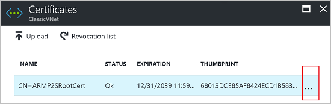 

## 吊销客户端证书

你可以吊销客户端证书。 证书吊销列表可让你选择性地拒绝基于单个客户端证书的点到站点连接。 这不同于删除受信任的根证书。 如果从 Azure 中删除受信任的根证书 .cer，它会吊销由吊销的根证书生成/签名的所有客户端证书的访问权限。 如果吊销客户端证书而非根证书，则可继续使用从根证书生成的其他证书，以便进行点到站点连接所需的身份验证。

常见的做法是使用根证书管理团队或组织级别的访问权限，然后使用吊销的客户端证书针对单个用户进行精细的访问控制。

### 吊销客户端证书

可以通过将指纹添加到吊销列表来吊销客户端证书。

1. 检索客户端证书指纹。 有关详细信息，请参阅[如何：检索证书的指纹](https://msdn.microsoft.com/zh-cn/library/ms734695.aspx)。
2. 将信息复制到一个文本编辑器，删除所有空格，使之成为一个连续的字符串。
3. 导航到“‘经典虚拟网络名称’> 点到站点 VPN 连接 > 证书”边栏选项卡，然后单击“吊销列表”打开“吊销列表”边栏选项卡。 
4. 在“吊销列表”边栏选项卡中，单击“+添加证书”打开“将证书添加到吊销列表”边栏选项卡。
5. 在“将证书添加到吊销列表”边栏选项卡中，将证书指纹以连续文本行的形式进行粘贴，不留空格。 单击边栏选项卡底部的“确定”。
6. 更新完成后，不再可以使用证书来连接。 客户端在尝试使用此证书进行连接时，会收到一条消息，指出证书不再有效。

## 点到站点常见问题解答

[AZURE.INCLUDE [Point-to-Site FAQ](../../includes/vpn-gateway-point-to-site-faq-include.md)]

## 后续步骤
连接完成后，即可将虚拟机添加到虚拟网络。 有关详细信息，请参阅[虚拟机](/documentation/services/virtual-machines/)。 若要详细了解网络和虚拟机，请参阅 [Azure 和 Linux VM 网络概述](/documentation/articles/virtual-machines-linux-azure-vm-network-overview/)。

<!--Update_Description: move some contents to include files-->