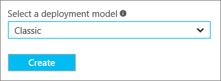

<properties
    pageTitle="使用点到站点将计算机连接到 Azure 虚拟网络：Azure 门户预览：经典 | Azure"
    description="使用 Azure 门户预览创建点到站点 VPN 网关连接，从而安全连接到经典 Azure 虚拟网络。"
    services="vpn-gateway"
    documentationcenter="na"
    author="cherylmc"
    manager="timlt"
    editor=""
    tags="azure-service-management"
    translationtype="Human Translation" />
<tags
    ms.assetid="65e14579-86cf-4d29-a6ac-547ccbd743bd"
    ms.service="vpn-gateway"
    ms.devlang="na"
    ms.topic="hero-article"
    ms.tgt_pltfrm="na"
    ms.workload="infrastructure-services"
    ms.date="03/20/2017"
    wacn.date="04/17/2017"
    ms.author="cherylmc"
    ms.sourcegitcommit="e0e6e13098e42358a7eaf3a810930af750e724dd"
    ms.openlocfilehash="64053c57e1d74d3434cf27f14e67f063d84accbb"
    ms.lasthandoff="04/06/2017" />

# 使用 Azure 门户预览（经典）配置与 VNet 的点到站点连接
> [AZURE.SELECTOR]
- [Resource Manager - Azure 门户预览](/documentation/articles/vpn-gateway-howto-point-to-site-resource-manager-portal/)
- [Resource Manager - PowerShell](/documentation/articles/vpn-gateway-howto-point-to-site-rm-ps/)
- [经典 - Azure 门户预览](/documentation/articles/vpn-gateway-howto-point-to-site-classic-azure-portal/)

使用点到站点 (P2S) 配置可以创建从单个客户端计算机到虚拟网络的安全连接。 P2S 是基于 SSTP（安全套接字隧道协议）的 VPN 连接。 如果要从远程位置（例如，从家里或会议室）连接到 VNet，或者只有少数几台客户端计算机需要连接到虚拟网络，点到站点连接将非常有用。 P2S 连接不需要 VPN 设备或面向公众的 IP 地址。 可从客户端计算机建立 VPN 连接。

本文逐步讲解如何使用 Azure 门户预览，在经典部署模型中创建具有点到站点连接的 VNet。 有关点到站点连接的详细信息，请参阅本文末尾的 [点到站点常见问题解答](#faq) 。

### P2S 连接的部署模型和方法
[AZURE.INCLUDE [deployment models](../../includes/vpn-gateway-deployment-models-include.md)]

下表显示了 P2S 配置的两种部署模型和可用的部署方法。 当有配置步骤相关的文章发布时，我们会直接从此表格链接到该文章。

[AZURE.INCLUDE [vpn-gateway-clasic-rm](../../includes/vpn-gateway-table-point-to-site-include.md)]

## 基本工作流

以下部分逐步讲解如何建立与虚拟网络的安全点到站点连接。

1. 创建虚拟网络和 VPN 网关
2. 生成证书
3. 上载 .cer 文件
4. 生成 VPN 客户端配置包
5. 配置客户端计算机
6. 连接到 Azure

### 示例设置
可以使用以下示例设置：

* **名称：VNet1**
* **地址空间：192.168.0.0/16** 对于此示例，我们只使用一个地址空间。 对于 VNet，可以有多个地址空间。
* **子网名称：FrontEnd**
* **子网地址范围：192.168.1.0/24**
* **订阅：** 如果你有多个订阅，请确保使用正确的订阅。
* **资源组：TestRG**
* **位置：中国东部**
* **连接类型：点到站点**
* **客户端地址空间：172.16.201.0/24**。 使用此点到站点连接连接到 VNet 的 VPN 客户端接收来自指定池的 IP 地址。
* **网关子网：192.168.200.0/24**。 网关子网必须使用名称“GatewaySubnet”。
* **大小：** 选择要使用的网关 SKU。
* **路由类型：动态**

## 第 1 部分 - 创建虚拟网络和 VPN 网关

开始之前，请确保你拥有 Azure 订阅。 如果你还没有 Azure 订阅，可以注册获取[试用帐户](/pricing/1rmb-trial)。
### 第 1 部分：创建虚拟网络
如果还没有虚拟网络，请创建一个。 这些屏幕截图仅供参考。 请务必替换为你自己的值。 若要使用 Azure 门户预览创建 VNet，请执行以下步骤：

1. 从浏览器导航到 [Azure 门户预览](http://portal.azure.cn) ，必要时使用 Azure 帐户登录。
2. 单击“新建” 。 在“搜索应用商店”字段中，键入“虚拟网络”。 从返回的列表中找到“虚拟网络”，单击打开“虚拟网络”边栏选项卡。

    
3. 从靠近“虚拟网络”边栏选项卡底部的“选择部署模型”列表中，选择“经典”，然后单击“创建”。

    
4. 在“创建虚拟网络”  边栏选项卡上，配置 VNet 设置。 在此边栏选项卡中，你将添加第一个地址空间和单个子网地址范围。 完成创建 VNet 之后，可以返回并添加其他子网和地址空间。

    
5. 验证“订阅”  是否正确。 可以使用下拉列表更改订阅。
6. 单击“资源组”  ，然后选择现有资源组，或通过键入新的资源组名称创建新资源组。 如果要创建新组，请根据计划的配置值来命名资源组。 有关资源组的详细信息，请访问 [Azure 资源管理器概述](/documentation/articles/resource-group-overview/#resource-groups)。
7. 接下来，选择 VNet 的“位置”  设置。 该位置决定了要部署到此 VNet 中的资源所在的位置。
8. 如果希望能够在仪表板上轻松查找 VNet，请选择“固定到仪表板”，然后单击“创建”。

    
9. 单击“创建”后，你将看到仪表板上有一个磁贴反映了 VNet 的进度。 创建 VNet 时，该磁贴会更改。

    
10. 创建虚拟网络后，可以添加 DNS 服务器的 IP 地址来处理名称解析。 打开虚拟网络的设置，单击 DNS 服务器，然后添加要使用的 DNS 服务器 IP 地址。 此设置不会创建新的 DNS 服务器。 请务必添加可与资源通信的 DNS 服务器。

创建虚拟网络后，可以在 Azure 经典管理门户中的“网络”页上，看到“状态”下面列出了“已创建”。

### 第 2 部分：创建网关子网和动态路由网关
本步骤创建网关子网和动态路由网关。 在经典部署模型的 Azure 门户预览中，可以通过相同的配置边栏选项卡创建网关子网和网关。

1. 在门户中，导航到要为其创建网关的虚拟网络。
2. 在虚拟网络“概述”边栏选项卡上的“VPN 连接”部分中，单击“网关”。

    
3. 在“新建 VPN 连接”边栏选项卡中，选择“点到站点”。

    
4. 对于“客户端地址空间”，请添加 IP 地址范围。 这是 VPN 客户端在连接时要从中接收 IP 地址的范围。 删除自动填充的范围，添加自己的范围。

    
5. 选中“立即创建网关”复选框。

    
6. 单击“可选网关配置”打开“网关配置”边栏选项卡。

    
7. 单击“子网配置所需的设置”添加**网关子网**。 尽管创建的网关子网最小可为 /29，但建议至少选择 /28 或 /27，创建包含更多地址的更大子网。 这样便可以留出足够多的地址，满足将来可能需要使用的其他配置。

    > [AZURE.IMPORTANT]
    > 处理网关子网时，请避免将网络安全组 (NSG) 关联到网关子网。 将网络安全组与此子网关联可能会导致 VPN 网关停止按预期方式工作。 有关网络安全组的详细信息，请参阅[什么是网络安全组？](/documentation/articles/virtual-networks-nsg/)
    >
    >

    
8. 选择网关 **大小**。 这是用于创建虚拟网络网关的网关 SKU。 在门户中，默认 SKU 为“基本”。 有关网关 SKU 的详细信息，请参阅[关于 VPN 网关设置](/documentation/articles/vpn-gateway-about-vpn-gateway-settings/#gwsku)。

    
9. 选择网关的“路由类型”。 P2S 配置需要“动态”路由类型。 在此边栏选项卡中完成配置后，请单击“确定”。

    
10. 在“新建 VPN 连接”边栏选项卡中，单击底部的“确定”开始创建虚拟网络网关。 此步骤可能最多需要 45 分钟才能完成。

## 第 2 部分 - 创建证书
Azure 使用证书对点到站点 VPN 的 VPN 客户端进行身份验证。 创建根证书以后，请将公共证书数据（不是密钥）作为 Base-64 编码的 X.509 .cer 文件导出。 然后，将公共证书数据从根证书上载到 Azure。

在使用点到站点连接连接到 VNet 的每台客户端计算机上，必须安装客户端证书。 客户端证书从根证书生成，安装在每个客户端计算机上。 如果未安装有效的客户端证书，而客户端尝试连接到 VNet，则身份验证会失败。

### 第 1 部分：获取根证书的公钥 (.cer)

####企业证书

如果要使用企业级解决方案，可以使用现有的证书链。 获取要使用的根证书的 .cer 文件。

####自签名根证书

如果使用的不是企业证书解决方案，则需要创建自签名根证书。 若要创建包含进行 P2S 身份验证所需的字段的自签名证书，可以使用 PowerShell。 [使用 PowerShell 为点到站点连接创建自签名的证书](/documentation/articles/vpn-gateway-certificates-point-to-site/)将引导用户完成相关步骤，以便创建自签名的根证书。

> [AZURE.NOTE]
> 以前，为点到站点连接创建自签名根证书和生成客户端证书的建议方法是使用 makecert。 现在，也可以使用 PowerShell 来创建这些证书。 使用 PowerShell 的优势之一是能够创建 SHA-2 证书。 请参阅[使用 PowerShell 为点到站点连接创建自签名证书](/documentation/articles/vpn-gateway-certificates-point-to-site/)，了解所需的值。
>
>

#### 导出自签名根证书的公钥

点到站点连接要求将公钥 (.cer) 上载到 Azure。 以下步骤帮助你导出自签名根证书的 .cer 文件。

1. 若要获取证书 .cer 文件，请打开 **certmgr.msc**。 找到自签名根证书（通常位于“Certificates - Current User\Personal\Certificates”中），然后右键单击。 单击“所有任务”，然后单击“导出”。 此操作将打开“证书导出向导”。
2. 在向导中，单击“下一步”。 选择“否，不导出私钥”，然后单击“下一步”。
3. 在“导出文件格式”页上，选择“Base-64 编码的 X.509 (.CER)”，然后单击“下一步”。 
4. 在“要导出的文件”中，“浏览”到要将证书导出的目标位置。 在“文件名”中，为证书文件命名。 然后单击“下一步” 。
5. 单击“完成”以导出证书  。 会看到“导出已成功” 。 单击“确定”关闭向导。

### 第 2 部分：生成客户端证书

可以为每个要连接的客户端生成唯一证书，也可以在多个客户端上使用相同的证书。 生成唯一客户端证书的优势是能够根据需要吊销单个证书。 否则，如果每个人都使用相同的客户端证书，在需要吊销某个客户端的证书时，必须为所有使用该证书进行身份验证的客户端生成并安装新证书。

####企业证书
- 如果使用的是企业证书解决方案，请使用通用名称值格式“name@yourdomain.com”生成客户端证书，而不要使用“域名\用户名”格式。
- 请确保颁发的客户端证书基于“用户”证书模板，该模板使用“客户端身份验证”作为使用列表中的第一项，而不是智能卡登录等。可以通过双击客户端证书，然后查看“详细信息”>“增强型密钥用法”来检查证书。

####自签名根证书 
如果使用的是自签名根证书，请参阅[使用 PowerShell 生成客户端证书](/documentation/articles/vpn-gateway-certificates-point-to-site/#clientcert)，了解生成与点到站点连接兼容的客户端证书的步骤。

### 第 3 部分：导出客户端证书
如果你根据 [PowerShell](/documentation/articles/vpn-gateway-certificates-point-to-site/#clientcert) 说明从自签名根证书生成了客户端证书，该证书会自动安装在用于生成该证书的计算机上。 如果想要在另一台客户端计算机上安装客户端证书，则需导出该证书。

1. 若要导出客户端证书，请打开 **certmgr.msc**。 右键单击要导出的客户端证书，单击“所有任务”，然后单击“导出”。 此操作将打开“证书导出向导”。
2. 在向导中，单击“**下一步**”，选择“**是，导出私钥**”，然后单击“**下一步**”。
3. 在“导出文件格式”页上，保留选择默认值。 请务必选中“包括证书路径中的所有证书(如果可能)”。 。
4. 在“安全性”页上，必须保护私钥  。 如果选择使用密码，请务必记下或牢记为此证书设置的密码。 。
5. 在“要导出的文件”中，“浏览”到要将证书导出的目标位置。 在“文件名”中，为证书文件命名。 然后单击“下一步” 。
6. 单击“完成”导出证书。

## 第 3 部分：上传根证书 .cer 文件
创建网关后，可以将受信任根证书的 .cer 文件上载到 Azure。 最多可以上载 20 个根证书的文件。 不要将根证书的私钥上载到 Azure。 上载 .Cer 文件后，Azure 将使用它来对连接到虚拟网络的客户端进行身份验证。

1. 在 VNet 边栏选项卡的“VPN 连接”部分中，单击“客户端”图形打开“点到站点 VPN 连接”边栏选项卡。

    
2. 在“点到站点连接”边栏选项卡中，单击“管理证书”打开“证书”边栏选项卡。 

      
3. 在“证书”边栏选项卡中，单击“上传”打开“上传证书”边栏选项卡。 

     
4. 单击文件夹图形浏览 .cer 文件。 选择该文件，然后单击“确定”。 刷新页面，在“证书”边栏选项卡中查看上传的证书。

     

## 第 4 节 - 生成 VPN 客户端配置包
若要连接到虚拟网络，还需配置 VPN 客户端。 客户端计算机要求提供客户端证书和正确的 VPN 客户端配置包来建立连接。

VPN 客户端包中含有用于配置 Windows 内置 VPN 客户端软件的配置信息。 该程序包不安装额外的软件。 这些设置特定于要连接到的虚拟网络。 有关支持的客户端操作系统列表，请参阅本文末尾的 [点到站点连接常见问题解答](#faq) 。

### 生成 VPN 客户端配置包
1. 在 Azure 门户预览中，在 VNet 的“概述”边栏选项卡上的“VPN 连接”中，单击客户端图形打开“点到站点 VPN 连接”边栏选项卡。
2. 在“点到站点 VPN 连接”边栏选项卡顶部，选择与要在其中进行安装的客户端操作系统对应的下载包： 

    * 对于 64 位客户端，请选择“VPN 客户端（64 位）”。
    * 对于 32 位客户端，请选择“VPN 客户端（32 位）”。

         
3. 此时将显示一条消息，指出 Azure 正在为虚拟网络生成 VPN 客户端配置包。 几分钟后，将会生成包，同时本地计算机上会显示一条消息，指出已下载包。 保存配置包文件。 需要在使用 P2S 连接到虚拟网络的每台客户端计算机上安装此文件。

## 第 5 节 - 配置客户端计算机
### 第 1 部分：安装已导出的客户端证书

如果想要从另一台客户端计算机（而不是用于生成客户端证书的计算机）创建 P2S 连接，需要安装客户端证书。 安装客户端证书时，需要使用导出客户端证书时创建的密码。

1. 找到 *.pfx* 文件并将其复制到客户端计算机。 在客户端计算机上，双击 *.pfx* 文件以进行安装。 将“**存储位置**”保留为“**当前用户**”，然后单击“**下一步**”。
2. 在“要导入的**文件**”页上，不要进行任何更改。 单击“下一步”。
3. 在“**私钥保护**”页上，如果使用了密码，请输入证书的密码，或验证安装证书的安全主体是否正确，然后单击“**下一步**”。
4. 在“**证书存储**”页上，保留默认位置，然后单击“**下一步**”。
5. 单击“**完成**”。 在证书安装的“**安全警告**”上，单击“**是**”。 可随时单击“是”，因为证书已生成。 现已成功导入证书。

### 第 2 部分：安装 VPN 客户端配置包
如果版本与客户端的体系结构匹配，可以在每台客户端计算机上使用相同的 VPN 客户端配置包。

1. 将配置文件通过本地方式复制到要连接到虚拟网络的计算机上。 
2. 双击 .exe 文件，在客户端计算机上安装包。 配置包未签名，因为是用户创建的。 这意味着用户可能会看到一条警告。 如果显示 Windows SmartScreen 弹出窗口，请单击“更多信息”（左侧），然后单击“仍要运行”以安装该包。
3. 在客户端计算机上，导航到“网络设置”，然后单击“VPN”。 此时将看到列出的连接。 其中显示了要连接到的虚拟网络的名称，如下所示：

    

## 第 6 节 - 连接到 Azure
### 连接到 VNet
1. 若要连接到 VNet，请在客户端计算机上导航到 VPN 连接，找到创建的 VPN 连接。 其名称与虚拟网络的名称相同。 单击“连接”。 可能会出现与使用证书相关的弹出消息。 如果出现此消息，请单击“继续”  以使用提升的权限。
2. 在“连接”状态页上，单击“连接”以启动连接。 如果看到“选择证书”屏幕，请确保所显示的客户端证书是要用来连接的证书。 如果不是，请使用下拉箭头选择正确的证书，然后单击“确定”。

    
3. 现在应已建立连接。

    

> [AZURE.NOTE]
> 如果使用的是通过企业 CA 解决方案颁发的证书，并且无法进行身份验证，请检查客户端证书上的身份验证顺序。 可以通过双击客户端证书，并转到“详细信息”>“增强型密钥用法”来检查身份验证列表顺序。 请确保此列表显示的第一项是“客户端身份验证”。 如果不是，则需要基于将“客户端身份验证”作为列表中第一项的用户模板颁发客户端证书。 
>
>

### 验证 VPN 连接
1. 若要验证你的 VPN 连接是否处于活动状态，请打开提升的命令提示符，然后运行 *ipconfig/all*。
2. 查看结果。 请注意，你收到的 IP 地址是点到站点连接地址范围中的一个地址，该范围是你在创建 VNet 时指定的。 结果应大致如下所示：

示例：

    PPP adapter VNet1:
        Connection-specific DNS Suffix .:
        Description.....................: VNet1
        Physical Address................:
        DHCP Enabled....................: No
        Autoconfiguration Enabled.......: Yes
        IPv4 Address....................: 192.168.130.2(Preferred)
        Subnet Mask.....................: 255.255.255.255
        Default Gateway.................:
        NetBIOS over Tcpip..............: Enabled

## 添加或删除受信任的根证书

可以在 Azure 中添加和删除受信任的根证书。 删除受信任的根证书后，从该根证书生成的客户端证书将不再能够通过点到站点配置连接到 Azure。 如果希望客户端连接，需要安装新客户端证书，该证书应从 Azure 中受信任的证书生成。

### 添加受信任的根证书

最多可以将 20 个受信任的根证书 .cer 文件添加到 Azure。 如需说明，请参阅[第 3 部分 - 上载根证书 .cer 文件](#upload)。

### 删除受信任的根证书

1. 在 VNet 边栏选项卡的“VPN 连接”部分中，单击“客户端”图形打开“点到站点 VPN 连接”边栏选项卡。

    
2. 在“点到站点连接”边栏选项卡中，单击“管理证书”打开“证书”边栏选项卡。 

      
3. 在“证书”边栏选项卡中，单击要删除的证书旁边的省略号，然后单击“删除”。

      

## 吊销客户端证书
你可以吊销客户端证书。 证书吊销列表可让你选择性地拒绝基于单个客户端证书的点到站点连接。 这不同于删除受信任的根证书。 如果从 Azure 中删除受信任的根证书 .cer，它会吊销由吊销的根证书生成/签名的所有客户端证书的访问权限。 如果吊销客户端证书而非根证书，则可继续使用从根证书生成的其他证书，以便进行点到站点连接所需的身份验证。

常见的做法是使用根证书管理团队或组织级别的访问权限，然后使用吊销的客户端证书针对单个用户进行精细的访问控制。

### 吊销客户端证书

可以通过将指纹添加到吊销列表来吊销客户端证书。

1. 检索客户端证书指纹。 有关详细信息，请参阅[如何：检索证书的指纹](https://msdn.microsoft.com/zh-cn/library/ms734695.aspx)。
2. 将信息复制到一个文本编辑器，删除所有空格，使之成为一个连续的字符串。
3. 导航到“‘经典虚拟网络名称’> 点到站点 VPN 连接 > 证书”边栏选项卡，然后单击“吊销列表”打开“吊销列表”边栏选项卡。 
4. 在“吊销列表”边栏选项卡中，单击“+添加证书”打开“将证书添加到吊销列表”边栏选项卡。
5. 在“将证书添加到吊销列表”边栏选项卡中，将证书指纹以连续文本行的形式进行粘贴，不留空格。 单击边栏选项卡底部的“确定”。
6. 更新完成后，不再可以使用证书来连接。 客户端在尝试使用此证书进行连接时，会收到一条消息，指出证书不再有效。

## 点到站点常见问题解答

[AZURE.INCLUDE [Point-to-Site FAQ](../../includes/vpn-gateway-point-to-site-faq-include.md)]

## 后续步骤
连接完成后，即可将虚拟机添加到虚拟网络。 有关详细信息，请参阅[虚拟机](/documentation/services/virtual-machines/)。 若要详细了解网络和虚拟机，请参阅 [Azure 和 Linux VM 网络概述](/documentation/articles/virtual-machines-linux-azure-vm-network-overview/)。
<!--Update_Description: wording update-->