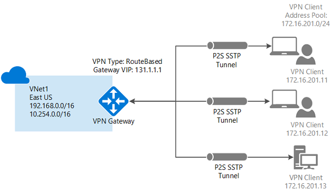
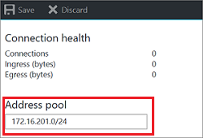
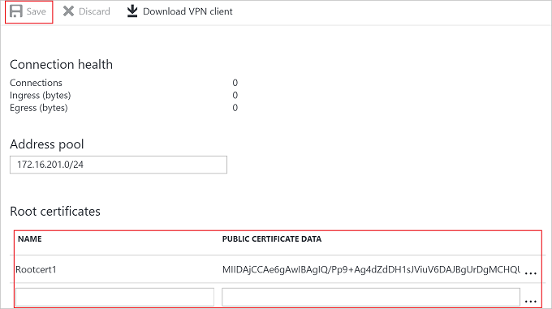
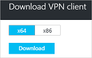

<properties
    pageTitle="使用点到站点将计算机连接到 Azure 虚拟网络：门户 | Azure"
    description="使用 Resource Manager 和 Azure 门户预览创建点到站点 VPN 网关连接，安全连接到 Azure 虚拟网络。"
    services="vpn-gateway"
    documentationcenter="na"
    author="cherylmc"
    manager="timlt"
    editor=""
    tags="azure-resource-manager" />
<tags
    ms.assetid="a15ad327-e236-461f-a18e-6dbedbf74943"
    ms.service="vpn-gateway"
    ms.devlang="na"
    ms.topic="hero-article"
    ms.tgt_pltfrm="na"
    ms.workload="infrastructure-services"
    ms.date="04/10/2017"
    wacn.date="05/22/2017"
    ms.author="cherylmc"
    ms.translationtype="Human Translation"
    ms.sourcegitcommit="8fd60f0e1095add1bff99de28a0b65a8662ce661"
    ms.openlocfilehash="a5f182616a6152f1b4bee0ec5deae7e3e484eca1"
    ms.contentlocale="zh-cn"
    ms.lasthandoff="05/12/2017" />

# 使用 Azure 门户预览配置与 VNet 的点到站点连接
> [AZURE.SELECTOR]
- [Resource Manager - Azure 门户预览](/documentation/articles/vpn-gateway-howto-point-to-site-resource-manager-portal/)
- [Resource Manager - PowerShell](/documentation/articles/vpn-gateway-howto-point-to-site-rm-ps/)
- [经典 - Azure 门户预览](/documentation/articles/vpn-gateway-howto-point-to-site-classic-azure-portal/)

使用点到站点 (P2S) 配置可以创建从单个客户端计算机到虚拟网络的安全连接。 P2S 是基于 SSTP（安全套接字隧道协议）的 VPN 连接。 如果要从远程位置（例如，从家里或会议室）连接到 VNet，或者只有少数几台客户端计算机需要连接到虚拟网络，点到站点连接将非常有用。 P2S 连接不需要 VPN 设备或面向公众的 IP 地址。 可从客户端计算机建立 VPN 连接。

本文逐步讲解如何使用 Azure 门户预览创建具有点到站点连接的 VNet。 有关点到站点连接的详细信息，请参阅本文末尾的 [点到站点常见问题解答](#faq) 。

### P2S 连接的部署模型和方法
[AZURE.INCLUDE [deployment models](../../includes/vpn-gateway-deployment-models-include.md)]

下表显示了 P2S 配置的两种部署模型和可用的部署方法。 当有配置步骤相关的文章发布时，我们会直接从此表格链接到该文章。

[AZURE.INCLUDE [vpn-gateway-clasic-rm](../../includes/vpn-gateway-table-point-to-site-include.md)]

## 基本工作流

### 示例值
* **名称：VNet1**
* **地址空间：192.168.0.0/16** 对于此示例，我们只使用一个地址空间。 对于 VNet，可以有多个地址空间。
* **子网名称：FrontEnd**
* **子网地址范围：192.168.1.0/24**
* **订阅：** 如果你有多个订阅，请确保使用正确的订阅。
* **资源组：TestRG**
* **位置：中国东部**
* **网关子网：192.168.200.0/24**
* **虚拟网络网关名称：VNet1GW**
* **网关类型：VPN**
* **VPN 类型：基于路由**
* **公共 IP 地址：VNet1GWpip**
* **连接类型：点到站点**
* **客户端地址池：172.16.201.0/24** 使用此点到站点连接连接到 VNet 的 VPN 客户端接收来自客户端地址池的 IP 地址。

## 第 1 部分 - 创建虚拟网络
开始之前，请确保你拥有 Azure 订阅。 如果还没有 Azure 订阅，可以注册一个[试用帐户](/pricing/1rmb-trial)。 如果正在练习创建此配置，可以参考[示例值](#example)。

[AZURE.INCLUDE [vpn-gateway-basic-vnet-rm-portal](../../includes/vpn-gateway-basic-vnet-rm-portal-include.md)]

## 第 2 部分 - 指定地址空间和子网
可以将其他地址空间和子网添加到已创建的 VNet。

[AZURE.INCLUDE [vpn-gateway-additional-address-space](../../includes/vpn-gateway-additional-address-space-include.md)]

## 第 3 部分 - 添加网关子网

将虚拟网络连接到网关之前，必须先创建要连接的虚拟网络的网关子网。 网关服务使用网关子网中指定的 IP 地址。 如果可能，请使用 CIDR 块 /28 或 /27 创建网关子网，以便提供足够的 IP 地址，满足将来的其他配置要求。

本部分中的屏幕截图作为参考示例提供。 请确保使用与配置的所需值对应的网关子网地址范围。

###创建网关子网

[AZURE.INCLUDE [vpn-gateway-add-gwsubnet-rm-portal](../../includes/vpn-gateway-add-gwsubnet-rm-portal-include.md)]

## 第 4 部分 - 指定 DNS 服务器（可选）

点到站点连接不需要 DNS。 但是，如果希望对部署到虚拟网络的资源进行名称解析，则应指定 DNS 服务器。 可以通过此设置指定 DNS 服务器，以便将其用于此虚拟网络的名称解析。 此设置不创建 DNS 服务器。

[AZURE.INCLUDE [vpn-gateway-add-dns-rm-portal](../../includes/vpn-gateway-add-dns-rm-portal-include.md)]

## 第 5 部分 - 创建虚拟网络网关
点到站点连接需要以下设置：

* 网关类型：VPN
* VPN 类型：基于路由

### 创建虚拟网络网关
[AZURE.INCLUDE [vpn-gateway-add-gw-rm-portal](../../includes/vpn-gateway-add-gw-rm-portal-include.md)]

## 第 6 部分 - 生成证书

Azure 使用证书对点到站点 VPN 的 VPN 客户端进行身份验证。 创建根证书以后，请将公共证书数据（不是密钥）作为 Base-64 编码的 X.509 .cer 文件导出。 然后，将公共证书数据从根证书上传到 Azure。

在使用点到站点连接连接到 VNet 的每台客户端计算机上，必须安装客户端证书。 客户端证书从根证书生成，安装在每个客户端计算机上。 如果未安装有效的客户端证书，而客户端尝试连接到 VNet，则身份验证会失败。

### 步骤 1 - 获取根证书的 .cer 文件

#### 企业证书

如果要使用企业级解决方案，可以使用现有的证书链。 获取要使用的根证书的 .cer 文件。

#### 自签名根证书

如果使用的不是企业证书解决方案，则需要创建自签名根证书。 若要创建包含进行 P2S 身份验证所需的字段的自签名根证书，可以使用 PowerShell。 [使用 PowerShell 为点到站点连接创建自签名的根证书](/documentation/articles/vpn-gateway-certificates-point-to-site/)将引导用户完成相关步骤，以便创建自签名的根证书。

> [AZURE.NOTE]
> 以前，为点到站点连接创建自签名根证书和生成客户端证书的建议方法是使用 makecert。 现在，也可以使用 PowerShell 来创建这些证书。 使用 PowerShell 的优势之一是能够创建 SHA-2 证书。 请参阅[使用 PowerShell 为点到站点连接创建自签名根证书](/documentation/articles/vpn-gateway-certificates-point-to-site/)，了解所需的值。
>
>

#### 导出自签名根证书的公钥

点到站点连接要求将公钥 (.cer) 上传到 Azure。 以下步骤帮助你导出自签名根证书的 .cer 文件。

1. 若要获取证书 .cer 文件，请打开“管理用户证书”。
2. 找到“Certificates - Current User\Personal\Certificates”中的“P2SRootCert”自签名根证书，然后右键单击。 单击“所有任务”，然后单击“导出”打开“证书导出向导”。
3. 在向导中，单击“下一步”。 选择“否，不导出私钥”，然后单击“下一步”。
4. 在“导出文件格式”页上，选择“Base-64 编码的 X.509 (.CER)”，然后单击“下一步”。 
5. 在“要导出的文件”页上，浏览到“C:”，然后创建名为“cert”的子目录并将其选中。 将证书文件命名为“P2SRootCert.cer”，然后单击“保存”。 
6. 单击“下一步”，然后单击“完成”导出证书。 此时会显示“导出成功”。 单击“确定”关闭向导。

### 步骤 2 - 生成客户端证书
可以为每个客户端生成唯一证书，也可以在多个客户端上使用同一证书。 生成唯一客户端证书的优势是能够吊销单个证书。 否则，如果每个人都使用相同的客户端证书，则在需要撤销它时，必须为所有使用该证书进行身份验证的客户端生成并安装新证书。

#### 企业证书
- 如果使用的是企业证书解决方案，请使用通用名称值格式“name@yourdomain.com”生成客户端证书，而不要使用“域名\用户名”格式。
- 请确保客户端证书基于“用户”证书模板，该模板使用“客户端身份验证”（而不是“智能卡登录”等）作为使用列表中的第一项。可以通过双击客户端证书，然后查看“详细信息”>“增强型密钥用法”来检查证书。

#### 自签名根证书 
如果使用的是自签名根证书，请参阅[使用 PowerShell 生成客户端证书](/documentation/articles/vpn-gateway-certificates-point-to-site/#clientcert)，了解生成与点到站点连接兼容的客户端证书的步骤。

### 步骤 3 - 导出客户端证书
如果你根据 [PowerShell](/documentation/articles/vpn-gateway-certificates-point-to-site/#clientcert) 说明从自签名根证书生成了客户端证书，该证书会自动安装在用于生成该证书的计算机上。 如果想要在另一台客户端计算机上安装客户端证书，则需导出该证书。

1. 若要导出客户端证书，请打开“管理用户证书”。 右键单击要导出的客户端证书，单击“所有任务”，然后单击“导出”打开“证书导出向导”。
2. 在向导中，单击“**下一步**”，选择“**是，导出私钥**”，然后单击“**下一步**”。
3. 在“导出文件格式”页上，保留选择默认值。 请确保选中“包括证书路径中的所有证书(如果可能)”，以便将所需根证书信息也导出。 然后单击“下一步”。
4. 在“**安全性**”页上，必须保护私钥。 如果选择使用密码，请务必记下或牢记为此证书设置的密码。 然后单击“下一步”。
5. 在“要导出的文件”中，“浏览”到要将证书导出的目标位置。 在“文件名”中，为证书文件命名。 然后单击“下一步”。
6. 单击“完成”导出证书。   

## 第 7 部分 - 添加客户端地址池
1. 一旦创建虚拟网络网关后，请导航到“虚拟网络网关”边栏选项卡的“设置”部分。 在“设置”部分中，单击“点到站点配置”可打开“配置”边栏选项卡。

    
2. **地址池**是 IP 地址池，连接的客户端从该池接收 IP 地址。 添加地址池，然后单击“保存”。

    

## 第 8 部分 - 上传根证书 .cer 文件
创建网关后，可以将受信任根证书的 .cer 文件上传到 Azure。 最多可以上传 20 个根证书的文件。 不要将根证书的私钥上传到 Azure。 上传 .Cer 文件后，Azure 将使用它来对连接到虚拟网络的客户端进行身份验证。

1. 证书已添加到“根证书”部分中的“点到站点配置”边栏选项卡上。  
2. 请确保已导出了格式为 Base-64 编码的 X.509 (.cer) 文件的根证书。 需要以这种格式导出证书，以便使用文本编辑器打开该证书。
3. 使用记事本之类的文本编辑器打开该证书。 仅将以下部分复制为一个连续行：

    

    > [AZURE.NOTE]
    > 复制证书数据时，请确保将文本复制为一个无回车符或换行符的连续行。 可能需要在文本编辑器中将视图修改为“显示符号/显示所有字符”以查看回车符和换行符。                                                                                                                                                                            
    >
    >

4. 将证书数据粘贴到“公共证书数据”字段中。 “命名”该证书，然后单击“保存”。 最多可以添加 20 个受信任的根证书。

    

## 第 9 部分 - 下载并安装 VPN 客户端配置包
使用 P2S 连接到 Azure 的客户端必须安装客户端证书和 VPN 客户端配置包。 Windows 客户端有可用的 VPN 客户端配置包。 

VPN 客户端包中包含用于配置 Windows 内置 VPN 客户端软件的信息。 配置特定于要连接到的 VPN。 该程序包不安装额外的软件。

只要版本与客户端的体系结构匹配，就可以在每台客户端计算机上使用相同的 VPN 客户端配置包。

### 步骤 1 - 下载客户端配置包

1. 在“点到站点配置”边栏选项卡上，单击“下载 VPN 客户端”可打开“下载 VPN 客户端”边栏选项卡。 生成包需要一到两分钟。

    
2. 为客户端选择正确的包，然后单击“下载”。 保存配置包文件。 将 VPN 客户端配置包安装在每台连接到虚拟网络的客户端计算机上。

    

### 步骤 2 - 安装客户端配置包

1. 将配置文件通过本地方式复制到要连接到虚拟网络的计算机上。 
2. 双击 .exe 文件，在客户端计算机上安装包。 配置包是你创建的，因此未签名，并可能会显示警告。 如果显示 Windows SmartScreen 弹出窗口，请单击“更多信息”（左侧），然后单击“仍要运行”以安装该包。
3. 将该包安装在客户端计算机上。 如果显示 Windows SmartScreen 弹出窗口，请单击“更多信息”（左侧），然后单击“仍要运行”以安装该包。
4. 在客户端计算机上，导航到“网络设置”，然后单击“VPN”。 VPN 连接显示所连接到的虚拟网络的名称。

## 第 10 部分 - 安装已导出的客户端证书

如果想要从另一台客户端计算机（而不是用于生成客户端证书的计算机）创建 P2S 连接，需要安装客户端证书。 安装客户端证书时，需要使用导出客户端证书时创建的密码。

1. 找到 *.pfx* 文件并将其复制到客户端计算机。 在客户端计算机上，双击 *.pfx* 文件以进行安装。 将“存储位置”保留为“当前用户”，然后单击“下一步”。
2. 在“要导入的**文件**”页上，不要进行任何更改。 单机“下一步”
3. 在“私钥保护”页上，输入证书的密码，或验证安全主体是否正确，然后单击“下一步”。
4. 在“**证书存储**”页上，保留默认位置，然后单击“**下一步**”。
5. 单击“**完成**”。 在证书安装的“**安全警告**”上，单击“**是**”。 可随时单击“是”，因为证书已生成。 现已成功导入证书。

## 第 11 部分 - 连接到 Azure

 1. 若要连接到 VNet，请在客户端计算机上导航到 VPN 连接，找到创建的 VPN 连接。 其名称与虚拟网络的名称相同。 单击“连接”。 可能会出现与使用证书相关的弹出消息。 单击“继续”使用提升的权限。

2. 在“连接”状态页上，单击“连接”以启动连接。 如果看到“选择证书”屏幕，请确保所显示的客户端证书是要用来连接的证书。 如果不是，请使用下拉箭头选择正确的证书，然后单击“确定”。

    
3. 连接已建立。

    

如果连接时遇到问题，请检查以下项：

- 打开“管理用户证书”，然后导航到“受信任的根证书颁发机构\证书”。 验证根证书是否已列出。 若要进行身份验证，根证书必须存在。 使用默认值“包括证书路径中的所有证书(如果可能)”导出客户端证书 .pfx 时，根证书信息也会导出。 安装客户端证书时，根证书也会安装在客户端计算机上。 

- 如果使用的是通过企业 CA 解决方案颁发的证书，并且无法进行身份验证，请检查客户端证书上的身份验证顺序。 可以通过双击客户端证书，并转到“详细信息”>“增强型密钥用法”来检查身份验证列表顺序。 请确保此列表显示的第一项是“客户端身份验证”。 如果不是，则需要基于将“客户端身份验证”作为列表中第一项的用户模板颁发客户端证书。

## 第 12 部分 - 验证连接
1. 若要验证你的 VPN 连接是否处于活动状态，请打开提升的命令提示符，然后运行 *ipconfig/all*。
2. 查看结果。 请注意，你收到的 IP 地址是在配置中指定的点到站点 VPN 客户端地址池中的地址之一。 结果与以下示例类似：

        PPP adapter VNet1:
            Connection-specific DNS Suffix .:
            Description.....................: VNet1
            Physical Address................:
            DHCP Enabled....................: No
            Autoconfiguration Enabled.......: Yes
            IPv4 Address....................: 172.16.201.3(Preferred)
            Subnet Mask.....................: 255.255.255.255
            Default Gateway.................:
            NetBIOS over Tcpip..............: Enabled

如果你在通过 P2S 连接到虚拟机时出现问题，请使用“ipconfig”检查分配给以太网适配器的 IPv4 地址，该适配器所在的计算机正是你要从其进行连接的计算机。 如果该 IP 地址位于你要连接到的 VNet 的地址范围内，或者位于 VPNClientAddressPool 的地址范围内，则称为地址空间重叠。 当地址空间以这种方式重叠时，网络流量不会抵达 Azure，而是呆在本地网络中。 如果网络地址空间不重叠，但你仍然无法连接到 VM，请参阅[排查通过远程桌面连接到 VM 时的问题](/documentation/articles/virtual-machines-windows-troubleshoot-rdp-connection/)。

## 添加或删除受信任的根证书
可以在 Azure 中添加和删除受信任的根证书。 删除受信任的根证书后，从该根证书生成的客户端证书将无法通过点到站点配置连接到 Azure。 如果希望客户端进行连接，则需安装新客户端证书，该证书是从 Azure 中受信任的证书生成的。

### 添加受信任的根证书

最多可以将 20 个受信任的根证书 .cer 文件添加到 Azure。 有关说明，请参阅本文的[上传受信任的根证书](#uploadfile)部分。

### 删除受信任的根证书

1. 若要删除受信任的根证书，请导航到虚拟网关的“点到站点配置”边栏选项卡。
2. 在边栏选项卡的“根证书”部分，找到要删除的证书。
3. 单击证书旁的省略号，然后单击“删除”。

## 吊销客户端证书
你可以吊销客户端证书。 证书吊销列表可让你选择性地拒绝基于单个客户端证书的点到站点连接。 这不同于删除受信任的根证书。 如果从 Azure 中删除受信任的根证书 .cer，它会吊销由吊销的根证书生成/签名的所有客户端证书的访问权限。 如果吊销客户端证书而非根证书，则可继续使用从根证书生成的其他证书进行身份验证。

常见的做法是使用根证书管理团队或组织级别的访问权限，然后使用吊销的客户端证书针对单个用户进行精细的访问控制。

### 吊销客户端证书

可以通过将指纹添加到吊销列表来吊销客户端证书。

1. 检索客户端证书指纹。 有关详细信息，请参阅[如何检索证书的指纹](https://msdn.microsoft.com/zh-cn/library/ms734695.aspx)。
2. 将信息复制到一个文本编辑器，删除所有空格，使之成为一个连续的字符串。
3. 导航到虚拟网关的“点到站点配置”边栏选项卡。 此边栏选项卡正是你用来[上载受信任的根证书](#uploadfile)的边栏选项卡。
4. 在“吊销的证书”部分，输入证书的友好名称（不必是证书 CN）。
5. 将指纹字符串复制并粘贴到“指纹”字段。
6. 指纹将进行验证，并将自动添加到吊销列表。 屏幕上会显示一条消息，指出列表正在进行更新。 
7. 更新完成后，不再可以使用证书来连接。 客户端在尝试使用此证书进行连接时，会收到一条消息，指出证书不再有效。

## 点到站点常见问题解答

[AZURE.INCLUDE [Point-to-Site FAQ](../../includes/vpn-gateway-point-to-site-faq-include.md)]

## 后续步骤
连接完成后，即可将虚拟机添加到虚拟网络。 有关详细信息，请参阅[虚拟机](/documentation/services/virtual-machines/)。 若要详细了解网络和虚拟机，请参阅 [Azure 和 Linux VM 网络概述](/documentation/articles/virtual-machines-linux-azure-vm-network-overview/)。

<!--Update_Description: wording update-->