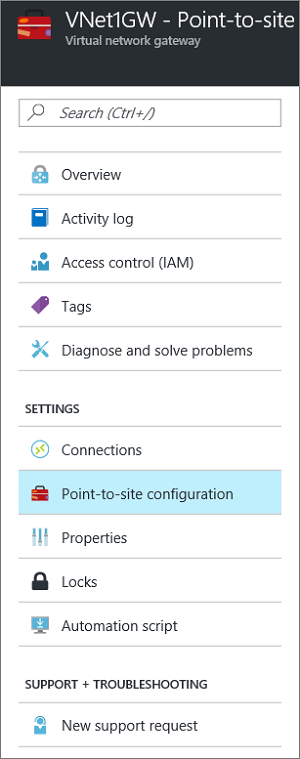
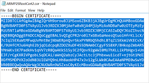

<!-- need to verified -->

<properties
    pageTitle="使用 Resource Manager 部署模型和 Azure 门户预览配置与虚拟网络的点到站点 VPN 网关连接 | Azure"
    description="使用 Resource Manager 和 Azure 门户预览创建点到站点 VPN 网关连接，安全连接到 Azure 虚拟网络。"
    services="vpn-gateway"
    documentationcenter="na"
    author="cherylmc"
    manager="carmonm"
    editor=""
    tags="azure-resource-manager" />
<tags 
    ms.assetid="a15ad327-e236-461f-a18e-6dbedbf74943"
    ms.service="vpn-gateway"
    ms.devlang="na"
    ms.topic="hero-article"
    ms.tgt_pltfrm="na"
    ms.workload="infrastructure-services"
    ms.date="10/17/2016"
    wacn.date="12/26/2016"
    ms.author="cherylmc" />

# 使用 Azure 门户预览配置与 VNet 的点到站点连接
> [AZURE.SELECTOR]
- [Resource Manager - Azure 门户预览](/documentation/articles/vpn-gateway-howto-point-to-site-resource-manager-portal/)
- [Resource Manager - PowerShell](/documentation/articles/vpn-gateway-howto-point-to-site-rm-ps/)
- [经典 - Azure 门户预览](/documentation/articles/vpn-gateway-howto-point-to-site-classic-azure-portal/)

通过点到站点 (P2S) 配置，可以创建单台客户端计算机到虚拟网络的安全连接。如果要从远程位置（例如从家里或会议室）连接到 VNet，或者只有少数几个需要连接到虚拟网络的客户端，则 P2S 连接会很有用。

点到站点连接不需要 VPN 设备或面向公众的 IP 地址即可运行。可通过从客户端计算机启动连接来建立 VPN 连接。有关点到站点连接的详细信息，请参阅 [VPN Gateway FAQ](/documentation/articles/vpn-gateway-vpn-faq/#point-to-site-connections)（VPN 网关常见问题）及 [Planning and Design](/documentation/articles/vpn-gateway-plan-design/)（规划和设计）。

本文逐步讲解如何使用 Azure 门户预览，在 Resource Manager 部署模型中创建具有点到站点连接的 VNet。

### P2S 连接的部署模型和方法
[AZURE.INCLUDE [部署模型](../../includes/vpn-gateway-deployment-models-include.md)]

下表显示了 P2S 配置的两种部署模型和可用的部署方法。当有配置步骤相关的文章发布时，我们会直接从此表格链接到该文章。

[AZURE.INCLUDE [vpn-gateway-clasic-rm](../../includes/vpn-gateway-table-point-to-site-include.md)]

## 基本工作流
  

### 示例值
* **名称：VNet1**
* **地址空间：192.168.0.0/16** 对于此示例，我们只使用一个地址空间。对于 VNet，可以有多个地址空间。
* **子网名称：FrontEnd**
* **子网地址范围：192.168.1.0/24**
* **订阅：**如果你有多个订阅，请确保使用正确的订阅。
* **资源组：TestRG**
* **位置：中国东部**
* **网关子网：192.168.200.0/24**
* **虚拟网络网关名称：VNet1GW**
* **网关类型：VPN**
* **VPN 类型：基于路由**
* **公共 IP 地址：VNet1GWpip**
* **连接类型：点到站点**
* **客户端地址池：172.16.201.0/24** 使用此点到站点连接连接到 VNet 的 VPN 客户端接收来自客户端地址池的 IP 地址。

## 开始之前
* 确保你拥有 Azure 订阅。如果你还没有 Azure 订阅，可以注册获取[1元帐户](/pricing/1rmb-trial)。

## 第 1 部分 - 创建虚拟网络
如果要练习创建此配置，可以引用[示例值](#example)。

[AZURE.INCLUDE [vpn-gateway-basic-vnet-rm-portal](../../includes/vpn-gateway-basic-vnet-rm-portal-include.md)]

### 2\.添加其他地址空间和子网
可以将其他地址空间和子网添加到已创建的 VNet。

[AZURE.INCLUDE [vpn-gateway-additional-address-space](../../includes/vpn-gateway-additional-address-space-include.md)]

### 3\.创建网关子网
将虚拟网络连接到网关之前，必须先创建要连接的虚拟网络的网关子网。在可能的情况下，最好是使用 CIDR 块 /28 或 /27 创建网关子网，以便提供足够的 IP 地址，满足将来的其他配置要求。

本部分中的屏幕截图作为参考示例提供。请确保使用与配置的所需值对应的网关子网地址范围。

**创建网关子网**

[AZURE.INCLUDE [vpn-gateway-add-gwsubnet-rm-portal](../../includes/vpn-gateway-add-gwsubnet-rm-portal-include.md)]

### 4.指定 DNS 服务器（可选）
[AZURE.INCLUDE [vpn-gateway-add-dns-rm-portal](../../includes/vpn-gateway-add-dns-rm-portal-include.md)]

## 第 2 部分 - 创建虚拟网络网关
点到站点连接需要以下设置：

* 网关类型：VPN
* VPN 类型：基于路由

### 创建虚拟网络网关
[AZURE.INCLUDE [vpn-gateway-add-gw-rm-portal](../../includes/vpn-gateway-add-gw-rm-portal-include.md)]

## 第 3 部分 - 生成证书
Azure 使用证书对点到站点 VPN 的 VPN 客户端进行身份验证。从企业证书解决方案生成的根证书或自签名根证书将公共证书数据（不是私钥）导出为 Base-64 编码 X.509 .cer 文件。然后从根证书将公共证书数据导入到 Azure。此外，需要从客户端的根证书生成客户端证书。每个要使用 P2S 连接连接到虚拟网络的客户端都必须已安装从根证书生成的客户端证书。

### 1.获取根证书的 .cer 文件
如果使用的是企业解决方案，可以使用现有的证书链。如果使用的不是企业 CA 解决方案，可以创建自签名根证书。创建自签名证书的方法之一是使用 Makecert。

* 如果使用企业证书系统，请获取要使用的根证书的 .cer 文件。
* 如果使用的不是企业证书解决方案，则需要生成自签名根证书。有关适用于 Windows 10 的步骤，请参阅 [Working with self-signed root certificates for Point-to-Site configurations](/documentation/articles/vpn-gateway-certificates-point-to-site/)（为点到站点配置使用自签名根证书）。

1. 若要从证书中获取 .cer 文件，请打开 **certmgr.msc** 并找到根证书。右键单击自签名根证书，单击“所有任务”，然后单击“导出”。此操作将打开“证书导出向导”。
2. 在向导中，单击“下一步”，选择“否，不导出私钥”，然后单击“下一步”。
3. 在“导出文件格式”页上，选择“Base-64 编码的 X.509 (.CER)”。 然后，单击“下一步”。
4. 在“要导出的文件”中，单击“浏览”并选择要导出证书的位置。在“文件名”中，为证书文件命名。然后单击“下一步”。
5. 单击“完成”以导出证书。

### 2.生成客户端证书
可以为每个要连接的客户端生成唯一证书，也可以在多个客户端上使用相同的证书。生成唯一客户端证书的优势是能够根据需要吊销单个证书。否则，如果每个人都使用相同的客户端证书，在需要吊销某个客户端的证书时，必须为所有使用该证书进行身份验证的客户端生成并安装新证书。

* 如果使用的是企业证书解决方案，请使用通用名称值格式“name@yourdomain.com”生成客户端证书，而不要使用“域名\\用户名”格式。
* 如果使用自签名的证书解决方案，请参阅 [Working with self-signed root certificates for Point-to-Site configurations](/documentation/articles/vpn-gateway-certificates-point-to-site/)（为点到站点配置使用自签名根证书）生成客户端证书。

### 3.导出客户端证书
身份验证时需要客户端证书。生成客户端证书后，将其导出。导出的客户端证书稍后将安装在每台客户端计算机上。

1. 若要导出客户端证书，可以使用 *certmgr.msc*。右键单击要导出的客户端证书，单击“所有任务”，然后单击“导出”。
2. 导出包含私钥的客户端证书。这是一个 *.pfx* 文件。请确保记录或记住为此证书设置的密码（密钥）。

## 第 4 部分 - 添加客户端地址池
1. 创建虚拟网络网关后，导航到虚拟网络网关边栏选项卡的“设置”部分。在“设置”部分中，单击“点到站点配置”，打开“配置”边栏选项卡。
   
      

2. **地址池**是连接的客户端将从中接收 IP 地址的 IP 地址池。添加地址池，然后单击“保存”。
   
      

## 第 5 部分 - 上载根证书 .cer 文件
创建网关后，可以将受信任根证书的 .cer 文件上载到 Azure。最多可以上载 20 个根证书的文件。不要将根证书的私钥上载到 Azure。上载 .Cer 文件后，Azure 将使用它来对连接到虚拟网络的客户端进行身份验证。

1. 导航到“点到站点配置”边栏选项卡。将在此边栏选项卡的“根证书”部分添加 .cer 文件。
   
      

2. 请确保将根证书导出为 Base-64 编码的 X.509 (.cer) 文件。需要以这种格式导出根证书，以便可以使用文本编辑器打开该证书。
3. 使用记事本等文本编辑器中打开该证书。只复制以下部分：
   
      

4. 将证书数据粘贴到门户的“公共证书数据”部分。在“名称”空间中输入证书的名称，然后单击“保存”。最多可以添加 20 个受信任的根证书。
   
      

## 第 6 部分 - 下载并安装 VPN 客户端配置程序包
使用 P2S 连接到 Azure 的客户端必须安装客户端证书和 VPN 客户端配置包。Windows 客户端有可用的 VPN 客户端配置包。

VPN 客户端包中包含用于配置 Windows 内置 VPN 客户端软件的信息。配置特定于要连接到的 VPN。该程序包不安装额外的软件。有关详细信息，请参阅 [VPN Gateway FAQ](/documentation/articles/vpn-gateway-vpn-faq/#point-to-site-connections)（VPN 网关常见问题）。

1. 在“点到站点配置”边栏选项卡上，单击“下载 VPN 客户端”，打开“下载 VPN 客户端”边栏选项卡。
   
      

2. 为客户端选择正确的程序包，然后单击“下载”。对于 64 位客户端，选择“AMD64”。对于 32 位客户端，选择“x86”。
3. 在客户端计算机上安装该包。如果显示 SmartScreen 弹出窗口，请单击“更多信息”，然后单击“仍要运行”以安装该包。
4. 在客户端计算机上，导航到“网络设置”，然后单击“VPN”。此时将会列出连接。其中显示了要连接到的虚拟网络的名称，如以下示例所示：
   
      

## 第 7 部分 - 安装客户端证书
每个客户端计算机必须有一个客户端证书才能执行身份验证。安装客户端证书时，需要使用导出客户端证书时创建的密码。

1. 将 .pfx 文件复制到客户端计算机。
2. 双击 .pfx 文件将它安装。请勿修改安装位置。

## 第 8 部分 - 连接到 Azure
1. 若要连接到 VNet，请在客户端计算机上导航到 VPN 连接，找到创建的 VPN 连接。其名称与虚拟网络的名称相同。单击“连接”。可能会出现与使用证书相关的弹出消息。如果出现此消息，请单击“继续”以使用提升的权限。
2. 在“连接”状态页上，单击“连接”开始连接。如果你看到“选择证书”屏幕，请确保所显示的客户端证书就是你要用来连接的证书。如果不是，请使用下拉箭头选择正确的证书，然后单击“确定”。
   
      

3. 现在应已建立连接。
   
      

## 第 9 部分 - 验证连接
1. 若要验证你的 VPN 连接是否处于活动状态，请打开提升的命令提示符，然后运行 *ipconfig/all*。
2. 查看结果。请注意，你收到的 IP 地址是在配置中指定的点到站点 VPN 客户端地址池中的地址之一。结果应大致如下所示：
   
        PPP adapter VNet1:
            Connection-specific DNS Suffix .:
            Description.....................: VNet1
            Physical Address................:
            DHCP Enabled....................: No
            Autoconfiguration Enabled.......: Yes
            IPv4 Address....................: 172.16.201.3(Preferred)
            Subnet Mask.....................: 255.255.255.255
            Default Gateway.................:
            NetBIOS over Tcpip..............: Enabled

## 添加或删除受信任的根证书
可以从 Azure 中删除受信任的根证书。删除受信任的证书时，从根证书生成的客户端证书不再能够通过点到站点连接到 Azure。如果希望客户端能够连接，需要在客户端上安装新客户端证书，这些证书是从 Azure 信任的证书生成的。

可以在“点到站点配置”边栏选项卡上管理已吊销客户端证书的列表。此边栏选项卡用于[上载受信任的根证书](#uploadfile)。

## 管理已吊销客户端证书的列表
你可以吊销客户端证书。证书吊销列表可让你选择性地拒绝基于单个客户端证书的点到站点连接。如果从 Azure 中删除根证书 .cer，将吊销所有由吊销的根证书生成/签名的客户端证书的访问权限。如果需要，也可以吊销特定的客户端证书而不是根证书。这样，从根证书生成的证书仍然有效。

常见的做法是使用根证书管理团队或组织级别的访问权限，然后使用吊销的客户端证书针对单个用户进行精细的访问控制。

可以在“点到站点配置”边栏选项卡上管理已吊销客户端证书的列表。此边栏选项卡用于[上载受信任的根证书](#uploadfile)。

## 后续步骤
连接完成后，即可将虚拟机添加到虚拟网络。有关详细信息，请参阅[虚拟机](https://docs.microsoft.com/azure/#pivot=services&panel=Compute)。

<!---HONumber=Mooncake_1219_2016-->