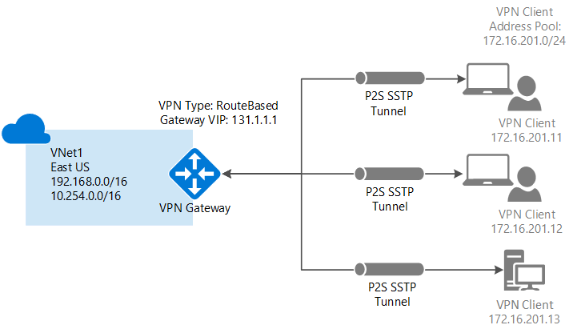

<properties
    pageTitle="使用点到站点将计算机连接到 Azure 虚拟网络：PowerShell | Azure"
    description="通过创建点到站点 VPN 网关连接将计算机安全地连接到 Azure 虚拟网络。"
    services="vpn-gateway"
    documentationcenter="na"
    author="cherylmc"
    manager="timlt"
    editor=""
    tags="azure-resource-manager" />
<tags
    ms.assetid="3eddadf6-2e96-48c4-87c6-52a146faeec6"
    ms.service="vpn-gateway"
    ms.devlang="na"
    ms.topic="hero-article"
    ms.tgt_pltfrm="na"
    ms.workload="infrastructure-services"
    ms.date="05/03/2017"
    wacn.date="05/31/2017"
    ms.author="cherylmc"
    ms.translationtype="Human Translation"
    ms.sourcegitcommit="4a18b6116e37e365e2d4c4e2d144d7588310292e"
    ms.openlocfilehash="d2a6c0bbc22915d030267ac619241cc368721705"
    ms.contentlocale="zh-cn"
    ms.lasthandoff="05/19/2017" />

# 使用 PowerShell 配置与 VNet 的点到站点连接

本文介绍如何在 Resource Manager 部署模型中使用 PowerShell 通过点到站点连接来创建 VNet。 也可使用不同的部署工具或部署模型创建此配置，方法是从以下列表中选择另一选项：
> [AZURE.SELECTOR]
- [Resource Manager - Azure 门户](/documentation/articles/vpn-gateway-howto-point-to-site-resource-manager-portal/)
- [Resource Manager - PowerShell](/documentation/articles/vpn-gateway-howto-point-to-site-rm-ps/)
- [经典 - Azure 门户](/documentation/articles/vpn-gateway-howto-point-to-site-classic-azure-portal/)

使用点到站点 (P2S) 配置可以创建从单个客户端计算机到虚拟网络的安全连接。 P2S 是基于 SSTP（安全套接字隧道协议）的 VPN 连接。 如果要从远程位置（例如，从家里或会议室）连接到 VNet，或者只有少数几台客户端计算机需要连接到虚拟网络，点到站点连接将非常有用。 P2S 连接不需要 VPN 设备或面向公众的 IP 地址。 可从客户端计算机建立 VPN 连接。

P2S 连接有以下要求：

* RouteBased VPN 网关。
* 根证书的公钥（.cer 文件），已上传到 Azure。 此证书被视为可信证书，用于身份验证。
* 从根证书生成的客户端证书，安装在每个要连接的客户端计算机上。 此证书用于客户端身份验证。
* 必须生成 VPN 客户端配置包，并将其安装在每个进行连接的客户端计算机上。 客户端配置包为操作系统上已有的本机 VPN 客户端配置连接到 VNet 所需的信息。

有关点到站点连接的详细信息，请参阅本文末尾的 [点到站点常见问题解答](#faq) 。

## 开始之前

* 确保拥有 Azure 订阅。 如果你还没有 Azure 订阅，可以注册获取[免费帐户](/pricing/1rmb-trial)。
* 安装最新版本的 Azure Resource Manager PowerShell cmdlet。 有关安装 PowerShell cmdlet 的详细信息，请参阅[如何安装和配置 Azure PowerShell](https://docs.microsoft.com/zh-cn/powershell/azure/overview)。

### 示例值

可使用示例值创建测试环境，或参考这些值以更好地理解本文中的示例。 在本文的第 [1](#declare) 部分设置变量。 可以使用这些步骤作为演练并按原样使用这些值，或者根据环境更改这些值。 

* **名称：VNet1**
* **地址空间：192.168.0.0/16** 和 **10.254.0.0/16** 本示例中使用了多个地址空间，说明此配置可与多个地址空间一起使用。 但是，对于此配置，多个地址空间并不必要。
* **子网名称：FrontEnd**
    * **子网地址范围：192.168.1.0/24**
* **子网名称：BackEnd**
    * **子网地址范围：10.254.1.0/24**
* **子网名称：GatewaySubnet** 要使 VPN 网关正常工作，必须使用子网名称 GatewaySubnet。
  * **GatewaySubnet 地址范围：192.168.200.0/24** 
* **VPN 客户端地址池：172.16.201.0/24** 使用此点到站点连接连接到 VNet 的 VPN 客户端接收来自 VPN 客户端地址池的 IP 地址。
* **订阅：** 如果你有多个订阅，请确保使用正确的订阅。
* **资源组：TestRG**
* **位置：中国东部**
* **DNS 服务器：要用于名称解析的 DNS 服务器的 IP 地址** 。
* **网关名称：Vnet1GW**
* **公共 IP 名称：VNet1GWPIP**
* **VpnType：RouteBased** 

## 1 - 登录并设置变量

在本部分，可以登录并声明用于此配置的值。 声明的值将在示例脚本中使用。 根据自己的环境更改值。 也可以使用声明的值完成这些步骤作为练习。

1. 使用提升的权限打开 PowerShell 控制台，然后登录到 Azure 帐户。 该 cmdlet 将提示你提供登录凭据。 登录后它会下载你的帐户设置，以便这些信息可供 Azure PowerShell 使用。

        Login-AzureRmAccount -EnvironmentName AzureChinaCloud

2. 获取 Azure 订阅的列表。

        Get-AzureRmSubscription

3. 指定要使用的订阅。

        Select-AzureRmSubscription -SubscriptionName "Name of subscription"

4. 声明要使用的变量。 使用以下示例，根据需要将值替换为自己的值。

        $VNetName    = "VNet1"
        $FESubName = "FrontEnd"
        $BESubName = "Backend"
        $GWSubName = "GatewaySubnet"
        $VNetPrefix1 = "192.168.0.0/16"
        $VNetPrefix2 = "10.254.0.0/16"
        $FESubPrefix = "192.168.1.0/24"
        $BESubPrefix = "10.254.1.0/24"
        $GWSubPrefix = "192.168.200.0/26"
        $VPNClientAddressPool = "172.16.201.0/24"
        $RG = "TestRG"
        $Location = "China East"
        $DNS = "8.8.8.8"
        $GWName = "VNet1GW"
        $GWIPName = "VNet1GWPIP"
        $GWIPconfName = "gwipconf"

## 2 - 配置 VNet

1. 创建资源组。

        New-AzureRmResourceGroup -Name $RG -Location $Location

2. 为虚拟网络创建子网配置，并将其命名为 FrontEnd、BackEnd 和 GatewaySubnet。 这些前缀必须是已声明的 VNet 地址空间的一部分。

        $fesub = New-AzureRmVirtualNetworkSubnetConfig -Name $FESubName -AddressPrefix $FESubPrefix
        $besub = New-AzureRmVirtualNetworkSubnetConfig -Name $BESubName -AddressPrefix $BESubPrefix
        $gwsub = New-AzureRmVirtualNetworkSubnetConfig -Name $GWSubName -AddressPrefix $GWSubPrefix

3. 创建虚拟网络。   DNS 服务器是可选的。 指定该值不会创建新的 DNS 服务器。 在随后的步骤中生成的客户端配置包将包含在本设置中指定的 DNS 服务器的 IP 地址。 如果需要在将来更新 DNS 服务器的列表，则可根据新列表生成并安装新的 VPN 客户端配置包。 指定的 DNS 服务器应该是可以解析所连接的资源名称的 DNS 服务器。 在本示例中，我们使用了公共 IP 地址。 请务必使用自己的值。

        New-AzureRmVirtualNetwork -Name $VNetName -ResourceGroupName $RG -Location $Location -AddressPrefix $VNetPrefix1,$VNetPrefix2 -Subnet $fesub, $besub, $gwsub -DnsServer $DNS

4. 为创建的虚拟网络指定变量。

        $vnet = Get-AzureRmVirtualNetwork -Name $VNetName -ResourceGroupName $RG
        $subnet = Get-AzureRmVirtualNetworkSubnetConfig -Name "GatewaySubnet" -VirtualNetwork $vnet

5. VPN 网关必须具有公共 IP 地址。 请先请求 IP 地址资源，然后在创建虚拟网关时参阅该资源。 创建 VPN 网关时，IP 地址是动态分配给资源的。 VPN 网关当前仅支持动态公共 IP 地址分配。 不能请求静态公共 IP 地址分配。 但这并不意味着 IP 地址在分配到 VPN 网关后会更改。 公共 IP 地址只在删除或重新创建网关时更改。 该地址不会因为 VPN 网关大小调整、重置或其他内部维护/升级而更改。

请求动态分配的公共 IP 地址。

        $pip = New-AzureRmPublicIpAddress -Name $GWIPName -ResourceGroupName $RG -Location $Location -AllocationMethod Dynamic
        $ipconf = New-AzureRmVirtualNetworkGatewayIpConfig -Name $GWIPconfName -Subnet $subnet -PublicIpAddress $pip

## 3 - 生成证书

Azure 使用证书对点到站点 VPN 的 VPN 客户端进行身份验证。 请将根证书的公钥信息上传到 Azure， 然后即可将该公钥视为“可信”公钥。 必须根据可信根证书生成客户端证书，然后将其安装在每个客户端计算机的 Certificates-Current User/个人证书存储中。 当客户端发起到 VNet 的连接时，使用证书对客户端进行身份验证。 有关如何生成和安装证书的详细信息，请参阅[点到站点的证书](/documentation/articles/vpn-gateway-certificates-point-to-site/)。

### 步骤 1 - 获取根证书的 .cer 文件

[AZURE.INCLUDE [vpn-gateway-basic-vnet-rm-portal](../../includes/vpn-gateway-p2s-rootcert-include.md)]

### 步骤 2 - 生成客户端证书

[AZURE.INCLUDE [vpn-gateway-basic-vnet-rm-portal](../../includes/vpn-gateway-p2s-clientcert-include.md)]

## 4 - 准备要上传的根证书 .cer 文件

准备为委托给 Azure 的根证书上传 .cer 文件（其中包含公钥信息）。 不要将根证书的私钥上传到 Azure。 上传 .cer 文件后，Azure 可以使用该文件对已安装客户端证书（根据可信根证书生成）的客户端进行身份验证。 可在以后根据需要上传更多的可信根证书文件（最多 20 个）。 在本部分，请声明根证书 .cer 文件，该文件在创建时会与 VPN 网关相关联（参见下一部分）。

1. 为证书名称声明变量，将值替换为自己的值。

        $P2SRootCertName = "P2SRootCert.cer"

2. 将文件路径替换为自己的路径，然后运行 cmdlet。

        $filePathForCert = "C:\cert\P2SRootCert.cer"
        $cert = new-object System.Security.Cryptography.X509Certificates.X509Certificate2($filePathForCert)
        $CertBase64 = [system.convert]::ToBase64String($cert.RawData)
        $p2srootcert = New-AzureRmVpnClientRootCertificate -Name $P2SRootCertName -PublicCertData $CertBase64

## 5 - 创建 VPN 网关

为 VNet 配置和创建虚拟网络网关。

* -GatewayType 必须是 **Vpn**，且 -VpnType 必须是 **RouteBased**。
* 在此示例中，根证书的公钥通过在上一部分指定的变量“$p2srootcert”与 VPN 网关相关联。
* 在此示例中，VPN 客户端地址池在步骤 1 声明为[变量](#declare)。 VPN 客户端地址池是 VPN 客户端在连接时要从中接收 IP 地址的范围。 使用专用 IP 地址范围时，该范围不得与要通过其进行连接的本地位置重叠，也不得与要连接到其中的 VNet 重叠。
* VPN 网关可能需要长达 45 分钟的时间才能完成，具体取决于所选[网关 SKU](/documentation/articles/vpn-gateway-about-vpn-gateway-settings/)。

        New-AzureRmVirtualNetworkGateway -Name $GWName -ResourceGroupName $RG `
        -Location $Location -IpConfigurations $ipconf -GatewayType Vpn `
        -VpnType RouteBased -EnableBgp $false -GatewaySku Standard `
        -VpnClientAddressPool $VPNClientAddressPool -VpnClientRootCertificates $p2srootcert

## 6 - 下载 VPN 客户端配置包

若要通过点到站点 VPN 连接到 VNet，每个客户端都必须安装一个用于配置本机 Windows VPN 客户端的包。 配置包为本机 Windows VPN 客户端配置连接到虚拟网络所需的设置，在为 VNet 指定 DNS 服务器的情况下，它包含 DNS 服务器 IP 地址，客户端将使用该地址进行名称解析。 如果在以后更改指定的 DNS 服务器，则在生成客户端配置包以后，请确保生成新的客户端配置包，以便将其安装在客户端计算机上。

只要版本与客户端的体系结构匹配，就可以在每台客户端计算机上使用相同的 VPN 客户端配置包。 有关支持的客户端操作系统列表，请参阅本文末尾的[点到站点连接常见问题解答](#faq)。

1. 创建网关后，可生成和下载客户端配置包。 此示例下载 64 位客户端包。 如果要下载 32 位客户端，请将“Amd64”替换为“x86”。 还可以使用 Azure 门户下载 VPN 客户端。

        Get-AzureRmVpnClientPackage -ResourceGroupName $RG `
        -VirtualNetworkGatewayName $GWName -ProcessorArchitecture Amd64

2. 复制并粘贴返回到 Web 浏览器的链接以下载包，注意删除链接的引号。 
3. 下载该包并将其安装在客户端计算机上。 如果显示 SmartScreen 弹出窗口，请单击“更多信息”，然后单击“仍要运行”。 也可将要安装的包保存在其他客户端计算机上。
4. 在客户端计算机上，导航到“网络设置”，然后单击“VPN”。 VPN 连接显示所连接到的虚拟网络的名称。

## 7 - 安装已导出的客户端证书

如果想要从另一台客户端计算机（而不是用于生成客户端证书的计算机）创建 P2S 连接，需要安装客户端证书。 安装客户端证书时，需要使用导出客户端证书时创建的密码。 通常只需双击证书即可安装。 有关详细信息，请参阅[安装已导出的客户端证书](/documentation/articles/vpn-gateway-certificates-point-to-site/#install)。

## 8 - 连接到 Azure
1. 若要连接到 VNet，请在客户端计算机上导航到 VPN 连接，找到创建的 VPN 连接。 其名称与虚拟网络的名称相同。 单击“连接”。 可能会出现与使用证书相关的弹出消息。 单击“继续”使用提升的权限。 
2. 在“连接”状态页上，单击“连接”以启动连接。 如果看到“选择证书”屏幕，请确保所显示的客户端证书是要用来连接的证书。 如果不是，请使用下拉箭头选择正确的证书，然后单击“确定”。

    
3. 连接已建立。

    

如果连接时遇到问题，请检查以下项：

- 打开“管理用户证书”，然后导航到“受信任的根证书颁发机构\证书”。 验证根证书是否已列出。 若要进行身份验证，根证书必须存在。 使用默认值“包括证书路径中的所有证书(如果可能)”导出客户端证书 .pfx 时，根证书信息也会导出。 安装客户端证书时，根证书也会安装在客户端计算机上。 

- 如果使用的是通过企业 CA 解决方案颁发的证书，并且无法进行身份验证，请检查客户端证书上的身份验证顺序。 可以通过双击客户端证书，并转到“详细信息”>“增强型密钥用法”来检查身份验证列表顺序。 请确保此列表显示的第一项是“客户端身份验证”。 如果不是，则需要基于将“客户端身份验证”作为列表中第一项的用户模板颁发客户端证书。  

## 9 - 验证连接

1. 若要验证你的 VPN 连接是否处于活动状态，请打开提升的命令提示符，然后运行 *ipconfig/all*。
2. 查看结果。 请注意，你收到的 IP 地址是在配置中指定的点到站点 VPN 客户端地址池中的地址之一。 结果与以下示例类似：

        PPP adapter VNet1:
            Connection-specific DNS Suffix .:
            Description.....................: VNet1
            Physical Address................:
            DHCP Enabled....................: No
            Autoconfiguration Enabled.......: Yes
            IPv4 Address....................: 172.16.201.3(Preferred)
            Subnet Mask.....................: 255.255.255.255
            Default Gateway.................:
            NetBIOS over Tcpip..............: Enabled

## 连接到虚拟机

[AZURE.INCLUDE [Connect to a VM](../../includes/vpn-gateway-connect-vm-p2s-include.md)]

## 添加或删除根证书

可以在 Azure 中添加和删除受信任的根证书。 删除根证书时，如果客户端的证书是从该根生成的，则客户端不能进行身份验证，因此无法进行连接。 如果希望客户端进行身份验证和连接，则需安装新客户端证书，该证书是从委托（上传）给 Azure 的根证书生成的。

### 添加根证书

最多可以将 20 个根证书 .cer 文件添加到 Azure。 以下步骤用于添加根证书：

1. 创建并准备要添加到 Azure 的新根证书。 将公钥导出为 Base-64 编码 X.509 (.CER) 文件并使用文本编辑器打开它。 复制值，如以下示例所示：

    

    > [AZURE.NOTE]
    > 复制证书数据时，请确保将文本复制为一个无回车符或换行符的连续行。 可能需要在文本编辑器中将视图修改为“显示符号/显示所有字符”以查看回车符和换行符。                                                                                                                                                                            
    >
    >

2. 指定证书名称和密钥信息作为变量。 将信息替换为自己的值，如以下示例中所示：

        $P2SRootCertName2 = "ARMP2SRootCert2.cer"
        $MyP2SCertPubKeyBase64_2 = "MIIC/zCCAeugAwIBAgIQKazxzFjMkp9JRiX+tkTfSzAJBgUrDgMCHQUAMBgxFjAUBgNVBAMTDU15UDJTUm9vdENlcnQwHhcNMTUxMjE5MDI1MTIxWhcNMzkxMjMxMjM1OTU5WjAYMRYwFAYDVQQDEw1NeVAyU1Jvb3RDZXJ0MIIBIjANBgkqhkiG9w0BAQEFAAOCAQ8AMIIBCgKCAQEAyjIXoWy8xE/GF1OSIvUaA0bxBjZ1PJfcXkMWsHPzvhWc2esOKrVQtgFgDz4ggAnOUFEkFaszjiHdnXv3mjzE2SpmAVIZPf2/yPWqkoHwkmrp6BpOvNVOpKxaGPOuK8+dql1xcL0eCkt69g4lxy0FGRFkBcSIgVTViS9wjuuS7LPo5+OXgyFkAY3pSDiMzQCkRGNFgw5WGMHRDAiruDQF1ciLNojAQCsDdLnI3pDYsvRW73HZEhmOqRRnJQe6VekvBYKLvnKaxUTKhFIYwuymHBB96nMFdRUKCZIiWRIy8Hc8+sQEsAML2EItAjQv4+fqgYiFdSWqnQCPf/7IZbotgQIDAQABo00wSzBJBgNVHQEEQjBAgBAkuVrWvFsCJAdK5pb/eoCNoRowGDEWMBQGA1UEAxMNTXlQMlNSb290Q2VydIIQKazxzFjMkp9JRiX+tkTfSzAJBgUrDgMCHQUAA4IBAQA223veAZEIar9N12ubNH2+HwZASNzDVNqspkPKD97TXfKHlPlIcS43TaYkTz38eVrwI6E0yDk4jAuPaKnPuPYFRj9w540SvY6PdOUwDoEqpIcAVp+b4VYwxPL6oyEQ8wnOYuoAK1hhh20lCbo8h9mMy9ofU+RP6HJ7lTqupLfXdID/XevI8tW6Dm+C/wCeV3EmIlO9KUoblD/e24zlo3YzOtbyXwTIh34T0fO/zQvUuBqZMcIPfM1cDvqcqiEFLWvWKoAnxbzckye2uk1gHO52d8AVL3mGiX8wBJkjc/pMdxrEvvCzJkltBmqxTM6XjDJALuVh16qFlqgTWCIcb7ju"

3. 添加新的根证书。 一次只能添加一个证书。

        Add-AzureRmVpnClientRootCertificate -VpnClientRootCertificateName $P2SRootCertName2 -VirtualNetworkGatewayname "VNet1GW" -ResourceGroupName "TestRG" -PublicCertData $MyP2SCertPubKeyBase64_2

4. 可以使用以下示例来验证是否已正确添加新证书。

        Get-AzureRmVpnClientRootCertificate -ResourceGroupName "TestRG" `
        -VirtualNetworkGatewayName "VNet1GW"

### 删除根证书

1. 声明变量。

        $GWName = "Name_of_virtual_network_gateway"
        $RG = "Name_of_resource_group"
        $P2SRootCertName2 = "ARMP2SRootCert2.cer"
        $MyP2SCertPubKeyBase64_2 = "MIIC/zCCAeugAwIBAgIQKazxzFjMkp9JRiX+tkTfSzAJBgUrDgMCHQUAMBgxFjAUBgNVBAMTDU15UDJTUm9vdENlcnQwHhcNMTUxMjE5MDI1MTIxWhcNMzkxMjMxMjM1OTU5WjAYMRYwFAYDVQQDEw1NeVAyU1Jvb3RDZXJ0MIIBIjANBgkqhkiG9w0BAQEFAAOCAQ8AMIIBCgKCAQEAyjIXoWy8xE/GF1OSIvUaA0bxBjZ1PJfcXkMWsHPzvhWc2esOKrVQtgFgDz4ggAnOUFEkFaszjiHdnXv3mjzE2SpmAVIZPf2/yPWqkoHwkmrp6BpOvNVOpKxaGPOuK8+dql1xcL0eCkt69g4lxy0FGRFkBcSIgVTViS9wjuuS7LPo5+OXgyFkAY3pSDiMzQCkRGNFgw5WGMHRDAiruDQF1ciLNojAQCsDdLnI3pDYsvRW73HZEhmOqRRnJQe6VekvBYKLvnKaxUTKhFIYwuymHBB96nMFdRUKCZIiWRIy8Hc8+sQEsAML2EItAjQv4+fqgYiFdSWqnQCPf/7IZbotgQIDAQABo00wSzBJBgNVHQEEQjBAgBAkuVrWvFsCJAdK5pb/eoCNoRowGDEWMBQGA1UEAxMNTXlQMlNSb290Q2VydIIQKazxzFjMkp9JRiX+tkTfSzAJBgUrDgMCHQUAA4IBAQA223veAZEIar9N12ubNH2+HwZASNzDVNqspkPKD97TXfKHlPlIcS43TaYkTz38eVrwI6E0yDk4jAuPaKnPuPYFRj9w540SvY6PdOUwDoEqpIcAVp+b4VYwxPL6oyEQ8wnOYuoAK1hhh20lCbo8h9mMy9ofU+RP6HJ7lTqupLfXdID/XevI8tW6Dm+C/wCeV3EmIlO9KUoblD/e24zlo3YzOtbyXwTIh34T0fO/zQvUuBqZMcIPfM1cDvqcqiEFLWvWKoAnxbzckye2uk1gHO52d8AVL3mGiX8wBJkjc/pMdxrEvvCzJkltBmqxTM6XjDJALuVh16qFlqgTWCIcb7ju"

2. 删除证书。

        Remove-AzureRmVpnClientRootCertificate -VpnClientRootCertificateName $P2SRootCertName2 -VirtualNetworkGatewayName $GWName -ResourceGroupName $RG -PublicCertData $MyP2SCertPubKeyBase64_2

3. 使用以下示例来验证是否已成功删除证书。

        Get-AzureRmVpnClientRootCertificate -ResourceGroupName "TestRG" `
        -VirtualNetworkGatewayName "VNet1GW"

## 吊销客户端证书

你可以吊销客户端证书。 证书吊销列表可让你选择性地拒绝基于单个客户端证书的点到站点连接。 这不同于删除受信任的根证书。 如果从 Azure 中删除受信任的根证书 .cer，它会吊销由吊销的根证书生成/签名的所有客户端证书的访问权限。 如果吊销客户端证书而非根证书，则可继续使用从根证书生成的其他证书进行身份验证。

常见的做法是使用根证书管理团队或组织级别的访问权限，然后使用吊销的客户端证书针对单个用户进行精细的访问控制。

### 吊销客户端证书

1. 检索客户端证书指纹。 有关详细信息，请参阅[如何检索证书的指纹](https://msdn.microsoft.com/zh-cn/library/ms734695.aspx)。
2. 将信息复制到一个文本编辑器，删除所有空格，使之成为一个连续的字符串。 该字符串在下一步声明为变量。
3. 声明变量。 确保声明在前面的步骤中检索的指纹。

        $RevokedClientCert1 = "NameofCertificate"
        $RevokedThumbprint1 = "‎51ab1edd8da4cfed77e20061c5eb6d2ef2f778c7"
        $GWName = "Name_of_virtual_network_gateway"
        $RG = "Name_of_resource_group"

4. 将指纹添加到已吊销证书的列表。 添加指纹后，会显示“成功”。

        Add-AzureRmVpnClientRevokedCertificate -VpnClientRevokedCertificateName $RevokedClientCert1 `
        -VirtualNetworkGatewayName $GWName -ResourceGroupName $RG `
        -Thumbprint $RevokedThumbprint1

5. 确认指纹已添加到证书吊销列表。

        Get-AzureRmVpnClientRevokedCertificate -VirtualNetworkGatewayName $GWName -ResourceGroupName $RG

6. 添加指纹后，不再可以使用证书来连接。 客户端在尝试使用此证书进行连接时，会收到一条消息，指出证书不再有效。

### 恢复客户端证书

可以通过从吊销的客户端证书列表中删除指纹来恢复客户端证书。

1. 声明变量。 确保为需要恢复的证书声明正确的指纹。

        $RevokedClientCert1 = "NameofCertificate"
        $RevokedThumbprint1 = "‎51ab1edd8da4cfed77e20061c5eb6d2ef2f778c7"
        $GWName = "Name_of_virtual_network_gateway"
        $RG = "Name_of_resource_group"

2. 从证书吊销列表中删除证书指纹。

        Remove-AzureRmVpnClientRevokedCertificate -VpnClientRevokedCertificateName $RevokedClientCert1 `
        -VirtualNetworkGatewayName $GWName -ResourceGroupName $RG -Thumbprint $RevokedThumbprint1

3. 检查指纹是否已从吊销列表中删除。

        Get-AzureRmVpnClientRevokedCertificate -VirtualNetworkGatewayName $GWName -ResourceGroupName $RG

## 点到站点常见问题解答

[AZURE.INCLUDE [Point-to-Site FAQ](../../includes/vpn-gateway-point-to-site-faq-include.md)]

## 后续步骤
连接完成后，即可将虚拟机添加到虚拟网络。 有关详细信息，请参阅[虚拟机](/documentation/services/virtual-machines/)。 若要详细了解网络和虚拟机，请参阅 [Azure 和 Linux VM 网络概述](/documentation/articles/virtual-machines-linux-azure-vm-network-overview/)。

<!--Update_Description: move some content to include files-->