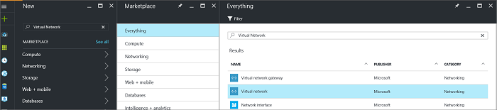
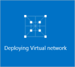
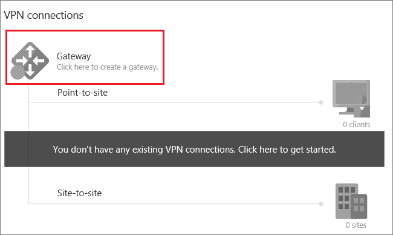

<properties
    pageTitle="将本地网络连接到 Azure 虚拟网络：站点到站点 VPN（经典）：门户 | Azure"
    description="通过公共 Internet 创建从本地网络到 Azure 虚拟网络的 IPsec 连接的步骤。 这些步骤将帮助你使用门户创建跨界站点到站点 VPN 网关连接。"
    services="vpn-gateway"
    documentationcenter="na"
    author="cherylmc"
    manager="timlt"
    editor=""
    tags="azure-resource-manager"
    translationtype="Human Translation" />
<tags
    ms.assetid=""
    ms.service="vpn-gateway"
    ms.devlang="na"
    ms.topic="hero-article"
    ms.tgt_pltfrm="na"
    ms.workload="infrastructure-services"
    ms.date="03/15/2017"
    wacn.date="04/17/2017"
    ms.author="cherylmc"
    ms.sourcegitcommit="e0e6e13098e42358a7eaf3a810930af750e724dd"
    ms.openlocfilehash="d490fe0652d06d424ca981a5ed3402fe53e8d790"
    ms.lasthandoff="04/06/2017" />

# 使用 Azure 门户预览创建具有站点到站点连接的 VNet（经典）
> [AZURE.SELECTOR]
- [Resource Manager - Azure 门户预览](/documentation/articles/vpn-gateway-howto-site-to-site-resource-manager-portal/)
- [Resource Manager - PowerShell](/documentation/articles/vpn-gateway-create-site-to-site-rm-powershell/)
- [经典 - Azure 门户预览](/documentation/articles/vpn-gateway-howto-site-to-site-classic-portal/)
- [经典 - 经典管理门户](/documentation/articles/vpn-gateway-site-to-site-create/)

本文介绍了如何使用经典部署模型和 Azure 门户预览创建一个虚拟网络和一个连接到本地网络的站点到站点 VPN 网关连接。 

站点到站点 (S2S) VPN 网关连接是通过 IPsec/IKE（IKEv1 或 IKEv2）VPN 隧道建立的连接。 此类型的连接要求位于本地的 VPN 设备分配有一个公共 IP 地址，并且不位于 NAT 后面。 S2S 连接可以用于跨界配置和混合配置，或者用于连接使用不同部署模型的 VNet。

### 用于站点到站点连接的部署模型和方法
[AZURE.INCLUDE [deployment models](../../includes/vpn-gateway-deployment-models-include.md)]

下表显示了站点到站点配置当前可用的部署模型和方法。 当有配置步骤相关的文章发布时，我们会直接从此表格链接到该文章。

[AZURE.INCLUDE [site-to-site table](../../includes/vpn-gateway-table-site-to-site-include.md)]

#### 其他配置
如果你想要将多个 VNet 连接到一起，但又不想创建连接到本地位置的连接，则请参阅 [配置 VNet 到 VNet 连接](/documentation/articles/virtual-networks-configure-vnet-to-vnet-connection/)。 如果想要向已具有连接的 VNet 添加站点到站点连接，请参阅[使用现有 VPN 网关连接将 S2S 连接添加到 VNet](/documentation/articles/vpn-gateway-multi-site/)。

## 开始之前
在开始配置之前，请确认是否已准备好以下各项：

* 一台兼容的 VPN 设备和能够对其进行配置的人员。 请参阅 [关于 VPN 设备](/documentation/articles/vpn-gateway-about-vpn-devices/)。 如果不熟悉 VPN 设备的配置，或者不熟悉本地网络配置中的 IP 地址范围，则需咨询能够为你提供此类详细信息的人员。
* 一个用于 VPN 设备的面向外部的公共 IPv4 IP 地址。 此 IP 地址不得位于 NAT 之后。
* Azure 订阅。 如果没有 Azure 订阅，可以注册一个[一元帐户](/pricing/1rmb-trial)。
* 目前需要使用 PowerShell 来指定共享密钥和创建 VPN 网关连接。 安装最新版本的 Azure 服务管理 (SM) PowerShell cmdlet。 有关详细信息，请参阅[如何安装和配置 Azure PowerShell](https://docs.microsoft.com/zh-cn/powershell/azureps-cmdlets-docs)。 使用 PowerShell 进行此配置时，请确保以管理员身份运行。 

> [AZURE.NOTE]
> 配置站点到站点连接时，需要为你的 VPN 设备提供面向公众的 IPv4 IP 地址。                                                                                                                                                                               
>
>

### 此练习的示例配置值
练习这些步骤时，可以使用示例配置值：

* **VNet 名称：**TestVNet1
* **地址空间：** 
    * 10.11.0.0/16
    * 10.12.0.0/16（可选，适用于本练习）
* **子网：**
  * FrontEnd：10.11.0.0/24
  * BackEnd：10.12.0.0/24（可选，适用于本练习）
* **GatewaySubnet：**10.11.255.0/27
* **资源组：** TestRG1
* **位置：** 中国东部
* **DNS 服务器：**8.8.8.8（可选，适用于本练习）
* **本地站点名称：**Site2

## 1.创建虚拟网络

创建适用于 S2S 连接的虚拟网络时，需确保指定的地址空间与适用于本地站点（你需要连接到这些站点）的任何客户端地址空间不重叠。 如果有重叠子网，连接将无法正常工作。

* 如果已有一个 VNet，请检查其设置是否与 VPN 网关设计兼容。 请特别注意任何可能与其他网络重叠的子网。 

* 如果还没有虚拟网络，请创建。 这些屏幕截图仅供参考。 请务必替换为你自己的值。

### 创建虚拟网络

1. 从浏览器导航到 [Azure 门户预览](http://portal.azure.cn) ，必要时使用 Azure 帐户登录。
2. 单击“新建” 。 在“搜索应用商店”字段中，键入“虚拟网络”。 从返回的列表中找到“虚拟网络”，单击打开“虚拟网络”边栏选项卡。

    
3. 从靠近“虚拟网络”边栏选项卡底部的“选择部署模型”列表中，选择“经典”，然后单击“创建”。

    
4. 在“创建虚拟网络”  边栏选项卡上，配置 VNet 设置。 在此边栏选项卡中，添加第一个地址空间和单个子网地址范围。 完成创建 VNet 之后，可以返回并添加其他子网和地址空间。

    
5. 验证“订阅”  是否正确。 可以使用下拉列表更改订阅。
6. 单击“资源组”  ，然后选择现有资源组，或通过键入新的资源组名称创建新资源组。 有关资源组的详细信息，请访问 [Azure 资源管理器概述](/documentation/articles/resource-group-overview/#resource-groups)。
7. 接下来，选择 VNet 的“位置”  设置。 该位置确定要部署到此 VNet 的资源所在的位置。
8. 如果希望能够在仪表板上轻松查找 VNet，请选择“固定到仪表板”，然后单击“创建”。

    
9. 单击“创建”后，会看到仪表板上有一个磁贴反映了 VNet 的进度。 创建 VNet 时，该磁贴会更改。

    

创建虚拟网络后，可以在 Azure 经典管理门户中的“网络”页上，看到“状态”下面列出了“已创建”。

## 2.添加其他地址空间

创建虚拟网络后，即可添加其他地址空间。 进行 S2S 配置时，不需添加额外的地址空间，但如果需要多个地址空间，请执行以下步骤：

1. 在门户中找到虚拟网络。
2. 在虚拟网络的边栏选项卡的“设置”部分，单击“地址空间”。
3. 在“地址空间”边栏选项卡上单击“+添加”，然后输入其他地址空间。

## 3.指定 DNS 服务器
在 S2S 配置过程中不需进行 DNS 设置，但如果需要名称解析，则 DNS 是必需的。

创建虚拟网络后，可以添加 DNS 服务器的 IP 地址来处理名称解析。 打开虚拟网络的设置，单击 DNS 服务器，然后添加要用于名称解析的 DNS 服务器的 IP 地址。 此设置不创建 DNS 服务器。 在示例设置中，我们使用公用 DNS 服务器。 通常情况下，需使用专用 DNS 服务器。 请务必添加可与资源通信的 DNS 服务器。

1. 在门户中找到虚拟网络。
2. 在虚拟网络的边栏选项卡的“设置”部分，单击“DNS 服务器”。
3. 添加 DNS 服务器。
4. 单击页面顶部的“保存”，保存你的设置。

## 4.配置本地站点

本地站点通常指本地位置。 它包含 VPN 设备的 IP 地址和地址范围，你需要创建到该设备的连接，并且需要通过 VPN 网关将地址范围路由到该设备。

1. 在门户中，导航到要为其创建网关的虚拟网络。
2. 在虚拟网络“概览”边栏选项卡的“VPN 连接”部分，单击“网关”打开“新建 VPN 连接”边栏选项卡。

    
3. 在“新建 VPN 连接”边栏选项卡上，选择“站点到站点”。

    
4. 单击“本地站点 - 配置所需的设置”打开“本地站点”边栏选项卡。 配置设置，然后单击“确定”保存设置。
    - **名称：**创建本地站点的名称，方便进行标识。
    - **VPN 网关 IP 地址：**这是本地网络的 VPN 设备的公共 IP 地址。 VPN 设备需要 IPv4 公共 IP 地址。 为要连接到的 VPN 设备指定一个有效的公共 IP 地址。 它不能位于 NAT 后面，并且必须可让 Azure 访问。
    - **客户端地址空间:** 列出一个 IP 地址范围，需通过该网关将此范围路由到本地网络。 可以添加多个地址空间范围。 请确保在此处指定的范围与虚拟网络连接到的其他网络的范围不重叠，也与虚拟网络本身的地址范围不重叠。

    

## 5.配置网关子网

必须为 VPN 网关创建一个网关子网。 网关子网包含 VPN 网关服务将使用的 IP 地址。

1. 在“新建 VPN 连接”边栏选项卡上，选中“立即创建网关”复选框。 此时会显示“可选网关配置”边栏选项卡。 如果不选中该复选框，则看不到配置网关子网的边栏选项卡。

    
2. 单击“可选网关配置 - 子网、大小和路由类型”打开“网关配置”边栏选项卡。
3. 在“网关配置”边栏选项卡上，单击“子网 - 配置所需的设置”打开“添加子网”边栏选项卡。

    
4. 在“添加子网”边栏选项卡上，添加网关子网。 添加网关子网时，最好是尽可能使用 CIDR 块 /28 或 /27 创建网关子网。 这样可确保你有足够的 IP 地址来应对未来的额外配置需求。  单击“确定”保存设置。

    

## 6.指定 SKU 和 VPN 类型
1. 选择网关“大小”。 这是用于创建虚拟网络网关的网关 SKU。 在门户中，“默认 SKU”为“基本”。 有关网关 SKU 的详细信息，请参阅[关于 VPN 网关设置](/documentation/articles/vpn-gateway-about-vpn-gateway-settings/#gwsku)。

    
2. 选择网关的“路由类型”。 这也称为 VPN 类型。 选择正确的网关类型很重要，因为无法将网关从一个类型转换为另一个类型。 VPN 设备必须兼容所选路由类型。 有关 VPN 类型的详细信息，请参阅[关于 VPN 网关设置](/documentation/articles/vpn-gateway-about-vpn-gateway-settings/#vpntype)。 可能会有文章引用“RouteBased”和“PolicyBased”VPN 类型。 “动态”对应于“RouteBased”，“静态”对应于“PolicyBased”。
3. 单击“确定”保存设置。
4. 在“新建 VPN 连接”边栏选项卡中，单击底部的“确定”开始创建虚拟网络网关。 此步骤可能最多需要 45 分钟才能完成。

## 7.配置 VPN 设备

请联系你的设备制造商以获得具体的配置信息并配置设备。 有关可在 Azure 上正常工作的 VPN 设备的详细信息，请参阅 [VPN 设备](/documentation/articles/vpn-gateway-about-vpn-devices/) 。 另外，对于要使用的 VPN 设备，请查看是否存在任何[已知的设备兼容性问题](/documentation/articles/vpn-gateway-about-vpn-devices/#known)。 

配置 VPN 设备时，需要所创建的 VPN 网关的 IP 地址。 转到虚拟网络的“概览”边栏选项卡即可找到该 IP 地址。

## 8.创建连接
此步骤设置共享密钥并创建连接。 设置的密钥必须是在 VPN 设备配置中使用过的同一密钥。

> [AZURE.NOTE]
> 此步骤目前在 Azure 门户预览中不可用。 必须使用服务管理 (SM) 版本的 Azure PowerShell cmdlet。                                                                                                                                                                             
>
>

### 步骤 1。 连接到 Azure 帐户

1. 使用提升的权限打开 PowerShell 控制台，然后连接到帐户。 使用下面的示例来帮助连接：

        Login-AzureRmAccount -EnvironmentName AzureChinaCloud
2. 检查该帐户的订阅。

        Get-AzureRmSubscription
3. 如果有多个订阅，请选择要使用的订阅。

        Select-AzureRmSubscription -SubscriptionName "Replace_with_your_subscription_name"
4. 添加 SM 版本的 PowerShell cmdlet。

        Add-AzureAccount -Environment AzureChinaCloud

### 步骤 2. 设置共享密钥并创建连接

使用 PowerShell 和经典部署模型时，有时门户中资源的名称不是在使用 PowerShell 时 Azure 中本应显示的名称。 可通过以下步骤导出网络配置文件，获取这些名称的确切值。

1. 在计算机上创建一个目录，然后将网络配置文件导出到该目录。 在此示例中，网络配置文件导出到 C:\AzureNet。

         Get-AzureVNetConfig -ExportToFile C:\AzureNet\NetworkConfig.xml
2. 使用 XML 编辑器打开网络配置文件，检查值中是否包含“LocalNetworkSite name”和“VirtualNetworkSite name”。 根据值修改此示例。 指定包含空格的名称时，请使用单引号将值引起来。

3. 设置共享密钥并创建连接。 “-SharedKey”是你生成并指定的值。 在示例中，我们使用的是“abc123”，但你可以生成并且应该使用更复杂的。 重要的是，此处指定的值必须与配置 VPN 设备时指定的值相同。

        Set-AzureVNetGatewayKey -VNetName 'Group TestRG1 TestVNet1' `
        -LocalNetworkSiteName 'D1BFC9CB_Site2' -SharedKey abc123
创建连接后，结果为“状态: 成功”。

## 9.验证连接

[AZURE.INCLUDE [vpn-gateway-verify-connection-azureportal-classic](../../includes/vpn-gateway-verify-connection-azureportal-classic-include.md)]

## 后续步骤
连接完成后，即可将虚拟机添加到虚拟网络。 有关详细信息，请参阅[虚拟机](/documentation/services/virtual-machines/)。