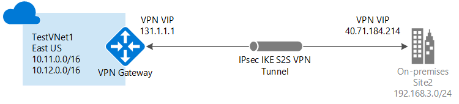

<properties
    pageTitle="使用 Azure Resource Manager 和 Azure 门户预览创建具有站点到站点 VPN 连接的虚拟网络 | Azure"
    description="如何使用 Resource Manager 部署模型创建 VNet，并使用 S2S VPN 网关连接将其连接到本地网络。"
    services="vpn-gateway"
    documentationcenter="na"
    author="cherylmc"
    manager="carmonm"
    editor=""
    tags="azure-resource-manager" />  

<tags
    ms.assetid="827a4db7-7fa5-4eaf-b7e1-e1518c51c815"
    ms.service="vpn-gateway"
    ms.devlang="na"
    ms.topic="hero-article"
    ms.tgt_pltfrm="na"
    ms.workload="infrastructure-services"
    ms.date="01/23/2017"
    wacn.date="03/28/2017"
    ms.author="cherylmc" />  

# 使用 Azure 门户预览创建具有站点到站点连接的 VNet
> [AZURE.SELECTOR]
- [Resource Manager - Azure 门户预览](/documentation/articles/vpn-gateway-howto-site-to-site-resource-manager-portal/)
- [Resource Manager - PowerShell](/documentation/articles/vpn-gateway-create-site-to-site-rm-powershell/)
- [经典 - 经典管理门户](/documentation/articles/vpn-gateway-site-to-site-create/)

本文逐步讲解如何使用 Azure Resource Manager 部署模型和 Azure 门户预览创建虚拟网络和连接到本地网络的站点到站点 VPN 网关连接。站点到站点连接可以用于跨界和混合配置。

  

### 用于站点到站点连接的部署模型和方法
[AZURE.INCLUDE [部署模型](../../includes/vpn-gateway-deployment-models-include.md)]

下表显示了站点到站点配置当前可用的部署模型和方法。当有配置步骤相关的文章发布时，我们会直接从此表格链接到该文章。

[AZURE.INCLUDE [站点到站点连接表](../../includes/vpn-gateway-table-site-to-site-include.md)]

#### 其他配置
如果你想要将多个 VNet 连接到一起，但又不想创建连接到本地位置的连接，则请参阅[配置 VNet 到 VNet 连接](/documentation/articles/vpn-gateway-vnet-vnet-rm-ps/)。如果要向已有连接的 VNet 添加站点到站点连接，请参阅 [Add a S2S connection to a VNet with an existing VPN gateway connection](/documentation/articles/vpn-gateway-howto-multi-site-to-site-resource-manager-portal/)（向已有 VPN 网关连接的 VNet 添加 S2S 连接）。

## 开始之前
在开始配置之前，请确认是否已准备好以下各项：

* 一台兼容的 VPN 设备和能够对其进行配置的人员。请参阅[关于 VPN 设备](/documentation/articles/vpn-gateway-about-vpn-devices/)。如果不熟悉 VPN 设备的配置，或者不熟悉本地网络配置中的 IP 地址范围，请咨询能够提供此类详细信息的人员。
* 一个用于 VPN 设备的面向外部的公共 IP 地址。此 IP 地址不得位于 NAT 之后。
* Azure 订阅。如果你还没有 Azure 订阅，你可以注册一个[试用版](/pricing/1rmb-trial)。

### 本练习的示例配置值
练习这些步骤时，可以使用示例配置值：

* **VNet 名称**：TestVNet1
* **地址空间**：10.11.0.0/16 和 10.12.0.0/16
* **子网：**
  * FrontEnd：10.11.0.0/24
  * BackEnd：10.12.0.0/24
  * GatewaySubnet：10.12.255.0/27
* **资源组**：TestRG1
* **位置**：中国东部
* **DNS 服务器**：8.8.8.8
* **网关名称**：VNet1GW
* **公共 IP**：VNet1GWIP
* **VPN 类型**：基于路由
* **连接类型**：站点到站点 (IPsec)
* **网关类型**：VPN
* **本地网络网关名称**：Site2
* **连接名称**：VNet1toSite2

## 1.创建虚拟网络
如果已有一个 VNet，请检查其设置是否与 VPN 网关设计兼容。请特别留意可能与其他网络重叠的任何子网。如果有重叠的子网，连接将无法正常工作。如果为 VNet 配置了正确的设置，可以开始执行[指定 DNS 服务器](#dns)部分中的步骤。

### 创建虚拟网络
[AZURE.INCLUDE [vpn-gateway-basic-vnet-rm-portal](../../includes/vpn-gateway-basic-vnet-rm-portal-include.md)]

## 2.添加其他地址空间和子网
可以将其他地址空间和子网添加到已创建的 VNet。

[AZURE.INCLUDE [vpn-gateway-additional-address-space](../../includes/vpn-gateway-additional-address-space-include.md)]

## 3.指定 DNS 服务器
### 指定 DNS 服务器
[AZURE.INCLUDE [vpn-gateway-add-dns-rm-portal](../../includes/vpn-gateway-add-dns-rm-portal-include.md)]

## 4.创建网关子网
将虚拟网络连接到网关之前，必须先创建要连接的虚拟网络的网关子网。在可能的情况下，最好是使用 CIDR 块 /28 或 /27 创建网关子网，以便提供足够的 IP 地址，满足将来的其他配置要求。

如果要练习创建此配置，请在创建网关子网时引用这些[值](#values)。

### 创建网关子网
[AZURE.INCLUDE [vpn-gateway-add-gwsubnet-rm-portal](../../includes/vpn-gateway-add-gwsubnet-rm-portal-include.md)]

## 5.创建虚拟网络网关
如果你在练习创建此配置，可以参考[示例配置值](#values)。

### 创建虚拟网络网关
[AZURE.INCLUDE [vpn-gateway-add-gw-rm-portal](../../includes/vpn-gateway-add-gw-rm-portal-include.md)]

## 6.创建本地网络网关
“本地网络网关”是指本地位置。为本地网络网关命名，Azure 可通过该名称引用该网关。

如果你在练习创建此配置，可以参考[示例配置值](#values)。

### 创建局域网网关
[AZURE.INCLUDE [vpn-gateway-add-lng-rm-portal](../../includes/vpn-gateway-add-lng-rm-portal-include.md)]

## 7.配置 VPN 设备
[AZURE.INCLUDE [vpn-gateway-configure-vpn-device-rm](../../includes/vpn-gateway-configure-vpn-device-rm-include.md)]

## 8.创建站点到站点 VPN 连接
在虚拟网络网关和 VPN 设备之间创建站点到站点 VPN 连接。请务必替换为你自己的值。共享密钥必须与你用于 VPN 设备配置的值匹配。

在开始本部分之前，请确认虚拟网络网关与局域网网关已完成创建。如果要练习创建此配置，请在创建连接时引用这些[值](#values)。

### 创建 VPN 连接
[AZURE.INCLUDE [vpn-gateway-add-site-to-site-connection-rm-portal](../../includes/vpn-gateway-add-site-to-site-connection-rm-portal-include.md)]

## 9.验证 VPN 连接
你可以在门户中或使用 PowerShell 验证 VPN 连接。

[AZURE.INCLUDE [vpn-gateway-verify-connection-rm](../../includes/vpn-gateway-verify-connection-rm-include.md)]

## 后续步骤
*  连接完成后，即可将虚拟机添加到虚拟网络。有关详细信息，请参阅[虚拟机](/documentation/services/virtual-machines/)。
*  有关 BGP 的信息，请参阅 [BGP 概述](/documentation/articles/vpn-gateway-bgp-overview/)和[如何配置 BGP](/documentation/articles/vpn-gateway-bgp-resource-manager-ps/)。

<!---HONumber=Mooncake_1226_2016-->