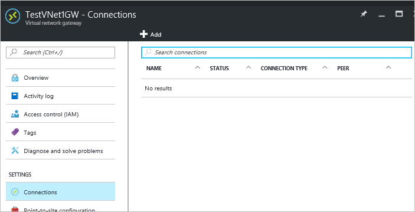
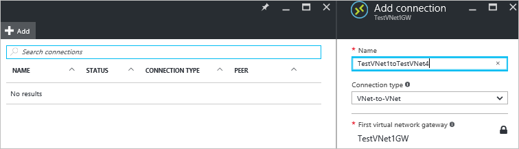
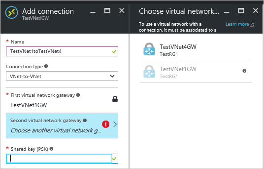
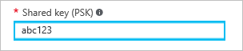
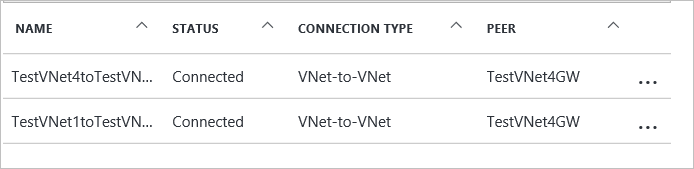
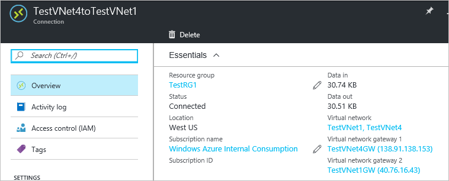

<properties
    pageTitle="将 Azure 虚拟网络连接到另一 VNet：门户 | Azure"
    description="使用 Resource Manager 和 Azure 门户在 VNet 之间创建 VPN 网关连接。"
    services="vpn-gateway"
    documentationcenter="na"
    author="cherylmc"
    manager="timlt"
    editor=""
    tags="azure-resource-manager" />
<tags
    ms.assetid="a7015cfc-764b-46a1-bfac-043d30a275df"
    ms.service="vpn-gateway"
    ms.devlang="na"
    ms.topic="hero-article"
    ms.tgt_pltfrm="na"
    ms.workload="infrastructure-services"
    ms.date="04/21/2017"
    wacn.date="05/31/2017"
    ms.author="cherylmc"
    ms.translationtype="Human Translation"
    ms.sourcegitcommit="4a18b6116e37e365e2d4c4e2d144d7588310292e"
    ms.openlocfilehash="f6d983ed26dd47b686c839eb25d41a678420c74b"
    ms.contentlocale="zh-cn"
    ms.lasthandoff="05/19/2017" />

# 使用 Azure 门户配置 VNet 到 VNet VPN 网关连接

本文介绍如何在虚拟网络之间创建 VPN 网关连接。 虚拟网络可位于相同或不同的区域，来自相同或不同的订阅。 本文中的步骤适用于 Resource Manager 部署模型和 Azure 门户。 也可使用不同的部署工具或部署模型创建此配置，方法是从以下列表中选择另一选项：
> [AZURE.SELECTOR]
- [Resource Manager - Azure 门户](/documentation/articles/vpn-gateway-howto-vnet-vnet-resource-manager-portal/)
- [Resource Manager - PowerShell](/documentation/articles/vpn-gateway-vnet-vnet-rm-ps/)
- [经典 - Azure 门户](/documentation/articles/vpn-gateway-howto-vnet-vnet-portal-classic/)
- [连接不同的部署模型 - Azure 门户](/documentation/articles/vpn-gateway-connect-different-deployment-models-portal/)
- [连接不同的部署模型 - PowerShell](/documentation/articles/vpn-gateway-connect-different-deployment-models-powershell/)

将一个虚拟网络连接到另一个虚拟网络（VNet 到 VNet）类似于将 VNet 连接到本地站点位置。 这两种连接类型都使用 VPN 网关来提供使用 IPsec/IKE 的安全隧道。 如果 VNet 位于同一区域，可能会考虑使用 VNet 对等互连进行连接。 VNet 对等互连不使用 VPN 网关。 有关详细信息，请参阅 [VNet 对等互连](/documentation/articles/virtual-network-peering-overview/)。

可以将 VNet 到 VNet 通信与多站点配置组合使用。 这样，便可以建立将跨界连接与虚拟网络间连接相结合的网络拓扑，如下图所示：

### 为什么要连接虚拟网络？

你可能会出于以下原因而连接虚拟网络：

* **跨区域地域冗余和地域存在**

    * 你可以使用安全连接设置自己的异地复制或同步，而无需借助于面向 Internet 的终结点。
    * 使用 Azure 流量管理器和负载均衡器，可以设置支持跨多个 Azure 区域实现异地冗余的高可用性工作负荷。 一个重要的示例就是对分布在多个 Azure 区域中的可用性组设置 SQL Always On。
* **具有隔离或管理边界的区域多层应用程序**

    * 在同一区域中，由于存在隔离或管理要求，可以设置具有多个虚拟网络的多层应用程序，这些虚拟网络相互连接在一起。

有关 VNet 到 VNet 连接的详细信息，请参阅本文末尾的 [VNet 到 VNet 常见问题解答](#faq) 。 请注意，如果 VNet 属于不同的订阅，则不能在门户中创建该连接。 可以使用 [PowerShell](/documentation/articles/vpn-gateway-vnet-vnet-rm-ps/)。

### 示例设置
使用这些步骤作为练习时，可以使用示例设置值。 对于示例用途，我们可以对每个 VNet 使用多个地址空间。 但是，VNet 到 VNet 配置不需要多个地址空间。

**TestVNet1 的值：**

* VNet 名称：TestVNet1
* 地址空间：10.11.0.0/16
    * 子网名称：FrontEnd
    * 子网地址范围：10.11.0.0/24
* 资源组：TestRG1
* 位置：中国东部
* 地址空间：10.12.0.0/16
    * 子网名称：BackEnd
    * 子网地址范围：10.12.0.0/24
* 网关子网名称：GatewaySubnet（这将在门户中自动填充）
    * 网关子网地址范围：10.11.255.0/27
* DNS 服务器：使用 DNS 服务器的 IP 地址
* 虚拟网络网关名称：TestVNet1GW
* 网关类型：VPN
* VPN 类型：基于路由
* SKU：选择要使用的网关 SKU
* 公共 IP 地址名称：TestVNet1GWIP
* 连接值：
    * 名称：TestVNet1toTestVNet4
    * 共享密钥：可以自己创建共享密钥。 对于本示例，我们将使用 abc123。 重要的是，在创建 VNet 之间的连接时，值必须匹配。

**TestVNet4 的值：**

* VNet 名称：TestVNet4
* 地址空间：10.41.0.0/16
    * 子网名称：FrontEnd
    * 子网地址范围：10.41.0.0/24
* 资源组：TestRG1
* 位置：中国北部
* 地址空间：10.42.0.0/16
    * 子网名称：BackEnd
    * 子网地址范围：10.42.0.0/24
* 网关子网名称：GatewaySubnet（这将在门户中自动填充）
    * 网关子网地址范围：10.41.255.0/27
* DNS 服务器：使用 DNS 服务器的 IP 地址
* 虚拟网络网关名称：TestVNet4GW
* 网关类型：VPN
* VPN 类型：基于路由
* SKU：选择要使用的网关 SKU
* 公共 IP 地址名称：TestVNet4GWIP
* 连接值：
    * 名称：TestVNet4toTestVNet1
    * 共享密钥：可以自己创建共享密钥。 对于本示例，我们将使用 abc123。 重要的是，在创建 VNet 之间的连接时，值必须匹配。

## 1.创建并配置 TestVNet1
如果已有一个 VNet，请检查其设置是否与 VPN 网关设计兼容。 请特别留意可能与其他网络重叠的任何子网。 如果有重叠的子网，连接将无法正常工作。 如果为 VNet 配置了正确的设置，可以开始执行 [指定 DNS 服务器](#dns) 部分中的步骤。

### 创建虚拟网络
[AZURE.INCLUDE [vpn-gateway-basic-vnet-rm-portal](../../includes/vpn-gateway-basic-vnet-rm-portal-include.md)]

## 2.添加其他地址空间并创建子网
创建 VNet 后，可以添加其他地址空间并创建子网。

[AZURE.INCLUDE [vpn-gateway-additional-address-space](../../includes/vpn-gateway-additional-address-space-include.md)]

## 3.创建网关子网
将虚拟网络连接到网关之前，必须先创建要连接的虚拟网络的网关子网。 在可能的情况下，最好是使用 CIDR 块 /28 或 /27 创建网关子网，以便提供足够的 IP 地址，满足将来的其他配置要求。

如果要练习创建此配置，请在创建网关子网时引用这些 [示例设置](#values) 。

[AZURE.INCLUDE [vpn-gateway-no-nsg](../../includes/vpn-gateway-no-nsg-include.md)]

### 创建网关子网
[AZURE.INCLUDE [vpn-gateway-add-gwsubnet-rm-portal](../../includes/vpn-gateway-add-gwsubnet-rm-portal-include.md)]

## 4.指定 DNS 服务器（可选）
VNet 到 VNet 连接不需要 DNS。 但是，如果希望对部署到虚拟网络的资源进行名称解析，则应指定 DNS 服务器。 可以通过此设置指定 DNS 服务器，以便将其用于此虚拟网络的名称解析。 此设置不创建 DNS 服务器。

[AZURE.INCLUDE [vpn-gateway-add-dns-rm-portal](../../includes/vpn-gateway-add-dns-rm-portal-include.md)]

## 5.创建虚拟网关
在此步骤中，将为 VNet 创建虚拟网络网关。 创建网关通常需要 45 分钟或更长的时间，具体取决于所选网关 SKU。 如果要练习创建此配置，可以引用 [示例设置](#values)。

### 创建虚拟网络网关
[AZURE.INCLUDE [vpn-gateway-add-gw-rm-portal](../../includes/vpn-gateway-add-gw-rm-portal-include.md)]

## 6.创建并配置 TestVNet4
配置 TestVNet1 后，请通过重复上述步骤，并将值替换为 TestVNet4 的这些值来创建 TestVNet4。 你不必等到 TestVNet1 的虚拟网络网关已完成创建，就可以配置 TestVNet4。 如果要使用你自己的值，请确保地址空间未与要连接到的任何 VNet 重叠。

## 7.配置 TestVNet1 连接
TestVNet1 和 TestVNet4 的虚拟网络网关都已完成后，便可以创建虚拟网络网关连接。 在本部分中，将创建一个从 VNet1 到 VNet4 的连接。 这些步骤仅适用于同一订阅中的 VNet。 如果 VNet 属于不同的订阅，则必须使用 PowerShell 进行连接。 请参阅 [PowerShell](/documentation/articles/vpn-gateway-vnet-vnet-rm-ps/) 一文。

1. 在“所有资源” 中，导航到 VNet 的虚拟网络网关。 例如，“TestVNet1GW” 。 单击“TestVNet1GW”  ，打开虚拟网络网关边栏选项卡。

    
2. 单击“+添加”打开“添加连接”边栏选项卡。
3. 在“添加连接”边栏选项卡上的“名称”字段中，键入连接名称。 例如，**TestVNet1toTestVNet4**。

    
4. 对于“连接类型”， 从下拉列表中选择“VNet 到 VNet”。
5. 将自动填充“第一个虚拟网络网关”  字段值，因为正在从指定的虚拟网络网关创建此连接。
6. “第二个虚拟网络网关”  字段是要创建与其的连接的 VNet 的虚拟网络网关。 单击“选择另一个虚拟网关”可打开“选择虚拟网关”边栏选项卡。

    
7. 查看此边栏选项卡上列出的虚拟网络网关。 请注意，只会列出你的订阅中的虚拟网络网关。 如果想要连接到订阅外的虚拟网关，请参阅 [PowerShell 文章](/documentation/articles/vpn-gateway-vnet-vnet-rm-ps/)。 
8. 单击要连接到的虚拟网络网关。
9. 在“共享密钥”  字段中，键入连接的共享密钥。 可以自己生成或创建此密钥。 在站点到站点连接中，你使用的密钥应与本地设备和虚拟网络网关连接的密钥完全相同。 此处的概念类似，不同的是不是连接到 VPN 设备，而是要连接到另一个虚拟网络网关。

    
10. 单击边栏选项卡底部的“确定”以保存更改。

## 8.配置 TestVNet4 连接
接下来，从 TestVNet4 到 TestVNet1 创建一个连接。 使用的方法与用于创建从 TestVNet1 到 TestVNet4 的连接的方法相同。 请确保使用相同的共享密钥。

## 9.验证连接
验证连接。 对于每个虚拟网络网关，执行以下操作：

1. 找到虚拟网络网关的边栏选项卡。 例如， **TestVNet4GW**。 
2. 在虚拟网络网关边栏选项卡上，单击“连接”  以查看虚拟网络网关的“连接”边栏选项卡。

查看连接并验证状态。 创建连接后，“状态”值将显示为“已成功”和“已连接”。

可以分别双击每个连接，以查看有关该连接的详细信息。

## VNet 到 VNet 常见问题解答
查看常见问题解答详细信息以获取有关 VNet 到 VNet 连接的其他信息。

[AZURE.INCLUDE [vpn-gateway-vnet-vnet-faq](../../includes/vpn-gateway-vnet-vnet-faq-include.md)]

## 后续步骤
连接完成后，即可将虚拟机添加到虚拟网络。 有关详细信息，请参阅[虚拟机文档](/documentation/services/virtual-machines/)。

<!--Update_Description: wording update-->