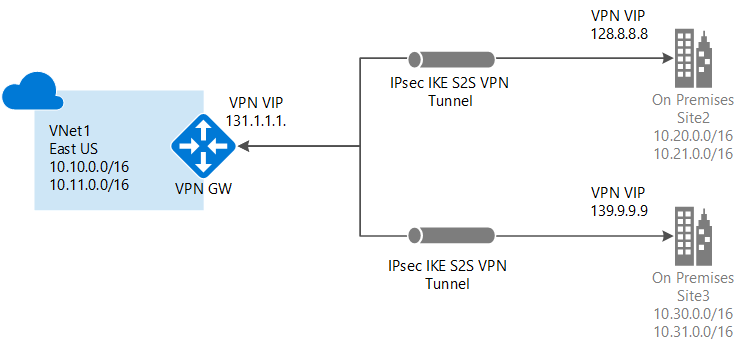

<properties
    pageTitle="使用 VPN 网关和 PowerShell 将虚拟网络连接到多个站点：经典 | Azure"
    description="本文指导你使用经典部署模型的 VPN 网关将多个本地站点连接到虚拟网络。"
    services="vpn-gateway"
    documentationcenter="na"
    author="yushwang"
    manager="rossort"
    editor=""
    tags="azure-service-management" />
<tags
    ms.assetid="b043df6e-f1e8-4a4d-8467-c06079e2c093"
    ms.service="vpn-gateway"
    ms.devlang="na"
    ms.topic="article"
    ms.tgt_pltfrm="na"
    ms.workload="infrastructure-services"
    ms.date="04/20/2017"
    wacn.date="05/31/2017"
    ms.author="yushwang"
    ms.translationtype="Human Translation"
    ms.sourcegitcommit="4a18b6116e37e365e2d4c4e2d144d7588310292e"
    ms.openlocfilehash="87d6e7e04253f4708a554ff5abc8871d3cb309b9"
    ms.contentlocale="zh-cn"
    ms.lasthandoff="05/19/2017" />

# 将站点到站点连接添加到包含现有 VPN 网关连接的 VNet（经典）
> [AZURE.SELECTOR]
- [Resource Manager - 门户](/documentation/articles/vpn-gateway-howto-multi-site-to-site-resource-manager-portal/)
- [经典 - PowerShell](/documentation/articles/vpn-gateway-multi-site/)

本文逐步讲解如何使用 PowerShell 将站点到站点 (S2S) 连接添加到包含现有连接的 VPN 网关。 这种类型的连接通常称为“多站点”配置。 本文中的步骤适用于使用经典部署模型（也称为“服务管理”）创建的虚拟网络。 本文中的步骤不适用于 ExpressRoute/站点到站点共存连接配置。

### 部署模型和方法

[AZURE.INCLUDE [vpn-gateway-clasic-rm](../../includes/vpn-gateway-classic-rm-include.md)]

当我们发布有关此配置的新文章和其他可用工具时，将会更新此表格。 有相关的文章发布时，我们会直接从此表格链接到该文章。

[AZURE.INCLUDE [vpn-gateway-table-multi-site](../../includes/vpn-gateway-table-multisite-include.md)]

## 关于连接

你可以将多个本地站点连接到单个虚拟网络。 在构建混合云解决方案时，这种做法特别有用。 创建到 Azure 虚拟网络网关的多站点连接时，其操作与创建其他站点到站点连接的操作类似。 事实上，可以使用现有的 Azure VPN 网关，只要该网关是动态的（基于路由）即可。

如果已经有连接到虚拟网络的静态网关，可以将网关类型更改为动态，而不需要为了适应多站点而重建虚拟网络。 在更改路由类型之前，请确保本地 VPN 网关支持基于路由的 VPN 配置。

## 考虑的要点

**无法使用门户更改此虚拟网络。** 需更改网络配置文件，而不是使用门户。 如果在门户中进行更改，更改将覆盖此虚拟网络的多站点引用设置。

在完成多站点过程后，便可轻松自如地使用网络配置文件。 但是，如果有多个人在处理你的网络配置，你需要确保每个人都知道这个限制。 这并不意味着完全不能使用门户。 除了无法对此特定虚拟网络进行配置更改以外，你可以使用它来完成其他任何操作。

## 开始之前

在开始配置之前，请确认满足以下条件：

* 每个本地位置都有兼容的 VPN 硬件。 查看[关于用于虚拟网络连接的 VPN 设备](/documentation/articles/vpn-gateway-about-vpn-devices/)，以确认要使用的设备是否是已知兼容的设备。
* 每个 VPN 设备都有一个面向外部的公共 IPv4 IP 地址。 该 IP 地址不能位于 NAT 后面， 必须满足这一要求。
* 你需要安装 Azure PowerShell cmdlet 的最新版本。 请确保同时安装了 Resource Manager 版本和服务管理 (SM) 版本。 有关详细信息，请参阅 [如何安装和配置 Azure PowerShell](https://docs.microsoft.com/zh-cn/powershell/azure/overview) 。
* 有人能够熟练地配置 VPN 硬件。 必须非常了解如何配置 VPN 设备，或者与具有此能力的人员合作。
* 要用于虚拟网络（如果尚未创建）的 IP 地址范围。
* 要连接到的每个本地网络站点的 IP 地址范围。 需确保要连接到的每个本地网络站点的 IP 地址范围不重叠。 否则，门户或 REST API 将拒绝上传配置。 例如，如果两个本地网络站点都包含 IP 地址范围 10.2.3.0/24，并且某个包包含目标地址 10.2.3.3，则 Azure 将不知道你要将该包发送到哪个站点，因为地址范围是重叠的。 为了防止路由问题，Azure 不允许你上载具有重叠范围的配置文件。

## 1.创建站点到站点 VPN
如果你已有使用动态路由网关的站点到站点 VPN，那太好了！ 你可以转到 [导出虚拟网络配置设置](#export)。 否则，请执行以下操作：

### 如果已有一个站点到站点虚拟网络，但该虚拟网络使用静态（基于策略）路由网关：
1. 将网关类型更改为动态路由。 多站点 VPN 需要动态（也称为基于路由）路由网关。 若要更改网关类型，首先需要删除现有网关，然后创建新网关。 有关说明，请参阅[如何更改网关的 VPN 路由类型](/documentation/articles/vpn-gateway-configure-vpn-gateway-mp/#how-to-change-the-vpn-routing-type-for-your-gateway)。  
2. 配置新网关并创建 VPN 隧道。 有关说明，请参阅 [Configure a VPN Gateway in the Azure Classic Management Portal](/documentation/articles/vpn-gateway-configure-vpn-gateway-mp/)（在 Azure 经典管理门户中配置 VPN 网关）。 首先，将网关类型更改为动态路由。

### 如果你没有站点到站点虚拟网络：
1. 按照以下说明创建站点到站点虚拟网络： [在 Azure 经典管理门户中创建使用站点到站点 VPN 连接的虚拟网络](/documentation/articles/vpn-gateway-site-to-site-create/)。  
2. 按照以下说明配置动态路由网关：[配置 VPN 网关](/documentation/articles/vpn-gateway-configure-vpn-gateway-mp/)。 请务必为网关类型选择“动态路由”。

## 2.导出网络配置文件
通过运行以下命令，导出 Azure 网络配置文件。 如有必要，可以将文件的导出位置更改为其他位置。

    Get-AzureVNetConfig -ExportToFile C:\AzureNet\NetworkConfig.xml

## 3.打开网络配置文件
打开你在执行上一步时下载的网络配置文件。 使用你偏好的任何 xml 编辑器。 该文件的内容类似于：

        <NetworkConfiguration xmlns:xsd="http://www.w3.org/2001/XMLSchema" xmlns:xsi="http://www.w3.org/2001/XMLSchema-instance" xmlns="http://schemas.microsoft.com/ServiceHosting/2011/07/NetworkConfiguration">
          <VirtualNetworkConfiguration>
            <LocalNetworkSites>
              <LocalNetworkSite name="Site1">
                <AddressSpace>
                  <AddressPrefix>10.0.0.0/16</AddressPrefix>
                  <AddressPrefix>10.1.0.0/16</AddressPrefix>
                </AddressSpace>
                <VPNGatewayAddress>131.2.3.4</VPNGatewayAddress>
              </LocalNetworkSite>
              <LocalNetworkSite name="Site2">
                <AddressSpace>
                  <AddressPrefix>10.2.0.0/16</AddressPrefix>
                  <AddressPrefix>10.3.0.0/16</AddressPrefix>
                </AddressSpace>
                <VPNGatewayAddress>131.4.5.6</VPNGatewayAddress>
              </LocalNetworkSite>
            </LocalNetworkSites>
            <VirtualNetworkSites>
              <VirtualNetworkSite name="VNet1" AffinityGroup="ChinaEast">
                <AddressSpace>
                  <AddressPrefix>10.20.0.0/16</AddressPrefix>
                  <AddressPrefix>10.21.0.0/16</AddressPrefix>
                </AddressSpace>
                <Subnets>
                  <Subnet name="FE">
                    <AddressPrefix>10.20.0.0/24</AddressPrefix>
                  </Subnet>
                  <Subnet name="BE">
                    <AddressPrefix>10.20.1.0/24</AddressPrefix>
                  </Subnet>
                  <Subnet name="GatewaySubnet">
                    <AddressPrefix>10.20.2.0/29</AddressPrefix>
                  </Subnet>
                </Subnets>
                <Gateway>
                  <ConnectionsToLocalNetwork>
                    <LocalNetworkSiteRef name="Site1">
                      <Connection type="IPsec" />
                    </LocalNetworkSiteRef>
                  </ConnectionsToLocalNetwork>
                </Gateway>
              </VirtualNetworkSite>
            </VirtualNetworkSites>
          </VirtualNetworkConfiguration>
        </NetworkConfiguration>

## 4.添加多个站点引用
在添加或删除站点引用信息时，将会对 ConnectionsToLocalNetwork/LocalNetworkSiteRef 进行配置更改。 添加新的本地站点引用会触发 Azure 来创建新隧道。 在以下示例中，网络配置适用于单站点连接。 更改完后，请保存该文件。

      <Gateway>
        <ConnectionsToLocalNetwork>
          <LocalNetworkSiteRef name="Site1"><Connection type="IPsec" /></LocalNetworkSiteRef>
        </ConnectionsToLocalNetwork>
      </Gateway>

若要添加其他站点引用（创建多站点配置），只需添加其他“LocalNetworkSiteRef”行，如下例所示：

      <Gateway>
        <ConnectionsToLocalNetwork>
          <LocalNetworkSiteRef name="Site1"><Connection type="IPsec" /></LocalNetworkSiteRef>
          <LocalNetworkSiteRef name="Site2"><Connection type="IPsec" /></LocalNetworkSiteRef>
        </ConnectionsToLocalNetwork>
      </Gateway>

## 5.导入网络配置文件
导入网络配置文件。 在导入这个包含更改的文件时，将会添加新的隧道。 这些隧道将使用你前面创建的动态网关。 可使用经典管理门户或 PowerShell 导入文件。

## 6.下载密钥
添加新的隧道后，使用 PowerShell cmdlet“Get-AzureVNetGatewayKey”获取每个隧道的 IPsec/IKE 预共享密钥。

例如：

    Get-AzureVNetGatewayKey -VNetName "VNet1" -LocalNetworkSiteName "Site1"
    Get-AzureVNetGatewayKey -VNetName "VNet1" -LocalNetworkSiteName "Site2"

如果需要，也可以使用 *获取虚拟网络网关共享密钥* REST API 来获取预共享密钥。

## 7.验证连接
检查多站点隧道状态。 下载每个隧道的密钥后，需要验证连接。 使用“Get-AzureVnetConnection”获取虚拟网络隧道的列表，如下例所示。 VNet1 是 VNet 的名称。

    Get-AzureVnetConnection -VNetName VNET1

示例返回：

        ConnectivityState         : Connected
        EgressBytesTransferred    : 661530
        IngressBytesTransferred   : 519207
        LastConnectionEstablished : 5/2/2014 2:51:40 PM
        LastEventID               : 23401
        LastEventMessage          : The connectivity state for the local network site 'Site1' changed from Not Connected to Connected.
        LastEventTimeStamp        : 5/2/2014 2:51:40 PM
        LocalNetworkSiteName      : Site1
        OperationDescription      : Get-AzureVNetConnection
        OperationId               : 7f68a8e6-51e9-9db4-88c2-16b8067fed7f
        OperationStatus           : Succeeded

        ConnectivityState         : Connected
        EgressBytesTransferred    : 789398
        IngressBytesTransferred   : 143908
        LastConnectionEstablished : 5/2/2014 3:20:40 PM
        LastEventID               : 23401
        LastEventMessage          : The connectivity state for the local network site 'Site2' changed from Not Connected to Connected.
        LastEventTimeStamp        : 5/2/2014 2:51:40 PM
        LocalNetworkSiteName      : Site2
        OperationDescription      : Get-AzureVNetConnection
        OperationId               : 7893b329-51e9-9db4-88c2-16b8067fed7f
        OperationStatus           : Succeeded

## 后续步骤

若要了解有关 VPN 网关的详细信息，请参阅[关于 VPN 网关](/documentation/articles/vpn-gateway-about-vpngateways/)。

<!--Update_Description: wording update-->