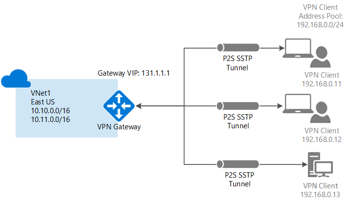

<properties
   pageTitle="使用经典管理门户配置与 Azure 虚拟网络的点到站点 VPN 网关连接 | Azure"
   description="通过创建点到站点 VPN 网关连接安全地连接到 Azure 虚拟网络。"
   services="vpn-gateway"
   documentationCenter="na"
   authors="cherylmc"
   manager="carmonm"
   editor=""
   tags="azure-service-management"/>  

<tags
   ms.service="vpn-gateway"
   ms.devlang="na"
   ms.topic="hero-article"
   ms.tgt_pltfrm="na"
   ms.workload="infrastructure-services"
   ms.date="08/31/2016"
   wacn.date="10/17/2016"
   ms.author="cherylmc"/>  

# 使用经典管理门户配置与 VNet 的点到站点连接

> [AZURE.SELECTOR]
- [PowerShell - Resource Manager](/documentation/articles/vpn-gateway-howto-point-to-site-rm-ps/)
- [门户 - 经典](/documentation/articles/vpn-gateway-point-to-site-create/)

使用点到站点 (P2S) 配置可以创建从单个客户端计算机到虚拟网络的安全连接。如果要从远程位置（例如从家里或会议室）连接到 VNet，或者只有少数几个需要连接到虚拟网络的客户端，则 P2S 连接会很有用。

本文逐步讲解如何使用经典管理门户，在**经典部署模型**中创建具有点到站点连接的 VNet。目前无法在 Azure 门户预览中为经典部署模型创建这种端到端配置。

点到站点连接不需要 VPN 设备或面向公众的 IP 地址即可运行。可通过从客户端计算机启动连接来建立 VPN 连接。有关点到站点连接的详细信息，请参阅 [VPN Gateway FAQ](/documentation/articles/vpn-gateway-vpn-faq/#point-to-site-connections)（VPN 网关常见问题）及 [Planning and Design](/documentation/articles/vpn-gateway-plan-design/)（规划和设计）。

**用于点到站点连接的部署模型和工具**

[AZURE.INCLUDE [vpn-gateway-table-point-to-site](../../includes/vpn-gateway-table-point-to-site-include.md)]

**关于 Azure 部署模型**

[AZURE.INCLUDE [vpn-gateway-clasic-rm](../../includes/vpn-gateway-classic-rm-include.md)]

  

## 关于创建点到站点连接
 
以下步骤逐步建立与虚拟网络的安全点到站点连接。

点到站点连接的配置分为四个部分。必须遵循这些部分的先后顺序完成配置。请不要跳过步骤。

- **第 1 部分**创建虚拟网络和 VPN 网关。
- **第 2 部分**创建并上载用于身份验证的证书。
- **第 3 部分**导出并安装客户端证书。
- **第 4 部分**配置 VPN 客户端。

## 第 1 部分 - 创建虚拟网络和 VPN 网关

### 第 1 部分：创建虚拟网络

1. 登录到 [Azure 经典管理门户](https://manage.windowsazure.cn/)。这些步骤使用经典管理门户而不是 Azure 门户预览。目前无法使用 Azure 门户预览创建 P2S 连接。

2. 在屏幕左下角，单击“新建”。在导航窗格中，单击“网络服务”，然后单击“虚拟网络”。单击“自定义创建”以启动配置向导。

3. 在“虚拟网络详细信息”页上，输入以下信息，然后单击右下角的“下一步”箭头。
	- **名称** - 为虚拟网络命名。例如“VNet1”。将 VM 部署到此 VNet 时，需要引用此名称。
	- **位置**：位置直接与你想让资源 (VM) 驻留在的物理位置（区域）有关。例如，如果你希望部署到此虚拟网络的 VM 的物理位置位于中国东部，请选择该位置。创建虚拟网络后，将无法更改与虚拟网络关联的区域。

4. 在“DNS 服务器和 VPN 连接”页上，输入以下信息，然后单击右下角的“下一步”箭头。
	- **DNS 服务器**：输入 DNS 服务器名称和 IP 地址，或从快捷菜单中选择一个以前注册的 DNS 服务器。此设置不创建 DNS 服务器。此设置允许指定要用于对此虚拟网络进行名称解析的 DNS 服务器。如果你想要使用 Azure 默认名称解析服务，请将本部分留空。
	- **配置点到站点 VPN**：选中此复选框。

5. 在“点到站点连接”页上，指定你的 VPN 客户端在连接后接收 IP 地址时的 IP 地址范围。有几个与用户能够指定的地址范围相关的规则。必须确保指定的范围与本地网络上的任何范围不重叠。

6. 请输入以下信息，然后单击“下一步”箭头。
 - **地址空间**：包括“起始 IP”和 CIDR（地址计数）。
 - **添加地址空间**：仅在网络设计需要时才添加地址空间。

7. 在“虚拟网络地址空间”页上，指定要用于虚拟网络的地址范围。这些都是动态 IP 地址 (DIPS)，将分配给部署到此虚拟网络的 VM 和其他角色实例。  所选范围不要与本地网络所用范围重叠，这一点尤其重要。必须与网络管理员协调，他们可能需要从本地网络地址空间划分一个 IP 地址范围供虚拟网络使用。

8. 输入以下信息，然后单击复选标记即可创建虚拟网络。
 - **地址空间**：添加要用于此虚拟网络的内部 IP 地址范围，包括起始 IP 和计数。所选范围不要与本地网络所用范围重叠，这一点非常重要。
 - **添加子网**：附加的子网不是必需的，但你可能需要为具有静态 DIP 的 VM 创建一个单独的子网。或者，你可能需要在子网中拥有与其他角色实例分开的 VM。
 - **添加网关子网**：网关子网是点到站点 VPN 所必需的。单击此项可添加网关子网。网关子网仅用于虚拟网络网关。

9. 创建虚拟网络后，可以在 Azure 经典管理门户中的“网络”页上，看到“状态”下面列出了“已创建”。创建虚拟网络后，便可以创建动态路由网关。

### 第 2 部分：创建动态路由网关

必须将网关类型配置为动态。静态路由网关无法使用此功能。

1. 在 Azure 经典管理门户的“网络”页上，单击创建的虚拟网络，然后导航到“仪表板”页。

2. 单击位于“仪表板”页底部的“创建网关”。此时会出现一条消息，询问“是否要为虚拟网络‘VNet1’创建网关”。单击“是”即可开始创建网关。创建网关可能需要大约 15 分钟。

## 第 2 部分 - 生成并上载证书

证书用于对点到站点 VPN 的 VPN 客户端进行身份验证。可以使用企业证书解决方案生成的证书，或使用自签名证书。最多可以将 20 个根证书上载到 Azure。上载 .cer 文件后，Azure 可以使用其中包含的信息验证已安装客户端证书的客户端。客户端证书必须通过 .cer 文件代表的同一个证书生成。

本部分的任务包括：

- 获取根证书的 .cer 文件。这可以是自签名证书，也可以使用企业证书系统。
- 将 .cer 文件上载到 Azure。
- 生成客户端证书。

### 第 1 部分：获取根证书的 .cer 文件

如果使用企业证书系统，请获取要使用的根证书的 .cer 文件。在[第 3 部分](#createclientcert)，将从根证书生成客户端证书。

如果你使用的不是企业证书解决方案，则需生成自签名根证书。有关适用于 Windows 10 的步骤，请参阅 [Working with self-signed root certificates for Point-to-Site configurations](/documentation/articles/vpn-gateway-certificates-point-to-site/)（为点到站点配置使用自签名根证书）。本文逐步讲解如何使用 makecert 生成自签名证书，然后导出 .cer 文件。

### 第 2 部分：将根证书 .cer 文件上载到 Azure 经典管理门户

将受信任的证书添加到 Azure。在将 Base64 编码 X.509 (.cer) 文件添加到 Azure 时，则是在告诉 Azure 信任该文件所代表的根证书。

1. 在 Azure 经典管理门户的虚拟网络“证书”页上，单击“上载根证书”。

2. 在“上载证书”页上，浏览 .cer 根证书，然后单击复选标记。

### 第 3 部分：生成客户端证书

接下来，生成客户端证书。可以为每个要连接的客户端生成唯一证书，也可以在多个客户端上使用相同的证书。生成唯一客户端证书的优势是能够根据需要吊销单个证书。否则，如果每个人都使用相同的客户端证书，在需要吊销某个客户端的证书时，必须为所有使用该证书进行身份验证的客户端生成并安装新证书。

- 如果使用的是企业证书解决方案，请使用通用名称值格式“name@yourdomain.com”生成客户端证书，而不要使用 NetBIOS“域\\用户名”格式。

- 如果使用自签名的证书解决方案，请参阅 [Working with self-signed root certificates for Point-to-Site configurations](/documentation/articles/vpn-gateway-certificates-point-to-site/)（为点到站点配置使用自签名根证书）生成客户端证书。

## 第 3 部分 - 导出并安装客户端证书

在要连接到虚拟网络的每台计算机上安装客户端证书。身份验证时需要客户端证书。可以自动安装客户端证书，也可以手动安装。以下步骤指导如何手动导出和安装客户端证书。

1. 若要导出客户端证书，可以使用 *certmgr.msc* 。右键单击要导出的客户端证书，单击“所有任务”，然后单击“导出”。
2. 导出包含私钥的客户端证书。这是一个 *.pfx* 文件。请确保记录或记住为此证书设置的密码（密钥）。
3. 将 *.pfx* 文件复制到客户端计算机。在客户端计算机上，双击 *.pfx* 文件，安装该证书。系统请求你输入密码时，请输入相应的密码。请勿修改安装位置。

## 第 4 部分 - 配置 VPN 客户端

若要连接到虚拟网络，还需配置 VPN 客户端。客户端要求你提供客户端证书和正确的 VPN 客户端配置才能进行连接。若要配置 VPN 客户端，请按顺序执行以下步骤。

### 第 1 部分：创建 VPN 客户端配置包

1. 在 Azure 经典管理门户中虚拟网络的“仪表板”页上，导航到右上角的速览菜单。有关客户端支持的操作系统列表，请参阅“VPN Gateway FAQ”（VPN 网关常见问题）中的 [Point-to-Site connections](/documentation/articles/vpn-gateway-vpn-faq/#point-to-site-connections)（点到站点连接）部分。VPN 客户端包中含有用于配置 Windows 内置 VPN 客户端软件的配置信息。该程序包不安装额外的软件。这些设置与要连接到的特定虚拟网络相关。  选择与要在其中安装包的客户端操作系统对应的下载包：
 - 对于 32 位客户端，请选择“下载 32 位客户端 VPN 程序包”。
 - 对于 64 位客户端，请选择“下载 64 位客户端 VPN 程序包”。

2. 创建客户端程序包需要花费几分钟的时间。安装完程序包后，便可以下载文件。你下载的 *.exe* 文件可以安全地存储在本地计算机上。

3. 在 Azure 经典管理门户中生成和下载 VPN 客户端程序包后，可以将客户端程序包安装在客户端计算机上，需要从该计算机连接到虚拟网络。如果你计划将 VPN 客户端程序包安装到多台客户端计算机，请确保每台计算机都安装了客户端证书。

### 第 2 部分：在客户端上安装 VPN 配置包

1. 将配置文件通过本地方式复制到需要连接到虚拟网络的计算机上，然后双击 .exe 文件。

2. 安装完程序包后，即可启动 VPN 连接。Microsoft 没有对配置包进行签名。可能需要使用组织的签名服务对程序包进行签名，也可以自行使用 [SignTool](http://go.microsoft.com/fwlink/p/?LinkId=699327) 对其签名。可以使用不签名的程序包。但如果程序包未签名，则在安装该程序包时，会显示一条警告。

3. 在客户端计算机上，导航到“网络设置”，然后单击“VPN”。此时将会列出连接。其中显示了要连接到的虚拟网络的名称，如下所示：

	  

### 第 3 部分：连接到 Azure

1. 若要连接到 VNet，请在客户端计算机上导航到 VPN 连接，找到创建的 VPN 连接。其名称与虚拟网络的名称相同。单击“连接”。可能会出现与使用证书相关的弹出消息。如果出现此消息，请单击“继续”以使用提升的权限。

2. 在“连接”状态页上，单击“连接”开始连接。如果你看到“选择证书”屏幕，请确保所显示的客户端证书就是你要用来连接的证书。如果不是，请使用下拉箭头选择正确的证书，然后单击“确定”。

	  

3. 现在应已建立连接。

	  

### 第 4 部分：验证 VPN 连接

1. 若要验证你的 VPN 连接是否处于活动状态，请打开提升的命令提示符，然后运行 *ipconfig/all* 。
2. 查看结果。请注意，你收到的 IP 地址是点到站点连接地址范围中的一个地址，该范围是你在创建 VNet 时指定的。结果应大致如下所示：

示例：

    PPP adapter VNet1:
		Connection-specific DNS Suffix .:
		Description.....................: VNet1
		Physical Address................:
		DHCP Enabled....................: No
		Autoconfiguration Enabled.......: Yes
		IPv4 Address....................: 192.168.130.2(Preferred)
		Subnet Mask.....................: 255.255.255.255
		Default Gateway.................:
		NetBIOS over Tcpip..............: Enabled

## 后续步骤

你可以将虚拟机添加到虚拟网络。请参阅[如何创建自定义虚拟机](/documentation/articles/virtual-machines-windows-classic-createportal/)。

如果你需要有关虚拟网络的更多信息，请参阅[虚拟网络文档](/documentation/services/networking/)页。

<!---HONumber=Mooncake_1010_2016-->