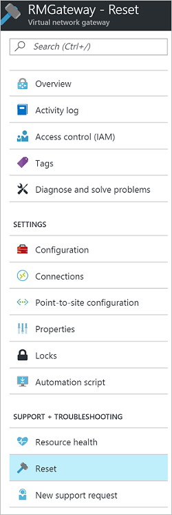

<properties
    pageTitle="重置 Azure VPN 网关以重新建立 IPsec 隧道 | Azure"
    description="本文逐步讲解如何通过重置 Azure VPN 网关来重新建立 IPsec 隧道。本文适用于经典和 Resource Manager 部署模型中的 VPN 网关。"
    services="vpn-gateway"
    documentationcenter="na"
    author="cherylmc"
    manager="timlt"
    editor=""
    tags="azure-resource-manager,azure-service-management" />
<tags
    ms.assetid="79d77cb8-d175-4273-93ac-712d7d45b1fe"
    ms.service="vpn-gateway"
    ms.devlang="na"
    ms.topic="article"
    ms.tgt_pltfrm="na"
    ms.workload="infrastructure-services"
    ms.date="04/12/2017"
    wacn.date="05/31/2017"
    ms.author="cherylmc" />  

# 重置 VPN 网关

如果丢失了一个或多个站点到站点 VPN 隧道上的跨界 VPN 连接，重置 Azure VPN 网关会非常有用。在此情况下，你的本地 VPN 设备都在正常工作，但却无法与 Azure VPN 网关建立 IPsec 隧道。本文将指导你完成重置 Azure VPN 网关。

每个 Azure VPN 网关都是一个虚拟网络网关，由在主动-待机配置中运行的两个 VM 实例组成。重置网关时，它会重启网关，然后对其重新应用跨界配置。该网关将保留现有的公共 IP 地址。这意味着不需要使用 Azure VPN 网关的新公共 IP 地址更新 VPN 路由器配置。

发出命令后，将立即重新启动 Azure VPN 网关的当前活动实例。从活动实例（正在重新启动）故障转移到备用实例期间会有一个短暂的时间间隔。该时间间隔应不超过 1 分钟。

如果在首次重新启动后未恢复连接，再次发出同一命令以重新启动第二个 VM 实例（新活动网关）。如果连续请求两次重新启动，则重新启动这两个 VM 实例（活动和备用）的时间可能略长一些。这种情况会导致 VPN 连接出现较长的时间间隔，VM 需要最多 2 到 4 分钟才能完成重新启动。

在两次重启之后，如果仍然遇到跨界连接问题，请从 Azure 门户预览提出支持请求。

## 开始之前
在重置网关之前，请为每个 IPsec 站点到站点 (S2S) VPN 隧道验证下面列出的重要项目。如果项目中存在任何不匹配，将导致 S2S VPN 隧道断开连接。验证并更正本地网关和 Azure VPN 网关的配置能够避免网关上其他正在工作的连接出现不必要的重新启动和中断。

在重置网关之前，请检查以下各项：

* 在 Azure 和本地 VPN 策略中，为 Azure VPN 网关和本地 VPN 网关配置的 Internet IP 地址 (VIP) 正确。
* 在 Azure 和本地 VPN 网关上，预共享的密钥必须相同。
* 如果应用特定的 IPsec/IKE 配置，如加密、哈希算法和 PFS（完全向前保密），请确保 Azure 和本地 VPN 网关具有相同的配置。

## 使用 Azure 门户预览重置 VPN 网关

可以使用 Azure 门户预览重置 Resource Manager VPN 网关。如果想要重置经典网关，请参阅 [PowerShell](#resetclassic) 步骤。

### Resource Manager 部署模型

1. 打开 Azure 门户预览并导航到想要重置的 Resource Manager 虚拟网络网关。
2. 在虚拟网络网关的边栏选项卡上，单击“重置”。

	  

3. 在“重置”边栏选项卡，单击  按钮。

## 使用 PowerShell 重置 VPN 网关

### Resource Manager 部署模型

需要最新版本的 PowerShell cmdlet。有关详细信息，请参阅[如何安装和配置 Azure PowerShell](https://docs.microsoft.com/powershell/azureps-cmdlets-docs)。用于重置网关的 PowerShell Resource Manager cmdlet 为 `Reset-AzureRmVirtualNetworkGateway`。以下示例重置资源组“TestRG1”中的 Azure VPN 网关“VNet1GW”。

    $gw = Get-AzureRmVirtualNetworkGateway -Name VNet1GW -ResourceGroup TestRG1
    Reset-AzureRmVirtualNetworkGateway -VirtualNetworkGateway $gw

### 经典部署模型

需要最新版本的 PowerShell cmdlet。有关详细信息，请参阅[如何安装和配置 Azure PowerShell](https://docs.microsoft.com/powershell/azureps-cmdlets-docs)。用于重置 Azure VPN 网关的 PowerShell cmdlet 为 `Reset-AzureVNetGateway`。以下示例重置名为“ContosoVNet”的虚拟网络的 Azure VPN 网关。

    Reset-AzureVNetGateway -VnetName "ContosoVNet" 

结果：

    Error          :
    HttpStatusCode : OK
    Id             : f1600632-c819-4b2f-ac0e-f4126bec1ff8
    Status         : Successful
    RequestId      : 9ca273de2c4d01e986480ce1ffa4d6d9
    StatusCode     : OK

<!---HONumber=Mooncake_0227_2017-->
<!--Update_Description: add a new portal solution and delete "next step"->