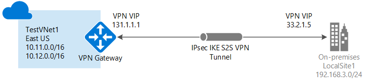

<properties
    pageTitle="将本地网络连接到 Azure 虚拟网络：站点到站点 VPN：经典管理门户 | Azure"
    description="通过公共 Internet 创建从本地网络到 Azure 虚拟网络的 IPsec 连接的步骤。 这些步骤可帮助使用经典管理门户和经典部署模型创建跨界站点到站点 VPN 网关连接。"
    services="vpn-gateway"
    documentationcenter=""
    author="cherylmc"
    manager="timlt"
    editor=""
    tags="azure-service-management" />
<tags
    ms.assetid="024ecb29-64de-4ff1-84f1-1a45a8595f0b"
    ms.service="vpn-gateway"
    ms.devlang="na"
    ms.topic="hero-article"
    ms.tgt_pltfrm="na"
    ms.workload="infrastructure-services"
    ms.date="04/11/2017"
    wacn.date="05/25/2017"
    ms.author="cherylmc"
    ms.translationtype="Human Translation"
    ms.sourcegitcommit="8fd60f0e1095add1bff99de28a0b65a8662ce661"
    ms.openlocfilehash="8297d170c951fe5af7b11324dfbbe229931fdd08"
    ms.contentlocale="zh-cn"
    ms.lasthandoff="05/12/2017" />

# 使用经典管理门户创建具有站点到站点连接的 VNet

站点到站点 (S2S) VPN 网关连接是通过 IPsec/IKE（IKEv1 或 IKEv2）VPN 隧道建立的连接。 这种类型的连接要求 VPN 设备位于本地，并且分配有公共 IP 地址，不在 NAT 的后面。 站点到站点连接可以用于跨界和混合配置。

本文逐步讲解如何经典部署模型和经典管理门户创建一个虚拟网络和一个连接到本地网络的站点到站点 VPN 网关连接。 站点到站点连接可以用于跨界和混合配置。 也可为 Resource Manager 部署模型创建该配置，只需从以下列表中选择另一选项即可：
> [AZURE.SELECTOR]
- [Resource Manager - Azure 门户预览](/documentation/articles/vpn-gateway-howto-site-to-site-resource-manager-portal/)
- [Resource Manager - PowerShell](/documentation/articles/vpn-gateway-create-site-to-site-rm-powershell/)
- [经典 - Azure 门户预览](/documentation/articles/vpn-gateway-howto-site-to-site-classic-portal/)
- [经典 - 经典管理门户](/documentation/articles/vpn-gateway-site-to-site-create/)

#### 其他配置
如果想要将多个 VNet 连接到一起，请参阅 [为经典部署模型配置 VNet 到 VNet 连接](/documentation/articles/virtual-networks-configure-vnet-to-vnet-connection/)。 如果想要向已具有连接的 VNet 添加站点到站点连接，请参阅[使用现有 VPN 网关连接将 S2S 连接添加到 VNet](/documentation/articles/vpn-gateway-multi-site/)。

## 开始之前

[AZURE.INCLUDE [deployment models](../../includes/vpn-gateway-deployment-models-include.md)]

在开始配置之前，请确认具有以下各项：

* 一台兼容的 VPN 设备和能够对其进行配置的人员。 请参阅 [关于 VPN 设备](/documentation/articles/vpn-gateway-about-vpn-devices/)。 如果不熟悉 VPN 设备的配置，或者不熟悉本地网络配置中的 IP 地址范围，请咨询能够提供此类详细信息的人员。
* 一个用于 VPN 设备的面向外部的公共 IP 地址。 此 IP 地址不得位于 NAT 之后。
* Azure 订阅。 如果还没有 Azure 订阅，可以注册一个[试用帐户](/pricing/1rmb-trial)。

## 创建虚拟网络
1. 登录到 [Azure 经典管理门户](https://manage.windowsazure.cn/)。
2. 在屏幕左下角，单击“新建”。 在导航窗格中，单击“网络服务”，然后单击“虚拟网络”。 单击“自定义创建”以启动配置向导  。
3. 若要创建 VNet，请在以下页面中输入配置设置：

## 虚拟网络详细信息页
输入以下信息：

* **名称**- 为虚拟网络命名。 例如， *ChinaEastVNet*。 在部署你的 VM 和 PaaS 实例时，将使用此虚拟网络名称，因此最好不要让此名称太复杂。
* **位置**：位置直接与你想让资源 (VM) 驻留在的物理位置（区域）有关。 例如，如果你希望部署到此虚拟网络的 VM 的物理位置位于 *中国东部*，请选择该位置。 创建虚拟网络后，将无法更改与虚拟网络关联的区域。

## DNS 服务器和 VPN 连接页
请输入以下信息，然后单击右下的“下一步”箭头。

* **DNS 服务器**：输入 DNS 服务器名称和 IP 地址，或从快捷菜单中选择一个以前注册的 DNS 服务器。 此设置不创建 DNS 服务器。 此设置允许指定要用于对此虚拟网络进行名称解析的 DNS 服务器。
* **配置站点到站点 VPN**：选中“配置站点到站点 VPN”复选框。
* **本地网络**：本地网络代表物理本地位置。 可以选择以前创建的本地网络，也可以创建一个新的本地网络。 但是，如果选择使用之前创建的本地网络，请转到“本地网络”配置页面，并验证 VPN 设备的 VPN 设备 IP 地址（面向公众的 IPv4 地址）是否正确。

## 站点到站点连接页
如果要创建新的本地网络，则会看到“站点到站点连接”页。 如果要使用此前创建的本地网络，则此页不会显示在向导中，可以转到下一部分。

请输入以下信息，然后单击“下一步”箭头。

* **名称**：希望用于称呼本地（内部）网络站点的名称。
* **VPN 设备 IP 地址**：本地 VPN 设备面向公众的 IPv4 地址，将使用该地址连接到 Azure。 VPN 设备不能位于 NAT 之后。
* **地址空间**：包括“起始 IP”和 CIDR（地址计数）。 指定要通过虚拟网关发送到本地内部位置的地址范围。 如果目标 IP 地址处于此处指定的范围之内，则通过虚拟网络网关来路由它。
* **添加地址空间**：如果拥有多个要通过虚拟网关发送的地址范围，请指定每个额外的地址范围。 可以稍后在“本地网络”页中添加或删除范围。

## 虚拟网络地址空间页
指定要用于虚拟网络的地址范围。 这些都是动态 IP 地址 (DIPS)，将分配给你部署到此虚拟网络的 VM 和其他角色实例。

所选范围不要与本地网络所用范围重叠，这一点尤其重要。 需要与网络管理员协调。 网络管理员可能需要从本地网络地址空间为你划分一个 IP 地址范围，以供你的虚拟网络使用。

输入以下信息，然后单击右下角的复选标记以配置你的网络。

* **地址空间**：包括起始 IP 和地址计数。 请验证你指定的地址空间不与本地网络的任一个地址空间相重叠。
* **添加子网**：包括起始 IP 和地址计数。 附加的子网不是必需的，但你可能需要为具有静态 DIP 的 VM 创建一个单独的子网。 或者，你可能需要在子网中拥有与其他角色实例分开的 VM。
* **添加网关子网**：单击此项可添加网关子网。 网关子网仅用于此虚拟网络网关，并且是此配置必需的。

单击页面底部的复选标记，此时将开始创建虚拟网络。 创建完成时，将在 Azure 经典管理门户的“网络”页上看到“状态”下列出的“已创建”。 创建 VNet 之后，便可以配置虚拟网关。

[AZURE.INCLUDE [vpn-gateway-no-nsg](../../includes/vpn-gateway-no-nsg-include.md)]

## 配置虚拟网络网关
配置虚拟网络网关，创建安全的站点到站点连接。 请参阅[在 Azure 经典管理门户中配置虚拟网关](/documentation/articles/vpn-gateway-configure-vpn-gateway-mp/)。

## 后续步骤
 连接完成后，即可将虚拟机添加到虚拟网络。 有关详细信息，请参阅[虚拟机](/documentation/services/virtual-machines/)。

<!--Update_Description: wording update-->