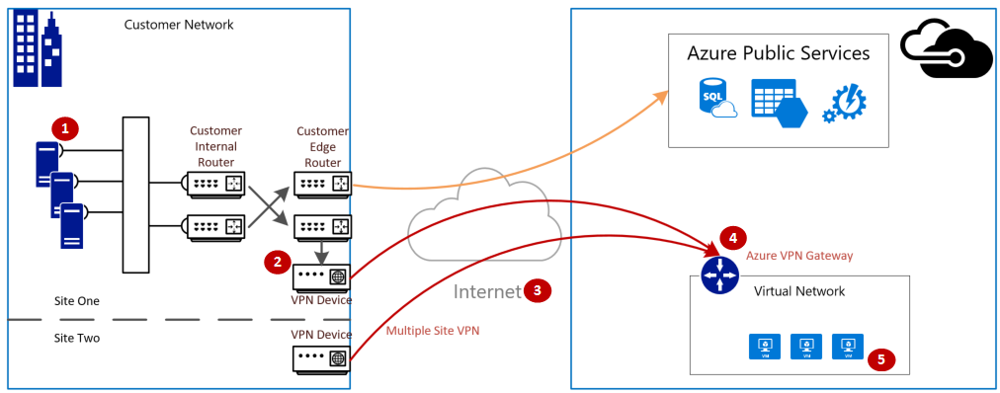
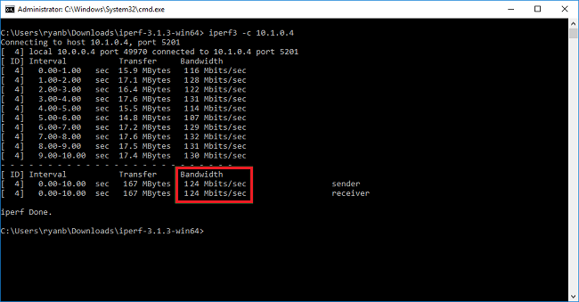
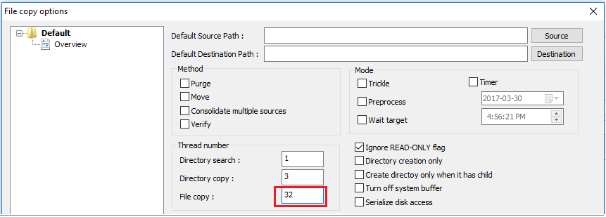
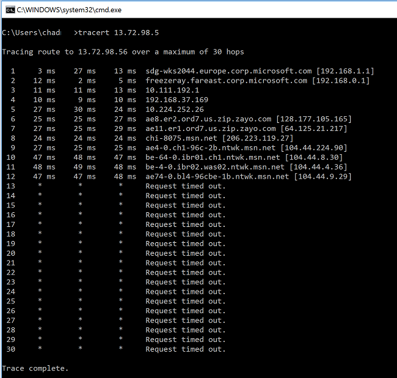

<properties
    pageTitle="验证 Azure 虚拟网络的 VPN 吞吐量 | Azure"
    description="本文旨在帮助用户验证从本地资源到达 Azure 虚拟机的网络吞吐量。"
    services="vpn-gateway"
    documentationcenter="na"
    author="chadmath"
    manager="jasmc"
    editor=""
    tags="azure-resource-manager,azure-service-management" />
<tags
    ms.assetid=""
    ms.service="vpn-gateway"
    ms.devlang="na"
    ms.topic="article"
    ms.tgt_pltfrm="na"
    ms.workload="infrastructure-services"
    ms.date="04/10/2017"
    wacn.date="05/22/2017"
    ms.author="radwiv;chadmat;genli"
    ms.translationtype="Human Translation"
    ms.sourcegitcommit="8fd60f0e1095add1bff99de28a0b65a8662ce661"
    ms.openlocfilehash="2c5e8cd6eb3f24d018f95c293b5e3bf82c2722f3"
    ms.contentlocale="zh-cn"
    ms.lasthandoff="05/12/2017" />

# 如何验证到达虚拟网络的 VPN 吞吐量

通过 VPN 网关连接，可以在 Azure 内的虚拟网络与本地 IT 基础结构之间创建安全的跨界连接。

本文演示如何验证从本地资源到达 Azure 虚拟机的网络吞吐量， 还会提供故障排除指南。

>[AZURE.NOTE]
>本文旨在帮助诊断并解决常见的问题。 如果使用以下信息无法解决问题，请[与支持人员联系](/support/contact/)。
>
>

## 概述

VPN 网关连接涉及以下组件：

- 本地 VPN 设备（请查看包含[已验证的 VPN 设备](/documentation/articles/vpn-gateway-about-vpn-devices/#devicetable)的列表）。
- 公共 Internet
- Azure VPN 网关
- Azure 虚拟机

下图显示的是通过 VPN 建立的从本地网络至 Azure 虚拟网络的逻辑连接。

## 计算最大的预期流入/流出量

1.    确定应用程序的基准吞吐量需求。
2.    确定 Azure VPN 网关的吞吐量限制。 有关帮助，请参阅[规划和设计 VPN 网关](/documentation/articles/vpn-gateway-plan-design/)的“按 SKU 和 VPN 类型列出的聚合吞吐量”部分。
3.    确定与 VM 大小相应的 [Azure VM 吞吐量指南](/documentation/articles/virtual-machines-windows-sizes/)。
4.    确定 Internet 服务提供商 (ISP) 的带宽。
5.    计算预期吞吐量 -（VM、网关、ISP）的最小带宽 * 0.8。

如果计算得出的吞吐量无法满足应用程序的基准吞吐量需求，则需提高已被确定为瓶颈的资源的带宽。 若要调整 Azure VPN 网关的大小，请参阅[更改网关 SKU](/documentation/articles/vpn-gateway-about-vpn-gateway-settings/#gwsku)。 若要调整虚拟机的大小，请参阅[调整 VM 的大小](/documentation/articles/virtual-machines-windows-resize-vm/)。 如果 Internet 的带宽不及预期，可能还需要联系 ISP。

## 使用性能工具验证网络吞吐量

此验证应在非高峰时段执行，因为测试期间的 VPN 隧道吞吐量饱和度无法给出准确的结果。

此测试将使用 iPerf 工具来实施，此工具在 Windows 和 Linux 上均可使用，并且有“客户端”和“服务器”两种模式。 对于 Windows VM，其限速为 3 Gbps。

此工具不会对磁盘执行任何读/写操作。 它只会生成从一端至另一端的自生成 TCP 流量。 它已生成的统计信息基于各种旨在测量客户端和服务器节点间可用带宽的试验。 在两个节点间进行测试时，一个节点充当服务器，另一个则充当客户端。 完成此测试后，建议对调两个节点的角色，以测试它们的上传和下载吞吐量。

### 下载 iPerf
下载 [iPerf](https://iperf.fr/download/iperf_3.1/iperf-3.1.2-win64.zip)。 有关详情，请参阅 [iPerf 文档](https://iperf.fr/iperf-doc.php)。

 >[AZURE.NOTE]
 >本文所讨论的第三方产品由独立于 Microsoft 的公司生产。 Microsoft 对这些产品的性能和可靠性不作任何明示或默示担保。
 >
 >

### 运行 iPerf (iperf3.exe)
1. 启用允许流量的 NSG/ACL 规则（适用于在 Azure VM 上进行公共 IP 地址测试）。

2. 在两个节点上，为端口 5001 启用防火墙例外。

    **Windows：**以管理员身份运行以下命令：

        netsh advfirewall firewall add rule name="Open Port 5001" dir=in action=allow protocol=TCP localport=5001

    若要在测试完成后删除规则，请运行此命令：

        netsh advfirewall firewall delete rule name="Open Port 5001" protocol=TCP localport=5001

     
    **Azure Linux：**Azure Linux 映像都具有限制性较低的防火墙。 如果有应用程序在侦听某个端口，则流量会被允许通过。 受保护的自定义映像可能需要显式打开端口。 常见的 Linux OS 层防火墙包括 `iptables`、`ufw` 或 `firewalld`。

3. 在服务器节点上，更改为从中提取 iperf3.exe 的目录。 然后，在服务器模式下运行 iPerf 并将其设置为侦听端口 5001，如以下命令所示：

         cd c:\iperf-3.1.2-win65

         iperf3.exe -s -p 5001

4. 在客户端节点上，转到从中提取 iperf 工具的目录，然后运行以下命令：

        iperf3.exe -c <IP of the iperf Server> -t 30 -p 5001 -P 32

    客户端会将端口 5001 的流量引入服务器，持续时间为 30 秒。 标志“-P”，表明正同时使用 32 个连至服务器节点的连接。

    以下屏幕显示了本示例中的输出：

    

5. （可选）若要保留测试结果，请运行以下命令：

        iperf3.exe -c IPofTheServerToReach -t 30 -p 5001 -P 32  >> output.txt

6. 完成上述步骤后，请调换角色以使服务器节点变为客户端节点（反之亦然），然后执行相同的步骤。

## 解决文件复制速度缓慢问题
在使用 Windows 资源管理器时，或者在通过 RDP 会话进行拖放时，文件的复制速度可能会很缓慢。 此问题通常是由以下的一个或两个因素造成的：

- 文件复制应用程序（如 Windows 资源管理器和 RDP）在复制文件时没有使用多个线程。 为了提高性能，请通过多线程文件复制应用程序（如 [Richcopy](https://technet.microsoft.com/magazine/2009.04.utilityspotlight.aspx)）使用 16 或 32 个线程来复制文件。 若要更改 Richcopy 中的文件复制线程数目，请单击“操作” > “复制选项” > “文件复制”。  
 
- VM 磁盘读/写速度不够快。 有关详细信息，请参阅 [Azure 存储故障排除](/documentation/articles/storage-e2e-troubleshooting/)。

## 本地设备上的对外接口
如果 Azure 中的[本地网络](/documentation/articles/vpn-gateway-howto-site-to-site-resource-manager-portal/#LocalNetworkGateway)定义中包含本地 VPN 设备面向 Internet 的 IP 地址，则可能会出现 VPN 无法显示、偶发性断连或性能问题。

## 检查延迟
请使用 tracert 跟踪 Azure 边缘设备，以确定跃点间是否存在任何超过 100 毫秒的延迟。

通过本地网络，针对 Azure 网关或 VM 的 VIP 运行 *tracert*。 当看到只返回了 *，则代表已到达 Azure 的边缘。 如果看到返回了包含“MSN”的 DNS 名称，则代表已到达 Microsoft 的主干。  

## 后续步骤
有关详细信息或帮助，请查看以下链接：

- [优化 Azure 虚拟机网络吞吐量](/documentation/articles/virtual-network-optimize-network-bandwidth/)
- [Azure.cn 支持部门](/support/contact/)