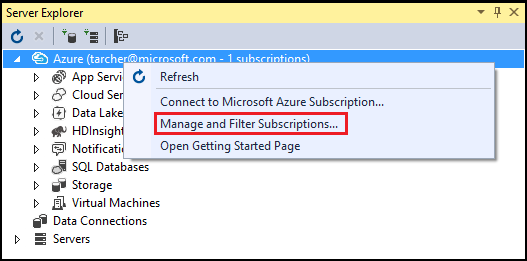
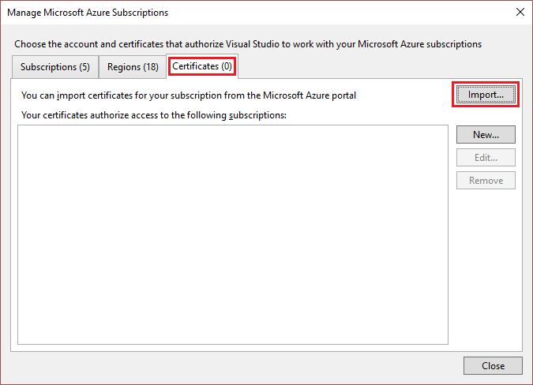
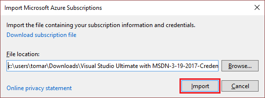

<properties 
   pageTitle="使用 Visual Studio 访问私有 Azure 云 | Azure"
   description="了解如何通过使用 Visual Studio 访问私有云资源。"
   services="visual-studio-online"
   documentationCenter="na"
   authors="TomArcher"
   manager="douge"
   editor="" />  

<tags 
	ms.assetid="9d733c8d-703b-44e7-a210-bb75874c45c8"
	ms.service="multiple"
	ms.devlang="dotnet"
	ms.topic="article"
	ms.tgt_pltfrm="na"
	ms.workload="multiple"
	ms.date="11/11/2016"
	ms.author="tarcher"
	wacn.date="02/04/2017" />

# 使用 Visual Studio 访问私有 Azure 云

##概述

默认情况下，Visual Studio 支持公有 Azure 云 REST 终结点。但如果你将 Visual Studio 用于私有 Azure 云，这可能是个问题。你可以使用证书将 Visual Studio 配置为访问私有 Azure 云 REST 终结点。可通过 Azure 发布设置文件获取这些证书。

## 在 Visual Studio 中访问私有 Azure 云

1. 在私有云的经典管理门户中下载你的发布设置文件，或与管理员联系以获取发布设置文件。在 Azure 的公共版中，用于下载的链接是 [https://manage.windowsazure.cn/publishsettings/](https://manage.windowsazure.cn/publishsettings/)。（下载的文件的扩展名应为 .publishsettings。）

1. 在 Visual Studio 中的“服务器资源管理器”中，选择“Azure”节点，然后在快捷菜单上选择“管理订阅”命令。

    

1. 在“管理 Microsoft Azure 订阅”对话框中，选择“证书”选项卡，然后选择“导入”按钮。

    

1. 在“导入 Microsoft Azure 订阅”对话框中，浏览到保存发布设置文件的文件夹，选择文件，然后选择“导入”按钮。这会将发布设置文件中的证书导入到 Visual Studio 中。现在，你应该能够与你的私有云资源进行交互。

      

## 后续步骤

[从 Visual Studio 发布到 Azure 云服务](https://msdn.microsoft.com/zh-cn/library/azure/ee460772.aspx)

[如何：下载并导入发布设置和订阅信息](https://msdn.microsoft.com/zh-cn/library/dn385850(v=nav.70).aspx)

<!---HONumber=Mooncake_0815_2016-->