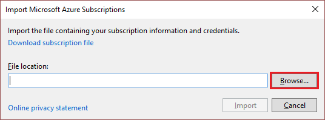
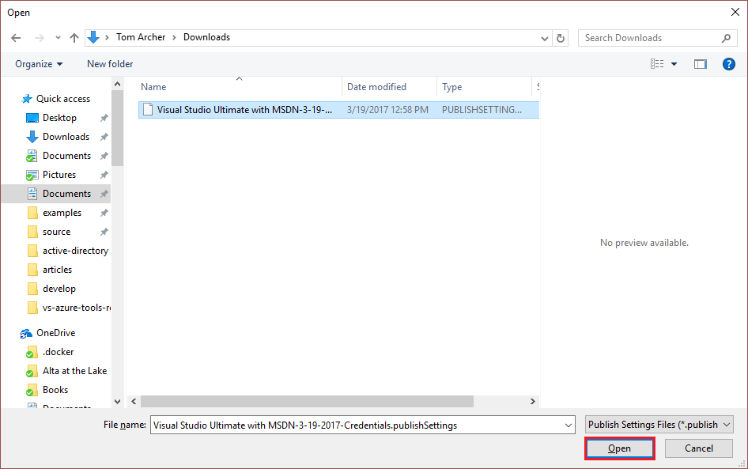

<properties
    pageTitle="使用 Visual Studio 访问私有 Azure 云 | Azure"
    description="了解如何通过使用 Visual Studio 访问私有云资源。"
    services="visual-studio-online"
    documentationcenter="na"
    author="TomArcher"
    manager="douge"
    editor=""
    translationtype="Human Translation" />
    
<tags
    ms.assetid="9d733c8d-703b-44e7-a210-bb75874c45c8"
    ms.service="multiple"
    ms.devlang="dotnet"
    ms.topic="article"
    ms.tgt_pltfrm="na"
    ms.workload="multiple"
    ms.date="03/19/2017"
    wacn.date="04/17/2017"
    ms.author="tarcher"
    ms.sourcegitcommit="7cc8d7b9c616d399509cd9dbdd155b0e9a7987a8"
    ms.openlocfilehash="f538823053ecbc43f01846bbed5c41bbaf99f148"
    ms.lasthandoff="04/07/2017" />

# 使用 Visual Studio 访问私有 Azure 云
默认情况下，Visual Studio 支持公有 Azure 云 REST 终结点。 在本主题中，将介绍如何使用私有云证书访问 Visual Studio 中的私有云并与之交互。

## 在 Visual Studio 中访问私有 Azure 云
1. 在私有云的 [Azure 经典管理门户](https://manage.windowsazure.cn)中下载你的发布设置文件，或与管理员联系以获取发布设置文件。 在 Azure 的公共版中，用于下载的链接是 [https://manage.windowsazure.cn/publishsettings/](https://manage.windowsazure.cn/publishsettings/)。 （下载的文件应使用 `.publishsettings` 扩展名）

2. 打开 Visual Studio

3. 在“服务器资源管理器”中，右键单击“Azure”节点，然后选择上下文菜单中的”管理和筛选订阅”。

    

4. 在“管理 Azure 订阅”对话框中，选择“证书”选项卡，然后选择“导入”。

    

5. 在“导入 Azure 订阅”对话框中，选择“浏览”。

    

6. 在“打开”对话框中，浏览到保存发布设置文件的目录，再选择文件，然后选择“打开”。

    

7. 返回到“导入 Azure 订阅”对话框时，选择“导入”。

    

    证书已从发布设置文件导入到 Visual Studio 中，现可与私有云资源进行交互。

## 后续步骤
- [从 Visual Studio 发布到 Azure 云服务](https://msdn.microsoft.com/zh-cn/library/azure/ee460772.aspx)
- [如何：下载并导入发布设置和订阅信息](https://msdn.microsoft.com/zh-cn/library/dn385850\(v=nav.70\).aspx)

<!-- Update_Description: wording update -->