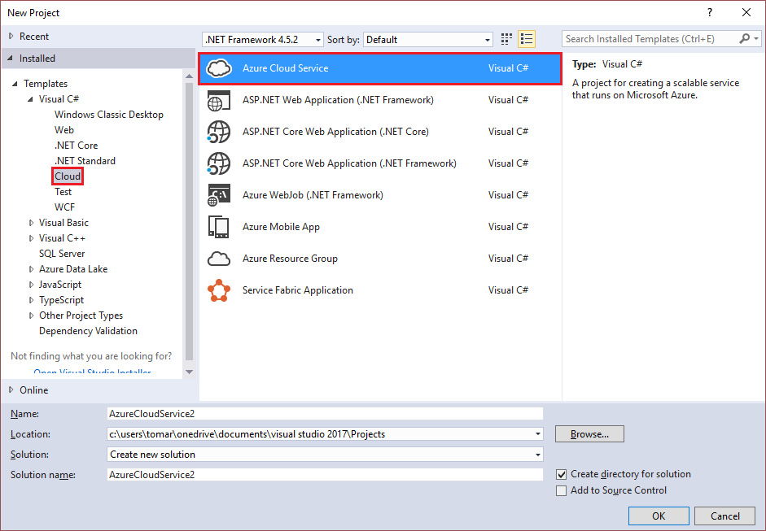
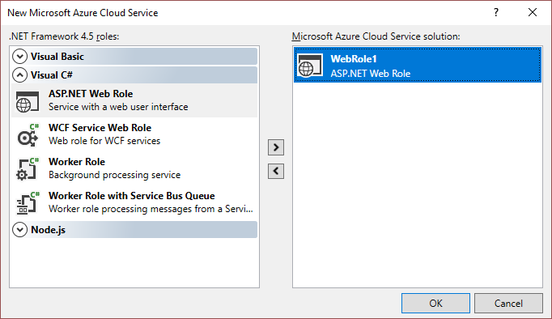
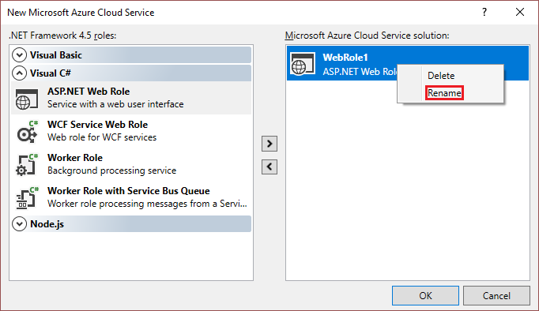

<properties
    pageTitle="使用 Visual Studio 创建 Azure 云服务项目 | Azure"
    description="了解如何使用 Visual Studio 创建 Azure 云服务项目"
    services="visual-studio-online"
    documentationcenter="na"
    author="TomArcher"
    manager="douge"
    editor="" />
<tags
    ms.assetid="ec580df7-3dcc-45a9-a1d9-8c110678dfb5"
    ms.service="multiple"
    ms.devlang="multiple"
    ms.topic="article"
    ms.tgt_pltfrm="na"
    ms.workload="na"
    ms.date="03/21/2017"
    wacn.date="05/22/2017"
    ms.author="tarcher"
    ms.translationtype="Human Translation"
    ms.sourcegitcommit="8fd60f0e1095add1bff99de28a0b65a8662ce661"
    ms.openlocfilehash="0e18e212960912b3441d788c2d79f6eb69d35d93"
    ms.contentlocale="zh-cn"
    ms.lasthandoff="05/12/2017" />

# 使用 Visual Studio 创建 Azure 云服务项目
Azure Tools for Visual Studio 提供了可用于创建 Azure 云服务的项目模板。 创建项目后，可通过 Visual Studio 调试、配置云服务，并将其部署到 Azure。

## 在 Visual Studio 中创建 Azure 云服务项目的步骤
本节将介绍如何在 Visual Studio 中创建具有一个或多个 Web 角色的 Azure 云服务项目。  

1. 以管理员身份启动 Visual Studio。

2. 在主菜单中，选择“文件” > “新建” > “项目”。

3. 从 Visual C# 或 Visual Basic 项目模板节点中选择“云”，然后从模板列表中选择“Azure 云服务”。

    

4. 指定要用于开发项目的 .NET Framework 版本。

5. 输入项目的名称和位置以及解决方案的名称。 

6. 选择“确定” 。

7. 在“新建 Azure 云服务”对话框中，选择要添加的角色，然后选择右箭头按钮以将其添加到解决方案。

    

8. 若要重命名已添加的角色，请在“新建 Azure 云服务”对话框中将鼠标悬停在该角色上，然后从上下文菜单中选择“重命名”。 还可在添加角色后在解决方案（**解决方案资源管理器**中）内对其进行重命名。

    

Visual Studio Azure 项目与解决方案中的角色项目具有关联。 该项目还包括服务定义文件和服务配置文件：

- **服务定义文件** - 定义了应用程序的运行时设置，包括所需角色、终结点和虚拟机大小。 
- **服务配置文件** - 配置了角色有多少实例在运行以及为角色定义的设置的值。 

有关这些文件的详细信息，请参阅[使用 Visual Studio 配置 Azure 云服务的角色](/documentation/articles/vs-azure-tools-configure-roles-for-cloud-service/)。

## 后续步骤
- [使用 Visual Studio 管理 Azure 云服务项目中的角色](/documentation/articles/vs-azure-tools-cloud-service-project-managing-roles/)

<!-- Update_Description: link update -->