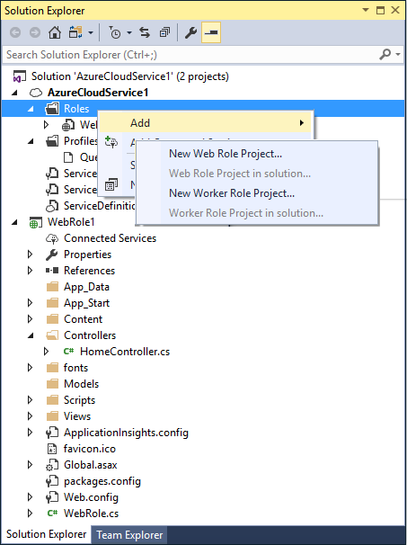
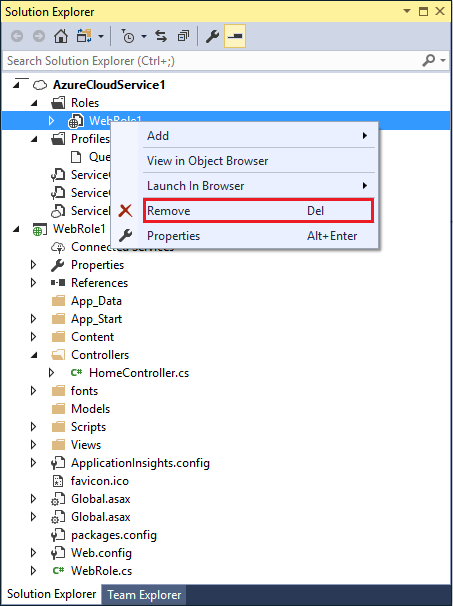

<properties
    pageTitle="使用 Visual Studio 管理 Azure 云服务中的角色 | Azure"
    description="了解如何使用 Visual Studio 在 Azure 云服务中添加和删除角色。"
    services="visual-studio-online"
    documentationcenter="na"
    author="TomArcher"
    manager="douge"
    editor="" />
<tags
    ms.assetid="5ec9ae2e-8579-4e5d-999e-8ae05b629bd1"
    ms.service="multiple"
    ms.devlang="dotnet"
    ms.topic="article"
    ms.tgt_pltfrm="na"
    ms.workload="multiple"
    ms.date="03/21/2017"
    wacn.date="05/22/2017"
    ms.author="tarcher"
    ms.translationtype="Human Translation"
    ms.sourcegitcommit="8fd60f0e1095add1bff99de28a0b65a8662ce661"
    ms.openlocfilehash="523255fe334fb770b1ca83ba4420d67ff5c48737"
    ms.contentlocale="zh-cn"
    ms.lasthandoff="05/12/2017" />

# 使用 Visual Studio 管理 Azure 云服务中的角色
创建 Azure 云服务后，即可向其添加新角色或从中删除现有角色。 你也可以导入现有项目并将其转换为角色。 例如，你可以导入 ASP.NET Web 应用程序并将其指定为 Web 角色。

## 将角色添加到 Azure 云服务
以下步骤指导如何在 Visual Studio 中将 Web 或辅助角色添加到 Azure 云服务项目。

1. 在 Visual Studio 中创建或打开 Azure 云服务项目。

2. 在“解决方案资源管理器”中，展开项目节点

3. 右键单击“角色”节点以显示上下文菜单。 从上下文菜单中，选择“添加”，然后从当前解决方案中选择现有 Web 角色或辅助角色，或创建新的 Web 或辅助角色项目。 还可以选择适当的项目（如 ASP.NET Web 应用程序项目），然后将其与角色项目相关联。

    

## 从 Azure 云服务删除角色
以下步骤指导如何在 Visual Studio 中从 Azure 云服务项目删除 Web 或辅助角色。

1. 在 Visual Studio 中创建或打开 Azure 云服务项目。

2. 在“解决方案资源管理器”中，展开项目节点

3. 展开“角色”节点。

4. 右键单击要删除的节点，然后从上下文菜单中选择“删除”。 

    

## 将角色重新添加到 Azure 云服务项目
如果你从云服务项目中删除了角色，但后来又决定将该角色添加回项目中，则只会添加角色声明和基本特性，如终结点和诊断信息。 不会向 `ServiceDefinition.csdef` 文件或 `ServiceConfiguration.cscfg` 文件添加其他资源或引用。 如果你想添加此类信息，则需要将其手动添加回这些文件中。

例如，你可能删除了 Web 服务角色，但后来又决定将此角色添加回解决方案中。 如果这样做，会出现错误。 为了防止出现此错误，必须将以下 XML 中显示的 `<LocalResources>` 元素添加回 `ServiceDefinition.csdef` 文件中。 使用添加回项目中的 Web 服务角色的名称作为 **<LocalStorage>** 元素的名称特性的一部分。 在此示例中，Web 服务角色的名称为 **WCFServiceWebRole1**。

    <WebRole name="WCFServiceWebRole1">
        <Sites>
          <Site name="Web">
            <Bindings>
              <Binding name="Endpoint1" endpointName="Endpoint1" />
            </Bindings>
          </Site>
        </Sites>
        <Endpoints>
          <InputEndpoint name="Endpoint1" protocol="http" port="80" />
        </Endpoints>
        <Imports>
          <Import moduleName="Diagnostics" />
        </Imports>
       <LocalResources>
          <LocalStorage name="WCFServiceWebRole1.svclog" sizeInMB="1000" cleanOnRoleRecycle="false" />
       </LocalResources>
    </WebRole>

## 后续步骤
- [使用 Visual Studio 配置 Azure 云服务的角色](/documentation/articles/vs-azure-tools-configure-roles-for-cloud-service/)

<!-- Update_Description: wording update -->