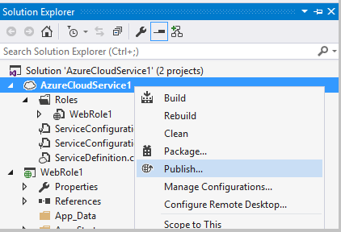

<properties
   pageTitle="准备从 Visual Studio 发布或部署 Azure 应用程序 | Azure"
   description="了解设置云服务和存储帐户服务以及配置 Azure 应用程序的过程。"
   services="visual-studio-online"
   documentationCenter="na"
   authors="TomArcher"
   manager="douge"
   editor="" />  

<tags
   ms.service="multiple"
   ms.date="05/08/2016"
   wacn.date="08/22/2016" />

# 准备从 Visual Studio 发布或部署 Azure 应用程序

## 概述

在发布云服务项目之前，必须先设置以下服务：

- 一个**云服务**，用于在 Azure 环境中运行你的角色。

- 一个**存储帐户**，提供对 Blob、队列和表服务的访问权限。

使用以下过程设置这些服务并配置应用程序：

## 创建云服务

若要将云服务发布到 Azure，首先必须创建一个云服务，它将在 Azure 环境中运行你的角色。你可以在 Azure 经典管理门户中创建云服务，如本主题稍后的**使用 Azure 经典管理门户创建云服务**部分中所述。当你使用发布向导时，还可以在 Visual Studio 中创建云服务。

### 使用 Visual Studio 创建云服务

1. 打开 Azure 项目的快捷菜单，然后选择“发布”。

    

1. 如果你尚未登录，请使用与 Azure 订阅关联的 Microsoft 帐户或组织帐户的用户名和密码登录。

1. 选择“下一步”按钮进入“设置”页。

    

1. 在“云服务”列表中，选择“新建”。此时将显示“创建 Azure 服务”对话框。

1. 输入云服务的名称。该名称构成服务的 URL 部分，因此必须是全局唯一的。该名称不区分大小写。

### 使用 Azure 经典管理门户创建云服务

1. 在 Microsoft 网站上，登录到 [Azure 经典管理门户](http://go.microsoft.com/fwlink/?LinkId=253103)。

1. （可选）若要列表显示已创建的云服务，请从页面左侧，选择“云服务”链接。

1. 选择左下角的“+”图标，然后在显示的菜单中选择“云服务”。随即显示另一个屏幕，其中有“快速创建”和“自定义创建”两个选项。如果选择“快速创建”，则只需指定云服务的 URL 和实际承载区域，便可创建云服务。如果选择“自定义创建”，可以指定包（.cspkg 文件）、配置（.cscfg 文件）和证书，立即发布云服务。如果想要使用 Azure 项目中的“发布”命令来发布云服务，则无需选择“自定义创建”。Azure 项目的快捷菜单上提供了“发布”命令。

1. 选择“快速创建”，随后使用 Visual Studio 发布云服务。

1. 指定云服务的名称。完整 URL 显示在名称旁边。

1. 在列表中，选择大多数用户所在的区域。

1. 在窗口底部，选择“创建云服务”链接。

## 创建存储帐户

存储帐户提供对 Blob、队列和表服务的访问权限。你可以使用 Visual Studio 或 [Azure 经典管理门户](http://manage.windowsazure.cn)创建存储帐户。

### 使用 Visual Studio 创建存储帐户

1. 在“解决方案资源管理器”中，打开“存储”节点的快捷菜单，然后选择“创建存储帐户”。

    

1. 在“创建存储帐户”对话框中选择或输入新存储帐户的以下信息。
    - 要将存储帐户添加到的 Azure 订阅。
    - 要用于新存储帐户的名称。
    - 区域或地缘组（例如“美国西部”或“东亚”）。
    - 要用于存储帐户的复制类型，如“异地冗余”。

1. 完成后，选择“创建”。新存储帐户将显示在“服务器资源管理器”的“存储”列表中。

### 使用 Azure 经典管理门户创建存储帐户

1. 在 Microsoft 网站上，登录到 [Azure 经典管理门户](http://manage.windowsazure.cn)。

1. （可选）若要查看存储帐户，请在页面左侧的面板上，选择“存储”链接。

1. 在该页左下角，选择“+”图标。

1. 在显示的菜单上，选择“存储”，然后选择“快速创建”。

1. 为存储帐户提供一个名称，这将生成一个唯一 URL。

1. 为云服务提供一个名称。完整 URL 显示在名称旁边。

1. 在区域列表中，选择大多数用户所在的区域。

1. 指定是否启用异地复制。如果启用异地复制，数据将保存在多个物理位置，降低丢失的机率。此功能会提高存储成本，但在创建存储帐户时启用地理位置，而非稍后添加此功能，便可以降低成本。有关详细信息，请参阅 [Geo-replication（异地复制）](http://go.microsoft.com/fwlink/?LinkId=253108)。

1. 在窗口底部，选择“创建存储帐户”链接。

创建存储帐户之后，你将会看到可用于访问每个 Azure 存储服务中的资源的 URL，同时可看到帐户的主访问密钥和辅助访问密钥。可使用这些访问密钥验证对存储服务发出的请求。

>[AZURE.NOTE] 辅助访问密钥提供的对存储帐户的访问权与主访问密钥提供的对存储帐户的访问权相同，并在主访问密钥出现问题的情况下作为备份。此外，建议定期重新生成访问密钥。可在重新生成主密钥时，修改连接字符串设置以使用辅助密钥，然后可在重新生成辅助密钥时修改连接字符串以便重新生成主密钥。

## 将应用配置为使用存储帐户提供的服务

必须配置访问存储服务以使用你创建的 Azure 存储空间服务的任何角色。为此，可为 Azure 项目使用多个服务配置。默认情况下，其中两个配置是在 Azure 项目中创建的。通过使用多个服务配置，你可以在代码中使用相同的连接字符串，但在每个服务配置中为连接字符串使用不同的值。例如，你可以使用一个服务配置通过本地 Azure 存储模拟器来运行和调试应用程序，并使用另一个服务配置将应用程序发布到 Azure。有关服务配置的详细信息，请参阅 [使用多种服务配置来配置 Azure 项目](/documentation/articles/vs-azure-tools-multiple-services-project-configurations/)。

### 将应用程序配置为使用存储帐户提供的服务

1. 在 Visual Studio 中打开你的 Azure 解决方案。在解决方案资源管理器中，在访问存储服务的 Azure 项目中打开每个角色的快捷菜单，并选择“属性”。包含角色名称的页将显示在 Visual Studio 编辑器中。该页面显示“配置”选项卡的字段。

1. 在角色的属性页中，选择“设置”。

1. 在“服务配置”列表中，选择你要编辑的服务配置名称。如果要对角色的所有服务配置进行更改，则可选择“所有配置”。有关如何更新服务配置的详细信息，请参阅主题 [使用 Visual Studio 配置 Azure 云服务的角色](/documentation/articles/vs-azure-tools-configure-roles-for-cloud-service/)中的**管理存储帐户的连接字符串**部分。

1. 若要修改任何连接字符串设置，请选择该设置旁边的“…”按钮。此时将显示“创建存储连接字符串”对话框。

1. 在“连接时使用”下，选择“你的订阅”选项。

1. 在“订阅”列表中，选择你的订阅。如果列表不包括所需订阅，请选择“下载发布设置”链接。

1. 在“帐户名称”列表中，选择你的存储帐户名称。Azure Tools 使用 .publishsettings 文件自动获得存储帐户凭据。若要手动指定存储帐户凭据，请选择“手动输入凭据”选项，然后继续此过程。存储帐户的名称和主密钥可以从 [Azure 经典管理门户](http://manage.windowsazure.cn)获得。如果不想手动指定存储帐户设置，请选择“确定”按钮，关闭此对话框。

1. 选择“输入存储帐户凭据”链接。

1. 在“帐户名称”框中，输入存储帐户的名称。

    >[AZURE.NOTE] 登录到经典[Azure 经典门户](http://manage.windowsazure.cn/)，然后选择“存储”按钮。门户将显示存储帐户的列表。如果你选择一个帐户，将打开该帐户的页面。从中可以复制存储帐户的名称。如果你正在使用以前版本的经典管理门户，存储帐户的名称将显示在经典管理门户的“存储帐户”视图中。若要复制此名称，请在此视图的“属性”窗口中突出显示它，然后按 Ctrl+C 键。若要将此名称粘贴到 Visual Studio 中，请选择“帐户名称”文本框，然后按 Ctrl+V 键。

1. 在“帐户密钥”框中，输入主密钥，或从 [Azure 经典管理门户](http://manage.windowsazure.cn)中进行复制粘贴。若要复制此密钥，请执行以下操作：

    1. 在相应存储帐户的页面底部，选择“管理密钥”按钮。

    1. 在“管理密钥访问权限”页面上，选择主访问密钥的文本，然后按 Ctrl+C 键。

    1. 在 Azure Tools 中，将该密钥粘贴到“帐户密钥”框中。

    1. 必须选择以下选项之一来确定该服务将如何访问存储帐户：
        - **使用 HTTP**。这是标准选项。例如，`http://<account name>.blob.core.chinacloudapi.cn`。
        - **使用 HTTPS**：用于建立安全连接。例如，`https://<accountname>.blob.core.chinacloudapi.cn`。
        - 为三项服务分别**指定自定义终结点**。然后，可将这些终结点键入特定服务的字段中。

        >[AZURE.NOTE] 如果你创建自定义终结点，则可以创建更复杂的连接字符串。当你使用此字符串格式时，可以指定包含已为 Blob 服务的存储帐户注册的自定义域名存储服务终结点。你还可以通过共享访问签名只授予对单个容器中的 Blob 资源的访问权限。有关如何创建自定义终结点的详细信息，请参阅 [配置 Azure 存储空间连接字符串](/documentation/articles/storage-configure-connection-string/)。

1. 若要保存这些连接字符串更改，请选择“确定”按钮，然后选择工具栏上的“保存”按钮。保存这些更改后，可以通过在代码中使用 [GetConfigurationSettingValue](https://msdn.microsoft.com/zh-cn/library/azure/microsoft.windowsazure.serviceruntime.roleenvironment.getconfigurationsettingvalue.aspx) 获取此连接字符串的值。将应用程序发布到 Azure 时，请选择包含连接字符串的 Azure 存储帐户的服务配置。发布应用程序后，验证应用程序是否按预期方式针对 Azure 存储服务正常工作

## 后续步骤

若要详细了解如何将应用从 Visual Studio 发布到 Azure，请参阅[使用 Azure Tools 发布云服务](/documentation/articles/vs-azure-tools-publishing-a-cloud-service/)。

<!---HONumber=Mooncake_0815_2016-->