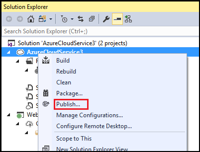
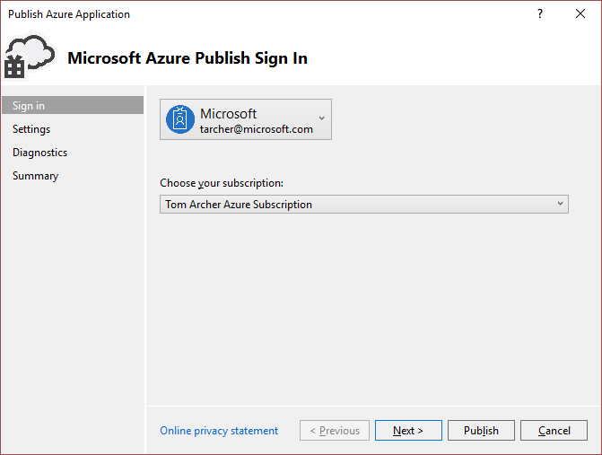
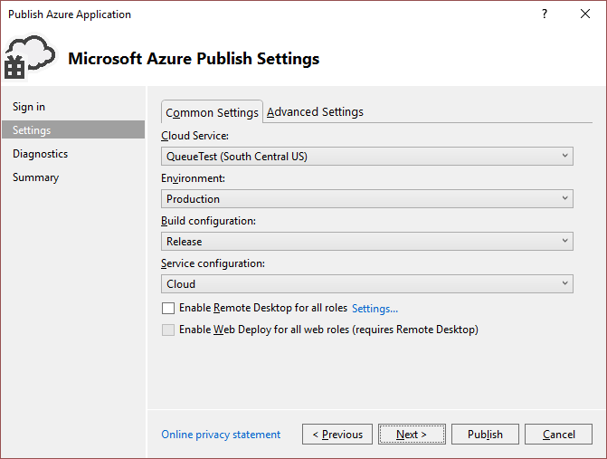
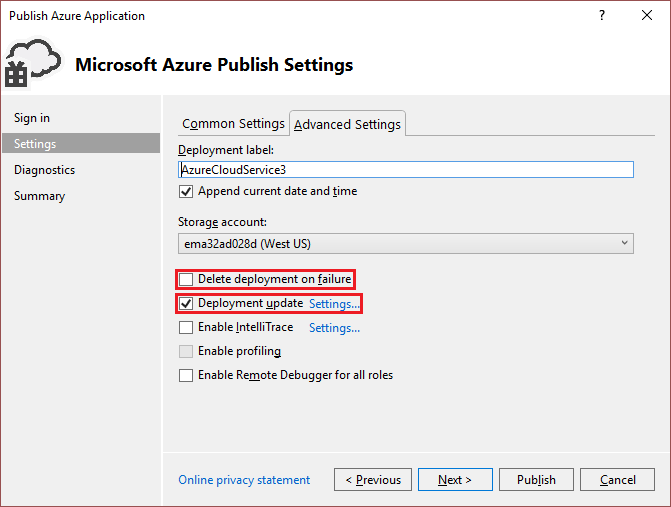
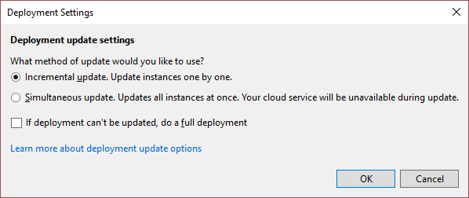
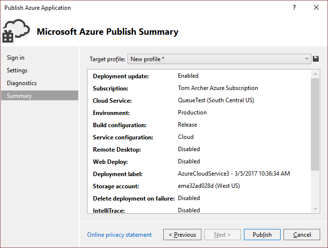

<properties
    pageTitle="如何为 Azure 云服务保留固定的虚拟 IP 地址 | Azure"
    description="了解如何确保 Azure 云服务的虚拟 IP 地址 (VIP) 不更改。"
    services="visual-studio-online"
    documentationcenter="na"
    author="TomArcher"
    manager="douge"
    editor=""
    translationtype="Human Translation" />

<tags
    ms.assetid="4a58e2c6-7a79-4051-8a2c-99182ff8b881"
    ms.service="multiple"
    ms.devlang="dotnet"
    ms.topic="article"
    ms.tgt_pltfrm="na"
    ms.workload="multiple"
    ms.date="03/20/2017"
    wacn.date="04/17/2017"
    ms.author="tarcher"
    ms.sourcegitcommit="7cc8d7b9c616d399509cd9dbdd155b0e9a7987a8"
    ms.openlocfilehash="3ea2f91c266f6bbf30db00dc429016838abf10fd"
    ms.lasthandoff="04/07/2017" />

# 如何为 Azure 云服务保留固定的虚拟 IP 地址
更新托管于 Azure 中的云服务时，可能需要确保该服务的虚拟 IP 地址 (VIP) 不发生更改。 许多域管理服务使用域名系统 (DNS) 注册域名。 仅当 VIP 保持不变时，DNS 才适用。 可使用 Azure Tools 中的“发布向导”  来确保云服务的 VIP 在更新时不更改。 有关如何将 DNS 域管理用于云服务的详细信息，请参阅[为 Azure 云服务配置自定义域名](/documentation/articles/cloud-services-custom-domain-name/)。

## 发布云服务而不更改其 VIP
当在特定环境（如生产环境）中第一次将云服务部署到 Azure 时，其 VIP 就已分配。 VIP 仅会在你显式删除部署或部署更新过程将其隐式删除时发生更改。 若要保留 VIP，则切勿删除部署，且务必确保 Visual Studio 不自动删除部署。 可以通过在“发布向导” 中指定部署设置来控制行为，该向导支持多个部署选项。 可以指定全新部署或更新部署，后者可以是增量更新或同时更新，这两种更新部署都将保留 VIP。 有关这些不同类型的部署的定义，请参阅 [Publish Azure application wizard](/documentation/articles/vs-azure-tools-publish-azure-application-wizard/)（发布 Azure 应用程序向导）。  此外，你可以控制出错时是否删除云服务以前的部署。 如果未正确设置该选项，VIP 可能意外改变。

## 更新云服务而不更改其 VIP
1. 在 Visual Studio 中创建或打开 Azure 云服务项目。 

2. 在“解决方案资源管理器”中右键单击项目，然后从上下文菜单中选择“发布”。

	

3. 在“发布 Azure 应用程序”对话框中，选择要部署的 Azure 订阅，在必要时进行登录，然后选择“下一步”。

	

4. 在“常用设置”选项卡中，验证要部署到的云服务的名称、“环境”、“生成配置”和“服务配置”是否全部正确。

	

5. 在“高级设置”选项卡中，验证存储帐户和部署标签是否正确、是否清除了“失败时删除部署”复选框以及是否选中了“部署更新”复选框。 通过选中“部署更新”复选框，确保重新发布应用程序时不会删除部署且不会丢失 VIP。 通过清除“失败时删除部署”复选框，确保部署期间出错时不会丢失 VIP。

	

6. （可选）若要进一步指定要更新角色的方式，请选择“部署更新”旁边的“设置”。 选择“增量更新”或“同时更新”。 如果选择“增量更新”，则会一个接一个地更新应用程序的每个实例，以使应用程序始终可用。 如果选择“同时更新”，则会同时更新应用程序的所有实例。 同时更新速度更快，但在更新过程中服务可能不可用。 完成后，选择“下一步”。

	

7. 返回到“发布 Azure 应用程序”对话框后，选择“下一步”，直到显示“摘要”页。 验证你的设置，然后选择“发布”。

	

## 后续步骤
- [使用 Visual Studio“发布 Azure 应用程序”向导](/documentation/articles/vs-azure-tools-publish-azure-application-wizard/)

<!-- Update_Description: wording update -->