<properties
    pageTitle="使用 Visual Studio 配置 Azure 云服务的角色 | Azure"
    description="了解如何使用 Visual Studio 设置和配置 Azure 云服务的角色。"
    services="visual-studio-online"
    documentationcenter="na"
    author="TomArcher"
    manager="douge"
    editor=""
    translationtype="Human Translation" />

<tags
    ms.assetid="d397ef87-64e5-401a-aad5-7f83f1022e16"
    ms.service="multiple"
    ms.devlang="dotnet"
    ms.topic="article"
    ms.tgt_pltfrm="na"
    ms.workload="multiple"
    ms.date="03/06/2017"
    wacn.date="04/17/2017"
    ms.author="tarcher"
    ms.sourcegitcommit="7cc8d7b9c616d399509cd9dbdd155b0e9a7987a8"
    ms.openlocfilehash="5c2261aea7844757bfa773bcd304bc4c40f3c458"
    ms.lasthandoff="04/07/2017" />

# 使用 Visual Studio 配置 Azure 云服务角色
一个 Azure 云服务可以有一个辅助角色或 Web 角色。 对于每个角色，需要定义该角色的设置方式，并配置该角色的运行方式。 

云服务信息存储在以下文件中：

- **ServiceDefinition.csdef** - 服务定义文件定义了云服务的运行时设置，包括需要什么角色、终结点和虚拟机大小。 当角色正在运行时，无法更改 `ServiceDefinition.csdef` 中存储的任何数据。
- **ServiceConfiguration.cscfg** - 服务配置文件则配置了角色有多少实例在运行以及为角色定义的设置的值。 当角色正在运行时，可以更改 `ServiceConfiguration.cscfg` 中存储的数据。

若要存储用于控制角色运行方式的设置的不同值，可以定义多个服务配置。 对于每个部署环境可使用不同的服务配置。 例如，可以在本地服务配置中设置存储帐户连接字符串以使用本地 Azure 存储模拟器并在云中创建另一个服务配置以使用 Azure 存储。

在 Visual Studio 中创建 Azure 云服务时，系统会自动创建两个服务配置并将其添加到 Azure 项目中：

- `ServiceConfiguration.Cloud.cscfg`
- `ServiceConfiguration.Local.cscfg`

## 配置 Azure 云服务
可从 Visual Studio 中的解决方案资源管理器配置 Azure 云服务，如以下步骤所述：

1. 在 Visual Studio 中打开 Azure 云服务项目

2. 在“解决方案资源管理器”中右键单击项目，然后从上下文菜单中选择“属性”。

	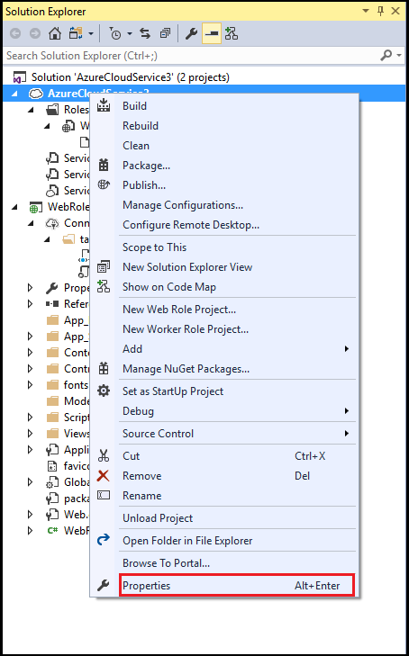

3. 在项目的属性页中，选择“开发”选项卡。 

	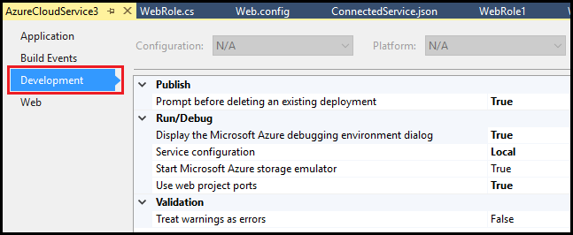

4. 在“服务配置”列表中，选择要编辑的服务配置名称。 （若要对角色的所有服务配置进行更改，请选择“所有配置”。）

	> [AZURE.IMPORTANT]
	> 如果要选择特定的服务配置，需禁用一些属性，因为其只能设置为所有配置。 若要编辑这些属性，必须选择“所有配置”。
	> 
	> 

	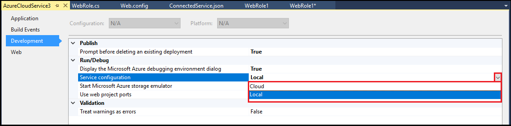

## 更改角色实例的数目
若要提高云服务的性能，可根据用户或某个特定角色的预期负载的数目，更改正在运行的角色实例的数目。 当云服务在 Azure 中运行时，将为每个角色实例创建单独的虚拟机。 这会影响部署此云服务的计费。 有关计费的详细信息，请参阅 [了解你的 Azure 帐单](/documentation/articles/billing-understand-your-bill/)。

1. 在 Visual Studio 中打开 Azure 云服务项目

2. 在“解决方案资源管理器”中，展开项目节点。 在“角色”节点下，右键单击要更新的角色，然后从上下文菜单中选择“属性”。

	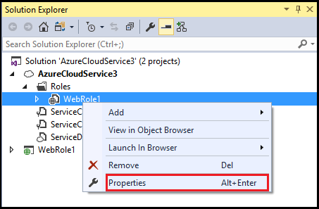

3. 选择“配置”选项卡。

	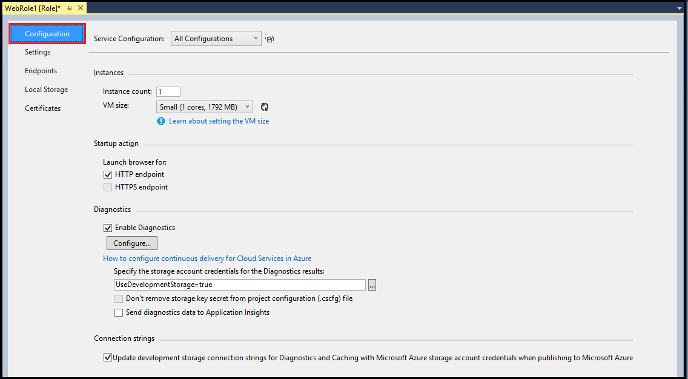

4. 在“服务配置”列表中，选择要更新的服务配置。

	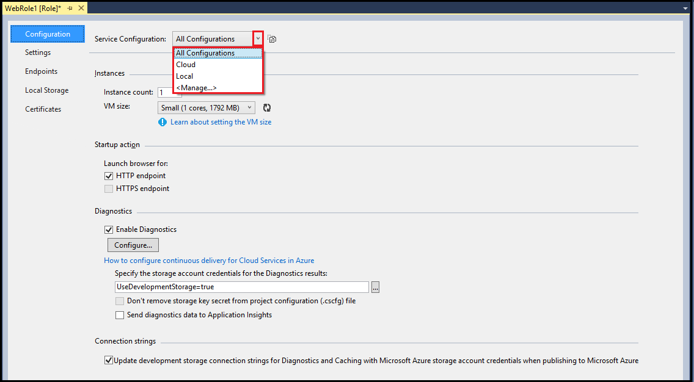

5. 在“实例计数”文本框中，键入想要启动此角色的实例数。 将云服务发布到 Azure 时，每个实例将在单独的虚拟机上运行。

	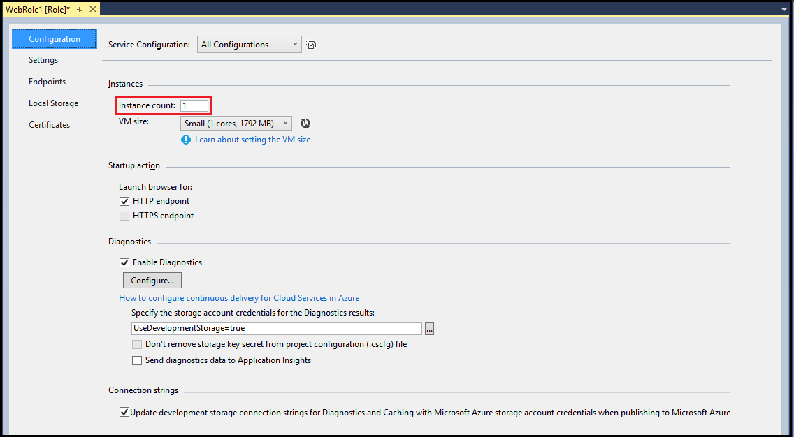

6. 从 Visual Studio 工具栏中，选择“保存”。

## 管理存储帐户的连接字符串
可添加、删除或修改服务配置的连接字符串。 例如，你可能希望本地服务配置的本地连接字符串，该本地服务配置具有 `UseDevelopmentStorage=true` 值。 你可能还希望将云服务配置为使用 Azure 中的存储帐户。

> [AZURE.WARNING]
> 当输入存储帐户连接字符串的 Azure 存储帐户关键信息时，此信息存储在本地服务配置文件中。 但是，此信息当前未存储为加密文本。
> 
> 

由于每个服务配置使用不同的值，当你将云服务发布到 Azure 时，不必在云服务中使用不同的连接字符串或修改你的代码。 可以在代码中对连接字符串使用同一名称，但值会不同，该值基于在生成云服务或发布云服务时选择的服务配置。

1. 在 Visual Studio 中打开 Azure 云服务项目

2. 在“解决方案资源管理器”中，展开项目节点。 在“角色”节点下，右键单击要更新的角色，然后从上下文菜单中选择“属性”。

	

3. 选择“设置”选项卡。

	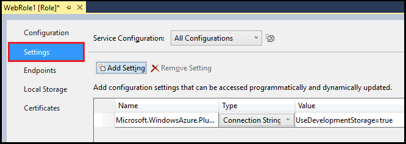

4. 在“服务配置”列表中，选择要更新的服务配置。

	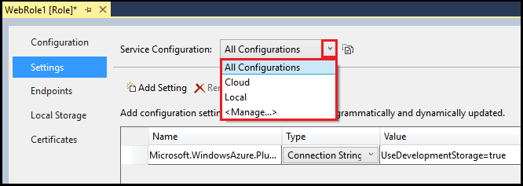

5. 若要添加连接字符串，请选择“添加设置”。

	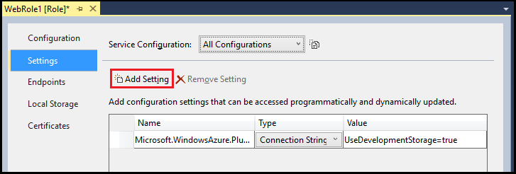

6. 将新设置添加到列表后，使用所需的信息更新列表中的行。

    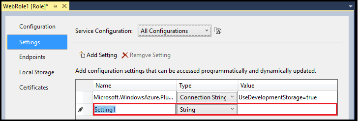

    - **名称** - 输入连接字符串要使用的名称。
    - **类型** - 从下拉列表中选择“连接字符串”。
    - **值** - 可以直接在“值”单元格中输入连接字符串，或者选择省略号 (...) 打开“创建存储连接字符串”对话框。  

7. 在“创建存储连接字符串”对话框中，为“连接方式”选择一个选项。 然后，遵照所选选项的说明操作：

    - **Azure 存储模拟器** - 如果选择此选项，对话框中的剩余设置将被禁用，因为这些设置仅适用于 Azure。 选择“确定” 。
    - **你的订阅** - 如果选择此选项，请使用下拉列表选择并登录到 Microsoft 帐户，或添加 Microsoft 帐户。 选择 Azure 订阅和 Azure 存储帐户。 选择“确定”。
    - **手动输入的凭据** - 输入存储帐户名称，以及主密钥或辅助密钥。 为“连接”选择一个选项（对于大多数方案，建议使用 HTTPS。）选择“确定”。

8. 若要删除某个连接字符串，请选择该连接字符串，然后选择“删除设置”。

9. 从 Visual Studio 工具栏中，选择“保存”。

## 以编程方式访问连接字符串

以下步骤说明如何使用 C# 以编程方式访问连接字符串。

1. 将以下 using 指令添加到要在其中使用该设置的 C# 文件中：

        using Microsoft.WindowsAzure;
        using Microsoft.WindowsAzure.Storage;
        using Microsoft.WindowsAzure.ServiceRuntime;

2. 以下代码演示有关如何访问连接字符串的示例。 将 &lt;ConnectionStringName> 占位符替换为适当的值。 

        // Setup the connection to Azure Storage
        var storageAccount = CloudStorageAccount.Parse(RoleEnvironment.GetConfigurationSettingValue("<ConnectionStringName>"));

## 将要使用的自定义设置添加到 Azure 云服务中
服务配置文件中的自定义设置可让你为特定服务配置的字符串添加名称和值。 你可以选择使用此设置来配置云服务中的功能，具体方法是：读取设置的值，然后使用该值来控制你的代码中的逻辑。 无需重新生成服务包就可更改这些服务配置值；运行云服务时也可以进行更改。 设置发生更改时，你的代码可以检查通知。 请参阅 [RoleEnvironment.Changing 事件](https://msdn.microsoft.com/zh-cn/library/azure/microsoft.windowsazure.serviceruntime.roleenvironment.changing.aspx)。

可添加、移除或修改服务配置的自定义设置。 对于不同的服务的配置，你可能需要这些字符串的不同值。

由于每个服务配置使用不同的值，当你将云服务发布到 Azure 时，不必在云服务中使用不同的字符串或修改你的代码。 可以在代码中对字符串使用同一名称，但值会不同，该值基于在生成云服务或发布云服务时选择的服务配置。

1. 在 Visual Studio 中打开 Azure 云服务项目

1. 在“解决方案资源管理器”中，展开项目节点。 在“角色”节点下，右键单击要更新的角色，然后从上下文菜单中选择“属性”。

    

1. 选择“设置”选项卡。

    

1. 在“服务配置”列表中，选择要更新的服务配置。

    

1. 若要添加自定义设置，请选择“添加设置”。

    

1. 将新设置添加到列表后，使用所需的信息更新列表中的行。

    

    - **名称** - 输入设置名称。
    - **类型** - 从下拉列表中选择“字符串”。
    - **值** - 输入设置值。 可以直接在“值”单元格中输入值，或者选择省略号 (...)，然后在“编辑字符串”对话框中输入值。  

1. 若要删除某个自定义设置，选择该设置，然后选择“删除设置”。

1. 从 Visual Studio 工具栏中，选择“保存”。

## 以编程方式访问自定义设置的值

以下步骤说明如何使用 C# 以编程方式访问自定义设置。

1. 将以下 using 指令添加到要在其中使用该设置的 C# 文件中：

        using Microsoft.WindowsAzure;
        using Microsoft.WindowsAzure.Storage;
        using Microsoft.WindowsAzure.ServiceRuntime;

1. 以下代码演示有关如何访问自定义设置的示例。 将 &lt;SettingName> 占位符替换为适当的值。 

        var settingValue = RoleEnvironment.GetConfigurationSettingValue("<SettingName>");

## 管理每个角色实例的本地存储
可以为角色的每个实例添加本地文件系统存储。 存储了数据的其他角色实例或其他角色无法访问该存储中存储的数据。  

1. 在 Visual Studio 中打开 Azure 云服务项目

1. 在“解决方案资源管理器”中，展开项目节点。 在“角色”节点下，右键单击要更新的角色，然后从上下文菜单中选择“属性”。

    

1. 选择“本地存储”选项卡。

    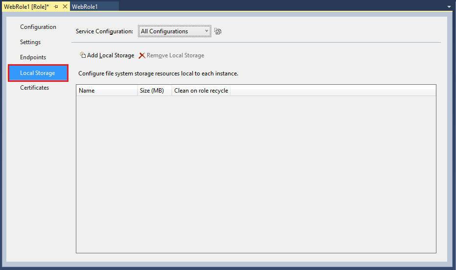

1. 在“服务配置”列表中，确保已选择“所有配置”，因为本地存储设置将应用到所有服务配置。 使用其他任何值会导致禁用页面上的所有输入字段。 

    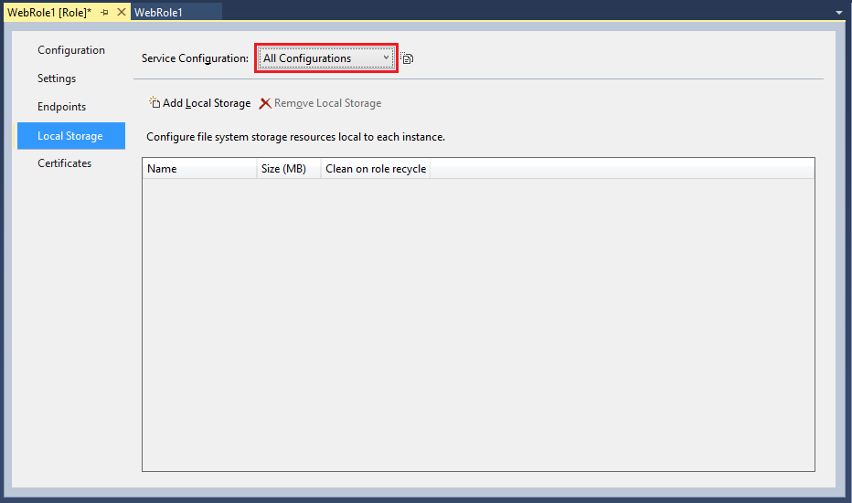

1. 若要添加本地存储条目，请选择“添加本地存储”。

    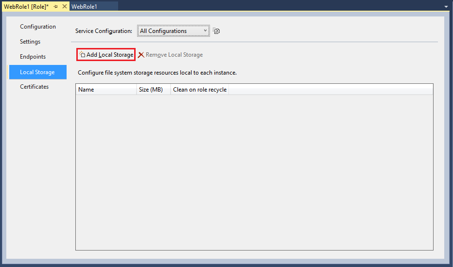

1. 将新的本地存储项添加到列表后，使用所需的信息更新列表中的行。

    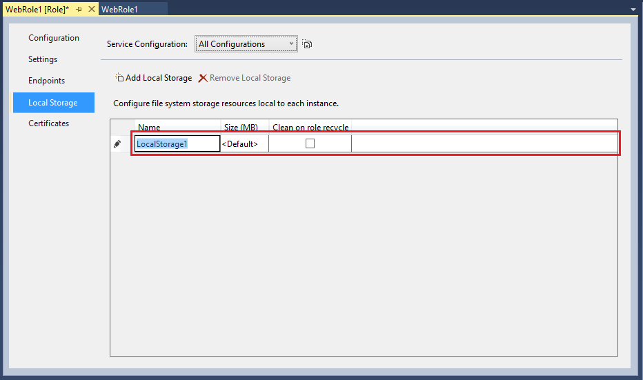

    - **名称** - 输入新本地存储要使用的名称。
    - **大小(MB)** - 输入新本地存储的所需大小，以 MB 为单位。
    - **角色回收时清理** - 选择此选项可在回收该角色的虚拟机时删除新本地存储中的数据。

1. 若要删除某个本地存储项，请选择该项，然后选择“删除本地存储”。

1. 从 Visual Studio 工具栏中，选择“保存”。

## 以编程方式访问本地存储

本部分演示如何通过编写测试文本文件 `MyLocalStorageTest.txt`，使用 C# 以编程方式访问本地存储。  

### 将文本文件写入本地存储

以下代码示例演示如何将文本文件写入本地存储。 将 &lt;LocalStorageName> 占位符替换为适当的值。 

    // Retrieve an object that points to the local storage resource
    LocalResource localResource = RoleEnvironment.GetLocalResource("<LocalStorageName>");

    //Define the file name and path
    string[] paths = { localResource.RootPath, "MyLocalStorageTest.txt" };
    String filePath = Path.Combine(paths);

    using (FileStream writeStream = File.Create(filePath))
    {
        Byte[] textToWrite = new UTF8Encoding(true).GetBytes("Testing Web role storage");
        writeStream.Write(textToWrite, 0, textToWrite.Length);
    }

### 查找已写入本地存储的文件

若要查看上一部分中的代码创建的文件，请执行以下步骤：

1.  在 Windows 通知区域中，右键单击 Azure 图标，然后从上下文菜单中选择“显示计算模拟器 UI”。 

    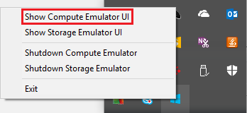

1. 选择 Web 角色。

    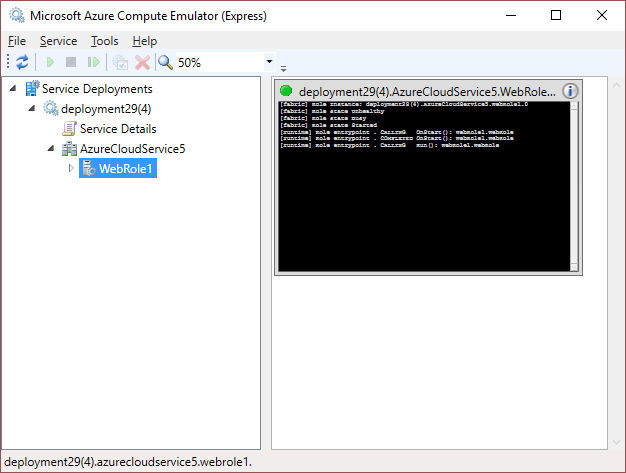

1. 在“Azure 计算模拟器”菜单中，选择“工具” > “打开本地存储”。

    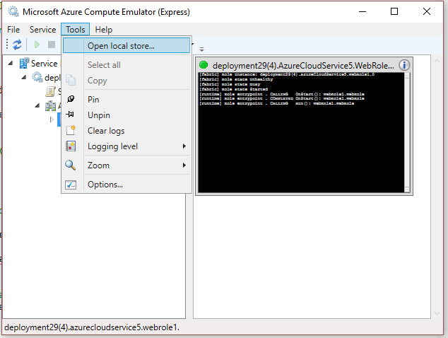

1. Windows 资源管理器窗口打开时，请在“搜索”文本框中输入“MyLocalStorageTest.txt”，然后按 **Enter** 开始搜索。 

## 后续步骤
阅读[配置 Azure 项目](/documentation/articles/vs-azure-tools-configuring-an-azure-project/)以详细了解 Visual Studio 中的 Azure 项目。 阅读 [架构参考](https://msdn.microsoft.com/zh-cn/library/azure/dd179398)以详细了解云服务架构。

<!-- Update_Description: wording update -->