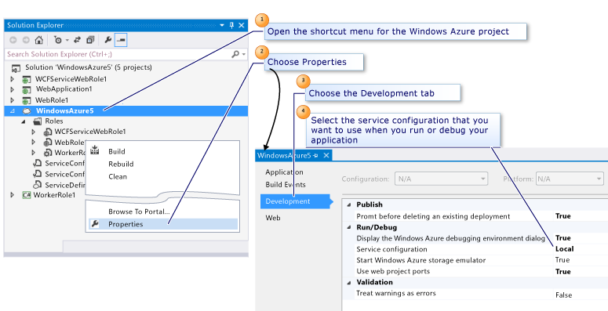

<properties
   pageTitle="使用 Visual Studio 配置 Azure 云服务项目 | Azure"
   description="了解如何根据你对该项目的要求在 Visual Studio 中配置 Azure 云服务项目。"
   services="visual-studio-online"
   documentationCenter="na"
   authors="TomArcher"
   manager="douge"
   editor="" />
<tags
   ms.service="multiple"
   ms.date="04/18/2016"
   wacn.date="05/23/2016" />

# 使用 Visual Studio 配置 Azure 云服务项目

可根据你对 Azure 云服务项目的要求来对其进行配置。可针对以下类别设置项目的属性：

- **将云服务发布到 Azure**

  你可以设置属性以确保部署到 Azure 的现有云服务不会被意外删除。

- **在本地计算机上运行或调试云服务**

  你可以选择要使用的服务配置并指示是否要启动 Azure 存储模拟器。

- **在创建云服务包时对其进行验证**

  你可以决定将任意警告视为错误，从而确保云服务包正常部署而不出现任何问题。在部署后发现出现故障时，此操作可以减少你的等待时间。

下图显示了如何选择在本地运行或调试云服务时要使用的配置。可从此窗口中设置所需的任何项目属性，如下图中所示。

## 配置 Azure 云服务项目

1. 若要从“解决方案资源管理器”中配置云服务项目，请打开云服务项目的快捷菜单，然后选择“属性”。

  Visual Studio 编辑器中将显示包含云服务项目名称的页面。

1. 选择“开发”选项卡。

1. 为确保不意外删除 Azure 中的现有部署，在删除现有部署列表之前的显示的提示中，请选择“True”。

1. 若要选择在本地运行或调试云服务时要使用的服务配置，请在“服务配置”列表中选择服务配置。

  >[AZURE.NOTE] 如过你想创建要使用的服务配置，请参阅“如何：管理服务配置和配置文件”。

1. 若要在本地运行或调试云服务时启动 Azure 存储模拟器，请在“启动 Azure 存储模拟器”中选择“True”。

1. 为确保在出现包验证错误时无法进行发布，请在“将警告视为错误”中选择“True”。

1. 为确保 Web 角色每次在 IIS Express 中本地启动时都使用同一端口，请在“使用 Web 项目端口”中选择“True”。若要为特定 Web 项目使用特定端口，请打开该 Web 项目的快捷菜单，依次选择“属性”选项卡、“Web”选项卡，然后在“IIS Express”部分的“项目 URL”设置中更改端口号。例如，输入 `http://localhost:14020` 作为项目 URL。

1. 若要保存对云服务项目的属性做出的任何更改，请选择工具栏上的“保存”按钮。

## 后续步骤

若要了解有关如何在 Visual Studio 中配置 Azure 云服务项目的详细信息，请参阅[使用多个服务配置配置 Azure 项目](/documentation/articles/vs-azure-tools-multiple-services-project-configurations/)。

<!---HONumber=Mooncake_0516_2016-->