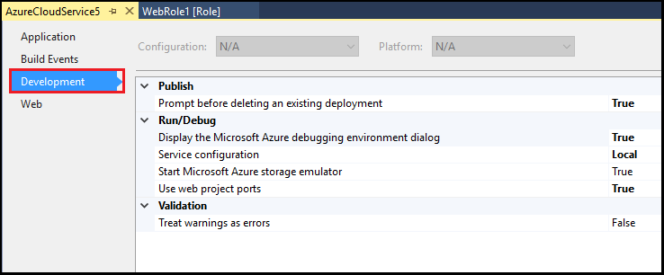

<properties
    pageTitle="使用 Visual Studio 配置 Azure 云服务项目 | Azure"
    description="了解如何根据你对该项目的要求在 Visual Studio 中配置 Azure 云服务项目。"
    services="visual-studio-online"
    documentationcenter="na"
    author="TomArcher"
    manager="douge"
    editor="" />
<tags
    ms.assetid="609d6965-05cc-47b1-82dc-c76a92d4f295"
    ms.service="multiple"
    ms.devlang="dotnet"
    ms.topic="article"
    ms.tgt_pltfrm="na"
    ms.workload="multiple"
    ms.date="03/06/2017"
    wacn.date="05/22/2017"
    ms.author="tarcher"
    ms.translationtype="Human Translation"
    ms.sourcegitcommit="8fd60f0e1095add1bff99de28a0b65a8662ce661"
    ms.openlocfilehash="38459df54bd5b0e8927b8b5ba1389d419849f408"
    ms.contentlocale="zh-cn"
    ms.lasthandoff="05/12/2017" />

# 使用 Visual Studio 配置 Azure 云服务项目
可根据你对 Azure 云服务项目的要求来对其进行配置。 可针对以下类别设置项目的属性：

- **将云服务发布到 Azure** - 可以设置属性以确保部署到 Azure 的现有云服务不会被意外删除。
- **在本地计算机上运行或调试云服务** - 可以选择要使用的服务配置并指示是否要启动 Azure 存储模拟器。
- **在创建云服务包时对其进行验证** - 可以决定将任意警告视为错误，从而确保云服务包正常部署而不出现任何问题。 

## 配置 Azure 云服务项目的步骤
1. 在 Visual Studio 中打开或创建 Azure 云服务项目

2. 在“解决方案资源管理器”中右键单击项目，然后从上下文菜单中选择“属性”。
   
3. 在项目的属性页中，选择“开发”选项卡。

    

4. 将“删除现有部署前提示”设为“True”。 此设置有助于确保不会意外删除 Azure 中的现有部署

5. 若要指示在本地运行或调试云服务时要使用的服务配置，请选择所需**服务配置**。 有关如何修改角色的服务配置的详细信息，请参阅[如何使用 Visual Studio 配置 Azure 云服务的角色](/documentation/articles/vs-azure-tools-configure-roles-for-cloud-service/)。

6. 若要在本地运行或调试云服务时启动 Azure 存储模拟器，请将“启动 Azure 存储模拟器”设为“True”。

7. 若要确保在出现包验证错误时无法发布，请将“将警告视为错误”设为“True”。

8. 若要确保 Web 角色每次在 IIS Express 中本地启动时都使用同一端口，请将“使用 Web 项目端口”设为“True”。

9. 从 Visual Studio 工具栏中，选择“保存”。

## 后续步骤
- [使用多种服务配置来配置 Azure 项目](/documentation/articles/vs-azure-tools-multiple-services-project-configurations/)

<!-- Update_Description: wording update -->