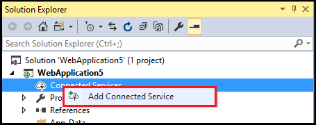
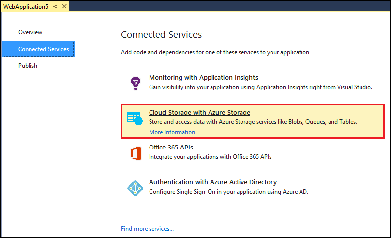
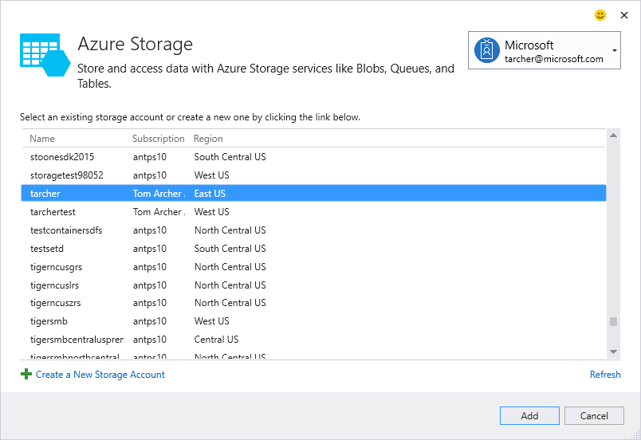
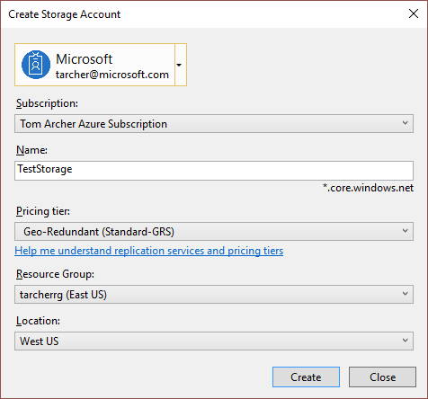

<properties
    pageTitle="在 Visual Studio 中使用连接服务添加 Azure 存储 | Azure"
    description="使用 Visual Studio 的“添加连接服务”对话框将 Azure 存储添加到您的应用"
    services="visual-studio-online"
    documentationcenter="na"
    author="TomArcher"
    manager="douge"
    editor="" />
<tags
    ms.assetid="521ec044-ad4b-4828-8864-01decde2e758"
    ms.service="storage"
    ms.devlang="na"
    ms.topic="article"
    ms.tgt_pltfrm="na"
    ms.workload="na"
    ms.date="03/26/2017"
    wacn.date="05/22/2017"
    ms.author="tarcher"
    ms.translationtype="Human Translation"
    ms.sourcegitcommit="8fd60f0e1095add1bff99de28a0b65a8662ce661"
    ms.openlocfilehash="8f169f5b9087bc0cc5639844071b6f6eb7acf6c4"
    ms.contentlocale="zh-cn"
    ms.lasthandoff="05/12/2017" />

# 使用 Visual Studio 连接服务添加 Azure 存储
在 Visual Studio 中，通过使用“添加连接服务”对话框可将以下任何服务连接到 Azure 存储：

- C# 云服务
- .NET 后端移动服务
- ASP.NET 网站或服务
- ASP.NET Core 服务
- Azure WebJob 服务 

连接服务功能可将所有需要的引用和连接代码添加到项目，并相应地修改配置文件。 

完成后，“添加连接服务”对话框会自动显示文档，其中详细介绍开始使用 blob 存储、队列和表所需的步骤。

## 使用“连接服务”对话框连接到 Azure 存储
1. 在 Visual Studio 中打开项目

2. 在“解决方案资源管理器”中，右键单击“连接服务”节点，然后在上下文菜单中选择“添加连接服务”。
   
    

3. 在“连接服务”页面中，选择“Azure 存储的云存储”。
   
    

4. 在“Azure 存储”对话框中，选择一个现有的存储帐户，然后选择“添加”。
   
    如果需要创建存储帐户，请转到下一步。 否则，请跳到步骤 6。
    
    

5. 创建存储帐户： 
   
   1. 选择对话框底部的“创建新存储帐户”。

   2. 填写“创建存储帐户”对话框，然后选择“创建”。
      
        
      
   3. 显示“Azure 存储”对话框时，新的存储帐户会显示在列表中。 在列表中选择新存储帐户，然后选择“添加”。

6. 该存储连接服务将显示在项目的“服务引用”节点下。
   
## 您的项目的修改情况
完成该对话框后，Visual Studio 将添加引用并修改特定配置文件。 具体更改情况取决于项目类型： 

- ASP.NET 项目 - [完成的操作 - ASP.NET 项目](http://go.microsoft.com/fwlink/p/?LinkId=513126)
- ASP.NET Core 项目 - [完成的操作 - ASP.NET 5 项目](http://go.microsoft.com/fwlink/p/?LinkId=513124) 
- 云服务项目（Web 角色和辅助角色）- [完成的操作 - 云服务项目](http://go.microsoft.com/fwlink/p/?LinkId=516965)
- WebJob 项目 - [完成的操作 - WebJob 项目](/documentation/articles/vs-storage-webjobs-what-happened/)

## 后续步骤
- [MSDN 论坛：Azure 存储](https://social.msdn.microsoft.com/Forums/zh-cn/home?forum=windowsazuredata)
- [Azure 存储团队博客](http://blogs.msdn.com/b/windowsazurestorage/)
- [Azure 存储文档](/documentation/services/storage/)

<!-- Update_Description: wording update -->