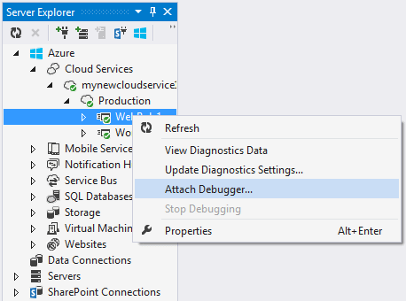
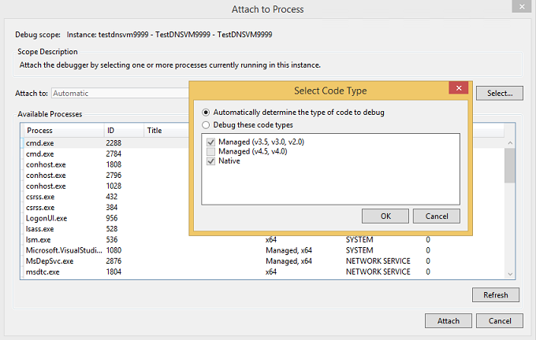
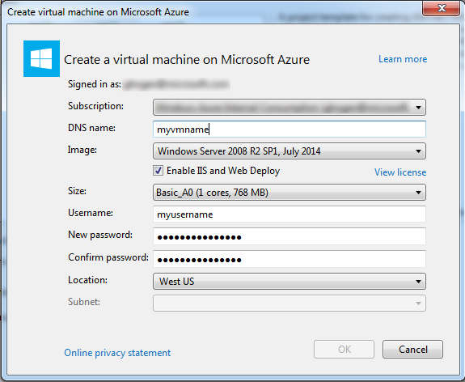

<properties 
	pageTitle="在 Visual Studio 中调试 Azure 云服务或虚拟机 | Azure"
	description="在 Visual Studio 中调试云服务或虚拟机"
	services="visual-studio-online"
	documentationCenter="na"
	authors="TomArcher"
	manager="douge"
	editor="" />  

<tags 
	ms.service="visual-studio-online"
	ms.date="06/01/2016"
	wacn.date="08/22/2016" />

# 在 Visual Studio 中调试云服务或虚拟机

Visual Studio 提供了不同的选项让您调试 Azure 云服务和虚拟机。

## 调试本地计算机上的云服务

使用 Azure 计算模拟器调试本地计算机上的云服务可为您节省时间和金钱。部署某个服务之前在本地对其进行调试可以提高可靠性和性能，且不会产生计算时间的相关费用。但是，仅当您在 Azure 自身中运行云服务时，某些错误才可能会出现。如果您在发布服务时启用远程调试，然后将调试器附加到角色实例，则可以调试这些错误。

该模拟器模拟 Azure 计算服务并在您的本地环境中运行，使您可以在部署云服务之前对其进行测试和调试。该模拟器将处理角色实例的生命周期，并提供对所模拟资源（如本地存储）的访问。当您从 Visual Studio 调试或运行服务时，Visual Studio 会自动将模拟器作为后台应用程序启动，然后将服务部署到模拟器。当模拟器在本地环境中运行时，您可以使用它来查看服务。可以运行完整版或速成版的模拟器。（从 Azure 2.3 开始，将默认安装速成版的模拟器。） 请参阅[使用 Emulator Express 在本地运行和调试云服务](https://msdn.microsoft.com/zh-cn/library/dn339018.aspx)。

### 调试本地计算机上的云服务

1. 在菜单栏上，选择“调试”和“开始调试”，以运行你的 Azure 云服务项目。或者，你可以按 F5。你将会看到一条消息，计算模拟器正在启动。当该模拟器启动时，系统托盘图标将会对其进行确认。

      

1. 打开通知区域中的 Azure 图标快捷菜单，然后选择“显示计算模拟器 UI”，从而显示计算模拟器的用户界面。

    UI 的左窗格显示了当前部署到计算模拟器的服务以及每项服务正在运行的角色实例。可选择服务或角色，以便在右窗格中显示生命周期、日志记录和诊断信息。如果将焦点置于包括窗口的上边距中，则该窗口将展开以填写右侧窗格。

1. 通过选择“调试”菜单上的命令并设置代码中的断点来单步执行应用程序。当你在调试器中单步执行应用程序时，窗格会随着应用程序的当前状态而更新。当停止调试时，将删除应用程序部署。如果应用程序包含 Web 角色并且您将“启动操作”属性设置为启动 Web 浏览器，则 Visual Studio 将在浏览器中启动您的 Web 应用程序。如果要更改服务配置中某个角色的实例数目，则必须停止云服务，然后重新启动调试，以便调试这些新的角色实例。

    **备注：**停止运行或调试服务时，不会停止本地计算模拟器和存储模拟器。您必须从通知区域显式将其停止。

## 在 Azure 中调试云服务

若要从远程计算机调试云服务，必须在部署云服务时显式启用该功能，以便在运行角色实例的虚拟机上安装所需的服务（例如 msvsmon.exe）。如果在发布服务时未启用远程调试，则必须在启用远程调试的情况下重新发布该服务。

为云服务启用远程调试不会导致性能下降或费用增加。不应在生产服务上使用远程调试，因为使用该服务的客户端可能会受到不利影响。

>[AZURE.NOTE] 当从 Visual Studio 中发布云服务时，可以为该服务中所有以 .NET Framework 4 或 .NET Framework 4.5 为目标的角色启用“IntelliTrace”。使用“IntelliTrace”可以检查过去发生在某个角色实例中的事件，并重现当时的上下文。请参阅[使用 IntelliTrace 和 Visual Studio 调试已发布的云服务](http://go.microsoft.com/fwlink/?LinkID=623016)和[使用 IntelliTrace 进行调试](https://msdn.microsoft.com/zh-cn/library/dd264915.aspx)。

### 为云服务启用远程调试

1. 打开 Azure 项目的快捷菜单，然后选择“发布”。

1. 选择“过渡”环境和“调试”配置。

    这些内容仅供指导。您可以选择在生产环境中运行测试环境。但是，如果在生产环境中启用远程调试，则可能会对用户造成不利影响。您可以选择“发布”配置，但是，“调试”配置能使调试变得更轻松。

    

1. 请按照一般步骤进行操作，但在“高级设置”选项卡上选中“为所有角色启用远程调试器”复选框。

    

### 将调试器附加到 Azure 中的云服务

1. 在“服务器资源管理器”中，展开云服务的节点。

1. 打开你想附加的角色或角色实例的快捷菜单，然后选择“附加调试器”。

    如果要调试某个角色，Visual Studio 调试器将附加到该角色的每个实例中。对于运行某个断点所在的代码行并符合该断点的所有条件的第一个角色实例，调试器将在该断点位置中断。如果您调试某个实例，调试器将只附加到该实例，并且仅当该特定实例运行某个断点所在的代码行并符合该断点的条件时，调试器才在该断点位置中断。

    

1. 将调试器附加到实例后，请按平时一样调试。调试器会自动附加到角色的相应主机进程。根据具体的角色，调试器将附加到 w3wp.exe、WaWorkerHost.exe 或 WaIISHost.exe。若要确认调试器附加到的进程，请展开“服务器资源管理器”中的实例节点。有关 Azure 进程的详细信息，请参阅 [Azure 角色体系结构](http://blogs.msdn.com/b/kwill/archive/2011/05/05/windows-azure-role-architecture.aspx)。

    

1. 若要识别调试器附加到的进程，请通过在菜单栏中选择“调试”、“Windows”、“进程”来打开“进程”对话框。（键盘操作：Ctrl+Alt+Z）若要分离特定的进程，请打开其快捷菜单，然后选择“分离进程”。或者，在“服务器资源管理器”中找到实例节点，找到该进程，打开其快捷菜单，然后选择“分离进程”。

      

>[AZURE.WARNING] 远程调试时避免长时间停止在断点处。Azure 会将停止时间超过数分钟的进程视为无响应，并停止向相应的实例发送流量。如果停止时间太长，msvsmon.exe 将与进程分离。

若要将调试器与实例或角色中的所有进程分离，请打开要调试的角色或实例的快捷菜单，然后选择“分离调试器”。

## 在 Azure 中进行远程调试的限制

从 Azure SDK 2.3 开始，远程调试存在以下限制。

- 启用远程调试后，无法发布其中的任一角色包含 25 个以上实例的云服务。

- 调试器使用端口 30400 至 30424、端口 31400 至 31424 以及端口 32400 至 32424。如果您尝试使用其中的任一端口，将无法发布服务，并且 Azure 的活动日志中将显示以下错误消息之一：

    - 根据 .csdef 文件验证 .cscfg 文件时出错。角色 “role” 的终结点 Microsoft.WindowsAzure.Plugins.RemoteDebugger.Connector 的保留端口范围 “range” 与已定义的端口或范围重叠。
    - 分配失败。请稍后重试，尝试减少 VM 大小或角色实例数目，或者尝试部署到其他区域。

## 调试 Azure 虚拟机

可以在 Visual Studio 中使用“服务器资源管理器”调试 Azure 虚拟机上运行的程序。在 Azure 虚拟机上启用远程调试时，Azure 将在该虚拟机上安装远程调试扩展。然后，您可以附加到虚拟机上的进程中，并像平时一样进行调试。

>[AZURE.NOTE] 可使用 Visual Studio 2015 中的“云资源管理器”对通过 Azure 资源管理器堆栈创建的虚拟机进行远程调试。

### 调试 Azure 虚拟机

1. 在“服务器资源管理器”中，展开“虚拟机”节点并选择您要调试的虚拟机的节点。

1. 打开上下文菜单，然后选择“启用调试”。当系统询问你是否确定要在虚拟机上启用调试时，请选择“是”。

    Azure 将在该虚拟机上安装远程调试扩展以启用调试。

    

      

1. 远程调试扩展安装完毕后，打开虚拟机的上下文菜单，然后选择“附加调试器...”

    Azure 将获取虚拟机上进程的列表，并将其显示在“附加到进程”对话框中。

    

1. 在“附加到进程”对话框中，选择“选择”以将结果列表限制为仅显示你想要调试的代码类型。您可以调试 32 位或 64 位托管代码和/或本机代码。

      

1. 选择虚拟机上你想要调试的进程，然后选择“附加”。例如，如果您想要调试虚拟机上的某个 Web 应用，则可以选择 w3wp.exe 进程。有关详细信息，请参阅[在 Visual Studio 中调试一个或多个进程](https://msdn.microsoft.com/zh-cn/library/jj919165.aspx)和 [Azure 角色体系结构](http://blogs.msdn.com/b/kwill/archive/2011/05/05/windows-azure-role-architecture.aspx)。

## 创建用于调试的 Web 项目和虚拟机

在发布 Azure 项目之前，您可能会发现，在支持调试和测试方案并且可以在其中安装测试和监视程序的受控环境中对项目进行测试会很有用。执行此操作的方法之一是远程调试虚拟机上的应用程序。

Visual Studio ASP.NET 项目提供了一个选项，让您创建可用于应用程序测试且易于操作的虚拟机。该虚拟机包含通常需要的终结点，例如 PowerShell、远程桌面和 WebDeploy。

### 创建用于调试的 Web 项目和虚拟机

1. 在 Visual Studio 中创建一个新的 ASP.NET Web 应用程序。

1. 在“新建 ASP.NET 项目”对话框的“Azure”部分，从下拉列表框中选择“虚拟机”。保留“创建远程资源”复选框的选中状态。选择“确定”以继续。

    会显示“在 Azure 上创建虚拟机”对话框。

      

    **备注：**如果您尚未登录到 Azure 帐户，系统将要求您登录。

1. 选择虚拟机的各项设置，然后选择“确定”。

    为 DNS 名称输入的名称也就是虚拟机的名称。

      

    Azure 将创建虚拟机，然后设置和配置终结点，例如远程桌面和 Web 部署

1. 完全配置好虚拟机后，请在“服务器资源管理器”中选择该虚拟机的节点。

1. 打开上下文菜单，然后选择“启用调试”。当系统询问你是否确定要在虚拟机上启用调试时，请选择“是”。

    Azure 将在该虚拟机上安装远程调试扩展以启用调试。

      

      

1. 根据[如何：在 Visual Studio 中使用一键式发布来部署 Web 项目](https://msdn.microsoft.com/zh-cn/library/dd465337.aspx)中所述的方法发布您的项目。由于您想要在虚拟机上进行调试，因此，请在“发布 Web”向导的“设置”页上选择“调试”作为配置。这可以确保在调试时代码符号可用。

      

1. 如果以前已经部署了该项目，请在“文件发布选项”中，选择“删除目标位置的其他文件”。

1. 发布项目之后，在服务器资源管理器中该虚拟机的上下文菜单上，选择“附加调试器...”

    Azure 将获取虚拟机上进程的列表，并将其显示在“附加到进程”对话框中。

    

1. 在“附加到进程”对话框中，选择“选择”以将结果列表限制为仅显示你想要调试的代码类型。您可以调试 32 位或 64 位托管代码和/或本机代码。

      

1. 选择虚拟机上你想要调试的进程，然后选择“附加”。例如，如果您想要调试虚拟机上的某个 Web 应用，则可以选择 w3wp.exe 进程。有关详细信息，请参阅[在 Visual Studio 中调试一个或多个进程](https://msdn.microsoft.com/zh-cn/library/jj919165.aspx)。

## 后续步骤

- 使用“Intellitrace”从发布服务器中收集调用和事件的日志。请参阅[使用 IntelliTrace 和 Visual Studio 调试已发布的云服务](/documentation/articles/vs-azure-tools-intellitrace-debug-published-cloud-services/。
- 使用“Azure 诊断”以记录在角色内运行的代码的详细信息，角色是否在开发环境或 Azure 中运行。请参阅[使用 Azure 诊断收集日志记录数据](/documentation/articles/cloud-services-dotnet-diagnostics/)。

<!---HONumber=Mooncake_0815_2016-->