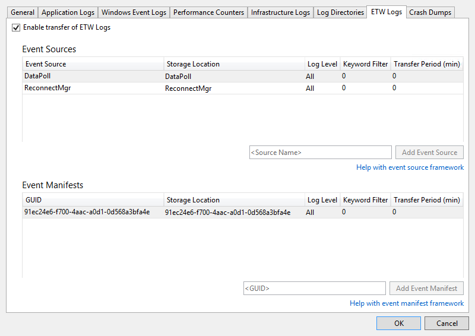

<properties
    pageTitle="为 Azure 云服务和虚拟机配置诊断 | Azure"
    description="介绍如何在 Visual Studio 中配置诊断信息以用于调试 Azure 云服务和虚拟机 (VM)。"
    services="visual-studio-online"
    documentationcenter="na"
    author="TomArcher"
    manager="douge"
    editor="" />
<tags
    ms.assetid="e70cd7b4-6298-43aa-adea-6fd618414c26"
    ms.service="multiple"
    ms.devlang="dotnet"
    ms.topic="article"
    ms.tgt_pltfrm="na"
    ms.workload="multiple"
    ms.date="11/11/2016"
    wacn.date="03/30/2017"
    ms.author="tarcher" />  


# 为 Azure 云服务和虚拟机配置诊断
如果需要对 Azure 云服务或 Azure 虚拟机进行故障排除，使用 Visual Studio 可以更轻松地配置 Azure 诊断。Azure 诊断可以在运行云服务的虚拟机和虚拟机实例上捕获系统数据和日志记录数据，并将这些数据传输到所选的存储帐户中。有关 Azure 中诊断日志记录的详细信息，请参阅[在 Azure App Service 中启用 Web 应用的诊断日志记录](/documentation/articles/web-sites-enable-diagnostic-log/)。

本主题演示如何在部署前后在 Visual Studio 和 Azure 虚拟机中启用和配置 Azure 诊断。它还演示如何选择要收集的诊断信息的类型以及如何在收集信息后查看这些信息。

Azure 诊断的配置方法有如下数种：

- 你可以通过 Visual Studio 中的“诊断配置”对话框更改诊断配置设置。设置将保存在名为 diagnostics.wadcfgx（在 Azure SDK 2.4 或更早版本中为 diagnostics.wadcfg）的文件中。或者，你可以直接修改配置文件。如果手动更新文件，则配置更改将在下次将云服务部署到 Azure 或在模拟器中运行该服务时生效。
- 使用 Visual Studio 中的**云资源管理器**或**服务器资源管理器**更改正在运行的云服务或虚拟机的诊断设置。

## Azure 2.6 诊断更改
对于 Visual Studio 中的 Azure SDK 2.6 项目，进行了以下更改。（这些更改同样适用于更高版本的 Azure SDK。）

- 本地模拟器现在支持诊断。这意味着，当你在 Visual Studio 中开发和测试时，你可以收集诊断数据并确保应用程序正在创建相应的跟踪。当你使用 Azure 存储模拟器在 Visual Studio 中运行云服务项目时，连接字符串 `UseDevelopmentStorage=true` 可启用诊断数据收集。所有诊断数据都在“(开发存储)”存储帐户中收集。
- 诊断存储帐户连接字符串 (Microsoft.WindowsAzure.Plugins.Diagnostics.ConnectionString) 将再次存储在服务配置 (.cscfg) 文件中。在 Azure SDK 2.5 中，在 diagnostics.wadcfgx 文件中指定诊断存储帐户。

连接字符串在 Azure SDK 2.4 及更早版本中的工作方式与它在 Azure SDK 2.6 中的工作方式之间有一些明显的差异。

- 在 Azure SDK 2.4 及更早版本中，连接字符串由诊断插件用作运行时以获取用于传输诊断日志的存储帐户信息。
- 在 Azure SDK 2.6 中，Visual Studio 在发布过程中通过诊断连接字符串使用相应的存储帐户信息配置诊断扩展。连接字符串让你为 Visual Studio 将在发布时使用的不同服务配置定义不同的存储帐户。但是，因为诊断插件已不再可用（在 Azure SDK 2.5 之后），.cscfg 文件本身不能启用诊断扩展。你必须通过工具（如 Visual Studio 或 PowerShell）单独启用扩展。
- 为了简化使用 PowerShell 配置诊断扩展的过程，Visual Studio 的程序包输出还包含每个角色的诊断扩展的公共配置 XML。Visual Studio 使用诊断连接字符串来填充公共配置中存在的存储帐户信息。公共配置文件在“扩展”文件夹中创建，并遵循模式 PaaSDiagnostics.&lt;RoleName>.PubConfig.xml。任何基于 PowerShell 的部署都可以使用此模式将每个配置映射到角色。
- .cscfg 文件中的连接字符串还由 [Azure 门户](https://portal.azure.cn)用于访问诊断数据，使这些数据可以显示在“监视”选项卡中。需要连接字符串才能配置服务以在门户中显示详细监视数据。

## 将项目迁移到 Azure SDK 2.6 和更高版本
从 Azure SDK 2.5 迁移到 Azure SDK 2.6 或更高版本时，如果你在 .wadcfgx 文件中指定了诊断存储帐户，则该帐户将继续保留在那里。若要针对不同存储配置充分使用不同存储帐户的灵活性，必须手动将连接字符串添加到项目。如果你将项目从 Azure SDK 2.4 或更低版本迁移到 Azure SDK 2.6，系统将保留诊断连接字符串。但是，请注意 Azure SDK 2.6 中处理连接字符串的方式的更改，如上一部分中所述。

### Visual Studio 如何确定诊断存储帐户
- 如果在 .cscfg 文件中指定了诊断连接字符串，则 Visual Studio 在发布时以及在打包过程中生成公共配置 xml 文件时将使用它来配置诊断扩展。
- 如果未在 .cscfg 文件中指定任何诊断连接字符串，则 Visual Studio 在发布时以及在打包过程中生成公共配置 xml 文件时将回退到使用 .wadcfgx 文件中指定的存储帐户来配置诊断扩展。
- .cscfg 文件中的诊断连接字符串将优先于 .wadcfgx 文件中的存储帐户。如果在 .cscfg 文件中指定了诊断连接字符串，则 Visual Studio 将使用该字符串，而忽略 .wadcfgx 中的存储帐户。

### “更新开发存储连接字符串...”复选框的作用是什么？
“在发布到 Azure 时使用 Azure 存储帐户凭据更新诊断和缓存的开发存储连接字符串”复选框为你提供了使用发布过程中指定的 Azure 存储帐户更新任何开发存储帐户连接字符串的简便方法。

例如，假设你选中此复选框，并且诊断连接字符串指定 `UseDevelopmentStorage=true`。将项目发布到 Azure 时，Visual Studio 将自动使用发布向导中指定的存储帐户更新诊断连接字符串。但是，如果已将实际的存储帐户指定为诊断连接字符串，则将改用该帐户。

## Azure SDK 2.4 及更早版本与 Azure SDK 2.5 及更高版本之间的诊断功能差异
如果要将项目从 Azure SDK 2.4 升级到 Azure SDK 2.5 或更高版本，则应考虑到以下诊断功能差异。

- **配置 API 已弃用** - 诊断的编程配置在 Azure SDK 2.4 或更早版本中可用，但在 Azure SDK 2.5 及更高版本中已弃用。如果你目前在代码中定义了诊断配置，则需在已迁移的项目中从头开始重新配置这些设置，这样才能让诊断正常工作。Azure SDK 2.4 的诊断配置文件是 diagnostics.wadcfg，而 Azure SDK 2.5 及更高版本的诊断配置文件是 diagnostics.wadcfgx。
- **云服务应用程序的诊断只能在角色级别配置，而不是在实例级别配置。**
- **每次部署应用时，都会更新诊断配置** - 如果从服务器资源管理器更改诊断配置并重新部署应用，这可能会导致奇偶校验问题。
- **在 Azure SDK 2.5 及更高版本中，故障转储是在诊断配置文件而非代码中配置的** - 如果在代码中配置了故障转储，则必须手动将配置从代码传输至配置文件，因为故障转储并未在迁移至 Azure SDK 2.6 的过程中传输。

## 部署前在云服务项目中启用诊断
在 Visual Studio 中，你可以选择为运行在 Azure 中的角色收集诊断数据，前提是部署前在模拟器中运行了服务。在 Visual Studio 中对诊断设置所做的任何更改都将保存在配置文件 diagnostics.cscfg 中。这些配置设置指定在部署云服务时将诊断数据保存到的存储帐户。

[AZURE.INCLUDE [cloud-services-wad-warning](../includes/cloud-services-wad-warning.md)]

### 部署前在 Visual Studio 中启用诊断
1. 在所需角色的快捷菜单上，选择“属性”，然后在该角色的“属性”窗口中，选择“配置”选项卡。
2. 在“诊断”部分中，确保“启用诊断”复选框已选中。
   
    
3. 选择省略号 (…) 按钮指定诊断数据要存储到的存储帐户。选择的存储帐户将是诊断数据的存储位置。
   
    
4. 在“创建存储连接字符串”对话框中，指定要使用 Azure 存储模拟器、Azure 订阅还是手动输入凭据进行连接。
   
      

   
   - 如果选择“Azure 存储模拟器”选项，则连接字符串设为 UseDevelopmentStorage=true。
   - 如果你选择“你的订阅”选项，则可以选择要使用的 Azure 订阅和帐户名称。你可以选择“管理帐户”按钮来管理你的 Azure 订阅。
   - 如果你选择“手动输入凭据”选项，则系统会提示你输入要使用的 Azure 帐户的名称和密钥。
5. 选择“配置”按钮查看“诊断配置”对话框。每个选项卡（“常规”和“日志目录”除外）表示你可以收集的诊断数据源。默认选项卡“常规”为你提供以下诊断数据收集选项：“仅限错误”、“所有信息”和“自定义计划”。默认选项“仅限错误”占用最少量的存储空间，因为该选项不传输警告或跟踪消息。“所有信息”选项传输的信息最多，因此就存储来说是成本最高的选项。
   
      

6. 对于此示例，可以选择“自定义计划”选项，以便自定义所收集的数据。
7. “磁盘配额(MB)”框指定你要在存储帐户中为诊断数据分配的空间量。你可以根据需要更改默认值。
8. 在要收集的诊断数据的每个选项卡上，选中其“启用 <日志类型> 的传输”复选框。例如，如果要收集应用程序日志，请选中“应用程序日志”选项卡上的“启用应用程序日志的传输”复选框。另外，请指定每种诊断数据类型所需的其他任何信息。有关每个选项卡上的配置信息，请参阅本主题后面的**配置诊断数据源**部分。
9. 对所需的所有诊断数据启用了收集后，请选择“确定”按钮。
10. 照常在 Visual Studio 中运行 Azure 云服务项目。当你使用应用程序时，所启用的日志信息将保存到你指定的 Azure 存储帐户中。

## 在 Azure 虚拟机中启用诊断
在 Visual Studio 中，你可以选择收集 Azure 虚拟机的诊断数据。

### 在 Azure 虚拟机中启用诊断
1. 在“服务器资源管理器”中，选择“Azure”节点，然后连接到你的 Azure 订阅（如果尚未连接）。
2. 展开“虚拟机”节点。你可以创建新虚拟机，也可以选择现有的虚拟机。
3. 在所需虚拟机的快捷菜单上，选择“配置”。此时将显示“虚拟机配置”对话框。
   
      

4. 如果尚未安装，请添加“Microsoft 监视代理诊断”扩展。使用此扩展可以收集 Azure 虚拟机的诊断数据。在“已安装的扩展”列表中，选择“选择可用扩展”下拉菜单，然后选择“Microsoft 监视代理诊断”。
   
      

   
	> [AZURE.NOTE]
	其他诊断扩展可用于虚拟机。有关详细信息，请参阅“Azure VM 扩展和功能”。
	> 
	> 
5. 选择“添加”按钮以添加扩展，并查看其“诊断配置”对话框。
6. 选择“配置”按钮以指定存储帐户，然后选择“确定”按钮。
   
    每个选项卡（“常规”和“日志目录”除外）表示你可以收集的诊断数据源。
   
      

   
    默认选项卡“常规”为你提供以下诊断数据收集选项：“仅限错误”、“所有信息”和“自定义计划”。默认选项“仅限错误”占用最少量的存储空间，因为该选项不传输警告或跟踪消息。“所有信息”选项传输的信息最多，因此就存储来说是成本最高的选项。
7. 对于此示例，可以选择“自定义计划”选项，以便自定义所收集的数据。
8. “磁盘配额(MB)”框指定你要在存储帐户中为诊断数据分配的空间量。你可以根据需要更改默认值。
9. 在要收集的诊断数据的每个选项卡上，选中其“启用 <日志类型> 的传输”复选框。
   
    例如，如果要收集应用程序日志，请选中“应用程序日志”选项卡上的“启用应用程序日志的传输”复选框。另外，请指定每种诊断数据类型所需的其他任何信息。有关每个选项卡上的配置信息，请参阅本主题后面的**配置诊断数据源**部分。
10. 对所需的所有诊断数据启用了收集后，请选择“确定”按钮。
11. 保存更新的项目。
    
     “Azure 活动日志”窗口中将显示一则消息，指出虚拟机已更新。

## 配置诊断数据源
启用了诊断数据收集后，你可以正确地选择要收集的数据源以及收集哪些信息。下面是“诊断配置”对话框中的选项卡列表，以及每个配置选项的含义。

### 应用程序日志
**应用程序日志**包含由 Web 应用程序生成的诊断信息。如果要捕获应用程序日志，请选中“启用应用程序日志的传输”复选框。你可以增加或减少将应用程序日志传输至存储帐户的分钟数，方法是更改“传输周期(分钟)”值。你还可以更改日志中捕获的信息量，方法是设置“日志级别”值。例如，你可以选择“详细”以获取更多信息，也可以选择“关键”以仅捕获关键错误。如果你使用特定诊断提供程序来传输应用程序日志，则可通过将提供程序的 GUID 添加到“提供程序 GUID”框中，来捕获这些日志。

    


  有关应用程序日志的详细信息，请参阅[在 Azure App Service 中启用 Web 应用的诊断日志记录](/documentation/articles/web-sites-enable-diagnostic-log/)。

### Windows 事件日志
如果要捕获 Windows 事件日志，请选中“启用 Windows 事件日志的传输”复选框。你可以增加或减少将事件日志传输至存储帐户的分钟数，方法是更改“传输周期(分钟)”值。选中与要跟踪的事件类型对应的复选框。

    


如果你使用的是 Azure SDK 2.6 或更高版本并想要指定自定义数据源，请在 **<数据源名称>** 文本框中输入它，然后选择它旁边的“添加”按钮。该数据源将添加到 diagnostics.cfcfg 文件中。

如果你使用的是 Azure SDK 2.5 并想要指定自定义数据源，可以将其添加到 diagnostics.wadcfgx 文件的 `WindowsEventLog` 节，如下例所示。

```
<WindowsEventLog scheduledTransferPeriod="PT1M">
   <DataSource name="Application!*" />
   <DataSource name="CustomDataSource!*" />
</WindowsEventLog>
```
### 性能计数器
性能计数器信息可以帮助你找到系统瓶颈，并优化系统和应用程序性能。有关详细信息，请参阅[在 Azure 应用程序中创建和使用性能计数器](https://msdn.microsoft.com/zh-cn/library/azure/hh411542.aspx)。如果要捕获性能计数器，请选中“启用性能计数器的传输”复选框。你可以增加或减少将事件日志传输至存储帐户的分钟数，方法是更改“传输周期(分钟)”值。选中与要跟踪的性能计数器对应的复选框。

    


若要跟踪未列出的性能计数器，请使用建议的语法输入它，然后选择“添加”按钮。虚拟机上的操作系统会确定你可以跟踪哪些性能计数器。有关语法的详细信息，请参阅[指定计数器路径](https://msdn.microsoft.com/zh-cn/library/windows/desktop/aa373193.aspx)。

### 基础结构日志
如果你要捕获基础结构日志，其中包含有关 Azure 诊断基础结构、RemoteAccess 模块和 RemoteForwarder 模块的信息，请选中“启用基础结构日志的传输”复选框。你可以增加或减少将日志传输至存储帐户的分钟数，方法是更改“传输周期(分钟)”值。

    


  有关详细信息，请参阅[使用 Azure 诊断收集日志记录数据](/documentation/articles/cloud-services-dotnet-diagnostics/)。

### 日志目录
如果要捕获日志目录，其中包含从日志目录收集的有关 Internet Information Services (IIS) 请求、失败的请求或所选的文件夹的数据，请选中“启用日志目录的传输”复选框。你可以增加或减少将日志传输至存储帐户的分钟数，方法是更改“传输周期(分钟)”值。

你可以选中要收集的日志对应的框，如“IIS 日志”和“失败的请求日志”。虽然系统提供了默认的存储容器名称，但是你可以根据需要更改这些名称。

另外，你可以从任何文件夹捕获日志。只需在“从绝对目录记录”部分中指定路径，然后选择“添加目录”按钮即可。日志将捕获到指定的容器中。

    


### ETW 日志
如果使用 [Windows 事件跟踪](https://msdn.microsoft.com/zh-cn/library/windows/desktop/bb968803(v=vs.85).aspx) (ETW) 并要捕获 ETW 日志，请选中“启用 ETW 日志的传输”复选框。你可以增加或减少将日志传输至存储帐户的分钟数，方法是更改“传输周期(分钟)”值。

事件将从你指定的事件源和事件清单捕获。若要指定事件源，请在“事件源”部分中输入一个名称，然后选择“添加事件源”按钮。同样，你也可以在“事件清单”部分中指定事件清单，然后选择“添加事件清单”按钮。

    


  支持在 ASP.NET 中通过 [System.Diagnostics.aspx](https://msdn.microsoft.com/zh-cn/library/system.diagnostics(v=vs.110)) 命名空间中的类来使用 ETW 框架。Microsoft.WindowsAzure.Diagnostics 命名空间继承自标准 [System.Diagnostics.aspx](https://msdn.microsoft.com/zh-cn/library/system.diagnostics(v=vs.110)) 类并对其进行了扩展，在 Azure 环境中，可以通过该命名空间将 [System.Diagnostics.aspx](https://msdn.microsoft.com/zh-cn/library/system.diagnostics(v=vs.110)) 用作日志记录框架。有关详细信息，请参阅[控制 Azure 中的日志记录和跟踪](https://msdn.microsoft.com/magazine/ff714589.aspx)以及[在 Azure 云服务和虚拟机中启用诊断](/documentation/articles/cloud-services-dotnet-diagnostics/)。

### 故障转储
如果要捕获有关角色实例何时发生故障的信息，请选中“启用故障转储的传输”复选框。（由于 ASP.NET 能够处理大多数异常，因此故障转储通常仅对辅助角色有用。） 你可以增加或减少专用于故障转储的存储空间的百分比，方法是更改“目录配额(%)”值。你可以更改将故障转储存储到的存储容器，还可以选择要捕获“完整”转储还是“微型”转储。

系统将列出当前跟踪的进程。选中与要捕获的进程对应的复选框。若要将另一个进程添加到列表中，请输入进程名称，然后选择“添加进程”按钮。

    


  有关详细信息，请参阅[控制 Azure 中的日志记录和跟踪](https://msdn.microsoft.com/magazine/ff714589.aspx)，以及 [Azure 诊断第 4 部分：自定义日志记录组件和 Azure 诊断 1.3 更改](http://justazure.com/microsoft-azure-diagnostics-part-4-custom-logging-components-azure-diagnostics-1-3-changes/)。

## 查看诊断数据
收集云服务或虚拟机的诊断数据后，你可以查看这些数据。

### 查看云服务的诊断数据
1. 照常部署云服务，然后运行该服务。
2. 诊断数据可以在 Visual Studio 生成的报告中查看，或是在存储帐户的表中查看。若要在报告中查看数据，请打开“服务器资源管理器”，打开所需角色节点的快捷菜单，然后选择“查看诊断数据”。
   
      

   
    随即显示包括可用数据的报告。
   
      

   
    如果最新数据没有显示，可能需要等待传输周期结束。
   
    选择“刷新”链接以立即更新数据，或者在“自动刷新”下拉列表框中选择一个时间间隔，让数据自动更新。若要导出错误数据，请选择“导出到 CSV”按钮以创建逗号分隔值文件，你可以在电子表格中打开该文件。
   
    在“云资源管理器”或“服务器资源管理器”中，打开部署的关联存储帐户。
3. 在表查看器中打开诊断表，然后查看所收集的数据。对于 IIS 日志和自定义日志，可以打开 Blob 容器。在下表中，可以找到包含所需数据的表或 Blob 容器。除了该日志文件的数据，表条目还包含 EventTickCount、DeploymentId、Role 和 RoleInstance，可帮助确定数据来自哪个虚拟机和角色，是何时生成的。
   
	|诊断数据 |说明 |位置 | 
	|--- |--- |--- | 
	|应用程序日志 |代码通过调用 System.Diagnostics.Trace 类的方法生成的日志。|WADLogsTable | 
	|事件日志 |此数据来自虚拟机上的 Windows 事件日志。Windows 将信息存储在这些日志，但应用程序和服务还使用它们来报告错误或记录信息。|WADWindowsEventLogsTable | 
	|性能计数器 |可以收集虚拟机上可用的任何性能计数器上的数据。操作系统提供性能计数器，其中包含多种统计数据，例如内存使用率和处理器时间。|WADPerformanceCountersTable | 
	|基础结构日志 |这些日志从诊断基础结构自身生成。|WADDiagnosticInfrastructureLogsTable | 
	|IIS 日志 |这些日志记录 Web 请求。如果云服务获取大量流量，那么这些日志会非常长，因此应仅在需要时收集和存储此数据。|可以在 blob 容器中的部署、角色和实例路径下的 wad-iis-failedreqlogs 中找到失败的请求日志。在 wad-iis-logfiles 下可以找到完整日志。每个文件的条目都在 WADDirectories 表中形成。| 
	|故障转储 |此信息提供云服务的进程（通常为辅助角色）的二进制映像。| wad-crush-dumps blob 容器 | 
	|自定义日志文件 |预定义的数据的日志。|可以在代码中指定存储帐户中自定义日志文件的位置。例如，可以指定自定义 blob 容器。|

4. 如有任何类型的数据出现截断，可以尝试增大该数据类型的缓冲区，或是缩短从虚拟机到存储帐户的数据传输间隔。
5. （可选）间或清除存储帐户中的数据，降低整体存储开销。
6. 进行完整部署时，diagnostics.cscfg 文件（Azure SDK 2.5 中为 .wadcfgx）将在 Azure 中更新，云服务将拾取对诊断配置的所有更改。如果你改为更新现有部署，则不会在 Azure 中更新 .cscfg 文件。但仍可按照下一部分中的步骤更改诊断设置。有关执行完整部署和更新现有部署的详细信息，请参阅[发布 Azure 应用程序向导](/documentation/articles/vs-azure-tools-publish-azure-application-wizard/)。

### 查看虚拟机的诊断数据
1. 在虚拟机的快捷菜单上，选择“查看诊断数据”。
   
      

   
    此时将打开“诊断摘要”窗口。
   
      

   
    如果最新数据没有显示，可能需要等待传输周期结束。
   
    选择“刷新”链接以立即更新数据，或者在“自动刷新”下拉列表框中选择一个时间间隔，让数据自动更新。若要导出错误数据，请选择“导出到 CSV”按钮以创建逗号分隔值文件，你可以在电子表格中打开该文件。

## 部署后配置云服务诊断
如果要调查的问题涉及已在运行的云服务，则可能要收集在最初部署此角色之前未指定的数据。对此情况，可以使用“服务器资源管理器”中的设置来启动数据收集。可以为角色的单个实例或所有实例配置诊断，具体取决于是从实例快捷菜单还是从角色快捷菜单打开“诊断配置”对话框。如果配置角色节点，任何更改都将应用于所有实例。如果配置实例节点，任何更改都将仅应用于该实例。

### 为正在运行的云服务配置诊断
1. 在“服务器资源管理器”中，展开“云服务”节点，然后展开其子节点找到你要调查的角色和/或实例。
   
      

2. 在实例节点或角色节点的快捷菜单上，选择“更新诊断设置”，然后选择要收集的诊断设置。
   
    有关配置设置的信息，请参阅本主题中的**配置诊断数据源**。有关如何查看诊断数据的信息，请参阅本主题中的**查看诊断数据**。
   
    如果在“服务器资源管理器”中更改了数据收集，则在完全重新部署云服务之前，这些更改会一直生效。如果你使用默认发布设置，将不会覆盖这些更改，因为默认发布设置用于更新现有部署而非进行完全重新部署。若要确保设置在部署时清除，请转到发布向导中的“高级设置”选项卡，然后清除“部署更新”复选框。在清除该复选框的情况下重新部署时，这些设置将还原为 .wadcfgx（或 .wadcfg）文件中的设置（与通过角色的“属性”编辑器进行设置一样）。如果更新部署，Azure 将保留旧设置。

## 排查 Azure 云服务问题
如果你在处理云服务项目时遇到问题，例如陷入“繁忙”状态的某个角色反复回收或引发内部服务器错误，则可以使用一些工具和方法来诊断并解决这些问题。有关常见问题和解决方案的具体示例，以及用于诊断并解决此类错误的概念和工具的概述，请参阅 [Azure PaaS 计算诊断数据](http://blogs.msdn.com/b/kwill/archive/2013/08/09/windows-azure-paas-compute-diagnostics-data.aspx)。

## 问题解答
**什么是缓冲区大小，应设置为多大？**

在每个虚拟机实例上，“配额”限制了本机文件系统上可以存储的诊断数据量。此外，可以指定每类诊断数据可以使用的缓冲区大小。此缓冲区大小的作用类似于该类数据的单独配额。查看对话框的底部，便可确定整体配额和剩余内存量。指定的缓冲区越大、数据类型越多，便越接近整体配额。通过修改 diagnostics.wadcfg/.wadcfgx 配置文件可以更改整体配额。诊断数据和应用程序存储在同一个文件系统上，所以如果应用程序使用了大量磁盘空间，便不应增加整体诊断配额。

**什么是传输周期，应设置为多长？**

传输周期是两次数据捕获之间经过的时间长度。在每个传输周期后，数据都将从虚拟机上的本机文件系统，移动到存储帐户的表中。如果在传输周期结束之前，收集的数据量已经超出了配额，将放弃较早数据。如果发现数据由于超出缓冲区大小或整体配额而丢失，你可能需要缩短传输周期。

**时间戳使用哪个时区？**

时间戳使用托管云服务的数据中心的本地时区。将使用日志表中的以下三个时间戳列。

- **PreciseTimeStamp** 是事件的 ETW 时间戳。即，从客户端记录事件的时间。
- **TIMESTAMP** 是将 PreciseTimeStamp 向下舍入到上载频率边界的值。因此，如果上载频率为 5 分钟，事件时间为 00:17:12，则 TIMESTAMP 将是 00:15:00。
- **Timestamp** 是在 Azure 表中创建实体时的时间戳。

**收集诊断信息时，如何管理开销？**

默认设置（“日志级别”设置为“错误”，“传输周期”设置为 **1 分钟**）设计为最小开销。收集的诊断数据越多、传输周期越短，计算开销便越大。不要收集超过所需的数据，不再需要数据收集时务必禁用它。如前一部分所示，始终可以再次启用数据收集，甚至是在运行时启用。

**如何从 IIS 收集失败请求的日志？**

默认情况下，IIS 不收集失败请求的日志。如果编辑 Web 角色的 web.config 文件，可以将 IIS 配置为收集这些日志。

**从 RoleEntryPoint 方法中，没能像 OnStart 中一样获得跟踪信息。什么地方错了？**

RoleEntryPoint 的方法在 WAIISHost.exe 上下文中调用，而非 IIS。因此，web.config 中通常会启用跟踪的配置信息在此不适用。要解决此问题，向 Web 角色项目添加一个 .config 文件，然后使其名称匹配包含 RoleEntryPoint 节点的输出程序集。在默认 Web 角色项目中，.config 文件的名称是 WAIISHost.exe.config。在此情况下，请将以下行添加到此文件：

```
<system.diagnostics>
  <trace>
      <listeners>
          <add name “AzureDiagnostics” type=”Microsoft.WindowsAzure.Diagnostics.DiagnosticMonitorTraceListener”>
              <filter type=”” />
          </add>
      </listeners>
  </trace>
</system.diagnostics>
```

现在，请在“属性”窗口中，将“复制到输出目录”属性设置为“始终复制”。

## 后续步骤
若要详细了解 Azure 中的诊断日志记录，请参阅[在 Azure 云服务和虚拟机中启用诊断](/documentation/articles/cloud-services-dotnet-diagnostics/)和[在 Azure App Service 中启用 Web 应用的诊断日志记录](/documentation/articles/web-sites-enable-diagnostic-log/)。

<!---HONumber=Mooncake_0320_2017-->
<!-- Update_Description: wording update -->