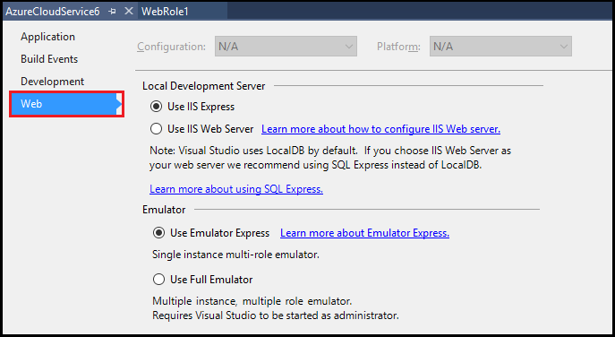

<properties
    pageTitle="使用 Emulator Express 在本地计算机上运行和调试 Azure 云服务 | Azure"
    description="使用 Emulator Express 在本地计算机上运行和调试云服务"
    services="visual-studio-online"
    documentationcenter="n/a"
    author="TomArcher"
    manager="douge"
    editor="" />
<tags
    ms.assetid="73108f98-a552-4817-b7a1-551367b71906"
    ms.service="visual-studio-online"
    ms.devlang="multiple"
    ms.topic="article"
    ms.tgt_pltfrm="multiple"
    ms.workload="na"
    ms.date="03/06/2017"
    wacn.date="05/22/2017"
    ms.author="tarcher"
    ms.translationtype="Human Translation"
    ms.sourcegitcommit="8fd60f0e1095add1bff99de28a0b65a8662ce661"
    ms.openlocfilehash="78a009a464e685f106928b728639e573397c54f4"
    ms.contentlocale="zh-cn"
    ms.lasthandoff="05/12/2017" />

# 使用 Emulator Express 在本地计算机上运行和调试 Azure 云服务
通过使用 Emulator Express，您可以测试和调试云服务，而不需要以管理员身份运行 Visual Studio。 您可以将项目设置指定为根据云服务的要求使用 Emulator Express 或完整版模拟器。 有关完整模拟器的详细信息，请参阅 [Run an Azure Application in the Compute Emulator](/documentation/articles/storage-use-emulator/)（在计算模拟器中运行 Azure 应用程序）。

## 在 Visual Studio 中使用 Emulator Express
在 Azure SDK 2.3 或更高版本中创建 Azure 项目时会自动使用 Emulator Express。 对于使用早期版本的 Azure SDK 创建的现有项目，请按照以下步骤来选择 Emulator Express：

1. 在 Visual Studio 中创建或打开 Azure 云服务项目。

2. 在“解决方案资源管理器”中右键单击项目，然后从上下文菜单中选择“属性”。

3. 在项目属性页中，选择“Web”选项卡。

    

5. 在“本地开发服务器”下，选择“使用 IIS Express”选项。

6. 在“模拟器”下，选择“使用 Emulator Express”。
   
7. 若要启动 Emulator Express，请在命令提示符处运行以下命令： 

        csrun.exe /useemulatorexpress

## Emulator Express 限制
以下问题是 Emulator Express 的已知限制： 

- Emulator Express 与 IIS Web 服务器不兼容。
- 您的云服务可以包含多个角色，但每个角色只能有一个实例。
- 无法访问 1000 以下的端口号。 如果所用的某个身份验证提供程序通常使用低于 1000 的端口，则可能需要将此值更改为 1000 以上的端口号。
- 适用于 Azure 计算模拟器的任何限制也适用于 Emulator Express。 例如，每个部署的角色实例数不能超过 50 个。 有关 Azure 计算模拟器的详细信息，请参阅[在计算模拟器中运行 Azure 应用程序](/documentation/articles/vs-azure-tools-performance-profiling-cloud-services/)。

## 后续步骤
[调试 Azure 云服务](https://msdn.microsoft.com/zh-cn/library/azure/ee405479.aspx)

<!-- Update_Description: link update -->