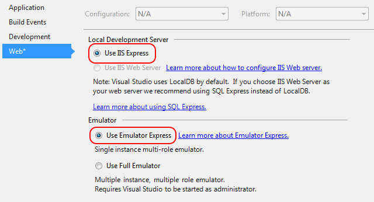

<properties
    pageTitle="使用 Emulator Express 在本地计算机上运行和调试云服务 | Azure"
    description="使用 Emulator Express 在本地计算机上运行和调试云服务"
    services="visual-studio-online"
    documentationcenter="n/a"
    author="TomArcher"
    manager="douge"
    editor="" />
<tags
    ms.assetid="73108f98-a552-4817-b7a1-551367b71906"
    ms.service="visual-studio-online"
    ms.devlang="multiple"
    ms.topic="article"
    ms.tgt_pltfrm="multiple"
    ms.workload="na"
    ms.date="11/11/2016"
    wacn.date="03/30/2017"
    ms.author="tarcher" />  

# 使用 Emulator Express 在本地计算机上运行和调试云服务
通过使用 Emulator Express，您可以测试和调试云服务，而不需要以管理员身份运行 Visual Studio。您可以将项目设置指定为根据云服务的要求使用 Emulator Express 或完整版模拟器。有关完整模拟器的详细信息，请参阅[在计算模拟器中运行 Azure 应用程序](/documentation/articles/storage-use-emulator/)。Emulator Express 首次包含在 Azure SDK 2.1 中，从 Azure SDK 2.3 开始，它已是默认的模拟器。

## 在 Visual Studio IDE 中使用 Emulator Express
当您在 Azure SDK 2.3 或更高版本中创建新项目时，便已选择 Emulator Express。对于使用早期版本的 SDK 创建的现有项目，请执行以下步骤来选择 Emulator Express。

### 将项目配置为使用 Emulator Express
1. 在 Azure 项目的快捷菜单上，选择“属性”，然后选择“Web”选项卡。
2. 在“本地开发服务器”下，选择“使用 IIS Express ”选项按钮。Emulator Express 与“IIS Web 服务器”不兼容。
3. 在“模拟器”下，选择“使用 Emulator Express”选项按钮。
   
    

## 通过命令提示符启动 Emulator Express
在命令提示符处，可以通过使用 /useemulatorexpress 选项，启动 Azure 计算模拟器的 Express 版本 (csrun.exe)。

## 限制
在使用 Emulator Express 之前，应了解一些限制：

- Emulator Express 与“IIS Web 服务器”不兼容。
- 您的云服务可以包含多个角色，但每个角色只能有一个实例。
- 无法访问 1000 以下的端口号。例如，如果您使用的某个身份验证提供程序通常使用低于 1000 的端口，则可能需要将此值更改为 1000 以上的端口号。
- 适用于 Azure 计算模拟器的任何限制也适用于 Emulator Express。例如，每个部署的角色实例数不能超过 50 个。请参阅[在计算模拟器中运行 Azure 应用程序](/documentation/articles/vs-azure-tools-performance-profiling-cloud-services/)

## 后续步骤
[调试云服务](https://msdn.microsoft.com/zh-cn/library/azure/ee405479.aspx)

<!---HONumber=Mooncake_0320_2017-->
<!-- Update_Description: link update -->