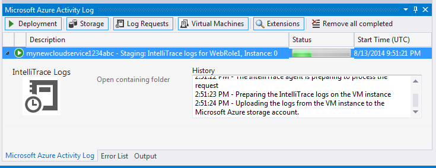

<properties 
   pageTitle="使用 IntelliTrace 和 Visual Studio 调试已发布的云服务 | Azure"
   description="使用 IntelliTrace 和 Visual Studio 调试已发布的云服务"
   services="visual-studio-online"
   documentationCenter="n/a"
   authors="TomArcher"
   manager="douge"
   editor="" />

<tags 
    ms.assetid="5e6662fc-b917-43ea-bf2b-4f2fc3d213dc"
    ms.service="visual-studio-online"
    ms.devlang="multiple"
    ms.topic="article"
    ms.tgt_pltfrm="multiple"
    ms.workload="na"
    ms.date="11/11/2016"
    wacn.date="02/04/2017"
    ms.author="tarcher" />

# 使用 IntelliTrace 和 Visual Studio 调试已发布的云服务

##概述

通过 IntelliTrace，可以在某个角色实例在 Azure 中运行时记录该角色实例的大量调试信息。如果您需要查找问题的原因，您可以从 Visual Studio 使用 IntelliTrace 日志来单步执行代码，就像它在 Azure 中运行一样。实际上，当 Azure 应用程序以云服务的形式在 Azure 中运行时，IntelliTrace 将记录关键代码执行和环境数据，并允许从 Visual Studio 中回放已记录的数据。作为替代方法，您可以使用远程调试，直接连接到在 Azure 中运行的云服务。请参阅[调试云服务](/documentation/articles/vs-azure-tools-debugging-cloud-services-overview/)。

>[AZURE.IMPORTANT] IntelliTrace 仅适用于调试方案，而不应用于生产部署。

>[AZURE.NOTE] 如果已安装 Visual Studio Enterprise，且 Azure 应用程序以 .NET Framework 4 或更高版本为目标，则可使用 IntelliTrace。IntelliTrace 收集 Azure 角色的信息。这些角色的虚拟机始终运行 64 位操作系统。

## 为 IntelliTrace 配置 Azure 应用程序

若要为 Azure 应用程序启用 IntelliTrace，必须从 Visual Studio Azure 项目创建并发布应用程序。在将应用程序发布到 Azure 之前，必须为 Azure 应用程序配置 IntelliTrace。如果发布应用程序（不配置 IntelliTrace），但随即又决定要执行此操作，则必须重新从 Visual Studio 发布该应用程序。有关详细信息，请参阅[使用 Azure Tools 发布云服务](/documentation/articles/vs-azure-tools-publishing-a-cloud-service/)。

1. 当您准备好部署 Azure 应用程序时，请验证是否将项目生成目标设置为“调试”。

1. 在“解决方案资源管理器”中打开“Azure 项目”的快捷菜单，然后选择“发布”。
 
    随即显示“发布 Azure 应用程序”向导。

1. 若想要当在云中发布应用程序时，收集其 IntelliTrace 日志，请选择“启用 IntelliTrace”复选框。

    >[AZURE.NOTE] 发布 Azure 应用程序时，可启用 IntelliTrace 或分析。二者不能同时启用。

1. 若要自定义基本的 IntelliTrace 配置，请选择“设置”超链接。

    “IntelliTrace 设置”对话框将出现，如下图所示。您可以指定要记录的事件、是否收集调用信息、要收集其日志的模块和过程，以及分配给记录的空间量。有关 IntelliTrace 的详细信息，请参阅[使用 IntelliTrace 进行调试](https://msdn.microsoft.com/zh-cn/library/dd264915.aspx)。

    

IntelliTrace 日志是一个循环日志文件，IntelliTrace 设置中指定了该文件的最大大小（默认大小为 250 MB）。IntelliTrace 日志将被收集到虚拟机的文件系统中的一个文件中。当请求日志时，将及时拍摄该时刻的快照，并将该快照下载到本地计算机上。

将 Azure 应用程序发布到 Azure 后，您可以确定是否已从“服务器资源管理器”中的“Azure 计算”节点启用了 IntelliTrace，如下图所示：

## 下载角色实例的 IntelliTrace 日志

可以从“服务器资源管理器”中的“云服务”节点下载角色实例的 IntelliTrace 日志。展开“云服务”节点直到找到所需的实例，打开此实例的快捷菜单，然后选择“查看 IntelliTrace 日志”。IntelliTrace 日志将被下载到本地计算机上某个目录中的文件中。每当您请求 IntelliTrace 日志时，就会创建新的快照。

在下载日志时，Visual Studio 将在“Azure 活动日志”窗口中显示操作进度。可以展开操作的行项以查看详细信息，如下图所示。

下载 IntelliTrace 日志时，可以在 Visual Studio 中继续工作。日志下载完成后，将在 Visual Studio 中自动打开。

>[AZURE.NOTE] IntelliTrace 日志可能包含由框架生成并进行后续处理的异常。如果这些异常时内部框架代码生成的，它们是启动角色的正常一环，可以安全地忽略。

<!---HONumber=Mooncake_0509_2016-->