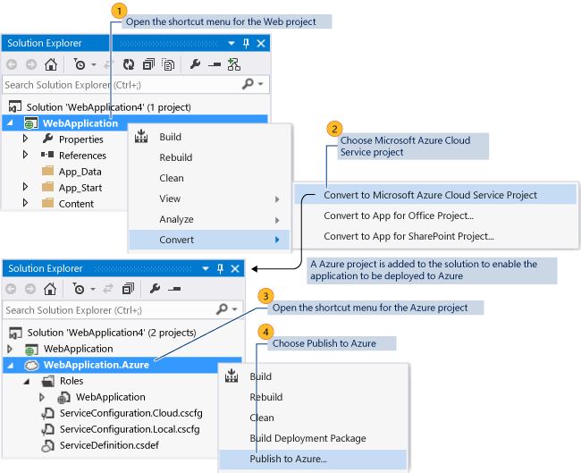

<properties
    pageTitle="如何通过 Visual Studio 将 Web 应用程序迁移和发布到 Azure 云服务 | Azure"
    description="了解如何使用 Visual Studio 将 Web 应用程序迁移和发布到 Azure 云服务。"
    services="visual-studio-online"
    documentationcenter="na"
    author="TomArcher"
    manager="douge"
    editor="" />
<tags
    ms.assetid="9394adfd-a645-4664-9354-dd5df08e8c91"
    ms.service="multiple"
    ms.devlang="dotnet"
    ms.topic="article"
    ms.tgt_pltfrm="na"
    ms.workload="multiple"
    ms.date="11/11/2016"
    wacn.date="03/30/2017"
    ms.author="tarcher" />  


# 如何：通过 Visual Studio 将 Web 应用程序迁移和发布到 Azure 云服务
若要利用 Azure 的托管服务和可缩放性，你可能要将 Web 应用程序迁移和发布到 Azure 云服务。只需对现有 Web 应用程序进行最小程度的更改，便可在 Azure 中运行它。

> [AZURE.NOTE]
本主题是关于如何部署到云服务，而不是部署到网站。有关如何部署到网站的信息，请参阅[在 Azure App Service 中部署 Web 应用](/documentation/articles/web-sites-deploy/)。
>
>

有关 Visual C# 和 Visual Basic 支持的特定模板列表，请参阅本主题稍后的**支持的项目模板**部分。

必须首先从 Visual Studio 中为 Azure 启用 Web 应用程序。下图显示了通过添加用于部署的 Azure 项目，来发布现有 Web 应用程序的关键步骤。此过程使用所需的 Web 角色，将 Azure 项目添加到解决方案。基于拥有的 Web 项目类型，如果服务包需要额外的部署程序集，则该程序集的项目属性也将更新。



> [AZURE.NOTE]
仅为解决方案中的 Web 项目显示“转换”>“转换为 Azure 云服务项目”命令。例如，该命令对解决方案中的 Silverlight 项目不可用。当你创建服务包或者将应用程序发布到 Azure 时，可能会出现警告或错误。这些警告和错误可以帮助你在部署到 Azure 之前解决问题。例如，你可能会收到有关缺少程序集的警告。有关如何将任何警告视为错误的详细信息，请参阅[使用 Visual Studio 配置 Azure 云服务项目](/documentation/articles/vs-azure-tools-configuring-an-azure-project/)。当你生成应用程序、使用计算模拟器本地运行应用程序，或者将它发布到 Azure 时，可能会在“错误列表”窗口看到以下错误：“指定的路径和/或文件名太长”。出现此错误的原因是 Azure 项目的完全限定名称太长。项目名称，包括完整路径的长度不能超过 146 个字符。例如，以下是完整的项目名称，包括为 Silverlight 应用程序创建的 Azure 项目的文件路径：`c:\users<user name>\documents\visual studio 2015\Projects\SilverlightApplication4\SilverlightApplication4.Web.Azure.ccproj`。你可能需要将解决方案移到路径较短的不同目录，以减少完全限定的项目名称的长度。
>
>

若要从 Visual Studio 将 Web 应用程序迁移和发布到 Azure，请执行以下步骤。

## 启用要部署到 Azure 的 Web 应用程序
### 启用要部署到 Azure 的 Web 应用程序
   若要启用要部署到 Azure 的 Web 应用程序，请在解决方案中打开 Web 项目的快捷菜单，然后选择“添加 Azure 部署项目”。

   执行以下操作：

   - 将名为 `<name of the web project>.Azure` 的 Azure 项目添加到应用程序的解决方案中。
   - 将 Web 项目的 Web 角色添加到此 Azure 项目中。
   - 对于 MVC 2、MVC 3、MVC 4 和 Silverlight 业务应用程序需要的任何程序集，“本地复制”属性设置为 true。这会将这些程序集添加到用于部署的服务包。

   > [AZURE.IMPORTANT]
   如果你有此 Web 应用程序所需的其他程序集或文件，必须手动设置这些文件的属性。有关如何设置这些属性的信息，请参阅本文稍后的**在服务包中包含文件**部分。
   >
   > [AZURE.NOTE]
   如果在解决方案中的 Azure 项目内已存在特定 Web 项目的 Web 角色，则“转换”>“转换为 Azure 云服务项目”不会显示在此 Web 项目的快捷菜单中。
   >
   >

   如果 Web 应用程序中有多个 Web 项目，且希望为每个 Web 项目都创建 Web 角色，则必须为每个 Web 项目执行此过程中的步骤。这将为每个 Web 角色创建独立的 Azure 项目。每个 Web 项目都可以单独发布。或者，你可以将另一个 Web 角色手动添加到 Web 应用程序中的现有 Azure 项目。为此，请打开 Azure 项目中“角色”文件夹的快捷菜单，选择“添加”，然后在“解决方案中的 Web 角色项目”中，选择要添加为 Web 角色的项目，然后选择“确定”按钮。

## 为应用程序使用 Azure SQL 数据库
如果使用内部 SQL Server 数据库的 Web 应用程序具有连接字符串，必须将此连接字符串改为使用 Azure 托管的 SQL 数据库实例。

> [AZURE.IMPORTANT]
你的订阅必须允许你使用 SQL 数据库。如果从 [Azure 经典管理门户](https://manage.windowsazure.cn)访问订阅，便可确定订阅提供的服务。以下说明适用于已发行的 [Azure 经典管理门户](https://manage.windowsazure.cn)。如果你使用的是 [Azure 门户](http://portal.azure.cn)，请跳到下一过程。
>
>

### 为连接字符串使用 Web 角色中的 SQL 数据库实例
1. 若要在 [Azure 经典管理门户](https://manage.windowsazure.cn)中创建 SQL 数据库的实例，请执行以下文章中所述的步骤：[Create a SQL Database Server](http://go.microsoft.com/fwlink/?LinkId=225109)（创建 SQL 数据库服务器）。

	> [AZURE.NOTE]
	为 SQL 数据库实例设置防火墙规则时，必须选中“允许其他 Azure 服务访问此服务器”复选框。
	>
	>
2. 若要创建用于连接字符串的 SQL 数据库实例，请在下一部分中执行以下文章中所述的步骤：[Create a SQL Database](http://go.microsoft.com/fwlink/?LinkId=225110)（创建 SQL 数据库）。
3. 若要复制 ADO.NET 连接字符串以用作你的连接字符串，请在[ Azure 经典管理门户](https://manage.windowsazure.cn)中执行以下步骤。

   1. 选择“数据库”按钮，然后打开创建 SQL 数据库实例所用订阅的节点。
   2. 若要显示可用的 SQL 数据库实例，请选择“SQL 数据库”节点。
   3. 若要显示数据库的属性，请选择该数据库。此时将显示“属性”视图。

		> [AZURE.NOTE]
		如果未显示“属性”视图，可能需要使用分隔符打开它。
		>
		>
   4. 若要查看连接字符串，请选择“视图”旁边的省略号 (...) 按钮。

		此时将显示“连接字符串”对话框。
   5. 若要复制 ADO.NET 连接字符串，请突出显示文本，然后按 Ctrl+C 键。
   6. 若要关闭对话框，请选择“关闭”按钮。
4. 若要替换 web.config 文件中的连接字符串，改用此 SQL 数据库实例，请打开 web.config 文件，突出显示现有的连接字符串条目，然后按 Ctrl+V 键。该 SQL 数据库实例的 ADO.NET 连接字符串会替换现有连接字符串。
5. 此外，还必须将参数`MultipleActiveResultSets=True` 添加到连接字符串。连接字符串应为以下格式：

    ```
    connectionString=”Server=tcp:<database_server>.database.chinacloudapi.cn,1433;Database=<database_name>;User ID=<user_name>@<database_server>;Password=<myPassword>;Trusted_Connection=False;Encrypt=True;MultipleActiveResultSets=True"
    ```
6. （可选）直接更改 web.config 文件中的连接字符串的替代方法是将一段添加到其中一个 web.config 转换文件，取决于你使用来创建你的服务包的生成配置。打开 Web.Debug.Config 文件或Web.Release.Config 文件。将以下节添加到此文件：

    ```
    XMLCopy<connectionStrings><addname="DefaultConnection"connectionString="Server=tcp:<database_server>.database.chinacloudapi.cn,1433;Database=<database_name>;User ID=<user_name>@<database_server>;Password=<myPassword>;Trusted_Connection=False;Encrypt=True;MultipleActiveResultSets=True"xdt:Transform="SetAttributes"xdt:Locator="Match(name)"/></connectionStrings>
    ```
7. 保存已修改的文件，然后重新发布应用程序。

### 通过 Azure 经典管理门户使用 SQL 数据库实例
1. 在 [Azure 经典管理门户](https://manage.windowsazure.cn)中，选择“SQL 数据库”节点。

   - 如果显示了要使用的 SQL 数据库实例，请选择打开它。
   - 如果尚未创建任何实例，请选择相应的链接，然后创建一个实例。
2. 打开或创建数据库实例后，请选择“连接字符串”链接。
3. 在页面底部，选择配置防火墙设置的链接，接受默认值或配置所需的值。
4. 复制 ADO.NET 连接字符串，粘贴到 web.config 文件中，覆盖本地数据库的旧连接字符串，确保添加 `MultipleActiveResultSets=True`。

## 将 Web 应用程序发布到 Azure
### 将 Web 应用程序发布到 Azure
1. 若要使用 Azure 计算模拟器测试本地开发环境中的应用程序，请打开 Web 角色的 Azure 项目的快捷菜单，并选择“设置为启动项目”。然后选择“调试”>“启动调试”（快捷键：**F5**）。

    此时将显示“启动 Azure 调试环境”对话框，并在浏览器中启动应用程序。有关如何在计算模拟器中启动每种类型的 Web 应用程序的具体信息，请参阅本部分中的表格。
2. 若要设置应用程序的服务以将其发布到 Azure，你必须准备好一个 Microsoft 帐户和 Azure 订阅。使用以下主题中所述的步骤来设置服务：[Prepare to publish or deploy an Azure application from Visual Studio](/documentation/articles/vs-azure-tools-cloud-service-publish-set-up-required-services-in-visual-studio/)（准备从 Visual Studio 发布或部署 Azure 应用程序）。
3. 若要将 Web 应用程序发布到 Azure，请打开 Web 项目的快捷菜单，然后选择“发布到 Azure”。

    此时将显示“发布 Azure 应用程序”对话框，Visual Studio 将启动部署过程。有关如何发布应用程序的详细信息，请参阅 [Publishing a Cloud Service using the Azure Tools](/documentation/articles/vs-azure-tools-publishing-a-cloud-service/)（使用 Azure Tools 发布云服务）中的 **Publish an Azure Application from Visual Studio**（从 Visual Studio 发布 Azure 应用程序）部分。

	> [AZURE.NOTE]
	你还可以从 Azure 项目发布 Web 应用程序。为此，请打开 Azure 项目的快捷菜单，然后选择“发布”。
	>
	>
4. 若要查看部署进度，可以查看“Azure 活动日志”窗口。当启动部署过程时，将自动显示此日志。可在活动日志中展开行项以显示详细信息，如下图所示：

    
5. （可选）若要取消部署过程，请打开活动日志中的行项目的快捷菜单，并选择“取消并删除”。这会停止部署过程，并从 Azure 中删除部署环境。

	> [AZURE.NOTE]
	若要在完成部署后删除此部署环境，必须使用 [Azure 经典管理门户](https://manage.windowsazure.cn)。
	>
	>
6. （可选）启动角色实例后，Visual Studio 将自动在“云资源管理器”的“Azure 计算”节点中显示部署环境。可以从此位置查看单个角色实例的状态。

    下图显示“服务器资源管理器”中仍处于“正在初始化”状态中的角色实例：

    
7. 若要在部署后访问你的应用程序，请在“Azure 活动日志”中显示了“已完成”状态时，选择部署旁边的箭头。这会显示 Web 应用程序在 Azure 中的 URL。有关如何从 Azure 启动特定类型的 Web 应用程序的详细信息，请参阅下表。

    下表列出了有关如何从 Azure 启动特定 Web 应用程序，或者使用 Azure 计算模拟器在本地运行或调试 Web 应用程序的详细信息：

	|Web 应用程序类型 |在本地使用计算模拟器进行运行/调试 |在 Azure 中运行 | 
	|--- |--- |--- | 
	|ASP.NET Web 应用程序 |在菜单栏上，选择“调试”、“开始调试”（键盘：选择 **F5** 键。）。 |选择“Azure 活动日志”的“部署”选项卡中显示的 URL 超链接在浏览器中加载起始页。 | 
	|ASP.NET MVC 2 Web 应用程序 |在菜单栏上，选择“调试”、“开始调试”（键盘：选择 **F5** 键。）。 |选择“Azure 活动日志”的“部署”选项卡中显示的 URL 超链接在浏览器中加载起始页。 | 
	|ASP.NET MVC 3 Web 应用程序 |在菜单栏上，选择“调试”、“开始调试”（键盘：选择 **F5** 键。）。 |选择“Azure 活动日志”的“部署”选项卡中显示的 URL 超链接在浏览器中加载起始页。 | 
	|ASP.NET MVC 4 Web 应用程序 |在菜单栏上，选择“调试”、“开始调试”（键盘：选择 **F5** 键。）。 |选择“Azure 活动日志”的“部署”选项卡中显示的 URL 超链接在浏览器中加载起始页。 | 
	|ASP.NET 空 Web 应用程序 |必须在应用程序中添加一个 .aspx 页，将其设为你的 Web 项目的起始页。然后在菜单栏上，选择“调试”、“开始调试”（键盘：选择 **F5** 键。）。|如果应用程序中包含默认的 .aspx 页，请选择“Azure 活动日志”的“部署”选项卡中显示的 URL 超链接，随即在浏览器中加载此页。如果有不同的 .aspx 页，则需要使用以下格式的 url 导航到特定页：`<url for deployment>/<name of page>.aspx` | 
	|Silverlight 应用程序 |在菜单栏上，选择“调试”、“开始调试”（键盘：选择 **F5** 键。）。 |需要使用以下格式的 url 导航到应用程序的特定页：`<url for deployment>/<name of page>.aspx` | 
	|Silverlight 商业应用程序 |在菜单栏上，选择“调试”、“开始调试”（键盘：选择 **F5** 键。）。 |需要使用以下格式的 url 导航到应用程序的特定页：`<url for deployment>/<name of page>.aspx` | 
	|Silverlight 导航应用程序 |在菜单栏上，选择“调试”、“开始调试”（键盘：选择 **F5** 键。）。 |需要使用以下格式的 url 导航到应用程序的特定页：`<url for deployment>/<name of page>.aspx` | 
	|WCF 服务应用程序 |必须将 .svc 文件设置为 WCF 服务项目的起始页。然后在菜单栏上，选择“调试”、“开始调试”（键盘：选择 **F5** 键。）。 |需要使用以下格式的 url 导航到应用程序的 svc 文件：`<url for deployment>/<name of service file>.svc` | 
	|WCF 工作流服务应用程序 |必须将 .svc 文件设置为 WCF 服务项目的起始页。然后在菜单栏上，选择“调试”、“开始调试”（键盘：选择 **F5** 键。）。 |需要使用以下格式的 url 导航到应用程序的 svc 文件：`<url for deployment>/<name of service file>.svc` | 
	|ASP.NET 动态实体 |在菜单栏上，选择“调试”、“开始调试”（键盘：选择 **F5** 键。）。 |必须更新连接字符串（请参阅下一节）。你还需要使用以下格式的 url 导航到应用程序的特定页： `<url for deployment>/<name of page>.aspx` | 
	|ASP.NET 动态数据 Linq to SQL |在菜单栏上，选择“调试”、“开始调试”（键盘：选择 **F5** 键。）。 |必须遵循以下过程中的步骤：在应用程序中使用 SQL Azure 数据库（请参阅本主题中的前面部分）。另外，需要使用以下格式的 URL 导航到应用程序的特定页：`<url for deployment>/<name of page>.aspx` |

## 为 ASP.NET 动态实体更新连接字符串
### 为 ASP.NET 动态实体更新连接字符串
1. 若要创建可用于 ASP.NET 动态实体 Web 应用程序的 SQL Azure 数据库，必须遵循以下过程中的步骤：本主题前面的**为应用程序使用 SQL Azure 数据库**。
2. 从 [Azure 经典管理门户](https://manage.windowsazure.cn)添加此数据库所需的表和字段。
3. 在 web.config 文件中，这种类型的应用程序的连接字符串具有以下格式：

    ```
    <addname="tempdbEntities"connectionString="metadata=res://*/Model1.csdl|res://*/Model1.ssdl|res://*/Model1.msl;provider=System.Data.SqlClient;provider connection string=";data source=<server name>\SQLEXPRESS;initial catalog=<database name>;integrated security=True;multipleactiveresultsets=True;App=EntityFramework";"providerName="System.Data.EntityClient"/>
    ```

    使用 SQL Azure 数据库的 ADO.NET 连接字符串更新 *connectionString* 值，如下所示：

    ```
    XMLCopy<addname="tempdbEntities"connectionString="metadata=res://*/Model1.csdl|res://*/Model1.ssdl|res://*/Model1.msl;provider=System.Data.SqlClient;provider connection string=";Server=tcp:<SQL Azure server name>.database.chinacloudapi.cn,1433;Database=<database name>;User ID=<user name>;Password=<password>;Trusted_Connection=False;Encrypt=True;multipleactiveresultsets=True;App=EntityFramework";"providerName="System.Data.EntityClient"/>
    ```
4. 对连接字符串做出更改后，若要保存 web.config 文件，请在菜单栏上选择“文件”>“保存 web.config”。

## 支持的项目模板
若要将 Web 应用程序发布到 Azure，应用程序必须使用下表中列出的适用于 C# 或 Visual Basic 的项目模板之一。

| 项目模板组 | 项目模板 |
| --- | --- |
| Web |ASP.NET Web 应用程序 |
| Web |ASP.NET MVC 2 Web 应用程序 |
| Web |ASP.NET MVC 3 Web 应用程序 |
| Web |ASP.NET MVC 4 Web 应用程序 |
| Web |ASP.NET 空 Web 应用程序 |
| Web |ASP.NET MVC 2 空 Web 应用程序 |
| Web |ASP.NET 动态数据实体 Web 应用程序 |
| Web |ASP.NET 动态数据实体 Linq to SQL Web 应用程序 |
| Silverlight |Silverlight 应用程序 |
| Silverlight |Silverlight 业务应用程序 |
| Silverlight |Silverlight 导航应用程序 |
| WCF |WCF 服务应用程序 |
| WCF |WCF 工作流服务应用程序 |
| 工作流 |WCF 工作流服务应用程序 |

## 后续步骤
关于发布的详细信息，请参阅[准备从 Visual Studio 发布或部署 Azure 应用程序](/documentation/articles/vs-azure-tools-cloud-service-publish-set-up-required-services-in-visual-studio/)。另请参阅 [设置命名的身份验证凭据](/documentation/articles/vs-azure-tools-setting-up-named-authentication-credentials/)。

<!---HONumber=Mooncake_0320_2017-->
<!-- Update_Description: wording update -->