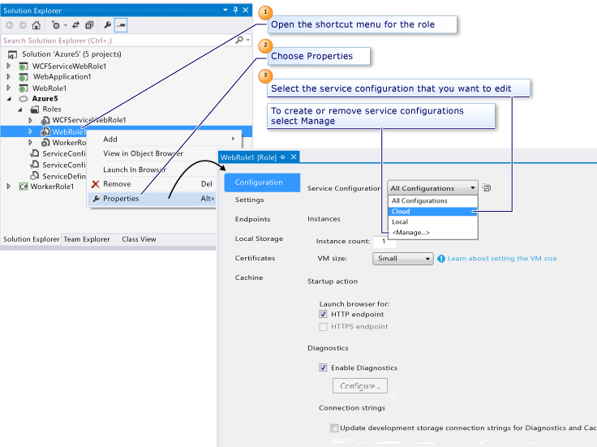

<properties
   pageTitle="使用多种服务配置来配置 Azure 项目 | Azure"
   description="了解如何通过更改 ServiceDefinition.csdef 和 ServiceConfiguration.cscfg 文件来配置 Azure 云服务项目。"
   services="visual-studio-online"
   documentationCenter="na"
   authors="TomArcher"
   manager="douge"
   editor="" />
<tags
   ms.service="multiple"
   ms.date="08/15/2016"
   wacn.date="09/19/2016" />

# 使用多种服务配置来配置 Azure 项目

Azure 云服务项目包括两个配置文件：ServiceDefinition.csdef 和 ServiceConfiguration.cscfg。这些文件将与你的 Azure 云服务应用程序一起打包并部署到 Azure。

- **ServiceDefinition.csdef** 文件包含 Azure 环境根据你的云服务应用程序所需而确定的必备元数据，包括应用程序包含哪些角色。此文件还包含适用于所有实例的配置设置。可以在运行时使用 Azure 服务托管运行时 API 读取这些配置设置。在 Azure 中运行你的服务时，无法更新此文件。

- **ServiceConfiguration.cscfg** 文件将设置服务定义文件中定义的配置设置的值，并指定要为每个角色运行的实例的数目。在 Azure 中运行你的云服务时，可以更新此文件。

Azure Tools for Microsoft Visual Studio 提供可用于设置存储在这些文件中的配置设置的属性页。若要访问这些属性页，请在解决方案资源管理器中，双击 Azure 云服务项目下的角色引用，或右键单击角色引用，然后选择“属性”，如下图所示。

有关服务定义文件和服务配置文件的基础架构信息，请参阅 [Schema Reference](https://msdn.microsoft.com/zh-cn/library/azure/dd179398.aspx)（架构参考）。有关服务配置的详细信息，请参阅[如何配置云服务](/documentation/articles/cloud-services-how-to-configure/)。

## 配置角色属性

Web 角色的属性页与辅助角色的属性页类似，不过存在少许差异，如以下部分中所述。

在“缓存”页中，可以配置 Azure 缓存服务。

### 配置页

在“配置”页上，可以设置以下属性：

**实例**

将“实例计数”属性设置为服务应为此角色运行的实例的数目。

将“VM 大小”属性设置为“特小”、“小”、“中”、“大”或“特大”。有关详细信息，请参阅[云服务的大小](/documentation/articles/cloud-services-sizes-specs/)。

**启动操作**（仅适用于 Web 角色）

设置此属性可指定在开始调试时，Visual Studio 应为 HTTP 终结点、HTTPS 终结点还是两者启动 Web 浏览器。

仅当你已经为角色定义了 HTTPS 终结点时，HTTPS 终结点选项才可用。可以在“终结点”属性页上定义 HTTPS 终结点。

如果已添加 HTTPS 终结点，则按默认启用“HTTPS 终结点”选项，Visual Studio 除了为 HTTP 终结点启动浏览器之外，还将在开始调试时为此终结点启动浏览器。此处假设两个启动选项都已启用。

**诊断**

默认情况下，将对 Web 角色启用诊断。Azure 云服务项目和存储帐户都设置为使用本地存储模拟器。准备好部署到 Azure 后，可以选择生成器按钮 (**…**) 来更新存储帐户，以便在云中使用 Azure 存储空间。可以根据需要或自动计划的间隔，将诊断数据传输到存储帐户。有关 Azure 诊断的详细信息，请参阅[在 Azure 云服务和虚拟机中启用诊断](./cloud-services/cloud-services-dotnet-diagnostics.md)。

## “设置”页

可以在“设置”页上为服务添加配置设置。配置设置是名称-值对。角色中运行的代码可以使用 [Azure 托管库](http://go.microsoft.com/fwlink?LinkID=171026)提供的类，在运行时读取配置设置的值。具体而言，[GetConfigurationSettingValue](https://msdn.microsoft.com/library/azure/microsoft.windowsazure.serviceruntime.roleenvironment.getconfigurationsettingvalue.aspx) 方法将在运行时返回命名配置设置的值。

### 将连接字符串配置为存储帐户

连接字符串是一个配置设置，它为存储模拟器或 Azure 存储帐户提供连接和身份验证信息。只要代码必须从角色中运行的代码访问 Azure 存储服务数据（即，blob、队列或表数据），就必须为该存储帐户定义连接字符串。

指向 Azure 存储帐户的连接字符串必须使用定义的格式。有关如何创建连接字符串的信息，请参阅[配置 Azure 存储空间连接字符串](/documentation/articles/storage-configure-connection-string/)。

在准备好对 Azure 存储服务测试你的服务时，或在准备好将你的云服务部署到 Azure 时，可以更改任何连接字符串的值以指向 Azure 存储帐户。选择 (**…**)，选择“输入存储帐户凭据”。输入包含你的帐户名和帐户密钥的帐户信息。此外，还可以在“存储帐户连接字符串”对话框中，指示是希望使用默认 HTTPS 终结点（默认选项）、默认 HTTP 终结点还是自定义终结点。如果已为服务注册了自定义域名，则可以决定使用自定义终结点，如[为 Azure 存储帐户中的 Blob 数据配置自定义域名](./storage/storage-custom-domain-name.md)中所述。

>[AZURE.IMPORTANT] 在部署服务之前，必须修改连接字符串以指向 Azure 存储帐户。否则，可能导致角色无法启动，或是在初始化、忙碌、停止状态之间循环。

## “终结点”页

一个辅助角色可以有任意数量的 HTTP、HTTPS 或 TCP 终结点。终结点可以是供外部客户端使用的输入终结点，也可以是供服务中其他运行角色使用的内部终结点。

- 若要使 HTTP 终结点可用于外部客户端和 Web 浏览器，请将终结点类型更改为输入，然后指定名称和公用端口号。

- 若要使 HTTPS 终结点可用于外部客户端和 Web 浏览器，请将终结点类型更改为**输入**，然后指定名称、公用端口号和管理证书名称。

    请注意，必须先在“证书”属性页上定义一个管理证书，然后才能指定该证书。

- 若要使终结点可供云服务中的其他角色进行内部访问，请将终结点类型更改为内部，然后为其指定名称和可行的专用端口。

## “本地存储”页

可以使用“本地存储”属性页来保留某个角色的一个或多个本地存储资源。本地存储资源是运行角色实例的 Azure 虚拟机的文件系统中的保留目录。

## “证书”页

可以在“证书”页上将证书与角色关联。所添加的证书可用于配置“终结点”属性页上的 HTTPS 终结点。

“证书”属性页会将有关证书的信息添加到服务配置。请注意，证书不会与服务一起打包；你必须通过 [Azure 经典门户](http://go.microsoft.com/fwlink/?LinkID=213885)将证书单独上载到 Azure。

若要将证书与角色关联，请提供证书的名称。在“终结点”属性页上配置 HTTPS 终结点时，你将使用此名称来引用证书。接下来，指定证书存储是“本地计算机”还是“当前用户”，并指定存储的名称。最后，输入证书的指纹。如果证书位于“当前用户\\个人(我的)”存储区中，可以通过从填充列表中选择证书来输入证书的指纹。如果证书驻留在任何其他位置，则手动输入指纹值。

当你添加来自证书存储区中的证书时，系统会自动将任何中间证书添加到配置设置。若要正确为服务配置 SSL，还必须将这些中间证书上载到 Azure。

仅当服务在云中运行时，与该服务关联的所有管理证书才会应用到该服务。当服务在本地开发环境中运行时，它使用由计算模拟器管理的标准证书。

## 配置 Azure 云服务项目

若所配置的设置将应用于整个 Azure 云服务项目，请先打开该项目代码的快捷菜单，然后选择“属性”以打开其属性页。下表显示了这些属性页。

|属性页|说明|
|---|---|
|应用程序|在此页中，可以显示有关此云服务项目使用的 Azure Tools 的版本信息，并且可以升级到这些工具的最新版本。|
|生成事件|在此页中，可以设置生成前和生成后事件。|
|开发|在此页中，可以指定生成配置说明，以及运行任何生成后事件的条件。|
|Web|在此页中，可以配置与 Web 服务器相关的设置。|

<!---HONumber=Mooncake_0912_2016-->