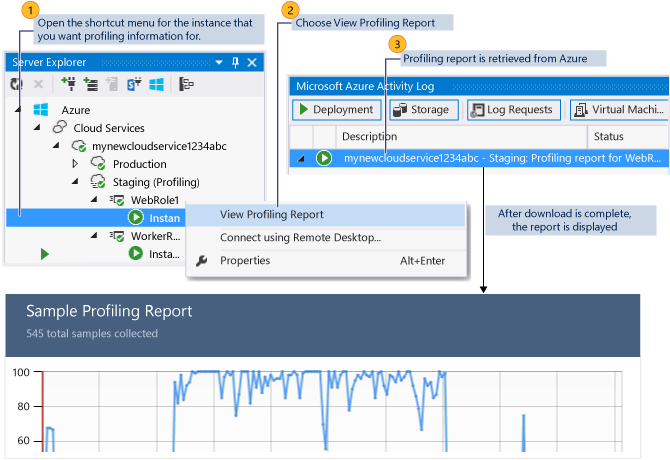

<properties
    pageTitle="测试云服务的性能 | Azure"
    description="使用 Visual Studio 探查器测试云服务的性能"
    services="visual-studio-online"
    documentationcenter="n/a"
    author="TomArcher"
    manager="douge"
    editor="" />
<tags
    ms.assetid="7a5501aa-f92c-457c-af9b-92ea50914e24"
    ms.service="visual-studio-online"
    ms.devlang="multiple"
    ms.topic="article"
    ms.tgt_pltfrm="multiple"
    ms.workload="na"
    ms.date="11/11/2016"
    wacn.date="03/30/2017"
    ms.author="tarcher" />  

# 测试云服务的性能
## 概述
您可以通过以下方式测试云服务的性能：

- 使用 Azure 诊断，可以收集有关请求和连接的信息，可以查看站点统计信息，其中显示了客户角度的服务执行情况。若要快速入门，请参阅[为 Azure 云服务和虚拟机配置诊断](/documentation/articles/vs-azure-tools-diagnostics-for-cloud-services-and-virtual-machines/)。
- 通过使用 Visual Studio 探查器，可以获取该服务在计算方面运行情况的深入分析。如本主题所述，服务在 Azure 中运行时，可使用探查器来测量性能。有关当服务在计算模拟器中本地运行时如何使用探查器来测量其性能的信息，请参阅[使用 Visual Studio 探查器来测试在计算模拟器中本地运行的 Azure 云服务的性能](/documentation/articles/cloud-services-performance-testing-visual-studio-profiler/)。

## 选择性能测试方法
### 使用 Azure 诊断进行收集：
- 对网页或服务（如请求和连接）的统计信息。
- 对角色的统计信息，例如角色重启的频率。
- 有关内存使用率的整体信息，例如垃圾回收器所用时间的百分比，或是正在运行的角色的内存集。

### 希望执行以下任务时，可使用 Visual Studio 探查器：
- 确定哪些功能用时最多。
- 对于计算密集型程序，测量其各部分用了多少时间。
- 比较服务两个版本的详细性能报告。
- 在比单个内存分配更详细的级别上，分析内存分配。
- 分析多线程代码中的并发问题。

使用探查器时，无论云服务是在本地运行还是在 Azure 中运行，都可以收集数据。

### 希望执行以下任务时，应在本地收集分析数据：
- 针对云服务中不需要实际模拟负载的部分，测试其性能，如特定辅助角色的执行。
- 在受控的隔离条件下，测试云服务的性能。
- 将云服务部署到 Azure 之前，测试其性能。
- 私下测试云服务的性能，而不影响现有的部署。
- 测试服务的性能，而不产生在 Azure 中运行的费用。

### 希望执行以下任务时，应在 Azure 中收集分析数据：
- 测试云服务在模拟或真实负载下的性能。
- 使用用于收集分析数据的检测方法，如本主题稍后所述。
- 使用服务在生产中运行时的相同环境，测试服务性能。

通常会通过模拟一个负载，测试正常或压力状况下的云服务。

## 分析在 Azure 中的云服务
从 Visual Studio 发布云服务时，可以分析服务，指定提供所需信息的分析设置。为每个角色实例启动分析会话。有关如何从 Visual Studio 中发布服务的详细信息，请参阅[从 Visual Studio 发布到 Azure 云服务](https://msdn.microsoft.com/zh-cn/library/azure/ee460772.aspx)。

若要了解有关 Visual Studio 中的性能分析的详细信息，请参阅[性能分析初学者指南](https://msdn.microsoft.com/zh-cn/library/azure/ms182372.aspx)和[使用分析工具分析应用程序性能](https://msdn.microsoft.com/zh-cn/library/azure/z9z62c29.aspx)。

> [AZURE.NOTE]
发布云服务时，可以启用 IntelliTrace 或分析。但二者不能同时启用。
> 
> 

### 分析集合方法
根据遇到的性能问题，可以使用不同的分析集合方法：

- **CPU 采样** - 此方法为 CPU 利用率问题的初始分析收集有用的应用程序统计信息。CPU 采样是建议的方法，用于启动大多数性能调查。收集 CPU 采样数据时，这不会对要分析的应用程序产生很大影响。
- **检测信息** - 此方法收集用于重点分析和分析输入/输出性能问题有用的详细计时数据。在分析运行过程中，检测方法将记录每个进入、退出以及对模块中的函数执行的函数调用。此方法适用于收集有关代码中某个部分的详细计时信息，以及了解输入和输出操作对应用程序性能的影响。此方法禁用计算机运行 32 位操作系统。仅当云服务在 Azure 中运行，而非以本地方式在计算模拟器中运行时，此选项才可用。
- **.NET 内存分配** - 此方法通过使用采样分析方法收集 .NET Framework 内存分配数据。所收集的数据包括数量和分配的对象的大小。
- **并发性** - 此方法收集资源争用数据和线程执行数据，这些数据可用于分析多线程应用程序和多进程应用程序。并发性方法收集阻止执行代码的每个事件的数据，例如，当线程等待对应用程序资源的锁定访问权限得到释放时。此方法可用于分析多线程应用程序。
- 您还可以启用**层交互分析**，这种方法提供了有关在可与一个或多个数据库通信的多层应用程序函数中同步 ADO.NET 调用的执行时间的更多信息。您可以使用任意分析方法收集层交互数据。有关层交互分析的详细信息，请参阅[层交互视图](https://msdn.microsoft.com/zh-cn/library/azure/dd557764.aspx)。

## 配置分析设置
下图演示了如何从“发布 Azure 应用程序”对话框配置分析设置。

> [AZURE.NOTE]
若要启用“启用分析”复选框，则必须在你用来发布云服务的本地计算上安装了探查器。默认情况下，探查器会在你安装 Visual Studio 时安装。
> 
> 

### 配置分析设置
1. 在“解决方案资源管理器”中，打开“Azure 项目”的快捷菜单，然后选择“发布”。有关如何发布云服务的详细步骤，请参阅[使用 Azure Tools 发布云服务](/documentation/articles/vs-azure-tools-publishing-a-cloud-service/)。
2. 在“发布 Azure 应用程序”对话框中，选择“高级设置”选项卡。
3. 若要启用分析，请选中“启用分析”复选框。
4. 若要配置分析设置，请选择“设置”超链接。此时将显示“分析设置”对话框。
5. 在“要使用什么分析方法”选项按钮中，选择所需的分析类型。
6. 若要收集层交互分析数据，请选中“启用层交互分析”复选框。
7. 若要保存设置，请选择“确定”按钮。
   
    当发布此应用程序时，这些设置将用于为每个角色创建分析会话。

## 查看分析报告
为云服务中的角色的每个实例创建分析会话。若要从 Visual Studio 查看每个会话的分析报告，可以查看“服务器资源管理器”窗口，然后选择“Azure 计算”节点以选择角色的实例。然后可以查看分析报告，如下图所示。

### 查看分析报告
1. 若要在 Visual Studio 中查看“服务器资源管理器”窗口，请在菜单栏上选择“视图”、“服务器资源管理器”。
2. 选择“Azure 计算”节点，然后针对从 Visual Studio 发布时您所选的要进行分析的云服务，选择相应 Azure 部署节点。
3. 若要查看实例的分析报告，请选择服务中的角色，打开特定实例的快捷菜单，然后选择“查看分析报告”。
   
    报告是一个 .vsp 文件，它现在已从 Azure 下载，且下载的状态显示在 Azure 活动日志中。下载完成后，分析报告在名为 <角色名称><实例编号><标识符>.vsp 的 Visual Studio 编辑器选项卡中显示。随即将显示报告的汇总数据。
4. 若要显示报告的其他视图，请在“当前视图”列表中，选择所需视图类型。有关详细信息，请参阅[分析工具报告视图](https://msdn.microsoft.com/zh-cn/library/azure/bb385755.aspx)。

<!---HONumber=Mooncake_0320_2017-->
<!-- Update_Description: wording update -->