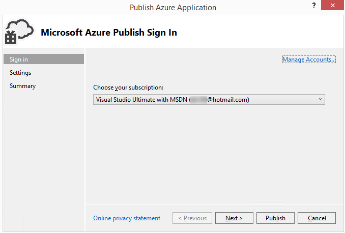

<properties 
   pageTitle="发布 Azure 应用程序向导 | Azure"
   description="发布 Azure 应用程序向导"
   services="visual-studio-online"
   documentationCenter="na"
   authors="TomArcher"
   manager="douge"
   editor="" />

<tags
    ms.assetid="7d8f1ac9-e439-47e0-a183-0642c4ea1920"
    ms.service="multiple"
    ms.devlang="multiple"
    ms.topic="article"
    ms.tgt_pltfrm="na"
    ms.workload="na"
    ms.date="11/11/2016"
    wacn.date="02/04/2017"
    ms.author="tarcher" />

# 发布 Azure 应用程序向导

## 概述

在 Visual Studio 中开发 Web 应用程序后，可以使用**发布 Azure 应用程序**向导更轻松地将该应用程序发布到 Azure 云服务。第一部分说明使用该向导前必须完成的步骤，其余部分将解释该向导的功能。

>[AZURE.NOTE] 本主题是关于如何部署到云服务，而不是部署到网站。有关如何部署到网站的信息，请参阅 [How to Deploy an Azure Web Site](https://social.msdn.microsoft.com/Search/windowsazure?query=How%20to%20Deploy%20an%20Azure%20Web%20Site&Refinement=138&ac=4#refinementChanges=117&pageNumber=1&showMore=false)（如何部署 Azure 网站）。

## 先决条件

在将 Web 应用程序发布到 Azure 之前，需要有一个 Microsoft 帐户和一个 Azure 订阅，并且必须将 Web 应用程序与 Azure 云服务关联。如果你已完成这些任务，则可以跳到下一部分。

1. 获取 Microsoft 帐户和 Azure 订阅。可以在[此处](/pricing/1rmb-trial/)免费试用 Azure 订阅一个月

1. 在 Azure 上创建云服务和存储帐户。可以通过 Visual Studio 中的服务器资源管理器或使用 [Azure 经典管理门户](http://manage.windowsazure.cn)执行此操作。

1. 为 Azure 启用 Web 应用程序。若要启用 Web 应用程序以将其从 Visual Studio 发布到 Azure，必须将它与 Visual Studio 中的 Azure 云服务项目相关联。若要创建关联的云服务项目，请打开 Web 应用程序项目的快捷菜单，然后选择“转换”>“转换为 Azure 云服务项目”。

1. 将云服务项目添加到解决方案后，请再次打开同一个快捷菜单并选择“发布”。

>[AZURE.NOTE] 确保使用管理员凭据启动 Visual Studio（以管理员身份运行）。

1. 准备好发布应用程序时，请打开 Azure 云服务项目的快捷菜单，然后选择“发布”。以下步骤演示了发布 Azure 应用程序向导。

## 选择你的订阅

### 选择订阅

1. 在首次使用向导之前，你必须登录。选择“登录”链接。根据提示登录到 Azure 经典管理门户，并提供你的 Azure 用户名和密码。 

    

    订阅列表中填充了与你的帐户关联的订阅。你也可以从事先导入的任何订阅文件查看订阅。

1. 在“选择订阅”列表中，选择要用于此部署的订阅。

    如果你选择“<管理...>”，将显示“管理订阅”对话框，你可以选择要使用的订阅和用户帐户。“帐户”选项卡显示所有帐户，“订阅”选项卡显示与帐户关联的所有订阅。你也可以选择要从中使用 Azure 资源的区域，并从 Azure 经典管理门户创建或导入订阅的证书。如果你从订阅文件导入了任何订阅，关联的证书将显示在“证书”选项卡下。完成后，请选择“关闭”按钮。

    
    
    >[AZURE.NOTE] A subscription file can contain more than one subscription.

1. 选择“下一步”按钮继续。 

    如果你的订阅中没有任何云服务，则需要在 Azure 中创建云服务来托管项目。此时将显示“创建云服务和存储帐户”对话框。

    指定云服务的新名称。该名称在 Azure 中必须唯一。然后指定靠近你或大多数客户端的数据中心的区域或地缘组。此名称还用于 Azure 为云服务创建的新存储帐户。

1. 修改要用于此部署的任何设置，然后选择“发布”按钮将它发布（下一部分将提供各项设置的详细信息）。若要在发布之前检查设置，请选择“下一步”按钮。

    >[AZURE.NOTE] 如果在此步骤中选择“发布”，你可以在 Visual Studio 中监视此部署的状态。

可以使用“发布 Azure 应用程序”向导修改部署的通用和高级设置。例如，你可以选择某项设置，在发布应用程序之前将它部署到测试环境。下图显示了 Azure 部署的“通用设置”选项卡。

## 配置发布设置

### 配置发布设置

1. 在“云服务”列表中，执行下列其中一组步骤：

   1. 在下拉列表框中，选择现有的云服务。此时将显示该服务的数据中心位置。你应记下此位置，并确保存储帐户位置在同一个数据中心。

    1. 选择“新建”以创建 Azure 托管的云服务。在“创建云服务”对话框中，提供服务的名称，然后指定区域或地缘组，以指定用于托管此云服务的数据中心位置。该名称在 Azure 中必须唯一。

1. 在“环境”列表中，选择“生产”或“过渡”。如果想要将应用程序部署到测试环境，请选择过渡环境。以后可以将应用程序转移到生产环境。

1. 在“生成配置”列表中，选择“调试”或“发布”。

1. 在“服务配置”列表中，选择“云”或“本地”。

    如果希望能够从远程连接到服务，请选中“为所有角色启用远程桌面”复选框。此选项主要用于故障排除。选中此复选框后，将显示“远程桌面配置”对话框。选择“设置”链接以更改配置。

    选中“为所有 Web 角色启用 Web 部署”复选框以启用服务的 Web 部署。只有启用了远程桌面才能使用此功能。有关详细信息，请参阅 [使用 Azure Tools 发布云服务](https://msdn.microsoft.com/zh-cn/library/azure/ff683672.aspx)。有关 Web 部署的详细信息，请参阅 [使用 Azure Tools 发布云服务](https://msdn.microsoft.com/zh-cn/library/azure/ff683672.aspx)。

1. 选择“高级设置”选项卡。在“部署标签”字段中，接受默认名称，或输入所选的名称。若要将日期附加到部署标签，请保留选中相应的复选框。

    

1. 在“存储帐户”列表中，选择要用于此部署的存储帐户。比较云服务和存储帐户的数据中心位置。理想情况下，这些位置应该相同。

    >[AZURE.NOTE] Azure 存储帐户将存储应用程序部署的包。部署应用程序之后，将从存储帐户中删除该包。

1. 如果你只想要部署更新的组件，请选中“部署更新”复选框。这种部署类型比完整部署更快速。选择“设置”链接打开“部署更新设置”对话框，如下图所示。

    

    你可以选择更新部署的两个选项之一：增量或同时。增量部署每次更新一个已部署的实例，使应用程序保持连接并可供用户使用。同时部署一次性更新所有已部署的实例。同时更新的速度比增量更新要快，但如果选择此选项，应用程序在更新过程中可能不可用。

    如果无法更新部署，则应选中此复选框；如果想要在更新部署失败时自动更新完整部署，请执行完整部署。完整部署将重置云服务的虚拟 IP (VIP) 地址。有关详细信息，请参阅 [如何：为云服务保留固定的虚拟 IP 地址](https://msdn.microsoft.com/zh-cn/library/azure/jj614593.aspx)。

1. 若要调试你的服务，请选中“启用 IntelliTrace”复选框；如果要部署“调试”配置并想要在 Azure 中调试云服务，请选中“为所有角色启用远程调试器”复选框以部署远程调试服务。

2. 若要分析应用程序，请选中“启用分析”复选框，然后选择“设置”链接显示分析选项。

    >[AZURE.NOTE] 必须使用 Visual Studio Ultimate 来启用 IntelliTrace 或层交互分析 (TIP)，但不能同时启用两者。

    有关详细信息，请参阅 [使用 IntelliTrace 和 Visual Studio 调试已发布的云服务](https://msdn.microsoft.com/zh-cn/library/azure/ff683671.aspx)和 [测试云服务的性能](https://msdn.microsoft.com/zh-cn/library/azure/hh369930.aspx)。

1. 选择“下一步”查看应用程序的摘要页。

## 发布应用程序

1. 可以选择从所选的设置创建发布配置文件。例如，可以创建一个配置文件用于测试环境，并创建另一个配置文件用于生产环境。若要保存此配置文件，请选择“保存”图标。向导将创建配置文件并将它保存在 Visual Studio 项目中。若要修改配置文件名，请打开“目标配置文件”列表，然后选择“<管理...>”。

    

    >[AZURE.NOTE] 发布配置文件将出现在 Visual Studio 的解决方案资源管理器中，配置文件设置将写入扩展名为.azurePubxml 的文件。设置将保存为 XML 标记的属性。

1. 选择“发布”以发布应用程序。可以在 Visual Studio 的“输出”窗口中监视过程状态。

## 另请参阅

[如何：通过 Visual Studio 将 Web 应用程序迁移和发布到 Azure 云服务](https://msdn.microsoft.com/zh-cn/library/azure/hh420322.aspx)

[使用 Azure Tools 发布云服务](https://msdn.microsoft.com/zh-cn/library/azure/ff683672.aspx)

[使用 IntelliTrace 和 Visual Studio 调试已发布的云服务](https://msdn.microsoft.com/zh-cn/library/azure/ff683671.aspx)

[测试云服务的性能](https://msdn.microsoft.com/zh-cn/library/azure/hh369930.aspx)

<!---HONumber=Mooncake_0509_2016-->