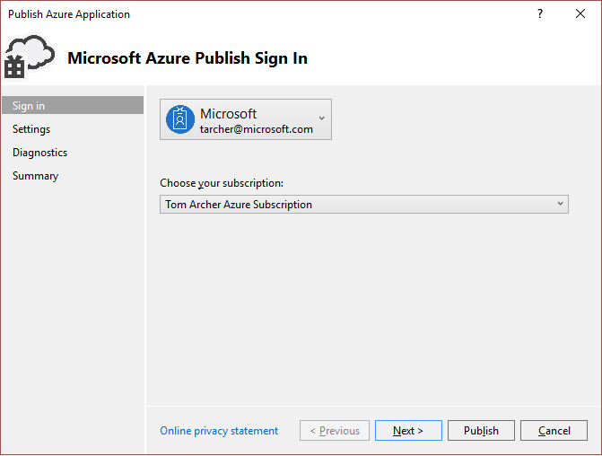
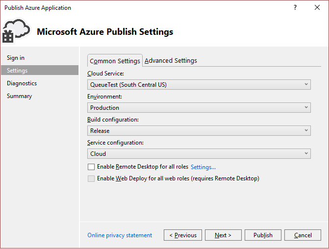
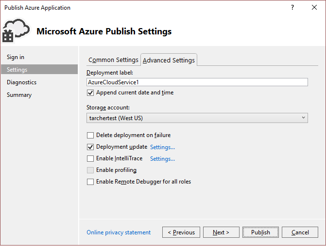
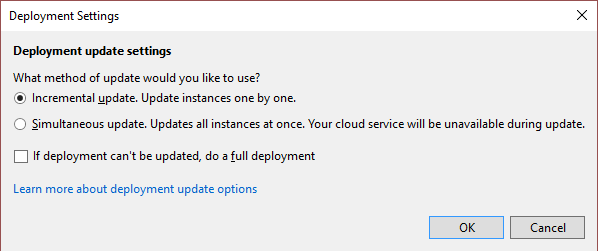
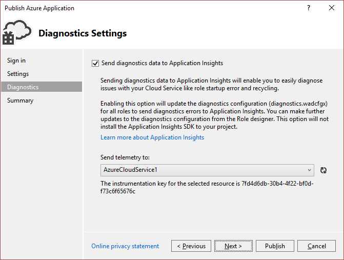
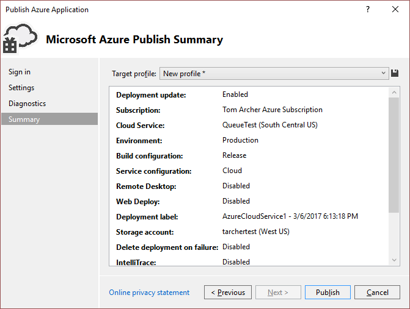

<properties
    pageTitle="使用 Visual Studio“发布 Azure 应用程序”向导 | Azure"
    description="了解如何在 Visual Studio“发布 Azure 应用程序”向导中配置各种设置"
    services="visual-studio-online"
    documentationcenter="na"
    author="TomArcher"
    manager="douge"
    editor=""
    translationtype="Human Translation" />
<tags
    ms.assetid="7d8f1ac9-e439-47e0-a183-0642c4ea1920"
    ms.service="multiple"
    ms.devlang="multiple"
    ms.topic="article"
    ms.tgt_pltfrm="na"
    ms.workload="na"
    ms.date="03/06/2017"
    wacn.date="04/17/2017"
    ms.author="tarcher"
    ms.sourcegitcommit="7cc8d7b9c616d399509cd9dbdd155b0e9a7987a8"
    ms.openlocfilehash="bd405a5f56434063f6caa07539aa58539f32e5fa"
    ms.lasthandoff="04/07/2017" />

# 使用 Visual Studio“发布 Azure 应用程序”向导 | Microsoft Docs
在 Visual Studio 中开发 Web 应用程序后，可以使用**发布 Azure 应用程序**向导将该应用程序发布到 Azure 云服务。 

> [AZURE.NOTE]
> 本主题是关于如何部署到云服务，而不是部署到网站。 有关部署到网站的信息，请参阅[如何部署 Azure 网站](https://social.msdn.microsoft.com/Search/windowsazure?query=How%20to%20Deploy%20an%20Azure%20Web%20Site&Refinement=138&ac=4#refinementChanges=117&pageNumber=1&showMore=false)。
> 
> 

## 访问“发布 Azure 应用程序”向导

可以通过两种方式访问“发布 Azure 应用程序”向导，具体取决于所使用的 Visual Studio 项目类型。

**如果使用的是 Azure 云服务项目：**

1. 在 Visual Studio 中创建或打开 Azure 云服务项目。

1. 在“解决方案资源管理器”中右键单击项目，然后从上下文菜单中选择“发布”。

**如果使用的是未为 Azure 启用的 Web 应用程序项目：**

1. 在 Visual Studio 中创建或打开 Azure 云服务项目。

1. 在“解决方案资源管理器”中右键单击项目，然后从上下文菜单中选择“转换” > “转换为 Azure 云服务项目”。 

1. 在“解决方案资源管理器”中右键单击新创建的 Azure 项目，然后从上下文菜单中选择“发布”。

## 登录页

**帐户** - 选择一个帐户，或者在帐户下拉列表中选择“添加帐户”。

**选择订阅** - 选择要用于部署的订阅。

## “设置”页 -“常用设置”选项卡   

** 云服务** - 使用下拉列表选择现有的云服务，或者选择“新建>”创建一个云服务。**&lt;** 每个云服务的数据中心均显示在括号中。 建议云服务的数据中心位置与存储帐户的数据中心位置相同（高级设置）。  

** 环境** - 选择“生产”或“过渡”。 如果要在测试环境中部署应用程序，请选择过渡环境。 

**生成配置** - 选择“调试”或“发布”。

**服务配置** - 选择“云”或“本地”。

**为所有角色启用远程桌面** - 如果希望能够远程连接到服务，请选中此选项。 此选项主要用于故障排除。 当选中此复选框后，“远程桌面配置”对话框随即出现。 选择“设置”链接以更改配置。

**为所有 Web 角色启用 Web 部署** - 选中此选项以为服务启用 Web 部署。 必须选择“为所有角色启用远程桌面”选项才能使用此功能。 有关详细信息，请参阅[[使用 Visual Studio 发布 Azure 云服务](https://msdn.microsoft.com/zh-cn/library/azure/ff683672.aspx)](https://msdn.microsoft.com/zh-cn/library/azure/ff683672.aspx)。 

## “设置”页 -“高级设置”选项卡

**部署标签** - 接受默认名称，或者输入所选的名称。 若要将日期附加到部署标签，请保留选中相应的复选框。 

**存储帐户** - 选择要用于此部署的存储帐户，或者单击“&lt;新建>”创建一个存储帐户。 每个存储帐户的数据中心均显示在括号中。 建议存储帐户的数据中心位置与云服务的数据中心位置相同（常用设置）。  

Azure 存储帐户将存储应用程序部署的包。 部署应用程序之后，将从存储帐户中删除该包。

**失败时删除部署** - 选择此选项可在发布期间遇到任何错误时将部署删除。 如果要保留云服务的不变虚拟 IP 地址，则应取消选中此项。

**部署更新** - 如果希望仅部署更新的组件，请选择此选项。 这种部署类型比完整部署更快速。 如果要保留云服务的不变虚拟 IP 地址，则应选中此项。 

**部署更新 - 设置** - 此对话框用于进一步指定要更新角色的方式。 如果选择“增量更新”，则会一个接一个地更新应用程序的每个实例，以使应用程序始终可用。 如果选择“同时更新”，则会同时更新应用程序的所有实例。 同时更新速度更快，但在更新过程中服务可能不可用。 

**启用分析** - 指定是否要启用性能分析。 使用 Visual Studio 探查器，可以获取云服务在计算方面运行情况的深入分析。 有关使用 Visual Studio 探查器的详细信息，请参阅[测试 Azure 云服务的性能](/documentation/articles/vs-azure-tools-performance-profiling-cloud-services/)。

**为所有角色启用远程调试器** - 指定是否要启用远程调试。 有关使用 Visual Studio 调试云服务的详细信息，请参阅[在 Visual Studio 中调试 Azure 云服务或虚拟机](/documentation/articles/vs-azure-tools-debug-cloud-services-virtual-machines/)。

## “诊断设置”页

通过诊断，可以对 Azure 云服务（或 Azure 虚拟机）进行故障排除。 有关诊断的详细信息，请参阅 [Configuring Diagnostics for Azure Cloud Services and Virtual Machines](/documentation/articles/vs-azure-tools-diagnostics-for-cloud-services-and-virtual-machines/)（为 Azure 云服务和虚拟机配置诊断）。

## “摘要”页

**目标配置文件** - 可以选择基于所选的设置创建发布配置文件。 例如，可以创建一个配置文件用于测试环境，并创建另一个配置文件用于生产环境。 若要保存此配置文件，请选择“保存”  图标。 向导将创建配置文件并将它保存在 Visual Studio 项目中。 若要修改配置文件名称，请打开“目标配置文件”列表，然后选择“<管理…>”。

   > [AZURE.NOTE]
   > 发布配置文件将出现在 Visual Studio 的解决方案资源管理器中，配置文件设置将写入扩展名为.azurePubxml 的文件。 设置将保存为 XML 标记的属性。
   > 
   > 

## 发布应用程序

配置项目部署的所有设置后，请选择对话框底部的“发布”。 可以在 Visual Studio 的“输出”窗口中监视过程状态。

## 后续步骤
- [通过 Visual Studio 将 Web 应用程序迁移和发布到 Azure 云服务](/documentation/articles/vs-azure-tools-migrate-publish-web-app-to-cloud-service/)
- [了解如何使用 Visual Studio 发布 Azure 云服务](/documentation/articles/vs-azure-tools-publishing-a-cloud-service/)
- [使用 Visual Studio 和 IntelliTrace 调试已发布的 Azure 云服务](/documentation/articles/vs-azure-tools-intellitrace-debug-published-cloud-services/)
- [测试 Azure 云服务的性能](/documentation/articles/vs-azure-tools-performance-profiling-cloud-services/)
- [为 Azure 云服务和虚拟机配置诊断](/documentation/articles/vs-azure-tools-diagnostics-for-cloud-services-and-virtual-machines/)。

<!-- Update_Description: wording update -->